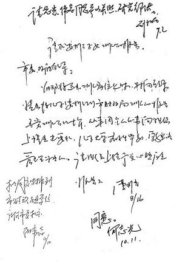
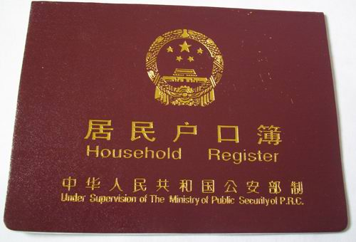

# <七星视点> 第一期：放假我们骑自行车回家吧

**编者按：** **作为一名大学生，你关注大学和大学生的相关新闻吗？北斗认为，关心时事，要从关心自己开始。为此北斗试推出一个新栏目：“七星视点”。 每周我们的小编会摘录七条跟大学和大学生相关的新闻，并简单地评论，这是我们北斗如何看，而你如何看呢？欢迎大家来跟北斗小编一起嬉笑怒骂。 不光要仰观星空，还要俯察校园；不光要有学生经历，还要有“七星视点”。** **本期是“七星视点”第一期。**

### 

# 七星视点

### 

## 第一期：放假我们骑自行车回家吧

### 

### 

### 1、放假我们骑自行车回家吧

### 

### 

大学生和农民工一样都是候鸟一族，放假回家就要经历春运。今年的春运，你很轻松就买到火车票了吗？是不是像人大的[“我爱TDB”同学买票过程](/?p=5652)那么惨烈？但放假不一定就要坐火车，坐飞机，坐汽车回家，我们也可以避开春运[骑自行车回家](http://news.jznews.com.cn/system/2011/01/21/010098426.shtml)。骑车回家过年越来越流行了。当然不是谁都能成功的，有个同学，还在骑了一半的时候被驾车来的父母截住，连人带车拉回家了。 这些选择骑自行车回家的同学，多半是自行车运动爱好者，俗称“骑友”。那驴友是不是就要骑驴回家？他们的行为是因为爱好，是一次挑战和冒险，而不是因为买不到票，没有别的方式回家。 有很多人是因为买不到票没法回家而选择了冒险的骑行方式，有个年轻母亲[李春凤](http://baike.baidu.com/view/5105958.htm)在浙江打工5年，半夜梦见6岁儿子全身是血，与老鼠争食……第二天，她竟独自骑着摩托车，装扮成男人，从浙江奔走2000多公里回渝，耗时6昼夜，这六昼夜里，没有像样地休息，没有进食。 **七星视点：**当然小编不鼓励大家路远的骑车回家，也不鼓励大家逃票雨夜进黄山露营。 

### 

### 2 、考国考就像买彩票

### 

### 

1月17日，[“国考”](http://baike.baidu.com/view/1850682.htm)公共科目笔试成绩公布。今年又有103万[“考碗族”](http://baike.baidu.com/view/1327598.htm)参加考试争过独木桥。平均考录比是63.6∶1。其中，国家能源局“能源节约和科技装备司”一职以4961∶1的考录比高居热门职位榜首。也许你对自己在六十多人里面脱颖而出还比较自信，那么如果是4961人呢？考中跟买彩票中大奖有什么区别！除了国家公务员考试，也还有地方公务员考试，可是说不定你还没去考人家就已经定好谁能考中了哟。湖南就有个[官二代大学生未毕业被直接安排当公务员](http://news.qq.com/a/20101226/000070.htm)。地方公务员考试“隐性世袭”的现象很严重。公务员就是很多求职者的彼岸，但大多数普通人只能望洋兴叹了。 而且现今不仅仅有“考碗族”，还有[“嫁碗族”](http://baike.baidu.com/view/3059548.htm)。[《2010中国人婚恋状况调查报告》](http://news.xinhuanet.com/society/2010-12/15/c_13650287.htm)显示,超过40%的受访女性希望理想伴侣的职业是公务员。不知道嫁给公务员的成功概率是不是要更大一点呢？ **七星视点：**为什么大家都想当公务员？当了公务员福利好，能腐败。这是一个失范的体制造就的一个[不健康的利益格局](http://www.chinaelections.org/newsinfo.asp?newsid=173961)。而当上公务员还有面子。在中国，这些现象总是令人费解，人人骂政府，但人人想当公务员。这就是一个更大的问题，这说明这个体制只能不断强化下去。公务员也许是这个体制的掌控者，但建构这个体制的是整个社会。 其实大多数普通求职者考公务员，抱着一个试试看的心态，也和买彩票的心态是一样的，都是把梦想实现的机会寄托在运气上。一个社会，不管怎么样，总不能让人把发财的梦想寄托在买彩票上，把过上幸福生活的梦想寄托在摇奖考公务员上。 看到这里，也许刚参加过国考的你会振振有词：“我是要为人民服务的。”好吧，well，that’s a good one.(真是个不错的玩笑) 

### 

### 3、我什么时候能在北京高考？

### 

### 

“你想想，你在北京住了好多年，上着高中备着考，结果突然有人告诉你要回原籍高考。能在北京高考的日子是好日子，有北京户口的日子才是好日子。”这恐怕是许多在京居住多年的非京籍考生的心声了。对此，1月21日，在2011北京两会期间，[13代表联名提议“放开在京高考”](http://edu.sina.com.cn/gaokao/2011-01-21/1431283290.shtml)。 反对声音立刻传来，“放开影响北京孩子升学率”。也有人说：“放开非京籍学生在京高考，那就要增加高校在北京的招生计划。”神马，北京还增加招生计划？ **七星视点：**户籍制度本来是政府进行[社会控制](http://baike.baidu.com/view/183640.htm)的一种手段。中国曾经有一个时期，不在自己的户口所在地住旅馆都要带介绍信，人们是不能在地域之间自由流动的。到了今天，政府也不再对社会成员进行如此严格的控制，但户籍制度仍然存在。户籍从一开始就是强制的不平等，在之前有城市户口和农村户口之分。在如今有[北京户口](http://business.sohu.com/2004/01/16/33/article218593316.shtml)和非北京户口之分。不放开在京高考，对很多在北京打拼了多年的京漂来说，多增添了生活的艰辛。而它反映的是，我们的行政改革远远落后于社会发展的需要。也许北京市也想让这些非京籍孩子高考，但一波更猛烈的高考移民也许就会到来。[户籍制度，和高考、就业、社会保障等其他社会体制](http://news.xinhuanet.com/politics/2008-01/30/content_7522585.htm)捆绑在一起，它们是联动的，要想改革，就要系统性地全面的改革，而这是阻力更大的一个过程。 

### 

### 4、蚁族们的好消息，以后上海的毕业生就有经适房住了

### 

### 

同时在上海两会期间，[上海市市长韩正表示，上海将通过保障性住房制度逐步解决青年“房奴”、“蜗居”问题](http://news.dichan.sina.com.cn/sh/2011/01/22/268289.html)。韩正还说：“蜗居不解决，上海就没未来。”这对在上海读书的[“硬盘”](http://news.163.com/09/1231/11/5RS095LR000125LI_2.html) “穷二代”且即将毕业成为[“蚁族”](http://baike.baidu.com/view/2806199.htm)的小编来说，真是个给力的好消息。只是，韩市长，不要让我们等太久啊。 **七星视点：**“蜗居”问题不解决，不仅上海没未来，中国都没未来。 

### 

### 5、当裸模，是为学费还是为炒作？

### 

### 

人大的同学们，你们去看过紫紫姐姐的艺术展了吗？其实[苏紫紫](http://baike.baidu.com/view/3936113.htm)是90后，但因为“凤姐”、“芙蓉姐姐”在前，小编也不由自主地将这位新晋的网络红人称为姐了。可这位姐好像与前两位姐是不同的，作为名校学生的苏紫紫拍裸照是为了赚学费，而且是要[“用一生从事人体艺术”](http://cq.qq.com/a/20110107/000161.htm)。可是近日爆出，苏紫紫有[幕后推手](http://www.daqi.com/fast/26619017.html)，拍裸照可能也是为了炒作，又让这位姐与前两位没什么不同了。这不禁让人想起了献身爱情动作片事业赚钱为男友实现导演梦想的松岛枫姐姐曾经感动过无数宅男，但到头来发现这只是个美丽的传说罢了。据传，[苏紫紫有望成为芒果女郎](http://www.daqi.com/fast/26619017.html)，这也让许多曾经受过感动的善良宅男们伤心了吧。 **七星视点：**苏紫紫出名以后，力挺她的人很多，的确，[裸不裸是女人的自由](http://opinion.dahe.cn/2011/01-09/100579361.html)。而且她的经历也很让人同情，有人质疑[到底是谁逼苏紫紫脱光了身上的衣服](http://opinion.dahe.cn/2011/01-09/100579361.html)。但同情的声音都是建立在她的经历是真实的基础之上的，如果她的经历都是为炒作而编造的，肯定会招来一致的口诛笔伐了。现在的苏紫紫是坚强的，勇敢的，也许不久她就变成了为了出名不择手段的，但她都是身不由已的：不论是强拆逼她脱光了衣服，还是她自愿一脱成名，一旦卷入到了这个浮躁的名利场，她的角色和性格就都扭曲了。 

### 6、你会怎么发求分短信呢？

### 

### 

本周全国各个高校都在陆续放假了，那放假回家的各位同学已经经历过期末考试的煎熬，过几天就出成绩了吧。有人说：“你挂，或者不挂科，命运就在那里，不悲不喜。”但肯定不是所有人都如此淡定。有的人已经拿出手机，开始编写一条“XX老师您好，很冒昧地给您发短信，我是XX班的XXX”这样的求分短信给老师。据说发了[求分短信](http://edu.china.com.cn/2011-01/22/content_21796356.htm)就会神马分数都有了。当然流传的只是一个短信模板，广大同学应该积极发挥主观能动性，具体问题具体分析，发一条适合自己，适合老师，适合自己和老师之间关系的求分短信给老师。但是不论短信形式如何变化，内容都可以概括成一句话：“老师，你懂的。” 同学们的意思老师自然懂的，但如果你考试什么都不会，又不是清纯可人的院花，你爸爸也不是李刚，也不是天天往学院团委跑的学生干部，而只是一个整日窝在寝室里打dota的宅男，他凭神马给你过？凭神马？ **七星视点：**学生想发求分短信，说明学生在混；发求分短信有机可乘，说明老师也在混。而一句“你懂的”更是道尽如今潜规则可是清清楚楚明明白白比正式规则都有用啊。 

### 7 、校庆不光热闹，还花钱啊

### 

### 

在四川省十一届人大四次会议上，《四川省2011年省级部门预算(草案)》被送到代表面前审阅，有个代表看到里面有[“川北医学院60周年校庆接待用车要花150万元”](http://news.sina.com.cn/c/2011-01-22/041521856308.shtml)，就拍了桌子，“这是坑爹呢！”省财政厅见代表质疑，赶快解释 ：“川北医学院60周年校庆需要用车，同时考虑到学校的车辆已经比较陈旧，因此准备安排购置4台车，其中[柯斯特](http://www.yaxingkeche.com.cn/cn/ProductDetail.aspx?id=105)两台，小轿车两台。”听到这里，代表非常满意。原来代表觉得“坑爹”，不是嫌钱花得多，而是因为没写清楚是买还是租，解释清楚了是买的，于是就不“坑爹”了。这条新闻变成体现我国根本政治制度全国人民代表大会制度是多么优越啊的了。 七星视点：代表觉得不“坑爹”了，小编还是觉得很“坑爹”。一个小学校，搞个校庆，就要花150万买车。这个车就校庆用吗？如果仅仅为了校庆接待，租车不行吗？如果不仅仅为了校庆，那校庆以后给谁用呢？中国[公车消费](http://news.sohu.com/20100104/n269364764.shtml)居高不行，每年超千亿，是政府体制化腐败的一个很好例证。政府公司化了，高校这种单位也是。小编每次经过学校的豪华酒店，都在想这个改成图书馆该多好啊。学校里很有钱，可就是不爱花在学生身上啊。 

### 

### 
