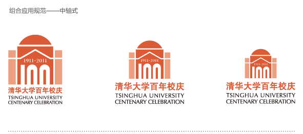
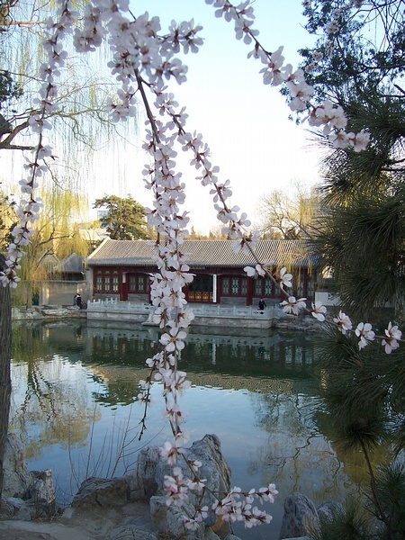
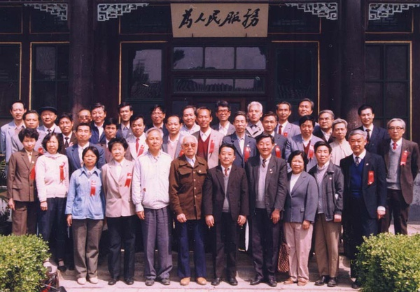
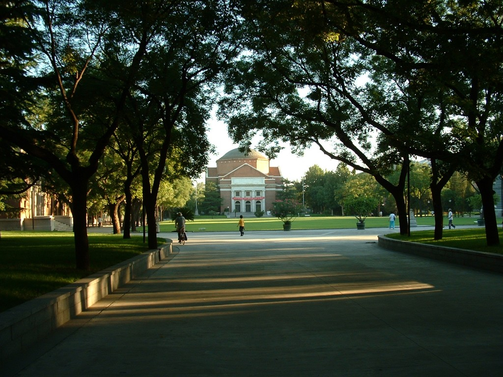

# ＜清华百年校庆特稿＞百年清华，民不聊生

**清华何处不是工地？许多自嘲的校内状态里早已白纸黑字分明：“欢迎来到百年工地，清华大学。”**

### 

### 

#  百年清华，民不聊生

** **

## 文/乔蕃泥（清华大学）

### 

** ** 我自然是爱这所学校的——即使仅仅在园子里呆了半年，呼吸脉搏已是与她同步。 然而这不是我爱的学校应有的样子。 当百年校庆愈发接近，忍不住将同学状态里的这句话发作标题。于是就华丽地标题党了。 咆哮体是自然不能多用了，要说的话并不多，写下来不知是否有思想小结长，权且看看，牢骚而已。 星期五早晨，我从三教下课，匆匆忙忙赶到射击馆。原本颠簸的三六之间的小道彻底被封（啊，说起来，我在那里甚至被颠下来过一个车筐），清芬附近永远少不了的景色是坑坑洼洼的路和不知道究竟作了些什么业的起重机。 

### 

### 

下雨的日子，泥泞肮脏不便得无以复加；晴朗的日子，干脆上演你是风儿我是沙。 似乎折腾了不短的时间了——人文图书馆已然从平地升起高楼，该当有所修缮的路况仍然是每一个赶课学生的梦魇。且不说六教车流使得下课那十五分钟里寸步难行从未有所改观，如今从紫荆往三教的主干道上纷纷扬起的飞沙走石让学生不得不皱眉蒙面——是为了躲避本就风沙大的京城之春，还是难以置信自己身处在自诩亚洲最美的大学之内？ 沿着河满是垂柳的小道成了两头皆堵的死路，骑车去一教经过时被柳枝不很温柔地打到脸颊的欢愉和窘迫荡然无存。我们当然还有“至善路”可以与机动车分享，但是那份大学校园里特有的诗意和雅致去哪里了？ 看到了一个视频，叫做《清华之大，已经安放不得一张平静的书桌了！》——短短一分多，在六教自习的主角抬起头，斗转星移竟是工地中央。将清华一向最特色的自习搬到清华如今最特色的工地之中，妙甚。 清华何处不是工地？许多自嘲的校内状态里早已白纸黑字分明：“欢迎来到百年工地，清华大学。” 团体操早就变身为团吐槽，旗操的男生们更是直接把示威运用到生活中去，“下课”的呐喊不仅是渴望更不仅仅是对着体育老师们的请求，而是对着校领导们一句“还我安宁”。 我一遍遍问自己，却一遍遍都没有答案，我们究竟是为什么，要浪费大量资源，穿一件设计之别扭以至于我们永远不会穿第二次的服装（紫荆花开的似乎好看些？），每个星期六都早起放着大喇叭，老师一边为难一边仍需声嘶力竭地指挥着站队，一切都只是为了在校庆的某一个极不重要的片段，展示给一些对领导们而言极重要的人物看？ 我们究竟是为什么？ 这里是大学，不是政府。 若一个大学变成了政府，那学生怎么可能还是学生？ 

### 

### 

需要展现集体运动的美，大可请专业人士而为之。需要展现学生的朝气，大家跑上去笑着再跑下去，即使略有混乱也必定发自内心。而如今，它仅仅是证明了——我们，清华的学生，只要放下书本和笔也是有能力排出团体操的！ 意义何在？ 梅校长那句“所谓大学_ _者，非谓有大楼之谓也，有大师之谓也。”仍然未散去，而如今有了大楼和大师的清华顶着名校的头衔，却难以让学生能真感受学习所爱的东西的乐趣。 记得前几日看到一篇分享，《清华除了学分绩还剩下什么》——文章是大片大片的空白。末尾处有一个简单而无奈的句号，以及一句话：“对，就是nothing.” 大学自然是学习的地方，但将学习等同于学分绩却实在不是什么好主意。 清华的学生如同清华，一块一块有规有矩，方方圆圆。一二教是基础的思修毛概史纲，连在一起的三四五教是每个工科学生都逃不掉的数理化，六教则是必须掌握的外语。 你看到这些楼建在那里，有模有样，然而道路却不是贯通的。 学分绩让我们日思夜想如何把楼建的高而气派，却少有人去思考该如何连同他们，从而每一个人都是刻板的房子，在楼之间探索与跳脱的惊奇奥妙无人问津。 几周前与一位老师聊天，我说自己难以抉择是否应放弃某一门选修课。她非常鼓励地说你可以都选啊，你还年轻，有这体力。 当我提及这两门课一门是政治一门是哲学，她一下子变了态度，“啊？跟生物没关系啊？你学医的去学这种乱七八糟的东西干嘛？喜欢就自己看看书，没必要去上课。” 韩寒曾说所谓“杂书”都是高考之后仍会保留的书，而“正书”则是高考之后再不会碰的书（大概除了卖掉它）。我只能期望“乱七八糟的课”对比“有用的课”与韩寒所言完全没有可比性。 我想起来报到那天傍晚，我和两个同学骑车游清华。夏夜的园子格外繁盛，当时的主干道还没有修，骑车倒也没有不便。当时的我们还未被学分绩所困，所聊所想都是发自肺腑。 

### 

### 

我回想起那个夏天的夜晚三个女生骑车迷路，在美院门口得一好心基科MM指点，一路狂飙回寝。 那个时候，觉得清华真是一个美丽的地方。 我在一篇咆哮文前面说过，如果一个大学能拥有超出一百年的涵养与远见，一百年的校庆，也不过是一百年而已。 

### 

### 

(采编：陈锴 责编：陈锴)

### 

### 
