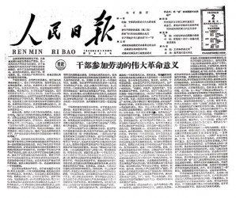
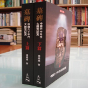
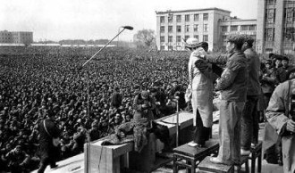

# 1963：报上已无毛主席

** 一**

我开始寻找我父亲生日那天的报纸。

我的父亲出生在1963年4月28日，在我的记忆中，428这个时间点，对应着很多历史的转折点。如果回忆，我们看到，1906年4月28日，新闻纸公开分裂成革命派和改良派，公开讨论应该革命还是改良。这是清朝末年的媒体环境，山雨欲来风满楼。1928年4月28日，革命党人的共产主义支流，遭遇了极大的挫折，来到了井冈山，史称“朱毛会师”，开始了中共的第一次复兴和割据。而1956年4月28日，那时候清朝早已终结，中华民国也偏居台湾，革命党人的共产主义支流取得了最终的胜利，建立了中华人民共和国，于是这一天，毛泽东不顾党内的不满，号召“双百方针”，之后的结果，便是所谓的引蛇出洞，五十五万知识分子坠入深渊。

我是重庆人，我父亲出生的时候，他还是四川人。而到1963年4月28日，我父亲出生这一天，到底有没有什么转折性的事情发生呢？我找到了那天的《四川日报》和《人民日报》。

答案是，没有。没有转折性的事情发生。这一天是星期日。四川日报只有两版，一个头版一个副刊。人民日报也只有四版。

来看四川日报这一天的头版。我们可以看到“不登高山不显平地，不比先进不见潜力——三元葡萄糖厂克服自满情绪虚心向友厂学习，生产水平提高成本大幅度降低”，“超差距赶上了先进——德阳锅厂饭锅畅销绵阳专区受到消费者好评”，“老红军的本色——记桐君阁药厂党支部书记李三多”，这三个新闻我把它归为一类，叫做“经济”新闻。一个头版三个经济新闻，而且是葡萄糖、饭锅、药厂，按照行业划分可以划分进第三产业，而不是钢铁，石油，建筑之类。这并不符合我的期待，我的期待是，这份党报一定会有符合社会主义先进性的东西出现，比如人民公社，比如钢铁产量，比如劳模光荣，而这些统统没有，**取而代之的是竞争性的，激励性的，市场导向的经济新闻，**这不是明显的政治不正确吗？

而让人疑窦顿生的，则是这一条，“刘主席将访问柬埔寨越南”。在我的预设中，**即便没有那些社会主义优越性的新闻，也至少得有毛主席的头条才对，而毛主席却在报纸上消失了。**我的疑问更进一步。

翻到副刊这一版，由于这个报纸不是很清晰，看的不是很清楚，但有一个引人注目的雕塑，我看到他叫**“雷锋”。**

“第三产业”经济新闻。刘主席。雷锋。他们在冥冥之间有关系吗？

我开始继续检索。这一次是最权威的，显示政治和方针动向的《人民日报》。

4月28日的人民日报，我看到刘主席，没有看到毛主席。

427，我看到了毛主席，但是有毛主席的时候，也有刘主席。刘主席所占的版面只多不少。

426，还是有毛主席。刘主席也存在。

但是从425开始，我就开始不放心了。425还是有刘主席，周总理，但却不见了毛主席。

424，同样没有。刘主席依然头版头条。

423，仔细找，没找到。刘主席头版头条。422，421。

420毛主席被三个刘主席的新闻包围在了中间，很小的一部分。论分量，少太多。

419， 刘主席头版，几乎占满了。几条新闻。

418，继续刘主席。417……

一直到4月1日，依然是刘主席。毛主席出现过两三次，每一次的版面都小于刘主席。

我再继续检索了其他月份的报纸，结果是一样的。依然是大部分都有刘主席，极少毛主席。

如果人民日报是一份娱乐报纸，每天占据头条的，我们可以理所当然地把他叫做红人。而那个一直上不了版面的人呢，我们说他过气了。

所以，从我父亲生日那天的报纸产生的疑问出发，我提出了一个得到了报纸版面证实的结论，毛主席过气了。

仔细回想一下，在中学的历史课本上，我们对这一段时间的历史几乎一无所知，如果只学习中学历史，差不多会觉得毛主席一直是主席，一直是主角。殊不知，看报纸才发现不是这样。中学所教授的历史是断裂的，无法解释，也不让你解释的。

** “如果一件事情无法解释，那么一定有你所不知道的事实存在。”**

**二**

在特里尔的《毛泽东传》中，有这样一个章节《退却（1961-1964）》，在第一段，特里尔用零度叙事写道，“迫于政治和经济的现实，自1961年起，毛泽东带着满腹狐疑开始让步退却了。刘少奇、邓小平二人强调政治秩序和经济效益符合时代趋势。刘、邓并没有同毛泽东发生正面冲突，只是沿着自己注重实际的道路加快了步伐，并且自然而然扩大了权力。毛泽东对他们没有做出什么决定性的阻止。”

看来毛主席在那时候确实不太如日中天。因为“政治秩序”和“经济效益”的原因。

时间回到1959年7月的庐山会议。大跃进第一季暂时结束。由于第一季“收视率的惨淡”，这次大会很可能导致的是大跃进被宣布终止，但由于彭德怀的一份只给毛主席看的万言书，被毛泽东印了出来分发全部与会干部批判，纠左变为了反右倾。彭德怀，张闻天，黄克诚，周小舟的“彭张黄周军事俱乐部”被打倒，林彪由于坚定地支持毛，代替被打倒的彭，升任国防部长。大跃进第二季随即播出。

如果说大跃进第一季是部分范围的失败，如果纠正及时，还可以逆转，那第二季大跃进则是惨绝人寰的失败。农业产量急剧下降，和农业产量正相关的轻工业急剧下降，食物短缺，商品匮乏，重工业也因此严重受挫，受挫程度甚至超过轻工业和农业。

**1959年晚期和1960年重新开始的大跃进导致了整个世界20世纪最大的饥荒。导致2000万以上人口的死亡。**

终于不得不变。而由于巨大的错误，毛泽东开始“过气”了。他的过气是分步骤的，反复焦灼的，至今想来，仍不免让人凄凉感旧，慷慨生哀。

第一步开始了。1961年1月，毛泽东在北京举行的**中共八届九中全会**上发言，要求全党大兴调查研究之风，1961年要搞个“实事求是年”，用现在的流行语讲，这叫“请自行打脸”。打脸的结果是会议正式批准对国民经济实行**“调整、巩固、充实、提高”**的八字方针。

人民公社实际上已解体为大队，农村的黑市开始半合法化。工厂中厂长负责制又复活了。偏离党的工作方法的倾向已经出现。1957年被作为毒草连根拔掉的知识分子又在刘邓的权势庭院中找到了新的土壤。

步步为营，第二步朝毛泽东走来。

1961年5月21日到6月12日，**中共中央工作会议**在北京召开。

在这之前，为了满足毛泽东的自行打脸，“实事求是”——刘少奇到湖南长沙、宁乡县，周恩来到河北邯郸，朱德到四川、河南、陕西，邓小平、彭真到北京顺义、怀柔实地调查研究，设计方案。而中央的其他领导和地方各级领导也都分别组织力量到基层，对农村、工厂、商业、文教、科技等各方面的情况进行调查研究。

在这次会上，实事求是的力量，通过了《农业六十条》、《商业四十条》、《手工业三十五条》等等，比如《农业六十条》规定，以生产队为核算单位，提供自留地。《人民公社工作条例修正草案》在所有制，分配制度，公共食堂办与不办问题上都有新的规定，按现代经济学来讲，私人产权得到了一定程度的恢复。

6月12日，会议的最后一天，毛泽东作总结讲话，在讲话中做了自我批评，并且认为1959年不该把反右倾斗争搞到群众中去，提出要对庐山会议后几年来批判和处分错了的人甄别平凡，重新教育干部。不许再开展反右倾或者左倾斗争，禁止给他们戴政治帽子。

结束中共中央工作会议之后，又有薄一波的《工业七十条》等内容，强调了“专家的作用”和“物质刺激的作用”。

** 党内高层并没公开反对毛泽东，但这一次通过的所有条例政策，都在实际上反对毛主席的“三面红旗”。**

高潮在1962年1月到来。第三步，**七千人大会。**

在七千人大会上，刘少奇在会上做了主要报告，他把主要责任归到中央，强调防止粗暴的清洗和反清洗的重要性。他说，三年饥荒的问题，70%是人祸，30%是天灾。与毛泽东竖起的三个手指恰好相反。

据邓力群的回忆，7000人大会闭幕后，刘少奇整理他的口头报告时，激动地说，“犯了那么大错误,给人民带来那么大的损失,我这是第一次总结!总结一次还不行,以后每年都要回过头来总结一次。”

然后就是著名的那句话，**“历史上人相食，是要上书的，是要下‘罪己诏’的。”**1962年3月，刘少奇又对公安部长就公安部近几年来多次打死人的事说，“活人不揭，死后下一代揭”。

这里是金冲及《刘少奇传》的实录。刘少奇在1月27日做大会口头报告时说，有些地方减产的主要原因是天灾，有些地方不是天灾，而是工作中的缺点和错误，“过去我们经常把缺点、错误和成绩，比之于一个指头和九个指头的关系。现在恐怕不能到处这样套。……恐怕是三个指头和七个指头的关系。还有些地区，缺点和错误不止是三个指头。如果说这些地方的缺点和错误只是三个指头，成绩还有七个指头，这是不符合实际情况的，是不能说服人的。我到湖南的一个地方，农民说是‘三分天灾，七分人祸’。你不承认，人家就不服。全国有一部分地区可以说缺点和错误是主要的，成绩不是主要的。”

他是在反驳毛泽东亲口说的比喻。这次“白天出气，晚上看戏，两干一稀，大家满意”的会议之后，还有政治局扩大会议要开，可毛泽东自称徐霞客，中国最著名的驴友，一走了之。

政治局扩大会议作为高层内部会议，对这个国度的灾难说得更加透彻。后来我们把这次会议称为**“西楼会议”，这是毛过气的第四步。**

刘少奇主持召开，认为国民经济要进行大幅度调整，因为处于非常时期，要退，要“退够”。

在毛泽东看来，困难时期已经挺过去了，这是“危言耸听”，把形势看的“一片黑暗”，刘少奇这是“揪住不放”。

类似的对话在1962年的7月也发生，刘少奇之子刘源在《毛泽东为什么要打倒刘少奇》中写道，刘少奇和毛泽东曾有过激烈的争执，刘少奇说：“饿死这么多人，历史要写上你我的，人相食，是要上书的！”毛泽东说：“西楼说的一片黑暗！三面红旗否定了，地也分了，你不顶住？我死了以后怎么办？”

后来我们看七千人大会，才知道毛泽东开得很不满意，但是需要知道的是，七千人大会的报告他都是提前看过的，批了三个字，“觉得好”。接着又说“还没有细想，提不出不同意见，需要看第二遍”，又建议推迟三天作报告。在《变局·七千人大会始末》一书中，作者就这段历史评价道：“觉得好是客气话，不太满意才是实情。”

事后的佐证是1967年，文革开始之后，毛泽东在接见阿尔巴尼亚代表团团长巴卢库时说，“7000人大会的时候，就已经看出问题来了，修正主义要推翻我们。”

到第五步，**则是1962年8月的北戴河会议。**毛泽东显然是以另外一种心情对待这次会议的。

他显然越来越感到自己在决策的主流地位中处境孤立。毛泽东和中央官僚集团已经产生了深刻的分歧。这一次他开始反击，而不是退让，一直被人打脸显然令他相当不爽。

在会议的初期，毛没有讲话，讲话的人是这些，他们讲了这些话——

邓小平：关于“单干”，不管白猫黑猫，抓得住老鼠的就是好猫。

朱德：要求在农业中扩大个人责任制。

陈云：在北方分“保命田”，作为解决农民吃饭问题的紧急措施。

邓子恢、刘少奇：主张搞包产到户，包干到户。

继续反思和改变的会议被毛泽东愤怒地打断。

毛泽东质问，“社会主义究竟存不存在阶级？这两年国内的形势究竟是一片光明还是一片黑暗？包产到户，包干到户就是搞资本主义！”

即便按照上面的最高层的意见，毛泽东也是以一敌五，更别论这五人的拥趸了。但结果出人意料。刘少奇在会上做了自我批评，赞成毛主席的批评，认为自己把国内困难估计太严重。

随即，毛主席过气的第六步，**9月的八届十中全会召开。**

预备会议期间出现的插曲再一次激怒了毛泽东，被下放的彭德怀通过调查，又写了一个八万言书，要求中央对自己全面重新审查，做出正确的处理。一个党员写信给中央，履行自己最正常的申诉权利，这一次被毛泽东认为是“翻案风”，是对党提出的挑战，在会上被严厉批评。

然后就是时任国务院副总理的习仲勋，一篇据说他作为后台的小说《刘志丹》被毛认为是用“小说反党”。而由于彭德怀在某种程度上和曾经的高饶事件有关系，彭德怀、习仲勋和早就被开除党籍已经死去的高岗组成了“彭习高反党集团”。在这之前，两个宿仇罗隆基和章伯钧被组合在一起成为“章罗联盟”，在这之后，也有“批林批孔”这种神奇的千古组合。当然，这是题外话了。

毛泽东在会上又关于阶级、形势、矛盾发表了言辞激烈的讲话，要全党承认阶级和阶级斗争的存在，“年年讲，月月讲，开一次中央全会就讲”，要求全党提高警惕，并再一次批判了“黑暗风”、“单干风”、“翻案风”。

党内高层的态度呢？

作为国家首席执行官的刘少奇在十中全会上依然同意毛泽东，“现在，最困难的时候已经过去，形势已有好转，我们更应该坚定。今年五月对困难估计得多了一些”，他再一次自我批评。

关于这一次会议的结果，《剑桥中华人民共和国史》如此写道——

** 十中全会在理论上接受了毛的全面分析，但在它的具体条款中保留了1961-1962年为了从“大跃进”中恢复过来而拟定的办法。由此而产生的折中公报，有些段落重复了毛的语言，另外一些段落插进了刘、邓和陈提出的理论。**

六步结束，我们看到，毛主席是一种非常奇怪的方式“过气”的，他一边被党内高层夸奖，一边他的主张政策却在实际上被边缘化。刘少奇，如同我在报纸上观察到的那样，自1959年成为这个国家的首席执行官以来，开始实际上地掌握着这个国家政治秩序和经济发展的轮盘。这个国家最官方的报纸和地方的报纸，都开始把他捧为最如日中天的红人，他的团队所主张的路线，也开始在版面上大量展示。

经济开始恢复，政治趋于稳定。而毛主席，则在众官僚的阳奉阴违中过气了。毛泽东的乌托邦之怒，仿佛打在了一团深谙太极的海绵里，打得越重，陷得越深。但是我父亲生日这天的报纸，隐隐地已经在告诉我们，比起毛泽东，这些实用主义的高层，真是太低估了一种精神的力量，他们以退为进，放之生长。

而在不远的将来，他们都将被这股力量反噬，金铄骨销，立锥无地。

** 三**

中国政治人物的过气不同于娱乐明星的过气，娱乐明星过气了顶多没有钱赚，生活不如以前那么光鲜靓丽。

但中国的政治人物不同，陈独秀，瞿秋白，王明，高岗，饶漱石，当然也有后来刘少奇，邓小平，林彪，江青，他们当红时一朝权在手，天下便来朝。过气了呢？结果好点的是开除出党，顶一个严重政治错误路线错误的帽子，比如右倾机会主义，左倾冒险主义。往死里整的，搞独立王国，叛徒内奸工贼，阴谋篡党夺权，处以极刑，死无葬身之地。但毛主席是个例外。

不管毛泽东本意如何，因为他的瞎指挥，已经事实上造成了20世纪乃至整个人类历史最大的人祸，上述任何一个政治人物都难以望其项背。

而彼时当红的刘少奇已经事实上成为国家的首席执行官，我们很难想象一个CEO经常做违心的自我检讨，这是一件非常奇怪的事情。

毛泽东不当红了。但他的存在感一直很强。因为他占据了一种被称为“道统”的力量。

在中国历史上，**皇帝占据法统，但是道统却由一代又一代知识分子儒生“释儒”进行解释，他们规定了“道”，皇帝必须明白谏臣的重要性，相权与皇权在很大程度上也互相制约。中国古代历史几乎是一个皇权不断加强，相权不断衰落的过程，清王朝的统治更被钱穆认为毫无制度可言，而全是“法术”。**

毛泽东从1959年就说自己“退居二线”，不再担任国家主席，刘少奇成为这个国家的最高领袖，占据了“法统”，可是法统只是“外王”，道统才是“内圣”。外王是可以被推翻的，内圣却不会。内圣暂时不王，却总会外王。

而外王的人呢？如果没有内圣，却是可以依照跌下王位，贬为庶人，甚至遭受极刑。刘少奇，胡耀邦，赵紫阳，都外王过。后来的邓小平，江泽民，胡锦涛，都有“内圣”作护身符和圣火令。它们是邓理论，三个代表，科学发展观。

在文革结束以前，**毛泽东一直被神格化，毛泽东思想就是道统的核心，他不会犯错误，更重要的是，他是不会犯错误，更不能被否定。否定了他，就等于否定了共产党。共产党就直接面临合法性危机。**

直到文革浩劫结束以后，被打倒的官僚们才不得不承认毛泽东也是会犯错误的，但是“毛泽东思想”却是完全正确的，这在党内经过数次讨论，是精心设计的结果，因为如前所述，否定了毛思想，就否定了共产党。

所以我们可以看到，一则不管毛泽东作错了什么，都是刘少奇、周恩来等人来承担责任；二则毛泽东一发怒，他们就要战战兢兢自我道歉。

毛泽东成为最红的红太阳，当然是从延安整风开始。应该说，党内官僚刘少奇、邓小平、周恩来等治国能人对于“封神”毛泽东负有极大责任。延安整风刘少奇坚定地支持毛泽东，打掉政敌的同时，打掉了一批有良心的党的监督者和批评家，他们是真正的知识分子。反右运动邓小平又充当了毛的急先锋，数量巨大的执政监督者和人才都陷入万劫不复。而周恩来几乎在所有事情上，至少在口头都极其拥护毛泽东。他们的悲剧，也是在不断地实施和纵容中必然的发生。

刘邓路线，由于没有足以对抗毛思想三面红旗的话语和理论支撑，他们在实际上无法免于政治错误，**经济效益创造的合法性又被“这都是毛主席思想的结果”的神话，吸星大法一般吸收进去。刘邓的路线，显然无法抗衡伟光正的共产主义道统。**

1963年，毛泽东“过气”了。但他只是暂时地隐退了。无论是出于担心他毕生的共产主义梦想的破灭，还是出于自身权力的缺失，抑或两者兼而有之，他的乌托邦之怒正在酝酿到来。有毛泽东思想道统的护身符，他可以随时全身而退。在这个意义上，**他的神化象征了共产党的伟大，赋予了共产党合法性，而他也绑架了共产党，一荣俱荣，一损俱损，党内官僚一手塑造了他，也被他反噬。**

** 四**

当他再度当红时，会比之前当红百倍。

到1966年，他会“炮打司令部”。但我父亲出生时，**他被党内官僚集团暂时“边缘化”，他虽然无法对经济教育农业等实务问题插手，但他这时候开始准备把他拥有的“道统”能量释放到最大。**

这年，他已经找到了四个最懂他的盟友。其中三个人是江青，康生，林彪。还有一个去世的战士，他出现在我父亲生日这天的报纸上，雷锋。他后来家喻户晓，现在他开始代替毛泽东，红起来。他的故事开始出现在人民日报，以及国人能接触的各类刊物和声音里。

而雷锋只是整个行动的一环，**这一行动叫造神，毛泽东的“道统最大化”，毛泽东的盟友倾力帮他涨粉，他想要击败的党内官僚刘少奇们居然也在实际上做同样的事情。**

1963年4月28日这天的《人民日报》里，胡耀邦撰写长文，《把青年的无产阶级觉悟提到新的高度——谈广泛开展学习雷锋运动的深远意义》，于是，我父亲出生者日的报纸，三个出乎意料的“新闻”以一种特殊的方式联系在了一起。

刘主席当红——刘邓路线经济政策恢复国民经济——毛主席过气——雷锋出现。之后的事情，就是后话了。

我的父亲生于1963。他不知道，这是寒冬过后，欣欣向荣的一年。但荒诞已经在路上。

======================================================

本文是鄙人在香港大学JMSC钱钢老师课上讲演内容的整理，也是此账号第一篇文章。希望能与各位朋友多多交流。微信号：journalismnote

（采编：陈静；责编：张舸）
