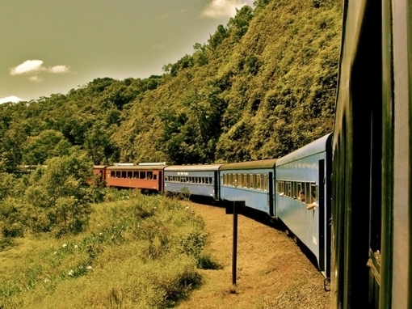

# 2012——末日未至

这是异常精彩的一年。

大片云集，情节离奇，扣人心弦。

世界末日如期未至，历史依然前行。

在我从业的第四个年头，这一年所发生的一切无疑让媒体人激动不已。只可惜，大事件样样陷入雷区。但沉默噤声背后，却是全民的躁动与暗自兴奋。仿佛就将迎来一场真的大变局。

写到第四份年鉴，我越来越感觉到，在这样的国度、这样的年岁，做一个记录着宏观制度改革的小记者，是一件多么幸运的事情。现实中过多的扭曲，却使人在对制度的条分缕析中，越来越清晰的看到一个理想国度的应然图景。

很多人都在不断的问，中国下一步，究竟应该怎么走。

斯巴达落幕，下一个十年格局初定。改革，成为反反复复被提及的一个标语，一个符号，一个图腾。

真正要改变，还是人心，真正需要行动的，还是公民自己。

Start from here.

这一年最值得被载入历史的故事，一开端便悬念迭出。

2月7日，下班时分，不少家住城南的成都人走到美领馆附近时发现，领事馆路已封死，戒备森严，如临大敌。

“爪子了爪子了？！”一些人隐约听说，一个名叫王丽娟的护士长，跑到领事馆来申请政治避难了。

微博上有了更确切的消息。那个护士长原来是个副市长，叫做王立军。

第二天，王“出于自愿”离开了领事馆。随后，他被送上飞机带往北京。再隔一天，重庆方面发出正式消息，重庆病人王立军被“休假式治疗”了。

一场大戏就此拉开序幕。

两个月后的全国两会上，摄影记者抓拍下了薄仰头望天，五味杂陈的表情。

在温的最后一场记者招待会上，最后一个提问的路透记者，终于问到了他一直想要回答的问题——怎么看待王立军事件？温回答：现任重庆市委和市政府必须反思，并认真从“王立军事件”中吸取教训。

24小时后，薄被免职。

一个月后的4月10日晚11点，人们一再等待的新闻终于释放：薄被立案调查；其妻谷因涉故意杀人案也已被移送司法机关。

毒杀命案，宫斗阴谋，一个极具好莱坞元素的剧本，被外媒热捧。包括他们海外的儿子，点滴细节都被悉数记录于案。就像那些最值得期待的大片一样，国内上映总会与海外上映有个时间差。过了将近四个月，谷案开庭，被删节后的大片这才呈现在了中国观众的面前。

人们看到一个后宫深苑神经质的女人，出于种种猜疑，设计毒死了“威胁”其子生命、又有种种利益纠葛的外国友人；忠心下属一面处理后事，一面留底存证，被主子一个巴掌摧毁自尊心和安全感后，向美帝亮出了杀手锏。这个故事经媒体后续的调查报道，更多的细节被披露。原来王在命案中不仅是简单包庇，更是推波助澜，以为一切尽在掌控，弄权者却难逃命运嘲弄。

一个多月后，9月24日，王立军因徇私枉法、滥用职权，叛逃并受贿305万获刑15年。在此之前，谷则被认定故意杀人，被判死缓。

4天后，9月28日，官方正式通报对薄的处理结果。除了对命案的“错误和责任”，还包括受贿、“与多名女性发生或保持不正当性关系”等项。

人们反复咀嚼着斯巴达前这一出风波的政治深意，试图从中解读派系争斗、改革动向。

但毫无疑问的是，这至少深刻的改变了重庆的政局。

薄在重庆的五年，将这座本身就极具魔幻主义色彩的城市，变得更加荒诞不经。就像是向前流动着的历史之河，偏偏在这一个犄角遭遇一道逆流，进而掀起一波漩涡。

种种令人瞠目结舌又捉摸不透的形式主义本已让重庆成为正常人的笑柄——唱红歌、扮江姐、红色电视台等等，而带有明显民粹主义色彩的一系列高福利政策——如大规模的保障房建设，更让地方债务高筑。打黑表面看上去打出了一片太平盛世，私底下却是毫无克制的打击异己，对私人财产的肆意虐夺，对言论自由的无底线扼杀。

随着重庆时局大变，从律师李庄的申诉开始，一系列打黑案件的翻案走进公众视野。人们乐于解剖重庆所经历的这段文革。权力的放肆，法治的沦丧，还有孕育民粹的肥沃土壤。当人们把过多的注意力都放在高层政治的争斗内幕时，很少有人回过头来问一问，重庆人呢？当他们悄悄抓走隔壁爱在网上发牢骚的小愤青时，当他们逼着你穿上滑稽的红军服唱雪山草地就差跳忠字舞时，当他们拿着你们纳的税去栽了又拔拔了又栽银杏树时，为什么普通人还是可以丝毫不受影响的过着普通的生活而对一切视而不见？为什么在这个年代，人们面对威权、强权的时候还是一样的束手无策忍气吞声？

不自由，毋宁死。

这是重庆村官任建宇“煽动颠覆国家政权”的证据之一。这个一面努力跻身体制内，一面又因独立思考而困惑的年轻人，因在腾讯微博和QQ空间复制、转发和点评“100多条负面信息”，而被劳教两年。在舆论的强烈声援下，2012年11月19日，劳教委撤销了劳教决定，任建宇重获自由。

重庆给人们带来的另一个有价值的遗产，便是对劳教制度的广泛讨论。既缺乏法律依据，又缺乏权力制衡的劳动教养，早已被公认为威胁公民人身安全的恶政，却迟迟未有废除的动向。原因很简单——作为最重要的“维稳”手段，劳教实在是太好用了。上访的，抗拆的，发牢骚的，扣上一个涉嫌煽颠，想关多久便是多久。

人们算不清重庆黑打究竟打掉了多少个任建宇的自由。这一年另一个令人心痛的案例，则是永州母亲唐慧。

这是个伤心欲绝的母亲。六年前，她11岁的女儿被强奸，又被卖入妓院卖淫。从立案、公诉到审判，为了让每一个罪人都得到应有的惩罚，唐慧一次次固执的上访、抗诉。她就是要让逼迫和蹂蹑她女儿的七个人都去死。历经三次判决两度发回重审后，2012年年中，七个被告分别被判死刑、无期和有期。本以为事情已该尘埃落定，唐慧却因此前的“闹访”而被处劳教一年。

废除劳教，让唐慧回家。微博签名，学界上书，连官方媒体都开口帮腔。被劳教九天后，唐慧恢复自由。而劳教制度的存留议题，却并未有实质性的推进——斯巴达当前，一切改革都被按下暂停键。

这一年，躲进了大使馆的不仅仅是护士长王丽娟。

4月底，“鸟儿出笼”的消息开始小范围的传播。这说的是被囚禁在山东临沂东师古的陈光诚，终于逃出了狱笼。这位因揭露暴力计生，而被当地政府疯狂报复的盲人律师，已成为中国人权史上再也绕不开的污点。他在因莫须有的罪名坐了四年牢后，依然遭到严格的软禁。2011年，网友们曾大规模的组织占领东师古的运动，无一不被打的落荒而逃。

而现在，陈光诚逃出来了。他绕过监视人布下的陷阱，翻过后墙，17个小时不吃不喝一路狂奔，终于出了临沂市，和北京的朋友接上头。在前后多个朋友的接力协助下，4月26日，陈光诚进入到美国大使馆。

这无疑是让中方极度难堪的外交事件。外交部要求美方道歉，随后北京日报还出了篇令人气势恢宏的檄文，声嘶力竭的控诉美国 “干涉我国内政别有用心”，又前言不搭后语的批评骆家辉瞎搞“平民生活秀”。

临沂方面更是乱了套。气急败坏的看守们发现陈不见了，先是抓走了陈的哥哥，接着又翻墙闯进陈的侄子家一顿乱打。陈的侄子陈克贵奋起反抗，用菜刀砍伤数人。

在大使馆停留六天后，担心家人安危的陈选择离开。多方斡旋的最后结果是，陈和家人一同前往美国读书。中方的表态也有所转折，称陈作为中国公民，可以通过正常途径出国读书。至于陈的侄子，则在2012年11月底因故意伤害，而被判刑三年三个月。

受到国际广泛关注的中国人，并不仅仅只有陈光诚。

12月10日，身着燕尾服的作家莫言，从瑞典国王手中接过了诺贝尔文学奖的证书。

这是在中国官方的语境下，第一个获得诺贝尔奖的中国人。获得这个消息的第一时间里，人们的态度颇值得玩味。

很自然的，人们要提到那位至今作品未能在大陆发表、也不再承认自己是中国人的高行健；更自然的，人们要提到2010年的和平奖得主和那把意味深长的空椅子。

尽管绝大多数人都没有读过莫言的作品，但他们还是乐于对他的党员身份和作协副主席身份冷嘲热讽。尤其是他手抄的毛的讲话——“中国的文艺必须服务于党”。

诺奖委员会给他的评价或许才是公允的——他在嬉笑间揭露了人类生存状态中最阴暗的一面，几乎是不动声色地赋予强烈象征以形象。在颁奖词中，委员会肯定莫言的价值观，肯定他对现实的批判，尤其是对计生政策的批判——喏，莫言和陈，其实都是斗士。

而他们所反抗或批判的，与计生政策相关的暴戾，依然还在上演。

5月30日，丈夫刚出门打工，陕西镇坪县怀孕七月的孕妇冯建梅，便被几个计生干部堵上了门。她怀的是二胎。干部们要她交4万块的“押金”，否则就要引产。 

冯建梅偷偷跑到姑姑家，遭遇围堵，又跑到山里的亲戚家。她躲在草丛里，躲到床板下，最终还是被四个人抬着，头上蒙上黑衣服，送进了医院里。6月2日15点40分，她被迫注入了引产针。在同胎儿一起痛苦挣扎了一天多以后，6月4日凌晨，浑身乌青的死婴被产下。

这个发育近乎完全的孩子，蜷曲成一个问号，躺在头发凌乱的母亲身旁——就是这张照片，引起舆论哗然。委屈而痛苦的冯建梅夫妇向外界大声控诉。就在他们接受外媒采访后，当地竟然还有人到冯所在的医院游行，打出“打到卖国贼”的旗号。

一个月后，冯建梅夫妇被迫妥协，接受政府7万元“补偿”，得以回归正常生活。而以此为契机，数十名学者联合上书，要求调整现有生育政策。剥夺公民生育自由的计生国策，酿就了太多类似的悲剧，更埋下中国社会深重的老龄化危机。而就如同劳教的讨论，上书并未有所回音。人们默默念叨，或许等到斯巴达之后吧。

关于儿童的死亡，这一年最刺痛人心的事件，莫过于贵州毕节垃圾桶里的五个流浪儿。

11月15日，毕节下着小雨。五个孩子本来已在一个工地上搭了棚子，但被赶了出来。天太冷，他们钻进了街头新安置的垃圾箱，然后点燃了枯树枝来取暖。

天亮时，他们没有再醒来。

五个鲜活的生命，却卑贱的如同垃圾般，悄无声息的，被遗弃，被埋葬。 

人们不断问，为什么？他们的家人呢？学校呢？救助站呢？

这五个孩子来自同一个大家庭。一个贫困而又问题重重的家庭。他们有的父母离异，有的是被父母彻底抛弃在家的留守儿童，吃不饱，穿不暖，无人照料，仿若孤儿；他们有的是超生儿，办不下户口，进不了学校，或者严重学厌学困，一心向往着外面的世界；他们也被救助站收容过好几次，受不了管束，自己想方设法逃走，或者被送回对他们而言已毫无意义的家里，没过两天便又选择出走。

人们谴责着政府，谴责着父母，却很少扪心问问自己：看到那些路边脏兮兮又小偷小摸的孩子，看到那些抱着大腿纠缠着卖花的孩子，什么时候想过其实这个社会多少还是可以为他们做一点什么？

同样是留守儿童，12月14日，就在美国20个孩子丧生校园枪击案的同一天，河南光山23个孩子，被受“末日说”影响的精神病男子砍伤。

而在国内主流媒体都大规模的扑向美国校园枪击案，恨不得立即要就禁枪展开辩论时，光山却在封锁消息，甚至还在地方媒体发了一篇讴歌当地教育工作的文稿。

类似的校园暴力，在最近两年里一次次重演。同样的还有校车事故。12月24日上午，江西省贵溪市滨江镇，又有11个孩子死在了上学的路上。

儿童，是一个社会最应关爱的群体。这一年却频频发生各种虐童案件。仅在十月，就有山西一个幼师对着孩子狂煽70个耳光的视频、以及温岭幼师颜艳红拎着孩子耳朵“闹着玩”的照片曝出。

儿童权利，在中国总是一个飘飘然的空洞口号。当全世界绝大多数国家都已建立儿童福利署和一整套保护机制时，中国甚至还没有一个专门的行政机关相对应。

除了这些凄苦悲凉的故事，今年也有部霸气的警匪大片。

8月20日，身负十条人命的悍匪周克华，终于被击毙。

在此之前，他已与警方斡旋八年之久。他瞄向的多是刚从银行取钱出来的人，一枪从太阳穴爆头，并毫不留情的扫清逃亡路上的一切障碍。就在重庆警察大规模搜山时，他还无比淡定的看了一场《听风者》和《太空一号》。

迟来的终结，终归为社会清扫掉一个高危炸弹。另一个颇具戏剧性的炸弹，5月10日在云南巧家爆炸。当时，白鹤滩镇花桥社区便民服务大厅正在进行征地拆迁补偿协议的签字，炸弹引爆，4死16伤。

当地矛盾重重的拆迁，被认为是这场暴力案件的缘由。作案者，则被锁定为背包进入案发现场的26岁农民赵登用。这个靠出卖苦力为生的年轻人，为人和善，与拆迁也无利害关系。警察实在解释不清楚他的作案动机，于是翻出他的高中日记、QQ状态，想方设法证明他的反社会倾向。面对记者质疑，县公安局长以自己的前程作保，称事实已经非常清楚，赵登用就是嫌犯。

然而，三个月后，官方的正式通告却狠狠煽了公安局长一耳光。赵登用其实是爆炸案的受害者，两名钉子户才是真正的罪犯。他们花了100块，雇佣赵登用把包背进大厅，这个老实巴交的农民怎么也想不到背了一颗终结自己生命的炸弹。

在汕头潮南区一家文胸作坊里打工的十四个年轻女孩，也永远想不到自己的生命会终结在工厂的烈火里。12月4日，同在工厂打工的纵火者刘双云，因为老板欠薪克扣工资，他满怀怨恨的买了四十块钱的汽油，喷洒在工厂满地都是的海绵上。

3月23日，17岁的李梦南在买水果刀时，也是一肚子的怨恨。这个家住鄂伦春的年轻人，三岁时父母离异，后来父亲因抢劫入狱服刑，相依为命的爷爷又得了胃癌。正当他满心希望的想着要出门打工，让家人过上好日子的时候，强直性脊柱炎又缠上了他。这是一种痛苦的慢性病，腰背关节长期疼痛，连上厕所都无法下蹲。祖孙俩为了治病，每次都坐九个小时的火车前往哈尔滨。医生给他开了最贵的药类克，而这种药绝不能用于肺结核者。

李梦南在服药一个月后，却出现了肺结核症状。家人搞不清究竟是否药物引起，但不信任的种子却已埋下。等待治完肺结核，李梦南满心期待的再次来到哈尔滨，等待他的却是医院间的辗转与推诿。“当时我非常生气，我和爷爷大老远来的，他们不理我，我挺恨大夫的。”

李梦南避开爷爷，买了水果刀，冲进了医生办公室。和他毫无关联的28岁实习医生王浩就此殒命。王浩即将去香港攻读博士学位。他说他如果真的成为一名医生，他会好好对患者，不收红包，不收回扣。只是，他不再有机会。

这一场场悲剧背后，总有着体制的纠葛。无论是征地拆迁，劳资纠纷，还是停滞的医改，制度的缺失叠加个体的戾气，付出生命代价的总是无辜的弱者。

还有一些生命，以意想不到的方式殒没。

7月21日，北京大雨。一场没有预警、没有戒备，让所有人都不以为意、事后却证明是六十年来最大的雨。晚上七点，34岁的丁志健和朋友聊完公事后，开着自家的越野车准备回家。他的妻女正等他回家吃饭。而当他经过闹市区东二环的广渠门桥时，竟然困在了被积水淹没的铁道桥下。他打不开车门。派出所说桥下没有车。站在辅路上的消防队员束手无策。他的妻子借来大喇叭，一遍遍的喊，“丁志健，丁志健，我来救你了！”

但他没能坚持到最后。他溺死在了北京的二环路上。他的手上和头上，都是撞击和捶打留下的伤。

一场大雨，北京79人亡。

8岁哈尔滨女童林玥彤的生命终结于8月14日下午4点半。她和外婆正坐在自家开的超市外的马路牙子上玩耍。而突然间，身下平整的路面毫无征兆的坍塌成直径十米、深达13米的大坑。

市政管线的老化渗漏、地下工程的施工不当、管理混乱的人防工程，让城市的马路，成为一个个潜在的噬命陷阱。仅在这一年，北京、哈尔滨、南京、太原，连发上百起地陷事故，一时间行人步步惊心。

令人担心的，还有塌桥事故。8月24日凌晨，哈尔滨阳明滩大桥疏解工程发生桥面坍塌事故。约121米长的桥面整体倾覆，四辆货车坠下，三死五伤。而在最近五年间，中国已经至少发生过13起大桥垮塌事故。

官方调查的结果，将这一事故原因解释为货车超载。

这是事实。倒塌的桥，采用的是“独柱墩”结构，重车超载且单侧行驶时，就有可能造成倾覆。

但公众不愿接受这个解释。他们更愿意相信是质量问题。他们要求公开工程信息，要求彻查其中贪腐。

有的公民，将这种要求，变成了行动。

8月27日，上海大学生雷闯，向哈尔滨建委递送信息公开申请，要求公开阳明滩大桥垮塌事故的设计、施工、监理单位。

这只是这一年由律师、大学生、NGO合力掀起的“阳光运动”中的一个案例。公民利用信息公开条例，针对热点事件，不断要求政府公开信息、提高透明度。更有影响的两个案例，直指官员财产公开。

8月26日，延安发生一起特大车祸，一辆满载旅客的双层卧铺客车与一辆运送甲醇的重型罐车发生追尾碰撞，随后燃起的大火导致客车上36人死亡，3人受伤。公众对这场悲剧的注意力，很快转移到了在现场微笑的安监局局长杨达才。网友对他发起人肉，列出他所带过的多块名表。9月1日，三峡大学学生刘艳峰要求陕西省财政厅公开杨达才2011年度工资。

2012年10月10日，广州城管局番禺分局政委蔡彬被网友曝光名下有21套房产后，官方迟迟未有正面回复，20岁的南京大学生段国超也向番禺财政局寄去信息公开申请，要求公布这位“房叔”的收入状况。

尽管两项申请最终都不了了之，但两名贪官则被正式拉下了水。官员财产公开的动议，又一次大规模引起讨论，并得到高官的呼应。

斯巴达期间，上海市委书记俞正声、广东省委书记汪洋纷纷表态，要建立完善官员财产申报和公开的制度。“只要中央决定，自己很容易公开，因为我没有多少财产”，俞说。

“中央”也快被逼急了。10月25日，纽约时报大幅头条，Billions in Hidden Riches for Family of Chinese Leader——指向温的权贵家庭。一些小道消息开始传言，称温看到此文后明确表态，他要公开财产，要求对己公开调查，若有贪腐愿接受公审。

可惜，这样的小道消息，连同NYT，已经所有相关联的信息，都已经被屏蔽。不明就里的人只能看到喉舌媒体突然莫名其妙做起了专题，向公众讲述NYT是一个多么没有底线、没有公信力、充斥虚假报道的媒体。

下一步究竟要怎么改，所有人都等待着斯巴达。在那之前，仿佛所有的公共政策改革，都就此停滞。

在这一年的最后几天，各省市终于就异地高考交了答卷。大多数地方打破了户籍门槛，而矛盾最尖锐的北京仍是铁板一块——满足诸多复杂条件后，“外地人”的孩子只能在北京读职业学校——在 北京人 的语境下，他们就活该当工人，这个社会似乎就应该被如此的阶层固化。上海广东略有松动，为不同 标准 的人的孩子划定了他们通过教育可达到的最高等级。

这些艰难的微调背后，是本地人与“外地人”的零和游戏。15岁的上海女孩占海特被推上前台。在她的名字中，“海”是上海的海，“特”是特区的特。她的姓名就是她的成长轨迹——一个在城市间辗转的“流动”儿童。尽管一家人已在上海站住脚跟，由于没有户口，她初中毕业后，便无法在上海升学。她一面着手准备出国，一面在网上与“本地人”们打起了口水战，发出约战书，要论辩异地高考是否应开放。

“本地人”的反应超乎预期。他们对占家进行人肉、抨击，举报他们超生、漏税，毫不客气的向一个15岁的孩子身上泼去一盆盆的污水，全然忘记自己还是个声称理性的成年人。

由户籍制度固化的特权，将公民赤裸裸的撕裂成对立的群体。那些看似无辜而自恃卑微的屁民们，摇身一变就成了捍卫体制的卫道士。

与异地高考同题的另一面，北京这样的大城市，依然还在拆除着农民工子弟学校。城镇化，已经被新一届领导人列为未来中国经济发展的增长点，中国政府居然还始终未对农民工——乡村移民们，做好战略性的接纳与安置。

城镇化下，地方政府最关切的，依然还是土地的城镇化。以提高农民补偿为核心的改革方案，已经在这年年底送到了人大常委会的案头。而打破城市经营土地的垄断，依然还未提上日程。

养老制度仍然是一个大隐患。2011年，14个省的养老金当期收支出现缺口，与此同时，个人账户的空洞也达到了2.2万亿。然而，除了年初广东一千亿养老金入市投石问路，无论是做实个人账户、国企分红入社保基金还是成立养老金理事会，核心的制度改革丝毫没有动议。

而另一场有关大病救助的讨论，也在微博的助推下，随着一个个悲情的故事进入公众视野。至8月底，中国政府面向城乡居民正式启动大病补充保险。而在相应的医保制度进一步刺激医疗需求的同时，医改最为核心的供应体系，却难有实质性的变革。

不过，也并非每一样改革都如此悲观。

近年来被频频提及的“社会管理体制创新”，被视作是政府向社会让渡的第一步。自广东始，社会组织登记管理体制的试点在这一年起步，开始为社会力量松绑。结社自由有限放开——公民结社，不再需要两个婆婆的双重审批，而改为在民政部门的直接登记。其实，这只是程序上的有限进步，对公民结社自由实质性审查的本质并未改变。

但有了第一步，必然就会有下一步。

人们多少看到了些苗头。12月9日，北京一起抗议京沈高铁通过密集居民区的集会，在墙外盛传，获得了官方罕见的批准。

类似的公民行动，仿若中国民主化的曙光，人们无不为之欢欣鼓舞。7月1日，四川德阳什邡，因反抗重污染的钼铜冶炼项目落地，民众大规模示威游行。武警、特警迅速维稳，警民冲突激烈，使得这场抗议颇具悲壮气氛。年轻的90后们第一次找到走上历史前台的机会，无不自我感动、自我升华，打出了“为了什邡人民，我们愿意牺牲”的口号。

年轻一代对公共事务的关切，赢得公知们的普遍称赞。而随即到来的启东事件，却有些端倪，夹杂在类似的 大进军 场景中。

这也是一场邻壁运动。由于担心日本王子纸业集团准备在当地修建的排污设施会对民众生活产生影响，数千名（也有说上万名）启东市民，在7月28日来到市政府门前广场抗议。作为发达地区，地方政府相对克制，武警仅是维持秩序，并未强力驱散民众。然而，很快的，强烈的 历史感 燃烧着 人民 的肾上腺素。一群人掀翻汽车，冲进市政府，扒光市委书记的上衣，砸烂办公室电脑，还有人谣传从抽屉里翻出了安全套，特有正义感地质问着：这都是什么东西什么东西？

一个多月后，广场效应的破坏力，更真切明白的摆在了人们眼前。

9月以来，由日本实施钓鱼岛国有化引发的中日两国危机逐渐升级。中国民间反日情绪不断高涨，最终在9月15日前后到达顶点。成都、西安、上海、广州、北京、青岛，一二线城市悉数陷入抗日的狂潮中。

很少有人说得清这场游行示威究竟是怎样组织起来的。人们能够看到的只是一些迹象。警方提前向一些日资企业发出过预警，但警察又同时收到要求要保持克制。人们只能根据过往反日游行的经验，去猜测背后究竟有无官方示意——要知道，1999年的反美大游行，学生就是一车一车被拉到抗议现场的。

究竟什么人在参加游行？确实有组织。例如打着毛的头像，甚至拉上毛的模仿者，亮出“毛主席我们想念你”的人；例如通过网络联系起来的“爱国人士们”——从学生到职员到农民，接受了数十年的洗脑教育后，不可否认的是，中国确实有人——而且是不少人，真心实意的爱着他们的祖国。等着这些人先上街了后，更多的“闲杂人等”回忆起来，他们听到声音，看着好奇，跟着走走，然后就情不自禁的加入到了队伍中，爱国之情油然而生。他们感动着，升华着，将渺小的自我融化于 我们 之中，狂热而兴奋的仿若发现了人生的另一个价值——附着在历史感之上，一切都变得伟大了起来。

他们太兴奋，太激动了，太生气了。他们心中早已没有了自我，只有了各种迫不及待要呐喊、要宣泄的情绪。于是他们推翻了日款汽车，砸开了日资企业的大门，他们开始纵火，他们开始狂欢。开着丰田车的李建利，被一把U型锁狠狠砸碎了头骨。青岛的日资商场JUSCO，被洗劫的一片狼藉。

是的，在此间升华的，多是平日自称弱势的底层草根。而他们，也才是中国公民的最大主体。游行中的暴戾，让这个社会的中产阶级、有识之士感到恐慌。他们看到的绝对不是公民意识的觉醒，而是彻底颠覆了法治框架、文明约束的个体宣泄。没有公民教育根基下的民主化，必然只能换来庸众的狂欢和民粹的胜利。中国已经从土改的抢掠、文革的癫狂中有过太多的教训，却还没有真正的提高警惕，并采取行动。

与之形成鲜明对比的，是同一时间在香港发起的反国民教育运动。避免自己的下一代被内地版的“国民教育”——更准确的说法是“愚民教育”所洗脑，香港人开始大规模的抗议。让国内观察人士尤其感慨的，不仅仅是每个国民勇敢而大声的说“不”，还有抗议的秩序与理性。而发生在大陆的这场游行成为他们抗议最有力的注脚——失败的国民教育，造就了没有独立人格和灵魂的一代又一代，最终造就了只有威权政府而无所谓民主自由的社会。

终于地，终于地，比往常晚了一个月，斯巴达终于地召开了。

终于地，终于地，比往常晚了两个小时，七个人走出来和大家见面了。

一场太过漫长的等待，已经被此前过于兴奋、躁狂的猜测、解读，耗尽了新鲜感。也不再有什么戏剧性的，这一场仿佛就能决定中国下一个十年的会，就开完了。

历史仿佛要重重地又按下播放键，要中国改革又抖擞抖擞地转起来。

习的亮相讲话，从一句“让大家久等了”开始，就赚得了不少加分。随后是12月南下广东，轻车从简，不封路，不限行，路线行程更被解读为对市场经济、改革开放的坚持。

再随后，便是来势汹汹的反腐浪潮。抓着岁末这一个多月，几乎每天都有贪官被曝出。例如刚刚被选上中央候补委员的原四川省委副书记李春城。再例如长相奇葩的重庆市北碚区原区委书记雷政富，愿为真爱写保证书的山东省农业厅原副厅长单增德。更直接的效应，是各地二手房成交量的明显增加——其中不少，必是官员急于脱手的房产。

12月21日，末日未至。

全能神的末日预言未能实现。他们也没有机会再战大红龙了。大红龙赶在末日前，一口气抓了他们好几百人。但教徒们还是相信，没有21日起的三个黑天黑夜，也会还有72天的灾难日。教徒们渴望着被救赎。

有人指望着神。有人还指望着大红龙。而真正要指望的，是自己。

习说，人民对美好生活的向往，就是我们的奋斗目标。

而人民，你们所希望的美好，又究竟是什么样的？一个让每个人都有公平发展机会的社会。一个能保障每个人有尊严的生活的社会。一个有道德秩序，理性表达，相互尊重的社会。一个充满竞争生机，而又能充分关怀弱者的社会。

在这样的社会中，人们面对央视突兀的镜头，才会淡定的说，我幸福。没有戾气，没有愤懑，没有焦躁。有保障，机会，有希望。

美好的生活，终究需要自己创造。

2012，新纪元开启。

（采编：佛冉，责编：佛冉）
