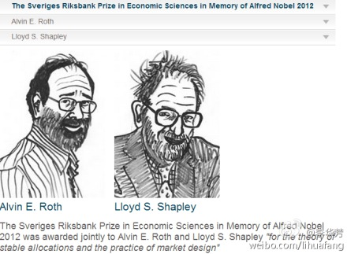

# 2012诺贝尔经济学奖介绍：稳定分配与市场设计

**对今年的诺奖而言，最让我触动的是纯粹产自想象的理论问题和实践中产生的问题是如何交织在一起，提出对现有理论的挑战的。而夏普利和罗斯，以及他们那些未能获奖但无比重要的合作者例如盖尔和乌讷弗（****M. U. Ünver****）等，又是如何将理论与实践紧密结合起来，并切实应用到实践中，提高市场效率和社会福利的。对未来的研究者来说，如何将理论与实践结合起来，恐怕也是本届诺奖带来的另一个启示了。**  

# 2012诺贝尔经济学奖介绍：稳定分配与市场设计

## **文/****李华芳 ****（上海金融与法律研究院研究员）**

 

经济学是研究资源最优配置问题的，而真实世界里配置资源的方式多种多样，市场或者说价格机制是经济学研究最多的。但是有一些市场里头，价格的作用受到多种限制，可能是来自法律等正式规则的限制，也可能是来自习俗或伦理道德等非正式制度的限制，例如最明显的例子就是找对象的时候不是价高者得，而是情投意合才结成夫妻。

问题是情投意合这种分配方式讲究“配对”，而且这种配对最好还需要“稳定”，麻烦的是还不能依靠传统的价格机制，在这种情况下经济学应该怎么办呢？2012年的诺贝尔经济学奖就授给了夏普利（L. S. Shapley）和罗斯（A. E. Roth），表彰他们在稳定配对和市场设计方面的理论和实践并重的贡献。

严格来说，并不是经济学家首先提出并在理论上解决这一问题的。1962年，数学家盖尔（D. Gale）和博弈论学者夏普利在《美国数学月刊》（American Mathematical Monthly）发表了一篇名为《大学录取和婚姻稳定》的文章，首先提出了后来被称为盖尔-夏普利算法的稳定配对（stable matching）问题。顺便说一句，博弈论领域已经涌现了大量的诺奖得主，1994年奖给了海撒尼、纳什和泽尔滕，2005年给了奥曼和谢林，2007年又给了赫维茨、马斯金和梅耶森，不过这些获奖者主要都是非合作博弈领域的大家，而夏普利可以说是合作博弈领域的巨头。所谓非合作和合作博弈的区分，简单来说就是非合作主要是个体之间的博弈，而合作博弈则处理群体与群体之间的博弈，例如医生与医院、学生与学校这类群体间的博弈。夏普利值也是这个合作博弈领域最为突出的贡献，不过有意思的是，这一次的诺奖贡献却没有颁给“夏普利值”，而是稳定配对理论。

这个稳定配对大意是说不存在两个人，他们都更中意于彼此、胜过他们当前的配对者。通俗来说，就是你的配偶是你所获得的最爱。因为就整个市场而言，如果婚姻市场上有数量大致相当的适婚男女，男的知晓所有女的信息，女的也一样。然后男的对女的有一个排序，女的也对男的排序。接下来一方发起求婚，另一方对照自己的偏好排序表，如果是最爱的就接受，不是的就拒绝。在交易费用为零和配对时间不限的情况下，最终萝卜青菜各有所爱，每个人总能找到自己的伴侣，并且这种配对是稳定的，即没有人想分手，不会出现出轨的现象。为什么呢？让我们假设有X男和Y女出轨了，X与原来的M女分手，这说明X更偏好Y，这违反了预设的偏好稳定。当然这可能意味着X之前没有向Y求过婚，同样对Y来说选择X也意味着更偏好X，但每个人都是按照自己的偏好排序来求婚的，就违反了偏好排序。所以如果是稳定配对，就不存在出轨现象。

细心的读者会发现，这其实和经济学对理性人的偏好稳定及偏好可排序假设没有任何区别，无非是这里并不是用价格，而是用配对来配置婚姻资源。盖尔-夏普利算法对多人参与的合作博弈如何分配资源的问题有重要的贡献和启示。对经济学来说，不仅仅存在个体与个体之间的交换，而且还存在大量群体参与的交换，这个时候如何让供需双方稳定配对，并不是简单的事情。

但经济学家要在这篇数学论文发表差不多20年后，才开始将其中的原理逐步应用到真实世界的市场里。而这个工作最主要的代表者就是罗斯。1984年罗斯发表了一篇关于实习医生的文章，将夏普利的理论应用到解释实际经济问题中。在医学领域，学生通常在后几年学习生涯中需要去医院实习。1940年代，美国的医院系统开始大规模发展，但医学院学生的数量很少，医院之间的竞争导致对医学院学生需求的急剧增加，于是很多医院就让学生提前实习，甚至在这些学生还没有选定专业领域的情况下就参加实习。但如果学生拒绝一个医院，往往导致医院再去找第二个学生就太迟了，因为第二个人可能已经被另一个医院抢走了。市场在这种情况下是极为不稳定的，因为医院往往会设定一个最后申请期限，迫使学生在不晓得是否还有其他机会之前就做出选择。由于医院未能及时给所有学生提供机会，而学生也未能向所有医院提出及时申请，双方都未能极大化自己的利益。

到了1950年代，为了解决这个问题，美国设立了一个集中的清算所（Clearinghouse），也就是全国住院医师配对项目（NRMP：National Resident Matching Program）的项目。在1984年的论文中，罗斯发现这个清算所采用的就是盖尔-夏普利算法，从而达到有效而稳定的配对。跟着这个发现，罗斯随后考察了英国的医院和医生配对情况，发现有些地区是稳定的，而有一些则不然。那么随之而来的问题就是为什么会有这些差异呢？原来英国不同的地方采用的配对算法不同，而如何有一个算法使得配对稳定下来，就成为成功的关键。如何改进算法，不仅要利用每一个市场的信息，也要借助计算机技术的进步，将理论和实际联系起来，这促成和发展了经济学的一个分支：市场设计。这个在拍卖领域得到了最广泛的应用，2007年克拉克奖得主阿西（S. C. Athey）就是自然资源领域拍卖设计的领军人物。而Google公司的在线广告拍卖也得到了首席经济学家范里安的帮助。

美国的NRMP项目一开始很成功，但随后又遇上了一个意想不到的问题。那就是医生夫妇的问题，因为1950年代中期之后，医学院的女生数量开始增长，这导致了医学院学生中夫妻学生数量也开始增长，他们在找实习机会的时候，总是倾向于在一起，而采用NRMP系统找实习的话，两个人很可能分开，因为同一个医院对两个人的排序是有差异的。这种情况下夫妻学生档开始绕过NRMP找工作，这就重新导致了市场的不稳定。由于NRMP系统青睐医院胜过学生，招致了大量的批评。罗斯在1995年应NRMP的要求，重新设计了配对系统，加入对学生配偶考虑，这项调整使得清算所稳定配对的功能得以继续发挥。NRMP于1997年采用了罗斯新的设计，现在每年能为约2万个学生有效匹配医院实习职位。

但这里还有一个问题是，如果学生夫妻可以抗拒最初的NRMP项目来达到改变项目的目的，那么是不是也有人可以通过系统地操纵算法来获得更好的收益，例如通过先隐藏自己的真实偏好并使他人境况变差来获得更好的收益。对市场设计而言，最重要的除了稳定（stability）之外，还要激励兼容（incentive compatibility），也就是说没有人有激励说谎话，这样除了能真实揭示出每个参与者的偏好排序外，也避免了有人系统性地操纵市场。罗斯后来的工作表明要系统实现操纵NRMP项目是不可能的，不仅因为新的算法避免了学生这种“错误表达偏好”的可能，也避免了医院系统操纵NRMP项目的可能，因为成本太高。关于激励兼容的研究，是2007年诺贝尔经济学奖得主赫维茨、马斯金和梅耶森的贡献了。

而罗斯后来的主要工作是将博弈论、经验证据和实验室研究结合起来，这个领域之前的获奖者是2002年的弗农·史密斯。我们已经知道找对象和找工作都是双向配对的，但是有一些真实世界的问题却不是双向的，而是单向的。例如对器官移植而言，就是完全单向的，病人是等待者，而捐赠者捐出之后，最好能又快又好地进行移植手术，才能最大化捐赠人和受赠人的利益。在这个市场上，等待器官移植的人由于受到法律和道德的限制，不能实施价高者得，而且可能实施起来的成本也不低，所以必须要有另外的配置资源的方式。那么在器官移植这种问题上，如何提高效率呢？

市场设计在这里也有可为之处。夏普利和盖尔提出了另一种算法，叫做“首位交易循环”（TTC: top trading cycle），TTC机制除了在器官移植领域广泛应用外，在学生择校领域也有广泛应用。TTC是说先进行之前提到的稳定配对，已经配对完成的参与者就从市场中移除。这个简单的限定在偏好稳定且可以排序的情况下，就导致没有人愿意说假话掩盖自己的偏好并试图操纵市场了，因为说真话揭示自己的真实偏好是唯一优胜的策略。在生死攸关的器官移植问题上，这一算法简单却又实用的保证了配对稳定和资源分配的效率。这里的挑战有两个：一是捐赠的器官是不是与受助者兼容；二是移除配对完成的参与者也需要时间。尽管如此，美国有大量的州已经实行这一TTC机制多年，为大量患者带去了福音。

正如前头已经提到的，这类市场设计可以被推广到大量价格的作用首先的市场里，其中最主要的一类应用是学生择校。学生要选到自己的理想学校，而学校也想挑选最佳学生，这显然属于两个群体之间如何最优配对且能稳定配对的问题。中国有不少研究高考择校问题的学者，已经在这方面做了一些探索，比较不同的择校机制之间的优劣。事实上，夏普利和后来的研究者已经将盖尔-夏普利算法做了改进，也可以被应用到价格起作用的市场中，例如拍卖，尤其是网络拍卖，有竞价，有大量的信息，以及便捷的技术，这个领域正在产出大量有意思的新问题和文章。

可能会有人指出类似清算所这样的机制最终隐含了计算机社会主义的倾向，不仅因为其是一个中央集权式的设计，而且也极端依靠大型的计算机能力，这也是“市场设计”派常常被人批评为试图将经济学工程化。而事实上，这有可能是一种误解。因为正如我前面所言，这是处理真实世界里那些价格机制的作用受到各类限制和约束的情况下，如何改善市场效率的问题，并不是对市场的推翻，而是要设计出让市场更好发挥作用的机制。这显然是对市场的拓展。

其实我更愿意从另一个角度来看这个问题，那就是理论联系实际。对今年的诺奖而言，最让我触动的是纯粹产自想象的理论问题和实践中产生的问题是如何交织在一起，提出对现有理论的挑战的。而夏普利和罗斯，以及他们那些未能获奖但无比重要的合作者例如盖尔和乌讷弗（M. U. Ünver）等，又是如何将理论与实践紧密结合起来，并切实应用到实践中，提高市场效率和社会福利的。对未来的研究者来说，如何将理论与实践结合起来，恐怕也是本届诺奖带来的另一个启示了。

 

（采编：彭程；责编：彭程）

 
