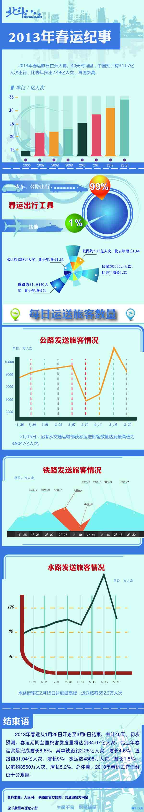

# 2013年春运纪事

**刘迎：为什么不能用“中小城镇化”来解决春运问题**

春运难不是个暂时性的问题，因此大家都懂得要从根源上思考解决办法，而根源呢，是供求失衡。在需求这一方，就是每年春节需要运输的人太多。由于这群人中很大一部分是离开家乡去大城市打工的农民，所以，有人提出，为了从根本上解决春运问题，我们要走城镇化道路，让农民呆在自己的地盘上，这不是就减少了很大一部分需求吗？

这种说法没有错。中小城镇化的构想是，农民在家门口的小镇上就能获得很好的就业，不需要挤进遥远的大城市，那么也就不需要每年一次的大迁徙。这样看来春运问题大概是能得到很好解决的。

但是，你要拿这个方案去问农民，他们愿意吗？用中小城镇化解决了春运问题，有没有想过会带来其他更严重的问题呢？

这个更严重的问题就是农民的发展问题。其实搜一下文献就会发现，“发展中小城镇”的观点大概是在前几年就不再提了，现在普遍认同的是“城市化”，而且是“大城市化”。为什么是这样呢？

因为大城市更有益于农民的发展。首先，由于大城市中人口规模大、产业链长等等因素，就业岗位多、机会多。其次，大城市中的公共服务是中小城镇无法企及的。许多在大城市里工作的外来人员收入不一定比留在老家的人收入高，但他们还是愿意留下，因为大城市中的基础设施、教育、医疗等无形中增加了他们的福利，因此算上这些隐性福利，他们的条件是优于留守家乡的人的。另外，很重要的一点是，大城市中有希望。“我们这一代在城市中吃点苦坚持下来，下一辈就会有更高的社会地位。”大城市中的阶层向上流动空间大，并且相对于中小城镇，流动更加容易。

当然你想说，那么中小城镇也可以建立良好的公共设施保障体系增加就业岗位。但是中小城镇由于人口规模小密度低无法形成规模经济等等自身限制，发展这些东西成本很大，并不是说政策倾斜了就能发展起来。

因此，用城镇化解决春运问题，好比你对农民说，为了不用遭受每年一次的拥挤，你们放弃更好的发展机会、更多的经济资源不就行了？

从供需这个根源上思考春运问题是对的，但提出“城镇化”的错误在于抑制需求的解决方式不对。若想减少农民工的流动，需要的是各地区城市的平衡发展，也就是说，中部、西部的省份中的大城市要跟上东部沿海城市的脚步，让每个区域中都有几个发展良好的大城市，使得农民迁移的路途不那么遥远，这才是真正的“就地发展”。与其说把农民留在自己的村镇，不如说，把农民留在自己所在区域的大城市。这样一来，回家的路，也就不那么艰辛了。

**马军：春运不只是铁道部的事儿**

貌似从“反正我是信了”开始，铁道部大有取代足协成为中国人民痛骂焦点的趋势，而且趋势越来越明显。因为毕竟冲击世界杯四年才来一次，而春运一年就得来上那么一回。因为人多路远车票少，所以难免人挤车脏黄牛多。在这萱萱无处不在的年头，铁道部成了少有的低政治风险的吐槽对象。于是每到过年，上至官媒下至微博，矛头纷纷对准铁道部，看来要当好铁老大，不光要有铁筋骨，还得有张铁面皮。

足协前两年办过一系列的活动，主张足球要从校园抓起，结果在学校里搞了一系列的活动，打算复兴校园足球。当时有人问我怎么看这事儿，我就说校园足球不是足协的事儿，而是教育部的事儿，只要中国高考依旧不考盘带过人任意球，校园足球肯定是起不来的。同样的，只要中国户籍制度城乡差异土地政策贫富差距还存在着，春运就不可能靠铁道部多弄几列火车就能解决的事儿。

有经济学家说，面对着一票难求的景象，应该采取市场的逻辑，让车票涨价，让买的起的人走，买不起的人留，多赚出来的钱补贴农民工。其实看看列车上质低价高的盒饭，便知道火车上早就市场化了，吃得起的人吃盒饭，吃不起的人吃泡面，但我们却也不知道那些涨出来的盒饭钱，是不是最后都贴给吃泡面的人了。就像我们不知道那些涨出来的油价多出来的过路费，到底有多少跟真的跟国际接了轨，有多少真的还了修路的贷。连红十字善款都能变玛莎拉蒂的当下，看来人们对铁道部的不信任，也不只是铁道部的事儿啊。

**张舸：免于匮乏？**

一个着实很庞大的国家，正又一次迎来一场遍及南北东西的喧哗。每年冬季最寒冷的时候，这个国家的人们就会纷纷踏上在工作地和家乡之间往返的旅程。

这也是被反反复复诟病着的旅程。拥挤、昂贵、短缺、不便，这些问题每年都被提出，已经成为了一种令人厌烦的常态。而其中，铁路不曾例外地，始终是责难的焦点。毫无疑问，最直接的原因是铁路部门荒谬到超出常识的行为和政策。然而这并不是问题的全部。

2012年6月，在福建发生了一起长途客车事故。这并不是近年来的唯一一起，如果我们还记得，从很多年前，客车的安全性就时常受到批评。然而，这一次公安部研究员给出的解决之道，却是全面废止超长途汽车客运。

很简单就能想到，公路客运由于其灵活性，尤其是在需求突然增长的时候，是足可以成为其他交通方式的有益补充的。实际上，单看高速公路上出现大型客车的频次，我们就可以对公路客运的规模有一个直观的了解。然而，有司提出的方案却是草率的禁止。所幸这仅仅是一个方案而已。

之所以提及这件事，是因为如今的争论正越来越多地集中在铁路运输是不是福利、应该不应该是福利上。然而福利问题是不值得过分担心的：福利带来的财政负担显而易见，从而所有的福利都会止步于其不能承担之前。更具有迷惑性的是管制，因为，正像民主制度的反对者认为的那样，它（在一定的时期看上去）竟然是有效率的。管制带来的消耗，远不像福利那样直观。

所以与福利相比，管制更加可能成为一个问题。尤其是，管制的恶果更可能被归于手段的错误，而福利的损害却容易被认识到来自制度本身。然而，如果说福利作为重新分配的手段，并不能使我们免于匮乏，那么管制作为对财富如何产生的干预，为什么会更可能改善我们的处境呢？

这也就是我与一些市场派的关键分歧。考察福利带来的损害是容易的，但如果仅限于此，就完全可能得出中国政府缺少福利从而是好政府的结论，而忽视其相比之下大得多且管制多得多，这当然是荒谬的。

免于匮乏，这可以是一个恰当的追求——虽然匮乏本身也是世间的常态。但是在谈论这个问题的时候，我们也同样应该清楚，存在一些看上去很美却会使得问题更糟糕的路径。

**曹雨晨：我曾天真的以为自己能懂铁道部**

春运中使用最广泛的当然是铁路交通，便捷、安全、运力大以及明显的价格优势成为最受春运大军，尤其是农民工、学生青睐的一种交通方式。它作为一种交通方式本是沟通各地，把世界拉得更平的一种方式。可如今我国的铁道交通却因为铁道部超常的想象力、独特的思维方式，给乘坐者带来重重阻碍。

各地火车票购买制度不同，政策朝令夕改却又难以得到确切信息。非得修完信息检索学、新闻传播学才能弄懂其中奥妙，顺利知道何时开卖。对于如此难买却又牵扯着过年回家大事的火车票，这样信息不通实在不是件好玩的事。

以笔者个人经历，无论我微博关注官网查询新闻追踪，也始终摸不清火车票购买情况。突然有一天走在路上都在谈论买票问题，又突然通过“妈妈告诉我”这一神奇渠道得知居然已经开卖了，还只能亲自排队不能网上购票。直到买完票也只有在代售点外一张手写告示纸上看到开卖信息。据说事后武汉铁道部方面还很是得意说是提前分三批卖票，避免了需要长时间排队——这是实话，每次只有一小撮人知道这事，当然没有长队了。上海始发的返程票却提前数月就可以购买，恕我愚钝实在不知这又和铁道部来来回回发布的哪条政策吻合了。

看来这应该是铁道部和教育部联手下的一盘大棋——意在快速提高我国居民素质，使其迅速掌握复杂的信息检索法，因其深知我国春运大军中很大部分都是教育水平有限，自身素质亟待提高的农民工兄弟，过年大事当前必能快速提高个人素质。嗯？你说春运大军另一大部分大学生也搞不懂？学生的主要任务就是学习嘛，学校知识是不够滴，社会大学继续学，这给你提供了难得的学习机会嘛。铁道部如此深意实在感人至深，开个买车票信息检索学习班如何？保证拼命学好。只是希望培训班的公示能明白易得点，不然这事就死循环了。

**火车票与人生哲学**** ****——专访北大“售票帝”裴济洋**

“12306”被占线、售票官网难登陆，滚烫的返家之心被闷在层层阻隔里，让各类抢票插件趁虚而入。人们各出奇招，加入这场体力与智力的比拼。

然而，早在三年前，裴济洋就开始了“用哲学买票”的思考。

裴济洋，北京大学2009级哲学系学生，2012年6月被授予“2011中国大学生年度人物”称号，也曾多次接受新华社、《人民日报》、中央电视台、《大学生》杂志等媒体专访。面对这些荣誉裴济洋看得很淡，他更希望可以通过媒体传播自己的攻略，从而让更多的人受益，让更多的人关注春运。

瓢虫君专访北大“售票帝”裴济洋，带你走近他的买票哲学与人生智慧。 

“春运”二字，在中国，尤其浓缩了国人的感情。

“12306”被占线、售票官网难登陆，滚烫的返家之心被闷在层层阻隔里，让各类抢票插件趁虚而入。人们各出奇招，加入这场体力与智力的比拼。

然而，早在三年前，北京大学2009级哲学系学生裴济洋就开始了“用哲学买票”的思考。更早开始的，还有他对人生的追索。

 **售票达人**

北大的火车票售票点客流量并不大。这几年，去那里买票的人却越来越多。“在别处买不到票。在那儿有个小伙子总能帮我们买到票！”

这个“小伙子”就是北大哲学系学生裴济洋，被人们称作“售票帝”。在过去三年中他总结出独门售票攻略，并买到二十余万张火车票，义务帮助来京打工的人们踏上回家之路。

裴济洋研究买票源于零九年的一次偶然经历。他的朋友有一次没买到卧铺，为了回成都，在隆隆震动的火车上站了40多个钟头。家在北大附近的裴济洋看到朋友的遭遇既惊讶又难过，这件事激发了他研究购票系统的好奇心。无巧不巧，他从一个整天泡在图书馆里的“学术帝”，摇身一变，成了研究如何买票的“专家”。

自2009年7月，裴济洋开始在售票窗口学习，积累买票经验。渐渐地他总结出一套购票攻略。这些策略并非凭空臆想，而是来自《道德经》中“以弱胜强，以柔克刚”的哲学道理。

比如，在号码前加拨所在城市的区号，从一条不太挤的线路打进订票系统。或者利用其他车站“曲线回家”。“以北京出发为例，要是买不到北京直达目的地的车票，可以试试利用这些站进行中转。更重要的是，这样很可能有座。”

之后，他编写了一套《春运火车票新思路购票攻略》，免费印发6000余份，分发给北大学生。有同学夸赞：“只要认真研读攻略，灵活运用中转等方式就一定能买到票。”

 **他眼中的春运**

对于春运问题，裴济洋有自己的见解。

他强调：铁路是计划经济而非市场经济，规定有多少运量就是多少。造成春运问题的根本原因是我国铁路运力不足，在供给与需求之间存在巨大缺口。

同时，我国现有的运力安排不合理：在基础设施建设方面，处于经济中心地位的南方落后于人口较少的北方，因此难以协调各地区的运力需求。

而在主观原因上，很多人对买票不重视、不了解售票规则，导致抢票失败，或者硬碰硬，偏要直达或者卧铺，而不愿意变通选择换乘几次车。

如何解决春运问题？裴济洋乐观地认为：坚持修建客运专线、高铁是很重要的一步；同时在运营方式上可以采取“干线运输与支线运输相结合”的方式——主干线上加密，实现快速运输；流水线发车，保持强势地位；而在支线大站区中转，以激活地方铁路网。

裴济洋认同：近年来，我国铁路事业有所改善。那要如何看待民众对铁道部的怨声载道？

面对这些怨言，裴济洋说自己“最不喜欢抱怨。”他认为中国铁路部门的确有可以改进的地方，但能做成这样实属不易。

他说国民要以客观的态度面对现状。中国作为一个发展中国家，能在春运这十几天内把两亿多的人运送到祖国各地已经是一个奇迹。“相比于美国等国的铁路运输（火车是边缘化的运输方式，很多比飞机还贵，并且很多州没有报站），我国已经做的很不错了。现在大家往往是“知不足多了，知足少了”。

春运返乡期，有新闻爆出D3043和D3047提前三天突然放票。裴济洋解释道：铁道部是有合同单位的，例如学生群体、农民工和军队，它要为合同单位提供足够数量的车票。“比如北京市有55万学生，再加上农民工和军队的运输任务，100多万张票在放票前就已经被减去了。在开车提前三天突然放票是因为这些合同单位有剩余的车票，而并不是因为人们所议论的铁路局博弈的结果。”

 **哲学人生**

裴济洋有很强的行动力。大学期间他曾利用寒暑假、节假日，坐火车259次，行程18万公里：北至黑龙江漠河，西至新疆和田，东至连云港，几乎遍及了全国所有通火车的地方。

他把火车当作一种旅行方式，甚至是“为了坐火车而旅行”。在这个封闭的空间里，他欣赏快速掠过的景色、观察世间“众生”；他将相机探出车窗记录这大千世界；他与车上的民工、外国人、学生、列车员交流；他向需要帮助的人们伸出援助之手……

一次次的旅行不仅使他丰富了见闻，更让他深入生活，收获感悟与思考。《澄明之境：旅行是为了在路上》 是他的第六本书。书中记录了他在旅途中的所见所感，配有他的摄影作品和他独立思考之后的感悟。

裴济洋说：“人活在世界上要了解社会的逻辑，多去接触社会，不能仅仅拘泥于书本中的故事。”

从小接受良好家庭教育的裴济洋对自己要求严格。他一直信奉儒家的哲学思想，认为儒家所倡导的“堂堂正正、坚毅果断的君子”是最有内涵的文字。

裴济洋也在努力践行孔孟之道。从帮助别人买票，到他在北京十一学校开设“儒家哲学史”课程；从让自己接触社会，到用行动发扬中国传统文化……这些行动像在践行他曾送给学生的那句话：在邦无怨，在家无怨（《论语•颜渊篇》）。

“‘沧浪之水清兮，可以濯吾缨；沧浪之水浊兮，可以濯吾足’，我们都活在流动的时间轴中，更应该适应外界环境，直面当下，找到人生的支点。”

裴济洋对未来充满希望。北大五年的课程结束后，他将去香港读哲学。

“读书之人，文以载道，有补于世”。他希望成为一名传承中国文化的使者、有智慧的实干家，“以现代化和国际化的视角发掘国学的当代意义，同时通过自己的努力，将博大精深的国学传播给国人、展示于世界。”

这就是裴济洋的故事，远远没有结束。

记者：张潇宇；制图：吴贺；编辑：郑萃颖；责编：徐海星
