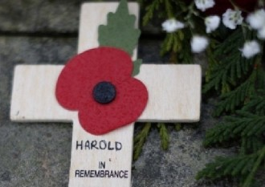
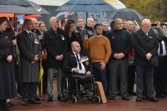

# 700位陌生人出席的葬礼

‘

顾不得头顶轰炸机的尖啸声，29岁的空军地勤哈罗德·杰尼可·帕西瓦尔先生把又一具战友的遗体从战机上扔下来，他身上满是油污和血迹，双手血肉模糊。没有人料到，他会是这支队伍里活到最后的人。

他正在争分夺秒地检修战机，供英国皇家空军617支队又一轮突袭使用，这是1943年5月16日的夜晚。那一夜，月光明亮，他们创造了二战史上的突袭奇迹，被载入史册。大部分人未能留下名字。

2013年10月25日，他在英国西北部的兰开夏郡离世，享年99岁。故友凋零，无妻无子，养老院的工作人员筹备葬礼时发现，他们甚至联系不到任何一位帕西瓦尔先生的亲人，来为他送行。他们在当地报纸登广告，呼吁人们为帕西瓦尔先生送葬。消息很快在网上传开了。 11月11日，气温极低，飘着冷雨。兰开夏郡上阵公园火葬场，700余名陌生人出席了他的葬礼。

当天是英联邦国家“阵亡将士纪念日”，按习俗，每个人衣领上都佩戴了一朵虞美人花。这种暗红色花朵，在东方是“霸王别姬”的凄美信物，在西方则寓意对死亡将士的尊重与缅怀。

上午九点，一百余人出现了。人不算多，谨慎的警察们却已忙碌着维持秩序。驻扎在当地的英国皇家海军、海军陆战队，以及帕西瓦尔曾服役过的空军的代表们，也陆续入场。他们举着代表各自军种的旗帜，表情肃穆，笔直地站在外场。色彩繁复艳丽的旗帜，是现场的唯一亮色。

在当地老兵服务机构的呼吁下，很多军人也纷纷出席，其中甚至有一位阿富汗执勤回来休探亲假的士兵。军人在葬礼上备受瞩目，不论军衔和年龄，所有人都不约而同的身着军装出席，都表情肃穆站仪态庄严，老兵衣领上都佩戴着沉甸甸的勋章。一群身着迷彩服的女兵，自发帮警察维持秩序，年龄都不到20岁，脸上还带着稚气。一名三十岁左右的先生端坐在轮椅上，他在伊拉克战争中失去双腿，仅剩的上半身已变得有些肥胖，他的妻子在一旁为他撑伞。一名须发皆白的老者，沉默地站在人群最外面。没有人注意到，他穿着一套已被淘汰的二战时期英国皇家海军的制服。

一位年轻母亲举着伞，压低声音要求自己的两个儿子安静些。两个小男孩都不足五岁，此刻正剧烈地挥舞着手中的小国旗，跑出了母亲雨伞的遮挡范围，玩得不亦乐乎。

身着旧式军服的老人微笑着看小男孩们跟母亲嬉闹，眼睛很快湿润了。 上午十点五十分，另外的500余人陆续到场。闻讯赶来的记者们已在草坪上架好摄像机，最后几位到场的人中，有一位被孙女搀扶着的80岁老妇人，她曾在帕西瓦尔先生服役的支队做护士。看到网上的消息后，老人远在澳洲的侄子侄女也火速赶来。除了他俩和养老院的工作人员，其他所有人，都与帕西瓦尔先生素不相识。

“因为我父亲也是二战时的军人，我没能参加他的葬礼，我不能再错过了，他们值得无上的尊荣。”一位约60岁的女士低声回复记者提问，她顿了顿，又郑重地补充到，“为了纪念。”

“您是真正的英雄，战胜暴政，谢谢那些在现场代我向您致敬的人们”，“愿您安息”还有网民纷纷在网页新闻下留言说。

因为礼堂只能容纳100余人，其余的人不得不在雨中参加仪式。人们很快决定，把在礼堂的机会，让给老兵和其他年级较大的人。

上午十一点整，帕西瓦尔先生的灵车缓缓驶入上阵公园，冷雨飘零，低沉的哀乐响彻在殡仪馆上方。伴随着口号，所有士兵，脱帽，敬礼。透过车窗，民众们对他行注目礼，他的遗体覆盖着国旗和英国皇家空军旗帜，四周堆满白色雏菊，表情安详。

灵车在殡仪馆门口停下，在电影《敌后大爆炸》的主题曲声中，年轻士兵们涌上来抬起灵柩，稳稳地朝礼堂走去。那部电影在英国家喻户晓，讲诉的正是1943年5月的月夜，帕西瓦尔先生所在空军支队的故事。

那晚，他们趁着夜色潜入欧洲大陆，冒险超低空驾驶战机，并使用最新研发的“跳跃炸弹”——炸弹投下后会像“打水漂”的石头一样，在水面跳跃前进，以越过敌军的防雷网。终于，目标德国鲁尔水坝被撕开一个70余米宽的大口子，溃堤声山呼海啸，水流奔涌直下，下游的工农区受到重创，那是纳粹最重要的军事补给区，德国被沉重打击。这是英军对同盟国最重大的贡献之一。

战后，他们的故事被搬上荧幕，让英国民众骄傲不已。已到中年的帕西瓦尔却悄然退役，独自去澳洲做渔民，每日与风浪搏击。年近不惑，他做起了室内装修工。偶尔赚了点钱，就着背一个小背包去旅行，足迹踏遍了澳洲、新西兰和英国。隔几年与姐姐家联系一次。

“他极其低调，过着‘游牧式’的古典生活。”老人的侄子告诉记者。

60岁以后，他身体健康每况愈下，而且因无妻无子和没有储蓄，生活愈发艰难。好在英国老兵福利很好，政府和民间组织都非常重视退伍士兵，尤其是高龄的二战老兵的生活。他被“老兵服务组织”接到了兰开夏郡的养老院。该组织还协助养老院料理了老人的后事。他在养老院里越发沉默，只有跟护士聊到爱妻时，他才会侃侃而谈，眼里光芒涌动。偶尔聊到“轰炸鲁尔水坝记”时，他则叹息着带过了。

一位BBC的记者正在做现场连线，“葬礼不仅寄托了我们的哀思，更表达了对帕西瓦尔先生的缅怀，这正是英国精神最伟大之处——尊重，铭记。”

英国和澳大利亚的媒体大幅报道此事时，给老人和葬礼参与者都给予了非常高的评价，认为他们都体现了美好的人性。

哀乐声响起，内室的老兵们颤颤巍巍地敬了一个标准的军礼。他们的手上已爬满皱纹，青筋暴起。

灵柩被停放在礼堂正前方。

伴随着社区唱诗班的颂声，牧师宣布仪式正式开始，一个标准的天主教式葬礼：向老人的侄子侄女致哀；追忆他的生平事迹，并与基督背负十字架的故事相联系，既讲道。

老人的名字彷佛暗示了他与战争有关的前半生：姓氏Percival在英语中有“武士”之意，名字Jellicoe与一战中英国皇家海军元帅相同。1914年，他在伦敦郊区享受着新生儿的宠爱时，一站爆发，英国正式对德国宣战。而万里之外的东方，窃得共和果实的袁世凯，正在暗<杀议员，登坛祭天。爱妻在1935年的战乱中患了肺结核，不治离世。他再未续弦，没有孩子。

接着是弥撒圣祭，牧师往灵柩上按从头到脚的顺序洒水；最后是向帕西瓦尔先生致哀，告别。

战后，立下战功的他为何离开部队？独自在澳洲捕鱼、做室内装修工时，他有没有怀念昔年的峥嵘岁月？背着一个背包

走遍全英国时他在想什么？他为何活得如此低调克制？连一个邮箱地址都不要所有的东西都寄到姐姐家，等他们见面时再取。晚年被老兵组织接回养老院时，他为什么时而暴躁时而沉默？沉默时都想到了些什么？······

仪式结束，棺木的盖子被永久地合上了。所有问题的答案也永久地无解了。

仪式持续了约一个小时，随后，他的灵柩被送往上阵公园墓地。无数英军将士埋骨此处，洁白的十字架墓碑整饬排列，一眼无际，庄严肃穆。墓地西邻爱尔兰海，与中国最北端漠河在同一纬度，夏日有极光和白夜现象。

哈罗德·杰尼可·帕西瓦尔先生迎来了自己的终点，在700余名陌生人的目送中。

(采编：陈静；责编：陈静)
