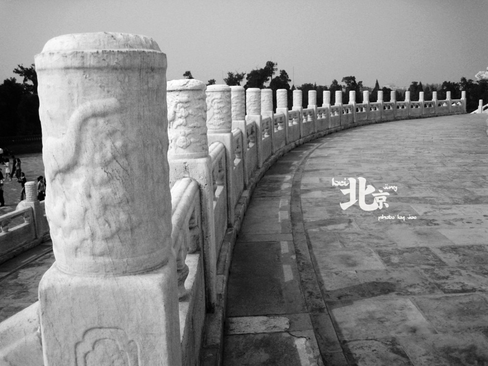
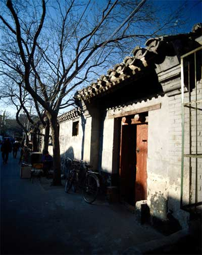
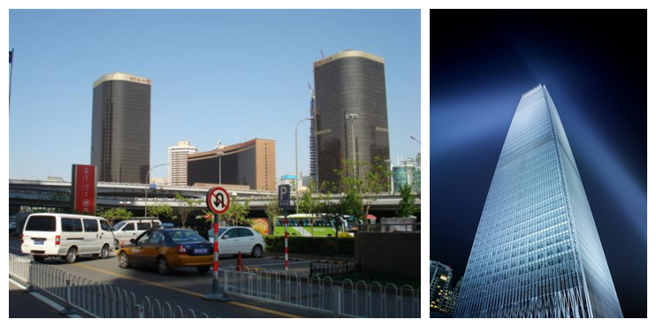
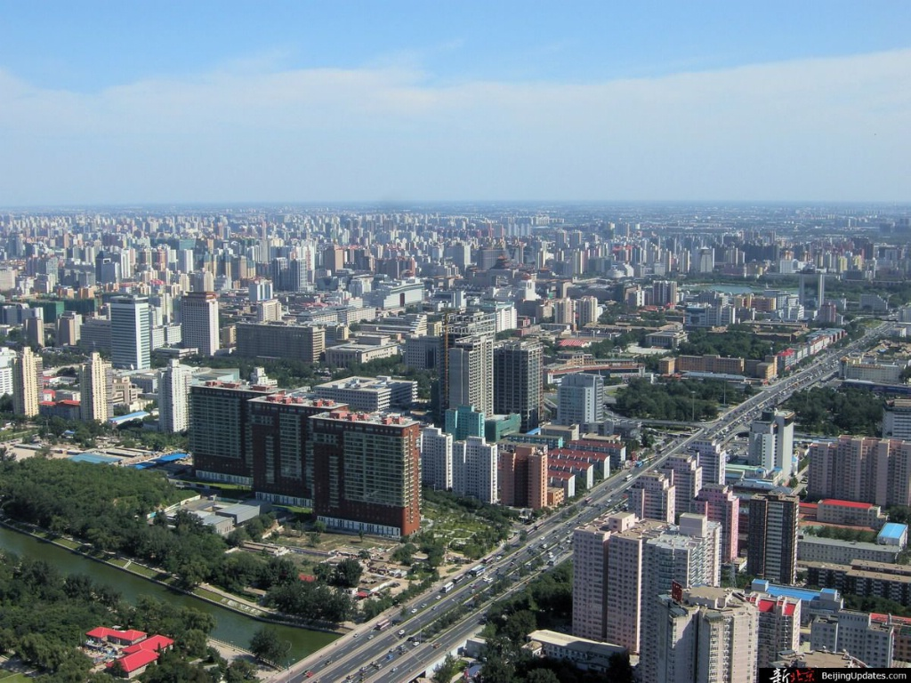

# 北京，你让我找不着北

**这个往常以保守广为诟病的中国，正在以前所未有的速度亲吻世界，只是，他亲吻的是世界的嘴巴，还是屁股？一个文明古国的帝都，为什么就一定要承担起“政治文化经济”中心三位一体的三座大山，不把纽约、华盛顿或者加利福利亚拆开来？为什么我们就一定要享受这“生命中不能承受之重”？**

### 

### 

# 北京，你让我找不着北

## 文/张亮（北京大学）

 在北京，我的总体感觉是，找不着北。 我承认，北京曾给我许多向往，我曾在我的小说开头浓墨重彩诉说过这些向往。 “我对面是一块黑板，牛辅导员正站在黑板面前滔滔不绝。我把目光抬高一点，黑板上白色的墙壁，像一块放电影的幕布，我就对着那幕布发呆。我要骑单车闯进长安街，我在南锣鼓巷品评醇酒，怀揣红皮板砖穿游东厂胡同，凌晨三点夜袭圆明园。我要到东堂邂逅外国教父，手把手教他马克思主义哲学（陈先奎一百题版），和他讨论《石春桢考研220题》，我要在每一个胡同里游荡，每一个一百年以上的门牌号面前停驻，认识吃肉不吐骨头，骂人不带脏字儿的北京小妞儿，和SB、2B、装B、牛B的北京混混喝一壶红星二锅头，我要只穿黑色四角裤，敲开正月十五，横渡护城河，我要一口气吃光两只全聚德烤鸭，三大盘东来顺涮羊肉。1998年，我看过《北京的夏天》，迷恋曹颖姐姐，想来这里找姑娘，2000年，我看过《黄金时代》，知道王二风流史，想来这里找流氓。我找到的姑娘都比我漂亮，我发现的流氓都比我流氓。我要上天安门，在景山凭吊崇祯帝，我要下护城河，去后海、北海、中南海、明武宗的豹房。我要在后海听《蓝莲花》，把美女从盎格鲁-撒克逊人怀里抢夺，听他们说那个歌手叫许巍，那个歌手叫窦唯。我要穿地铁，坐城铁，然后倒换大巴，见一面中央美院的老同学，我的暗恋对象。我要到传说中的西单，看看那儿有没有阳光灿烂的架子鼓手，神情俊朗的吉他手，黑边眼镜的贝司手，看一看阳光在黑色的眸子里流转。我游过王府井，听说那里的永和豆浆小巧玲珑，把卫生间和女人共享。我要逛琉璃厂，听说那里无人认识的古籍珍本堆积如山，泥沙俱下。我要去人民艺术剧院，结识濮存昕、冯远征，看一看曹禺《日出》、《雷雨》。我要逛逛国贸、金融街，见识资本主义，暗访六郎庄、流浪汉、同性恋、打工仔、发廊妹，握流氓无产者的手。我要站在2008年的鸟巢里呼唤刘翔。我要至少谈一次恋爱，绝对不劈腿，绝对不未婚先有子，道德高尚。我要去泡澡堂，模仿《洗澡》中的桥段。我要去天坛、地坛、中华世纪坛，半路杀进《阳光灿烂的日子》。 

### 

### 

“这一切都在白色幕布上滚滚而来。 “十年之前，我的白日梦漫长而雷人，我幻想着离开我所痛恨的一切，无聊的一切，投入一个新世界的怀抱，管它是海市蜃楼还是沙漠绿洲。” 这些幻想，这几年来一一实现，但我的北京梦，却在一点一点破灭。在这座城市里，我慢慢开始找不着北。胡同还在，但已经面目全非。骆驼祥子还在，但已经物是人非。我第一次到北京，如我所愿，去见我的一个暗恋对象，跟她吃一顿老鸭汤。那时，中关村还没有通地铁，我转了一个小时的公交，一个小时的城铁，一个小时的电车，途中唯一不变的，是城铁公交电车上面无表情，一群一群沙丁鱼罐头样拥挤的人类。当时，我旁边坐着一个曾经暗恋过我的高中女同学，她把MP3的一端递给我，让我塞进耳朵，另一端留给自己。 “是许巍。”我笑了。 “嗯呢。我想问，你为什么要来北京呢？” “歌儿里不是说了吗，没有什么可以阻挡。你知道的，对于我不知道但又想知道的东西，我永远想去知道。我就想知道，北京，到底是个怎么回事儿。” “那你现在知道了没？” “我知道了一些，比如现在，吃个老鸭汤见个人都要花整整三个小时，换三种交通工具，被无数面如死尸的同类挤在一个一个移动的沙丁鱼罐头里，周而复始，永远没有终点。但是在成都，你去见任何一个人，吃任何一顿饭，都不用转车，沿途风光潋滟，美女如云。” “那么你说对了。其实我也很想回成都，但是回不去了。最终你还是来了这里。你应该是后悔了。” “我没有后悔，如果我没有来这里，我不知道什么叫后悔，那才是一辈子后悔，因为我不知道。如今我在这里，看到芸芸众生，如同草芥，了无生趣，连偷人都显得拥挤。如果你看过王小波的《黄金时代》，才知道荒无人迹的山上，野地里，多么适于野合。春天，从不曾离开你。” “好了，请收好你的形容，从高中时起，你就是这破德性。现在呢，你看看窗外，你看看这个北京，你告诉我，你看到了什么？” 我朝窗外望去，我的嗓子开始发哑，密密麻麻的建筑，鸡窝般重叠在一起，同学告诉我，假如在冬天，它们全都是灰色或者白色，灰色的是沙尘暴，白色的是雪。有时，灰色会跟白色掺杂在一起，那就是雪里还下着沙。 “找不着北。”我轻轻道。 “什么？”我的同学问。 “找不着北，在这座城市里，你找不着北。我第一次到北大，找北门，师兄们都笑了，北边儿风水不好，北大没有北门，我找不到北。我第一次去王府井吃永和豆浆，那地儿窄得厕所不分男女，只一个蹲位，我冲进去时差点撞倒一个大妈。我在成都吃永和豆浆，那厕所，那蹲位，都闲得长出豌豆苗来。我去西直门坐地铁，我换车，我倒车，我问路，所有大妈大婶儿都只会给我说‘东西南北’，不懂得说‘左右’，我找不着北，我在西直门地铁那儿磨蹭了两个小时才找到入口。但是在成都，我从来不用找北，去什么地方，走着走着就走到了，看什么风景，看着看着就看完了，没有人告诉我‘北’在哪里。” “难道就没什么好的吗？” 

### 

### 

“老北京的胡同我是想去了，但是到后海一看，满大街都是染着黄毛拉客的，都是城乡结合部青年范儿，大尺度歌舞。你跑南锣鼓巷，好不容易找一清净地儿，还得坐地铁打车赌个无数小时，找不着北。第一次从颐和园回北大，叫了辆小三轮儿，牌子上写着‘北大清华/10块’。到北大西门下车，我递给老板二十，等着找。他说，大哥，还差二十。我说不是不是北大清华10块吗。他说那是一公里10块，您这儿是四公里了。我想，这地儿绝对没有四公里，但走了就走了，至少没有找不着北。” “胡同都得拆掉了，房价这么高，不得腾出地儿来修房子？” “你这话倒是，没来北京时，我盼着见一个原汁原味的老北京，等到了北京，却只能看见它的背影。我还是找不着北。” “你这倒是老古董了，俗话说，旧的不去，新的不来嘛。作为首都，它总是日日新，新日日的。”我的同学淡然道。突然，她指着窗外大喊一声：“快看！央视大楼！” 车窗外，那幢内裤式建筑——傲慢的CCTV大楼巍然耸立，其北配楼当时还健在，没被一把火烧掉。它对面的墙上，粉刷着这样的广告语：“北京曼哈顿建筑地标，从此北京与世界等量齐观。”新央视大楼曾经引发是否“像内裤”的争议，万众瞩目的国家体育馆鸟巢也备受质疑。鸟巢的设计师，以标新立异、反传统著称的建筑师荷兰雷姆·库哈斯告诉我们，他对鸟巢的设计理念就是“乱”。时隔不久，千里之外的成都，也树立起他的“乌龟壳”杰作，那是一座花费12个亿，气势恢宏的政府大楼。 这座千年帝国的每一寸土地，从来都是西方冒险家的乐园和试验场。 这座千年帝国的古老都城，正在日新月异，奋勇向前，大江西去。 喜新厌旧是人类的天性。狂飙突进的北京旧城改造在消灭一批老古董以后，也产生了一批新的“不动产”。作为“文物”的胡同们没有实用价值，正在被拆迁，毫不可惜。在城市新坐标的“造星运动”里，“不动产”因为顺应时势，大行其道，似乎要成为北京的新地标。无独有偶，在北京大学的校园内，拔地而起的一幢幢新式楼群，密密麻麻地簇拥在一起，瓷砖楼体闪亮洁白，像一群“内衣外穿”的彪形大汉。倒是学校西边儿燕京大学旧址，全是梁思成设计的中式建筑，雕梁画栋，曲径通幽，与学校的“大景观”格格不入。 从小在曼哈顿长大的Jackson是一个纯种盎格鲁-撒克逊人，他曾经就读于北京大学。他告诉我：“我从来不去上海，世界上一切的现代化都市都是一样的。上海南京路，北京王府井、西单，都是时代广场的翻版。只不过，中国的东西，都比美国要大一号。” 

### 

### 

美国友人Jackson的回答，让我想再问每一个中国人、北京人一个问题：北京想成为另一个盗版的曼哈顿，还是想成为独一无二的新北京？是鸟巢或者央视新大楼吗？越新的东西越是速朽，新建筑的使用周期似乎不会超过70年。巧克力色的一期国贸大厦已显得陈旧而矮小，徐娘半老，倒也风韵犹存。而10年前，它和今天的央视大楼与鸟巢一样，也曾经青春靓丽，耀武扬威。俗话说，三十年河东，三十年河西，只用了十年，当年的新标志就已经“女大十八变”，越变越难看？一个城市的新建筑，速朽得像女孩子易逝的青春，不能说不是一个讽刺。 十年以后，今天的央视大楼和鸟巢会否成为下一个国贸一期？咱不扯远了，就近说事儿。鸟巢身处亚运村，当年崭新耀眼的亚运村建筑，早已经淡出人们的视线，成为北京城市新坐标的野心也已功败垂成。而我们还沉浸在对不动产的偶像崇拜里不能自拔。 有人说，要向洋人学习，不要老抱着祖宗的东西不放。那让我们来看看洋人怎么做的。巴黎的韵味还在，在那些小巷散步时，你似乎仍能感到夏多布里昂游荡的气息。走在圣日耳曼区的古老街道上，你甚至能够找到当年拍摄《天使爱美丽》的场景——一个老式的旧咖啡馆，剧中人物在咖啡馆里的位置与场景，今天依然清晰可辨。由历史积淀成就的伟大似乎是真正的伟大，天打雷劈，战火洗礼，都无法将之抹去。打住，且再来看看咱北京，在拔地而起的钢筋混凝土包围圈里，还有多少“过去”？一个朋友给我讲他儿子的故事。他儿子拿了小学课本来问：鲁迅的故居在哪里？老舍的茶馆在哪里？朱自清的荷塘月色在哪里？梁实秋的雅舍又在哪里？他告诉儿子，现在都流行买房圈地，即使鲁迅、老舍、朱自清活着，也都把园子卖了炒房去，这也是文人下海的一种方式。幸而他们死了园子都还在，却淹没在一片日新月异的繁华里。可以理解，连清华大学里“清华园”三个金字招牌也是后来复制的，而那原来写的“清华园”牌坊早已当作“四旧”给砸掉。卖了倒还好，至少有得赚，更多时候，所谓文化，所谓老北京的生活，却越来越是一种奢侈。 中关村的城中村里，一位拥有一套四合院儿的大妈告诉我，这儿绝对拆不了，谁要拆我跟他拼命去。只是，更多的胡同是拆了，新房子是起了，死人挪地方了，活人还是没地儿住。幸福作为一种生活方式，并不在于急切地期待拥有，而在于从容地不惧失去。我们是急切地期待拥有而没有，同时从容地失去了。鸟巢的设计师说，鸟巢的美在于“大”和“乱”，只要乱出风格，乱出水平，大一点、乱一点无伤大雅。旧者已逝，新者速朽，新城市新坐标硬要给中国的崛起贴上一个“强大”的炫目标签，却不管裤子的尺码不对，很容易露出臀部来。 “你怎样看待这个新北京？”过去几年中，不断有人这样问我。 “到处都是工地，随时在制造新的房奴。”我回答道。这个往常以保守广为诟病的中国，正在以前所未有的速度亲吻世界，只是，他亲吻的是世界的嘴巴，还是屁股？一个文明古国的帝都，为什么就一定要承担起“政治文化经济”中心三位一体的三座大山，不把纽约、华盛顿或者加利福利亚拆开来？为什么我们就一定要享受这“生命中不能承受之重”？ 

### 

### 

当年，花三个小时吃完老鸭汤，我并未把这些话和盘托出，只是最近，当年带我逛北京城的高中女同学打来电话，兴奋道，终于抓住了一个有房产的二婚男人，可以生孩子了，我又突然想起这些话来。 是的，房市很火，从亚运村到世纪坛，到鸟巢，到央视新大楼，我们正在习惯于崇拜不动产。 当然，偶尔，我们还可以去南锣鼓巷、北锣鼓巷看看，作为对一种已死文化的缅怀。只是，最近听说，南锣鼓巷也要拆了？ 

### 

### 

(采编：张文倩)

### 

### 
