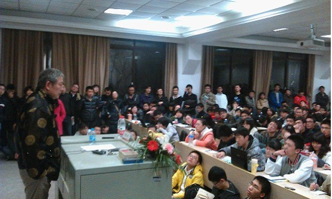
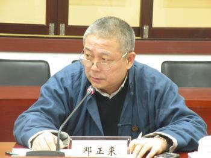
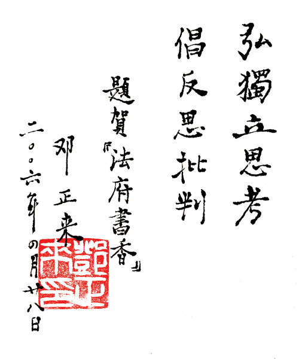

# 邓正来——体制内外的思辨风采

_编者按：邓正来，__[复旦大学](http://baike.baidu.com/view/1565.htm)[特聘教授](http://baike.baidu.com/view/2590370.htm)__，__[复旦大学社会科学高等研究院](http://baike.baidu.com/view/4215131.htm)__院长，复旦大学当代中国研究中心主任，《__[中国社会科学辑刊](http://baike.baidu.com/view/3573626.htm)__》、《耶鲁全球在线复旦版》、《__[复旦政治哲学评论](http://baike.baidu.com/view/5052969.htm)__》主编，主要研究领域为社会科学和指示社会学，侧重法律__[哲学](http://baike.baidu.com/view/3330.htm)__与政治哲学的研究。___

_他是中国关于思想研究的标志性学者，是中国哈耶克研究第一人。他翻译出版了哈耶克__220__余万字的著作，撰写了近__60__万字的哈耶克研究论文，其中包括《自由秩序原理》、《法律、立法与自由》、《个人主义与经济秩序》这些最为重要的著作。_

_在生命的最后十年，他从“羊肠小道”走进体制内，以期完成他__“已经做了很多年，还要做很多年”的事业。这份未能完成的事业最后却成为他这辈子最大的遗憾。___

___他在体制内是怎样“特立独行，睥睨权威，热衷反思，难以复制”？在体制外又是如何对学问保持高度热忱？__本期七星人物---通过一名普通大学生的视角，通过他的思考和感悟，带你走近著名学者 邓正来。_

1月24日傍晚，笔者像往常一样点开微博，即时头条是“世纪文景”发布的一条博客链接，内容是邓正来先生的一篇重要演讲叫《学术与人生》。这篇演讲概括了邓公对学术追求的人生态度和自己的治学原则，让人甚是感动与敬佩，也令人沉思。但这篇演讲通过微博发布出来却立刻让人感到一丝不安，于是赶忙点开邓正来先生的微博，震惊地得知，邓先生真的去世了。他的女儿说她爸爸当天凌晨心脏停止跳动，言语间没有任何悲痛，只是简单地陈述，但下面的转发和评论已经成百上千。我忽然意识到，邓先生的去世已经广泛地为人所知，并传播开来，成为学术界一大地震。

在人们的印象里，邓先生作为著名学者，治学教学任务繁重，万不会浪费时间在微博上。但2013年伊始，人们突然发现微博多了一个认证用户“邓正来2013”。第一条就发布声明说自己得了重病，现在在积极配合治疗，教学和研究活动暂停，并想通过微博来发布自己在治疗过程中的感悟和心得。邓先生借此机会开微博，真是让人心中五味杂陈：欣喜是因为能有机会与邓先生互动，但另一方面我们面对的又是如此状态下的邓先生，心灵与身体的冲突在此剧烈地碰撞。

邓先生消瘦了许多，两鬓更为斑白，比实际年龄老了不少。不过邓先生甚是乐观，不时发布在病房的照片，并始终保持着微笑，还通过微博积极地寻找治疗手段。去世前最后一条微博让大家都还以为邓先生一切安好，积极的心态和各方的援助一定会让他度过难关。谁想，三天之后，溘然长逝，带着他的思想和未完成的愿望一并离开了。

享年56岁，还差一个月就满57了。而德国的社会学家马克斯·韦伯，也是在这个年龄因为疾病去世的。在去世前几年他也在慕尼黑大学作了两场重要演讲，后来编辑成为《学术与政治》一书。更有趣的是，邓先生和韦伯的研究范围和学术旨趣也是颇为相似，可以说他是中国的韦伯。

笔者和邓先生只有一面之交，还是在复旦的一场讲座上，主题是《当代中国的公平问题》。关于“邓正来”三个字，在讲座之前，我脑子里只有一团模糊的印象。因为平时习惯阅读人文社科类书籍，在图书馆经常混在政治和法律分区胡乱翻书，对这个名字有碎片式的记忆：好像是译著并研究了许多哈耶克的著作？好像是翻译了很多法学的著作？总之在讲座之前，一切对他的了解都停留在“好像”的阶段。

我只能高举手机打开录音昂着脖子还隔着一同学保持这样的姿势足足半个多小时，为的就是能尽量清晰地录下讲座内容，好回去反复听。过了不知多长时间，有些同学渐渐离开，我才到教室里。运气真是好，我居然挤到了讲台侧面的最前面，邓先生就离我两三米远，于是又录下一段视频。

这是我在一大堆模糊了解的背景下第一次知道邓先生的长相和声音。然而邓先生很有意思，没有讲稿，没有提纲，没有PPT，还穿着传统中式唐装，讲哪算哪。话题不断转换，看似漫无边际，然而所讲之处都在打开大家的思维，每个问题都有反思的价值。也正是从这场讲座，我也了解到了他一直以来研究的一个主题，一个新鲜名词，就是“生存性智慧”（living wisdom）。

邓正来不是一位专家型的学者，研究兴趣不在一个点上钻牛角尖，而是游走在社会科学各领域，可以说打通了社会科学各个学科的藩篱。例如他研究中国社会科学的自主性问题，思考其中暴露的唯西方化、唯学科化问题的原因；市场与社会、国家与社会的关系问题；对

于中国法律理想图景的论述与批判；当然还有每一次都会自然引出的他一直研究的“生存性智慧”。他在各种场合反复讲他在埋头收集资料做这项宏大的研究，已经做了很多年，还要做很多年，是他这辈子希望完成的最大心愿，以此来总结他的学术生涯。但上天总是不给有雄心的人更多的时间，他未竟的事业，后人有谁能继续呢？

再进一步去了解他的著作、译著和治学的经历之后，他的形象在我心中由点成面，由面立体，高大了数十倍甚至上百倍。他远不止是一位通才型的学者，他有着异常丰富与传奇的学术生涯和人生：

原来，他是让哈耶克思想传入中国的先驱，是哈耶克研究和翻译的权威，之后中国出现的“哈耶克热”很大程度上得益于他的译著；他翻译了大量法学、政治学、经济学甚至人类学著作，成为众多青年学子的启蒙必读书；1992年他与景跃进合作发表《建构中国的市民社会》，由此拉开中国研究市民社会的帷幕，用他自己的话说“是始作俑者，于是乎之后成为了产业”；一部《中国法学向何处去》引来几乎所有法律界权威的集体回应，编成的书比原书还长；主编了《中国社会科学季刊》和《中国书评》，集中了当时几乎所有的著名学者来撰稿，成为学界的顶级刊物，并规范了当时异常混乱的学术评审制度，让中国社会科学研究开始走上规范化道路；最让人佩服的是他1985年居然离开高校独立治学，是中国第一个独立学者，“学术个体户”的说法也从他开始出现。

关于当学术个体户，邓先生在某次演讲中也讲到他当时的思想斗争，他说到大学期间曾一连好几天在一家小酒馆里吃饭喝茶，在一张纸上写“到底要不要读书啊？”，让酒馆的人以为来了一个疯子。他说，除非我被打死了，就算女朋友不愿意、结婚后孩子也嫌弃、边上的人都看不起、甚至抓到监狱里，我都要读下去。结果他考上了外交学院研究生，但有意思的是他还没毕业就自立门户搞研究，并且一搞就是18年。

最开始他作为“三无人员”到处流浪，仅靠一点微薄的兼职收入过活。但生活再艰苦他从来没有中断读书的梦想，身上永远背着装满书的背包。就在这样的境况下，他做出了体制内许多人都未做出的成果，思考的问题超越了既有学术共同体达到的高度。近二十年的奋斗与积累，他成为学术界一个另类的典型，直到2003年才被吉林大学收编进入体制内。邓先生在很多场合说，“鄙人是个连硕士学位都没有的，没当过一天讲师、副教授，但不好意思，我直接当了教授和博导”。2008年来到复旦还成立社会科学高研院并当了院长。“特立独行，睥睨权威，热衷反思，难以复制”，这是邓正来给人最鲜活的印象。我们平常人真的无法想象在体制外他如何对学问保持如此之久的热忱，即使是在经济非常困难的时候，而在进入体制内后依然保持着这样的风骨与个性。什么力量推动他走出这样一条人生之路？答案只能是，邓正来是个天生的学者。

之所以认为他是韦伯在中国的化身，不只是因为他们生命长度与大学演讲主题惊人的相似，更因为学术研究方向和气质的神似。韦伯是什么学家？如果照本宣科地说，是社会学家。但只要稍微深入了解一下韦伯的研究范围，我们会发现，社会学的教科书肯定会提到他，政治学也有他，法学又有他，经济史还有他，更别说各种交叉学科了。他到底算什么学家呢？其实这根本不是问题的重点。邓先生一直强调中国现在社会科学研究的唯学科化趋势的问题，这种discipline-oriented的方法把一个整体的中国给肢解了。研究提出的问题才是最重要的，即issue-oriented。言下之意，就是从问题出发从各种学科寻找思想资源，而非从学科出发把一个整体的问题人为割裂开。邓先生是很不屑于“我从某某学的角度来看”这样的说法。韦伯等大家若活到今天，一定也会同意。

邓先生去世后，各大媒体对他的介绍开头仍是“著名法学家、政治学家”。这是对邓先生学术研究方向莫大的误解与扭曲。如果邓先生有知，他断不会接受这样的头衔。“著名学者”或“学术组织者”才是对邓先生最好的概括。和韦伯一样，邓先生是研究真问题，具有“问题意识”的学者，所述及之处都引起极大的浪潮。当年韦伯的《新教伦理与资本主义精神》引起后人无数的回应与批判，跨越一个多世纪，至今仍是学界争论不休的论题。在厦大的讲座他讲到自己虽然系统研究翻译哈耶克，“但我不是他的信徒，我只是做纯粹的研究”，他甚至引用卡尔·波兰尼在《巨变》里的观点来批判哈耶克。这种精神和中国当今无数根本没认真读过哈耶克却自称是其信徒的人的态度简直是境界的两极。中国认真做事的人不多，而深刻反思与批判的人更是寥若晨星。韦伯在当年的德国是一个，邓先生在当下的中国自然也算一个。

容笔者模仿恩格斯《在马克思墓前的讲话》的一句：“他的去世是中国学界的一大损失，未来很长一段时间无人能填补这片空白。”现在唯一能期望的就是他一直念叨的关于“生存性智慧”的研究著述能整理成书，即使它是未完成的状态。相信它出版后必将成为经典。马克思的《资本论》如此，韦伯的《经济与社会》亦如此。

邓先生的去世，学界各方人士给了他诸多评价。从中，我们也许能描绘出一个简单又深刻的邓正来。

张维迎：人生挥洒，抽烟喝酒，聚友论道，斗室有天下；学术征战，闯北走南，著书育人，一人胜千军。

杨念群：老邓有点克里斯玛（超凡魅力的领袖气质）的味道。

徐友渔：邓正来可以说是1990年代民间社会科学的代表……他具有民间的活力和生命力。从一生而言，前半期是成就，后半期是风光；风光的东西随着岁月逐渐淡化，成就的东西却可以有很多内涵。

刘擎：正来兄的张扬、夸耀和领袖欲望是如此夺目，让我不由自主地敬而远之。

童世骏：与正来相识后，我就落入他抓差派活的对象范围，真正有一种加入超越某校某地的学术共同体的感觉。

邱兴隆：来是正好，去是正好。老邓在最恰当的时间，做了最恰当的事情，在没最恶化的时候就走了。

正来，正去，正当年，正逢寒冬；正身正能量，正问题正思想，正生正气正直人。

 

附2012年3月22日在复旦的讲座片段重现：

学生：有人大代表不鼓励农村的孩子上大学，我不同意。但从现在的角度说大城市孩子的优势越来越明显，农村的孩子进来越来越难......因为大城市资源更丰富，学生素质高，但对于其他地方，尤其农村的教育资源不好的学生来说，这是一种不公平的竞争。您怎么看待这个问题，怎么解决教育不公平的问题？

邓：我是特别站在你这边的......我是从哪毕业的？我们这一代人的好学者，你去看看他们的本科从哪毕业的？你就像我，川外的，四川外语学院（四川话说，一阵哄笑），在重庆四所学校底下，都是很差的学校。根本不要去想什么211，985更不是了。但是不好意思，我们学校出两个人你们至少是知道的，一个鄙人，一个刘小枫。你怎么知道那个学校就差呢？你怎么知道复旦培养出来的学生都是优秀的精英的人才？哈佛大学照样生产垃圾，你不要以为看到几个好的，它一堆一堆生产，耶鲁也是。复旦、北大难道不是如此吗？但这里面有个假设是错的，好像农村的孩子就笨，凭什么就笨？我见到的农民的孩子就很聪明，我的博士生硕士生绝大部分都是农民的孩子，他们很智慧。你想想看，你无非就是被叫做精英教育的一个大本营而已，因此你有什么了不得的？

传说一个复旦的，也是我的老朋友，现在在中央工作的王沪宁，好像是复旦百年校庆，请他题词，写封信，他就找学校的领导问，他说这么多年了我们复旦真的培养出来什么样的人才吗？所以他没写。这个问题发人深省啊！你以为通过招生，多高的高分进来就行了？你去看看高分进来的，你可以统计。我是78年考到四川外语学院，最后一名。英语我考38分，我们学英语的（笑）。老师面试我的时候发现我的这个中文是不得了，比他们教授还读得多，只是英语我讲的他们听不懂，讲的很流利，他们讲的我也听不懂（笑）......所以不是这样的对不对，有什么了不得？很多人考我的硕士博士的时候给我写信，问考试考哪几门？考试什么成绩？我说我从来不关心这个，我从来没出过题，我也不批卷子。我的要害就是面试的时候问你看过什么样的书，你看过没有？你认真读过没有？或者你告诉我你看过哪些书，我来问你那本书讲什么东西。你怎么知道考分低点的学生就差呢？考分是什么用啊？它是一个modernity，现代性的结果。建议大家去看看《阿甘正传》，我相信大家都看过。所以它跟人的智慧，真正内在的潜力有关，你不能因为他出生在农村，他教育资源差，他们水平就差，凭什么？你到那试试看？你不也是这样吗？你给他更好的条件，你怎么不知道他是比你更优秀的学生？

我们在某种意义上，用定义的方式、暗含着身份的方式把别人排挤掉了。但是今天坦率地讲我觉得很可悲，在知识这么大生产化的前提下还在搞这名堂，太多的学生啦！你想想看，上海多少大学？连专科学院多成大学了，中专都成大学了你搞什么搞。这样弄下去我个人认为，实际上是对知识的不尊重。。。你们所有在座的，比我们那代人聪明的多。因为从小接触的东西丰富了眼界开阔的多，我们这代人看什么？电视机也没有，收音机还到别人家里去凑着听，厂里放点广播，一放就是毛主席的诗词啊、语录啊、最新指示啊，当然毛泽东思想很伟大，值得我们认真去研究。所以我的看法就是，不要简单的否定自己，也不要简单的用某一种标准否定其他和我们同类的人，同时代的人。

这个社会它整个链条都是不公的，之所以出现这样的情况，大家都往名校奔，都是因为就业，公务员招聘，先看你是不是211、985本科，好的就留校，不是211本科的，不能留，出身问题。现在的学生不断地洗文凭，为什么？就是迁就了这个社会体制，它整个体制都是对人的身份的不公。不要以为我们进入了这个体制，我们获得了利益，我们就觉得这是想当然的，认为是正当的，不是那么简单的。所以我觉得，有些问题可能，一下子解决我不知道怎么解决啊，我这个人不懂解决，我们在做世界的人中有很多特别杰出的，相信他们能够解决好。

 

感谢读者 宋敖 的来稿

编辑：王凌羽

责编：郑萃颖

<七星人物>读者来信邮箱：beidouqxrw@163.com 如果你想提供身边有启发意义的人物；如果你想将自己的人物专访、人物故事发表在北斗网站上；如果你对我们的作品有疑问、质疑、喜爱、好奇等情感；欢迎来信与我们联络。 来稿原则：１，说真话。２，敢说话。【你的记录就是你的思想】
