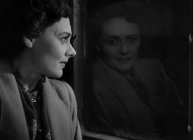
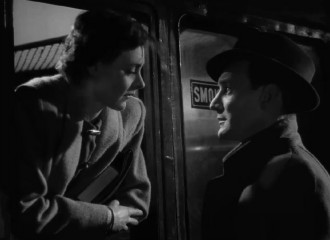
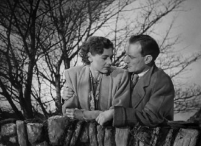

# 泪眼中的一粒沙——《相见恨晚》

“When I behold upon the night starred face.,huge cloudy symbols of a high romance.”女主角劳拉一边沉浸在无法言及的隐秘情事中无法自拔，一边淡淡地回答了这句济慈的诗歌。“Romance”劳拉不停地沉吟着丈夫字谜的答案，若有所思。接着，劳拉迫不及待地打开了留声机，房间里传来了拉赫玛尼诺夫的第二钢琴协奏曲。

窃以为济慈的这句诗歌是《相见恨晚》的题眼，又辅以拉赫玛尼诺夫的节奏，古典文学与古典音乐作为引导者，似乎不经意让四十年代那个远去的时间蒙上了一层熟悉感。谈及四十年代，印象中似乎往往是二战为主背景下宏大史诗，连你侬我侬男女情深之事也被逃脱不了“大时代小人物”的命运。《相见恨晚》诞生于世界二战结束的1945年，背景设为英国伦敦附近的城镇，故事中已经看不见战火的硝烟，中产阶级家庭的生活趋于平静。在这一年之前，战争的介入，社会的动荡，使得人们往往关心于你死我活的社会焦点事件，纠结于个人生死存亡，可以说无论是个体还是社会都处于生死攸关的激变之中，而电影的叙事通常侧重于强烈的戏剧冲突，往往表现惊心动魄、人命关天的重大命题抑或个人坎坎坷坷的人生道路。战争的结束意味着转折点。西方尤其是以英国为首的国家逐渐向中产阶级社会过渡，社会内部呈现稳定，大多数人达到温饱。诸如失业等社会矛盾不再像战时那样突出，然而新的社会矛盾又出现了，《相见恨晚》中的女主角劳拉便在这样的社会背景下应运而生。

女主角劳拉不仅仅代表着一个个体，她似乎是一个符号，一个象征，被创作者赋予了时代的灵魂。首先，她是一个中产阶级家庭的家庭主妇。中产阶级意味着什么，电影的种种细节都在像我们表明：她平时无所事事常常搭火车去邻镇购物看电影，在酒吧优雅地喝一杯白兰地吃一口曲奇饼。在家喜欢读济慈，听拉赫玛尼诺夫，被儿女催促带着他们去看歌剧抑或杂技表演。可以说是物质生活满足，精神生活看上去也同样富裕。其次，众所周知，物质文明的发达会带来社会的异化和人与人之间的间离，尽管生活在繁华热闹的都市却免不了难以消遣的孤独，人与人之间每天不得不打交道，但真正的心灵沟通却少而又少，人际关系的危机构成了社会的障碍，这便是随着社会发展而产生的新矛盾。一方面，影片开头，老妇人看似熟络亲切的问候交谈，实则为满足自己的窥视欲和八卦心理，这引起了劳拉生理心理的双重反应。她对老妇人的絮叨显得头痛难忍，后又与丈夫抱怨“当人们装出一副很好的样子来，是不是很恶心”。不仅如此，当劳拉与哈威在街头被熟人撞见一起吃饭时，劳拉还必须刻意划清界限，摆出热情寒暄的样子，但一切却都免不了沦为日后人们口中的谈资。还有，哈威的朋友在意识到哈威带女人来公寓时，不听哈威解释便把他赶出了房间。人际关系的危机，隐藏在每个人周围，不带真诚的交流，让人心烦意乱。另一方面，在这种人际关系危机的矛盾之下，当影片初始，哈威认真地用手帕拭去劳拉泪眼中的那颗沙后，便注定了此种感情的不寻常，像是埋下了一颗真诚的情感种子，只待时机喷薄欲出，怕是生命中这种真诚的心灵沟通少之又少罢了，随后男女主人公的六次相遇像是为之作注解。除了人际关系的危机，也不应忽视个体内心深处的危机。人类是唯一一种会探求生命意义的生物，这种探求在衣食无忧时会愈加突出，因为只有在衣食无忧的大前提之下，人们才会思考内省类似的问题。劳拉也是如此，物质生活的满足并不代表生活的完美度，直到哈威拭去她眼睛中的沙粒，原本平静的生活彻底被打破，情感的巨变使生活有了理智无法操控的波澜。电影的情节线设置为两个陌生男女的情感演进，它将焦点从社会外在危机转移到了人与人之间的内部危机之中，将镜头对准人与人之间的关系和他们内心情感甚至于不成形的潜意识，这不得不说是时代的进步，电影剧作模式的创新。

值得玩味的是，世人公认英伦三岛与法兰西的风情、伊比利亚半岛的狂热相比，少了浪漫与激情，显得略为寡淡刻板。但导演大卫•里恩则以这部1945年的早期作品打破了以往人们的惯有印象。影片中男女主人公的六次相遇堪称经典，贯穿始终。情感由一开始的无意识到自我察觉，躁动的自我安慰，直至失去理智的一发不可收拾，期间借由台词、情节呈现出“发乎情，止于礼”的状态，由迷醉激情到回归道德的过程，体现出英国人不同于美国人的道德取舍，这种“导演手法”的取舍大致表现在两个方面。一方面是外部的制约：影片开头导演首先选取了沉重的钟声与火车进站的轰鸣声，辅以拉赫玛尼诺夫第二钢琴协奏曲的开头八小节沉重的旋律，这种景象象征着无时无刻的社会约束力。此外熟人时不时打扰了两人正常的约会，让他们不得不重新自省审视自己的行为等等也都有所体现。另一方面是自我约束，女主角的独白贯穿其中，一直在刻意提醒自己重新回到正常轨道，重新回归“母亲”“妻子”的位置，一方面感慨“这种快乐不能持续”、被人撞见是“罪恶羞愧”的，一方面又自我安慰，“这次在车站能碰见他吧？”发誓“回到家中再也不见面了”，两个人下周四又如约相见。细腻的情感借由台词呈现，实为妙矣。尤其是哈威在谈及自己身为医生的“预防医学”理论时，其实也在潜意识里和盘托出自己对待这份感情的态度。“一种预防疾病的方法，值得50种治好的方法”，两个人一直在小心翼翼地抵御着最后的防线，防微杜渐，以预防的姿态去处理这份属于中年人的婚外情。

发乎情，止于礼，却也只能留下满满的惆怅，不圆满的结局。但是相比美国人的信马由缰，日本人樱花凋落般的东方式暗淡，英国人最终还是让理性与真情占了上风，留下了朦胧的光亮。刚才看到，有人引用了一句菲茨杰拉德。菲茨杰拉德说：“All life is just a progression toward, and then a recession from, one phrase—I love you.”（生活便是不断朝‘我爱你’这个字眼靠近的过程然后又不停地退却）这个过程与电影中的开端结尾相呼应。开端，火车驶过，泪眼中多了一颗沙。结尾，火车驶过，风吹乱了头发，扰乱了心绪，望穿秋水也只好止步前行，感慨一句相见恨晚罢了。

(采编：李玖玖；责编：王冬阳)
