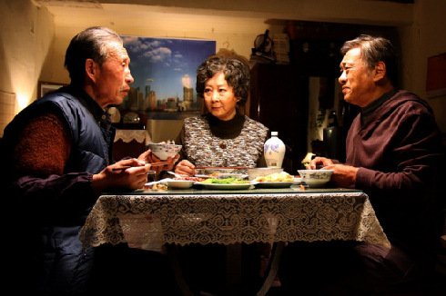
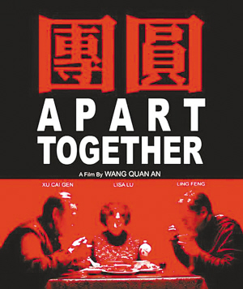
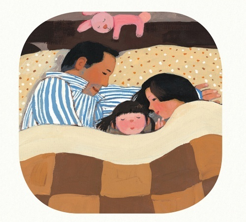

# 《团圆》•破镜记

得知电影《团圆》将于今年中秋上映，第一反应是“守得云开见月明”。

话虽如此，心里仍不免忧虑了一把。虽然结果是“有惊无险”，却也证明实非多虑 ——才刚问起家里人，果然那边就没有院线排片，看来“人在异乡”倒也未必尽是憾事。 只是，放着现实中的吴地不回，跑去电影院听90分钟的吴语，这到底是不是潜意识里的“乡愁”作祟？ 然而我又并非上海人士，扑面而来的“土白”远算不得乡音，不过比“官话”略多些江南的地气； 可当耳朵里飘进来一段《十八相送》，配上两位老人收拾齐整前去离婚，整个人又不禁略怔了一怔…… 那么，身边的帝都观众呢？在他们听来，台湾的“国语”是否较大陆方言更觉亲近？…… 所有这些地缘文化上的错位与吊诡，无不是偌大“乡土中国”的局部表征； 就像本片片名的呈现方式：Apart 与 Together，并存于“共识”的文字和观念下；一边“统一”，一边“疏离”。

导演王全安曾说：“我一直在重复一个东西：生活是一个悖论。”放到本片的语境下，这个悖论便是“团圆”的无法两全：台湾老兵刘燕生与昔日爱人玉娥的聚首，给后者在大陆的家庭带去了离散的危险。不必说，这个源于真实事件的故事框架，在叙事和表意上都拥有巨大的潜力：作为一个“家国同构”的民族寓言，它可以承载太多的政治喻意与历史怨怼；而作为一个“一女二夫”的三角结构，它又可以是一出通俗情节剧（尤其是伦理苦情戏）的绝佳范本。但事实是，王全安一面谨慎地避开了国共话语逻辑的潜在交锋（仅有的一次差异表述，是“雷雨交加的民国三十八年”VS“艳阳高照的一九四九年”。但它除了将档案化的“历史”解构为个体可疑的记忆外，并没有真正触及“版本”背后的意识形态对立），一面又刻意压抑戏剧性的矛盾冲突。因而在他的镜头下，你看不见充满张力的场面调度，看不见环环相扣的节奏推进，甚至很少看见旨在表现人物内心世界的细节设计。大多数时候，长镜头下的空间以近乎完全静态的形貌呈现在你面前，你会怀疑自己是不是正在凝视一幅风俗画：那里有张爱玲所谓的“柴米油盐、肥皂、水与太阳”和“实际的人生”，但画面更为粗粝，少了一份自恋式的怀旧。然后，在某个时刻，不经意的，你被摄影机邀请到桌前，在三位老人构成的“安稳”中，莫名地感到和谐与宁静。

但是，抛开这些具有象征意味的平稳构图，更多的时候，镜头会提醒我们这不是一个关于弥合的故事，而是一个关于分离和撕扯的故事——电影伊始，观众就能看到一幅以饭桌为中心的家庭“全景”图；但是很快地，卢燕饰演的玉娥便起身走出了画面，并合乎逻辑地拥有了全片的第一个单人镜头；有意思的是，随着刘燕生的到来，类似镜头中的人物逐渐换成了玉娥的丈夫陆善民，个中涵义，自不待言。在为刘举办的“接风宴”上，表面的一团和气难掩席间的尴尬——粗暴的历史曾给民间蚀刻下怎样的伤痕，又岂是官方意志的勉力撮合能够轻易抹去？到了接近结尾处，一场大雨又将桌上的“其乐融融”冲得七零八落，煞有介事的践行不得已草草收场…… 看得出来，对这种由“大团圆”的形式（全景镜头）与“不团圆”的内涵所形成的反讽，王全安既得心应手又情有独钟。

与上面那一种“貌合神离”的“大团圆”相比，刘燕生与玉娥的“小团圆”倒是显得“表里如一”：除了开头的久别重逢与结尾的依依惜别，只要情节允许，两人就一定处于双人镜头的关照之下，从无例外。这其中，最值得玩味的一场戏发生在兴建中的楼房工地。惟其正在兴建，建筑的表面便尤显丑陋；远景中的黄浦江，则得以透过尚未闭合的墙体暴露给观众。一方面，这是伤口被裸露出来的时刻：先时被一堵墙分割开的两个人走到一起，开始直面他们的过去、现在与未来；另一方面，尚未竣工的楼房与依然流淌的江水，以一种强有力的、近乎蛮横的姿态，在镜头中刻画出历史的“在场感”：渺小的个体一如既往地被裹挟其中，一时泥沙俱下……相比之下，另一场戏则与之形成了鲜明的对比。那是刘燕生带着玉娥回到当年的小旅馆，沉浸在对往事的回忆中；在潺潺的雨声里，《月圆花好》的调子似有若无地漂浮着。如果说，兴建中的楼房意味着（向历史的）裸露和敞开，那么此处的空间则完全是私密与闭合的——“毛毛雨”中，每一栋低矮的房子仿佛都深锁着一段旧梦，而每一扇紧闭的窗子则都像是对时代大潮的一次婉拒。更有甚者，在刘述说往事的时候，镜头对准了两位老人的镜中之像。这既充分彰显了此时此刻，“小团圆”之于“大历史”的自足状态，也暗示出其说到底不过是“镜里恩情”：一旦转回现实，一连串棘手的问题便接踵而至，迫使他们面对又一次的天涯相望。

倏忽之间，想起了“破镜重圆”的典故。用在刘燕生与玉娥身上，倒也觉得妥帖，虽然根据剧情，应修改为“破镜难圆”才对。其实，倘或细查中国文学中的一段段“离合之情”，那么或早或晚，但终将无可避免地，会与“兴亡之感”相遇。因此，尽管我深信，影片《团圆》获柏林电影节银熊奖，必然与其呈现中国之“镜”的角度密不可分，却终究不认为这一份题材上的“讨巧”值得引来多大的非议。相反的，我倒是并不欣赏那个颇具时代特征的结尾，后者旨在向观众呈述如下事实，即刘燕生走后，玉娥一家的“团圆”又将面对历史给予的全新挑战。在我看来，那已是另一个具体的、无法为来自过去的既有经验所驾驭的新问题（我是说，它完全值得另拍一部新的电影！）；至于本片，我以为，以摩天楼下、黄浦江畔，玉娥的一个背影作结，或许更有况味。便如诗中所云：

佳人失手镜初分，何日团圆再会君

今朝万里秋风起，山北山南一片云

（采编：陈听涵，责编：王冬阳）
