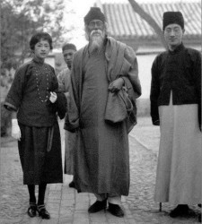
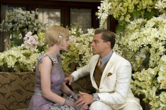

# 伤不起的盖茨比——那些年，我们没逆袭到的女神

年轻的时候我时常被这样一种姑娘吸引，她们穿着简单的T恤或是套头衫，拎着不知名的手袋踩着平底鞋，出现在经济型小汽车的驾驶位或者是公共交通工具甚至是自行车上，和她们出去吃饭的时候可以毫无压力的去麻辣烫和烤串。当然，最重要的一条，她们都足够漂亮，漂亮到需要克服太多诱惑拒绝无数男人，非常努力地才能过上普通女孩的生活。当跟她们同等姿色的女孩拎着迪奥坐在奥迪的副驾驶上的时候，我觉得她们简直就像天使一样。

我想，当出身贫寒身无分文的普通军官Gatsby最初和Daisy女神相恋的时候，他一定和我曾经一样，把那些看似遥不可及的女神寄予平凡的自己的那份感情当做一种恩赐，认定她一定是最浪漫最潇洒最不物质的姑娘。

Gatsby和我都错了。

感觉型和价值型

从感性和理性的维度，我们一般把姑娘简单地分为两类，如果说所谓感性的姑娘是更注重感情的感觉型，那理性的姑娘就是更务实的价值型。

可现实远比这复杂的多。盖茨比们忽略了一批高段位选手，比如Daisy和我开头提到的那些天使们中的大部分，借用某资深圈内人士的说法，我们称其为伪装成感觉型的价值型。她们深知男人们固有的天真导致他们普遍青睐感觉型的姑娘，毕竟无论财富多寡价值高低，谁都更渴望一个女人最终选择了自己是因为喜欢跟自己在一起的感觉。和那些情商过低到处晒名牌强调宁愿在宝马里哭泣的姑娘相比，让男人觉得更喜欢在自行车上面笑的姑娘，最终往往却更容易坐在宝马里。

我相信，Daisy五年前是爱过Gatsby的，可怜Gatsby却把那短暂的激情误以为终生不渝的一生所爱，如果他战死在沙场，这将是一段完美的爱情故事，就像泰坦尼克号一样。

所以，即使当Gatsby自以为成功逆袭回到Daisy身边的时候，他其实依然也只是那短暂的激情。Daisy价值型的内在属性，那份激情是远不足以让她彻底放弃Tom、孩子及已有的生活圈子和习惯，更不用说考虑到Gatsby的巨额财富来路不明（在原著中这是一个deal breaker，电影中为了使Daisy的形象更复杂被弱化了）。可她伪装出来的感觉型却令盖茨比无比相信，自己最爱的人是他。

其实在某种程度上，绝大多数女性随着年龄的增长，在长线关系中都会逐渐向价值型逐渐靠拢，她们内心深处对安全感的渴望在岁月的流逝中不断飙升，稳定和可预见性最终会压倒一切成为决定性因素，那也就是该接盘侠们出场的时候了。但与此同时，她们并不会彻底排斥一切短暂的激情，短期关系中她们足够入戏或是说也是真心喜欢那些带给她们难忘感觉的男人，只是她们最终选择的长期关系，依然还是要回归到对自己安全感的诉求上。

你说作为一个女人，Tom和Gatsby该如何选呢？

提到Daisy是伪装成感觉型的价值型的典范，你对她们的另一位鼻祖林徽因一定不陌生，而徐志摩就是众盖茨比们中的一员。盖茨比们就像烤串，饮食习惯再健康的人偶尔也会想吃上几次，但绝对不会因它挺好吃就天天改吃烤串了。烤串们却永远想不通这个道理。

屌丝的宿命

第一次读The Great Gatsby原著的时候我尚年幼，和很多人一样，被Gatsby的一片痴心感动到几乎落泪，为Daisy的负心薄幸痛恨得咬牙切齿。可现在回头来看，Daisy就和我后来遇到的很多姑娘一样，并非好人可也不是坏人，她只是一个女人。

而Gatsby，即使不考虑到他积累的财富风险系数太高埋下了最终悲剧的导火索，从头至尾也都是彻头彻尾的屌丝。

屌丝因为年轻的时候生活的首要困扰是缺钱，这份先天不足导致了思维上的缺陷，总是误以为有了钱一切问题就解决了。事实显然并非如此，那些生来就伴随着巨额财富的人一定明白，即使再有钱，生活依然有很多困惑和痛苦。

Gatsby用了五年的时间，凭借着不懈的努力和极好的运气，成功暴富。可他对Daisy的言谈举止和所作所为，依然是纯粹的屌丝。和资深高富帅Tom比起来，Gatsby的需求感太强，安全感太缺，电影和书里都有太多细节，什么谎称自己是牛津毕业，初次见面刻意布置的花房，那本贴满剪报的日记，偷情时不断提出的要求和期望，甚至最后顶替Daisy车祸的罪行，凡此种种，对于Daisy这个级别见过世面的美女而言，都是吸引力暴跌的自毁行为。

事实上，Gatsby之所以是Gatsby，当初所做的一切都是为了让自己能够达到迎娶Daisy标准。而凡是以迎合某个女人的标准为出发点的付出和努力，大多都以悲剧告终。

这些年我逐渐领会，美女的直觉是如此的敏锐，敏锐到她们自己都未必察觉，但凡一个男人内心存有需求感和不安，无论他多么擅长掩饰，言语和行为多么克制，在女人面前永远都会暴露无遗。这或许是自然选择赐予女性的一种自我保护的机制，帮助她们选择到最适合的异性繁衍。

当一个姑娘感觉到一个男人为她所做的一切是必须用清晰可见的回报做交换时，她们的本能绝非感动而是逃避。男人却往往以为自己做的还不够多以至于这场交易无法完成，结果逼得越紧，她也就逃得越远。到了这般地步，无论你坐拥多少财富，多么风趣幽默，泡过多少女神，在那个姑娘心里都毫无意义。太多高富帅沦为屌丝的悲情故事，它们的本质上都是如此。

前面提到过，不安是女人的天性，所以她们一生都在寻找内心存有真正安全感的男人，而非一个会因为自己的一言一行都会情绪激动不知所措的孩子。

Gatsby消失了五年重新出现，夜夜笙歌，挥金如土，可一上来就要求Daisy放弃已经拥有的一切和习惯的生活，回到自己身边。这又是多么强烈的需求感和不安？

事实上，当你试图用说服的方式让一个喜欢的姑娘爱上你的时候，你已经失掉了当初她喜欢你的一切特质。

盖茨比们的救赎

电影版中，最动人的场面，我觉得莫过于Gatsby初见Daisy那场戏。莱昂纳多在女神到来后匆忙出逃，又在大雨中狂奔回来，他第一眼看到Daisy时那个眼神，温柔得令人心碎。那个眼神熟悉又陌生，让人想起年少时的自己，又诧异它现在到了哪里？

真爱和需求感仿佛天生是一对邪恶的孪生兄弟，相生相克，曾经经历过的人都明白深陷其中时那无尽的痛苦和无可奈何的纠结。由此衍生出“表白必死，认真你就输了，谁先动心谁完蛋”之类貌似高手的忠告，实际都背离了问题的核心。

需求感的本身就是恐惧。害怕失去，害怕自己不够好，害怕再也遇不到，害怕自己的付出得不到回报。Gatsby后来为Daisy所做的一切，无不包含了上述恐惧的每一种，充分暴露了自己本身就是缺乏安全感的人。而女人天生最排斥的就是心中存着太多恐惧的男人。

所以因爱而生的需求感真的就无可救药了吗，盖茨比们真的就只能眼睁睁看着女神和一个混球在一起而无动于衷么？

你得需要经历很多痛苦才能明白，答案是否定的，真爱是可以和需求感分离开的。当你化解掉一切需求感的时候，才只留下爱，这需要一个漫长而艰难的过程。Gatsby并不懂得，像Daisy这种姑娘，你是绝对无法将她硬拉到你身边的，你只能大步向前走，让她自己转过身去追寻你。

如果她最终没有跟过来，那感到遗憾的应该是她而非你。

男人年轻时候的思维方式大多是线性的，遇到感情问题后首先想到的依然是用一系列线性的方法来解决问题，缺钱则拼命赚钱，出身卑微则刷名校强加光环，但求能满足一切已知条件然后导出理想的结果。但人的感情微妙之处便在于，大部分问题都无法用太直接的方式去解决，感情的本质，就是无能为力。

承认我们对大多事情都无能为力，并且心平气和地面对无能为力，是从根本上破除需求感的第一步。

Gatsby回来了，他依然深爱着Daisy，可如果他是一个只有爱而没有需求感的人，又应该怎么做呢？

我想，他大可以大大方方地告诉Daisy自己还爱着她，也渴望跟Daisy重新开始，真挚诚恳无需扭捏，只要一切是建立在Daisy自己愿意的前提下。他理解并尊重她的选择，更不纠结她是否爱过别人。在Daisy做任何决定之前，他完全可以和其他姑娘正常的交往，建立一个健康的社交圈子（而不是天天只跟Daisy的表哥玩），如果可能的话，尽量将自己非法获得的财富快速洗白，日子过得浪漫而坚实。其实没有需求感也不代表不作为，愿意自己喜欢的女人开心和讨好喜欢的女人更是截然不同的两件事情（小说和电影中，Gatsby显然是后者），他可以依然邀请Daisy参加到他精彩刺激的生活中来，偶尔送个礼物也无妨，但内心深处必须真正放下“你看我们曾经如此相爱现在又为你做了这么多你没有理由不抛弃家庭选择我”的一切念头，这份放下无法假装也无法掩饰，她一定会感受的到的。至于Daisy最终会如何做，那完全只是她自己的事情。

你不得不相信的是，“男人从来都无法真正选择女人，只能给她们一个选择他的机会。”

不执著，不躲闪，不掩饰，不证明，却依然相信爱情，才是盖茨比们应该追求的最高境界。

但愿天下所有Gatsby和Daisy终成眷属吧。

注：作者微博[http://weibo.com/yuzhouedison](http://weibo.com/yuzhouedison)

（采编：莫桂兰；责编：吴春凉）

[【风月江山】爵士时代的盖茨比](/?p=41380)--长时间以来，人们心中的泽尔达都是十足的坏女孩形象，她的疯狂与自私毁灭了他的丈夫。可是谁知道呢，如果没有泽尔达，会不会有《了不起的盖茨比》。 [＜玉衡＞毁掉菲兹杰拉德的女人](/?p=9303)--他毁了她，她毁了他，可这远远不能说清他和她之间最深沉的理解和冲突。他控制不住把她灵光四溢的日记抄袭进自己的小说，她控制不住在作家的妻子之外为自己寻找其他的身份。 [【七星影像】盖茨比真的“伤不起”？](/?p=41452)--多少人的爱情里夹杂着金钱、权利、身份这些外在的东西？有多少人能拿出勇气执着地追随心灵深处那道绿光？这些问题，总渴望从某个故事中找到答案。
