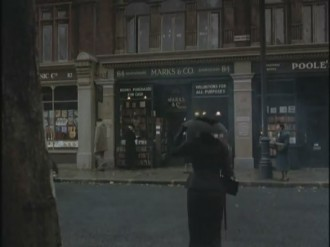
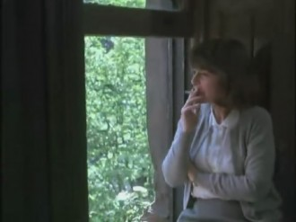

# 你眷念的都已失去——《查令十字街84号》

我记得第十放映室里说过，我们可以根据一部文学名著来改编成一部电影，可是至今为止，还没有因为一部好看的电影而转化为文学名著的。若在影像与文字中权衡，我更偏向于文字，它的力量能够穿透恒久的时间，不变质，不受外界的曲解，依然保持其原有的风味。万物持续流转，珍爱的事物不可能一直留存，惟有驻留在心底的文字，陪你良久。因此，我坚持在有条件的情况下都先看文字，再看其改编的影像作品。

佳佳推荐我看电影《查令十字街84号》。而很久以前我就涌生过关于这部书的阅读兴趣，现在更甚。电影下载后存在硬盘里，我要先寻其根源。某日下班后，在我喜爱的书店闲逛，撞见它。书的出版已有些时日，这是店内留存的最后一本。白底的封面有些发黄，但更符合它的味道，因为这就是一个关于旧书店的故事。

书很薄，两日就看完。然后我迫不及待的看了电影。书和电影加起来才完整了这个故事。电影忠于原著，没有给男女主角之间强加上爱情。人世间感情千万种，掺杂着欲望的爱情最简单最直白，所以很多时候我们无力分析时总把男女相遇归咎于此。二十年的通信的确让他们之间有些情愫在暗涌，但我相信不是爱情，更像是感激，对其需要给予的感激；或许是怜惜，惺惺相惜衍生的怜惜；还有期盼，渴望能见到对方的期盼。

一直对这样的相遇抱有憧憬。我相信隔着遥远时空无法碰触的人之间，因为没有利益的关系，感情更加纯粹和真实。为对方奉献我们所拥有的，不断的互相给予，然后又都认为自己得到的比给予还要多，因此惭愧又感激。就像作者，她按时足额的支付书款，并源源不断为彼岸的朋友寄予礼物，却仍在末尾说我亏欠她良多。这种情感，这种生活体验，多么美妙和珍贵。

那位书商，在回信中谦和有礼的答复汉芙小姐的问题，最君子式的问好，中规中矩。但内心仍难掩对这样一位素未蒙面朋友的想象和热情。他期盼与她见面，在得知汉芙小姐未能启程时语气里怎么也藏不住的失望。在见到一位与他想象中汉芙小姐形象相符的女子时会流露从未有过的眼神，热烈甚至灼热。安东尼霍普丝金成为这位男人的代言人，毫无褶皱的大衣，克制的言行，谦逊的语气，就是我想象中的弗兰克。他心底也有某种想要爆发的激情，但却永远让其安然无恙的躲避在中产阶级的安逸之后。

而不管是电影还是文字，都使观看者对汉芙小姐的印象更为深刻。她不修边幅又安于幽默。一件大衣一顶帽子，快步行走于路上。她的家并不整洁，处处堆着文稿和书籍，常常是随手拿起一本书，随意的坐下，随意的朗诵。她一个人随性又自我。内心身处，我渴望成为这样一个女子，不为华服美食金钱地位所累，不察言观色，仅有三五好友和有限的空间。但我也时常难掩内心的虚荣，对漂亮的衣服，对领导的肯定，对生活上物质的追求有盖也盖不住的欲望。如此矛盾但并不厌恶。我就是这样，一方面想做个简单朴素阳春白雪的女孩，一方面又难逃对物质小资生活的追求。这种矛盾，一方面激励我在现实生活中奋斗打拼，成为社会最普遍最大众的一类。可另一边，因为这些暗藏的想法，而让内心不断的接受滋养，使它在接受现实生活打击后仍然有着美好、向阳的一面。

作家海莲汉芙说，我曾经只为了瞧伦敦的街景而看了许多英国电影。就如同我，以前看了那么多关于上海风花雪月的故事只为了一窥想象中那个时代大上海的韵味。而深深迷恋欧洲电影的我，归咎到底，也是源自我对未知而又喜爱的文化、生活的一种探寻。我们反复的观看，只为了在梦想尚未实现时窥视其中一景。就如曾暗恋某个男孩，每日站在他对面的车站，遥远的望着，然后在他踏上公交后转过身，怀着满足又惆怅的情绪离开。

二十年后，汉芙小姐终于亲临书店，但她要寻找的人和书都已不在。终有一天，所眷念的都会失去。

（**采编**：李玖玖；**责编**：王冬阳）
