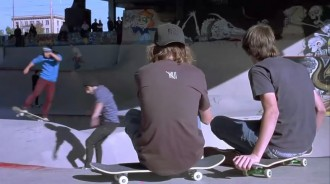
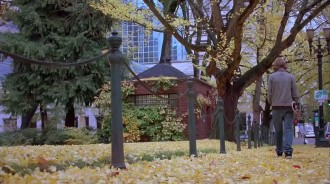

# 关于青春的记忆——《迷幻公园》

纵观格斯·范·桑特将近二十年的导演生涯，这位在美国独立电影界游刃有余，不断带给我们惊喜但却不迎合流俗审美情趣，而将实践个人的创作理念奉为圭臬的电影人，无疑是相当成功的。在他所营造的那些亦真亦幻的音画世界里，有在不羁的天空下不断行走，抛弃世俗而以波西米亚面孔出现的同性恋人；有为往事和记忆伤害，但却忍着切肤之痛拯救桀骜不驯内心脆弱天才的心灵捕手；也有在最后的日子中丢掉存在感和现实感的苟延残喘的摇滚巨星。这些主题、思想、概念和意境相互缠绕的数十个影像文本，提供给了我们大量关于青春、犯罪、同性之爱这些语汇解读方法和策略的可视化素材。

在所有的格斯·范·桑特电影中，青春是他最感兴趣、关心甚至可以被贴上他个人标签的创作主体和思维原点。而电影《盖瑞》则成为了导演本人关于青春记事、叙述、书写的分界线和切割符。在《盖瑞》以前，虽然每部电影故事的主题都披着青春的外衣，但这一词汇从来没有真正成为精巧叙事舞台上的主角，实际上，它只是电影剧情设定所需要的陪衬和装饰而已。在若干部电影中，格斯·范·桑特都设计了一个成对出现的一方年长，一方年幼的双人结构，在充满互动和张力的这一结构中，青春只是年幼一方的戏剧属性和符号称谓。无论是《心灵捕手》中的被动者还是《寻找佛罗斯特》中的主动者，它都没有大声呐喊一抒情怀成为叙事体系的主宰，对突破长期封闭的内心壁垒，唤醒僵死灵魂从而达到对主体拯救的关注才是格斯·范·桑特的重点。而从电影《盖瑞》以后，格斯·范·桑特改变了对于青春的关注方式，他抽离掉埋藏在青春主题下的其他框架和脉络，把它打扮成唯一的主角，真正置于舞台的中心。青春开始低声呢喃和自言自语，流淌着的一切故事都暗含在它的只言片语中。那些残酷无情的谋杀和漂浮迷离的同性之爱，虽然不够甜美，不够温馨，缺少任何救赎和援助，也不存在一个全知全能洞悉一切的道德上帝。但没关系，它终于不用再羞涩的躲在帷幕后面看着别的演员假借着自己的名义于舞台上大吹大擂，它也将不再会是其他主题的附庸物和垫脚石。从现在开始，青春是它自己。

实际上，从《盖瑞》开始，格斯·范·桑特不仅提纯和精粹了电影的主题，而且在电影的表现形式方面也有了巨大的转变，他摒除了繁杂的外在渲染和装饰，将常规的叙事方式进行了一番极具个人特色的改造。与以往过分注重叙事情节的戏剧冲突下形式的中规中矩和相辅相成不同，他开始关注一种原始的，缓慢流动的和纯粹的针对生命轨迹和青春触角的表现手法。长镜头的拍摄技巧，碎片化的叙事方式，纯客观的凝注视角，这些元素被组织、构建、捏合成为一个整体的，内在包容的，同时又与青春主题恰到好处紧紧啮合的外在框架。与常规好莱坞电影中短镜头的激烈快速，转瞬即逝，不断刺激肾上腺素的分泌不同，格斯·范·桑特的长镜头仿佛是一双为凝视生命而存在的眼睛，无论是《盖瑞》和《大象》中的谋杀，还是《最后的日子》中的自杀，流动的长镜头都真实而完整的记录下了从生到死，从色彩到灰暗，从律动到静止过程中的点点滴滴。这些记录并不是自以为是的想要发现关于存在的玄机亦或是一厢情愿的打算找出洞悉、推理、解决无可避免死亡的钥匙。它只是一种与任何外在感情都无涉的完整的真实记录，承载的也只是个体在生命这块幕布上的独一无二的投影。

如果论及《迷幻公园》的叙事线索，一个关于铁路警卫死亡的故事恐怕是唯一清晰和完整的线索，但格斯·范·桑特并未将这种犯罪打造成俗不可耐的悬疑和惊悚，在他的精心烹制下，电影散发出来可被人感知的其实是无处不在的情绪流转和心理写意。那个俊美的阿历克斯，犹如灵魂转世的兰波，激起一道道美丽和脆弱的涟漪。这甚至不是一种狭隘的同性之爱，而如古希腊健美而受智者们钟爱的男青年一样幻化成无可救药的唯美与极致。“对于迷幻公园，没有人是真正准备好的”亚历克斯唯一亲密的伙伴杰瑞，在带他去滑板公园时对他说。是呀，谁会在青春的时候做好准备呢？在片头那些亦真亦幻的摆拍和张弛分明的背景音乐中，青春的躯体踏着滑板左右穿行。与那些技艺高超的小伙伴们一样，阿历克斯钟爱滑板。这一次，格斯·范·桑特为他的青春找到了一个合理的标志——滑板。滑行，不确定，难以静止，永远在路上。这种克鲁亚克式的流浪精神贯穿于滑板文化的流行之中，起始于火热的六十年代的这种亚文化，以炫酷和个性来彰显自我，它是那场永载史册的青春风暴的某种形式的结束。但这并不表明真实和自由的信念不再成为人们的心头所愿而转变为陈列于博物馆的历史记忆，而是从曾经占据的宏大叙事领地里撤退转而分散在消费社会的各个细节之中。人们并非不再钟爱自由和信念了，而只是厌恶了在火热的群体运动和石块横飞、满目疮痍的巷战中来实践理想。青年人唯一想做的，只是在自己喜欢的团体和派别中感受没有责任的失重状态。喜欢滑板腾空之后的欢喜，无拘无束的不思索的权利。阿历克斯乐于享受的就是这些简单和纯粹。

青春的记忆能够完整吗？整部电影很像一个少年的青春记忆，无逻辑，碎片化，满含内容但又毫无意义。这种专属青春的记忆形式不同于长于世故的成年人，它不是那种精于计算和有目的的镌刻与忘怀，任何瞬间都能在那个还属青涩的内心留下一些印记，但它很难连续。前行的轨迹总是不断地被突发奇想和焦躁不安所打断，散落的碎片又被拾携起来参与重构和再造。如果说有哪位导演的影像能够忠实于这种奇妙的青年体验，那无疑是格斯·范·桑特。滑板公园讲述的青春当然是记忆的，导演标志性的拍摄手法与那个少年的记忆萦绕不分，似乎是在模拟这个群体的思考和在世。影像的呈现充满了生活的起伏和褶皱，唯一的高潮是那场关于死亡的展示，但即使这样，流露出来的处乱不惊也成为记忆得以重置的借口。阿历克斯不断地将那晚警卫死亡的碎片记忆写下，但最终又付之一炬。文字的碎片与影像的碎片产生了多么奇妙的联姻，这之中确实充满着挥散不去的奇情和灵感，格斯·范·桑特的记录和阿里克斯的书写显然充满了联系。

不是试图完整的再现，也不是刻意的人工雕琢，一切只是平静的记录那些拥有开始，被打碎和结束的权利。仿佛烈焰中熊熊燃烧的文字记忆一样，100多分钟梦的结束也使真实的纸张被付之一炬。对于阿列克斯和格斯·范·桑特来说，那个警卫的死亡记忆无非是永恒性质中的一瞬，与滑板带来的奇妙失重感一样，阿历克斯跳上那辆前行的火车其实是一种青年人的愿望：我要到远处去流浪。那个现代的萨尔突然感受到了莫名的快乐，那隆隆作响的机器鸣叫声犹如艾伦金斯堡的嚎叫推开障碍不断向前。但老朽的警卫追在青春的屁股后不断呵斥、拉拽、加以阻止，阿列克斯不妥协的一推，终结了逐渐老去的生命，也用青春的强健和朝气扇了陈旧和顽固一记耳光。这里没有任何的谴责和谩骂，也不会简单的将罪恶的标签贴在青春的头上，更不会自编自导一场法庭审判剧来满足一种虚假的想象和情感。格斯·范·桑特总是那么冷静和客观，一切只是青春自己的轨迹。他走在路上，引吭高歌，满心欢喜，一块破旧的石头不合时宜的挡住了他的路，他踢开了石头，依旧引吭高歌，走向了远方。甚至可能那个老人和那场死亡都仅仅是一个隐喻和指代：过去的死亡终究是要来临的，当青春迈着步伐疾驰向前时，一切的障碍都会被推开，但青春自己也会受伤，而让人唯一觉得叹息的其实是这场受伤所导致的死亡。

（采编：李玖玖 王冬阳；责编：王冬阳 王卜玄）
