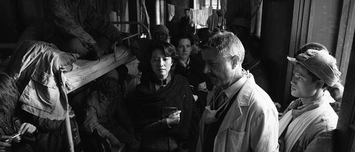
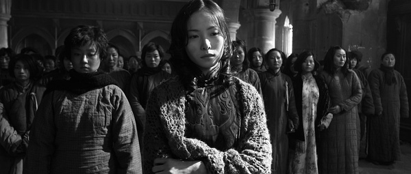

# 《南京！南京！》影评

#“<七星影像>南京城里-----《南京！南京！》影评”

《南京南京》从来没有呼唤血债血偿！每一个想用日本兵杀南京人的方式杀东京人，用日本兵糟蹋南京女人的方式糟蹋东京女人的中国男人，你们同那些在慰安妇面前急不可耐地扒掉裤子晃悠生殖器的日本鬼子有多大差别？日本鬼子疯癫的在中国女人身上泄欲不仅因为他们长着需要做爱的器官，更因为他们恐惧，他们仇恨，他们吓得发狂。因为他们也不过是这场战争中随时可以被毁灭的草芥。他们作为整体是占领南京城的帝国军队，他们中的每一个却不过是随时可以消失的一缕炮灰，随时可以坍塌的一具尸体，随时可以被战争齿轮辗成渣滓的一只蝼蚁。弱小而卑劣的他们只有在不断重复愈演愈烈的强暴、屠杀和摧残中才能感受自己哪怕是那么一丁点稍纵即逝的力量和控制。如果看完电影，我们也由于恐惧，由于仇恨，由于吓得发了狂而企图去做同样的事，那我们与他们何异？若我们也歇斯底里的去反抗、去报复，扛着枪炮去张显我们有力量，我们有种，我们是主人，其形态也就一如鬼子们在慰安妇床上疯狂透顶却绝望无力的抽插。换来的只会是疲惫中醒来的女人一句：XX君，你结束了吗？
　　

《南京南京》里没有英雄！有的只是为了保住自己、家人和同胞的性命而别无选择、孤注一掷的普通人和几十万张已经被历史的风尘模糊但却通过这部电影重新蚀刻在我们心中的面孔。你觉得“身”先士卒的军人（刘烨）、挺“身”而出的妓女（江一燕）、舍“身”救人的老师（高圆圆）是主旋律电影中被神化的典型，我却觉得他们做出的选择固然英勇，固然伟大，却也只是一个普通人在绝无仅有的历史时空中一个“身”不由己的选择。没有拔高，没有凸显，没有排山倒海善莫大焉，却依然能够触动我们，震撼我们，令我们感同身受泪眼婆娑。就像日本兵角川所说：“活着比死了困难吧。”不论是前面三人的献身还是后面那个“汉奸”的“从良”，都包含着特定情境中的普通人对于死亡从逃避到接受，直至变成主动选择的变化。我们有一百万个活着的理由，但当我们无法逃避死亡，当我们逃避的太累甚至为此付出了他人生命为代价，当我们的死亡可以换来亲人朋友或同胞的生存，真的，只要一个理由，我们的生命就能霎时变得空灵，宛如一层可以被轻轻吹去的浮灰，因为擦去这层浮灰我们能触摸到自己心灵真正的平和。范伟饰演的唐先生在死之前得意地冲日本鬼子吆喝：“我太太又怀孕啦！我太太又怀孕啦！”因为有新生命的延续，他犯下那个的无法获得自己原谅的罪行就可以用这条老命去赎回了。我崇敬他，但我并不觉得他是英雄，他只是在做出许多被动选择后，终于用一个主动的选择搏回一点做人的尊严和对同胞的交代。而当你停止逃跑，你就要面对，要承担，要做出选择。在日本，不是烫头发涂指甲的女人都是妓女，在中国，不是会在危难中做出正义选择的都是英雄！ 

《南京南京》不是在传道！很多人指责电影结构松散，“不知道到底想讲什么！”还有像小撮叔叔那样的，抨击它没有告诉我们暴行背后“普适性”的逻辑。这不禁让人哑然失笑了。我以为一部好的电影会引导人思考，而不是代替人思考。对于陆川的相对冷静客观，少有批判和解释的现象“罗列”，让人感激万分，致以无上的敬意。小时候因为看多了抗日片，对日本鬼子凶神恶煞的形象真是又恨又怕。在最坏的恶梦里，我为了逃避日本兵，怕成为他们的“花姑娘”，还曾跳下河去。但是在看《南京》的时候，虽然也曾潸然泪下，却不曾留下梦魇；看完之后虽有压抑感，却同时感受到了导演的尊重以及一部艺术作品给予我们的审美愉悦；虽然对日本鬼子的暴行怀有仇恨和恐惧，却同时能将它看成一桩被“去妖魔化”了的严酷现实。因为那原本可怕的东西成了目睹到的现实便少了几分匪夷所思的无处不在性，而拥有了一种历史感和庄严感。我不懂为什么有些人会一直要导演给出答案，要他表明电影的中心思想，划分好段落结构，挖掘现象背后的人性根基和“历史、经济、文化原因”。我相信有很多伟大电影确实做到了以上几条，但这并不意味着做到以上几条才能是伟大电影。“大象希形，大音希声”，南京大屠杀这件事对所有中国人来说太痛了，太屈辱了，太难以置信了，也太难以表述了。这就如同一个傲气冲天却被施以宫刑的男人，当他向别人讲起这段经历时，不能不在仇恨和羞愧中嘴角哆嗦，言辞零乱。而不管他多么挣扎，多么激动的完成这个叙述，聆听的正常人虽然同情，却永远无法理解其痛苦之万一。

《南京南京》并没有做那个被阉割的讲述者。它没有像一个正常的受害者那样，去批判仇人的暴行如何丧尽天良，去质问他们这样做的原因和逻辑，也没有企图讲述一个结构严谨的故事博人同情，他只是一个证人，他用全知的镜头去纪录。他让你看见中国人的遭遇，也让你看见日本人的绝望；他让你看见中国人的伟大，也让你看见中国人的愚懦。他不解释，因为他知道他没有能力解释，也没有人能解释，暴行的逻辑可以非常简单，因为人类并不高级；暴行的成因也可以非常复杂，因为一万个人会有一万个解释，电影虽然没有参与这个解释，却尊重了每一个人去思考和解释的权力。那些劝导演换编剧，挖深度，搭结构的人就跟劝妓女小江剪头发的婆婆一样，虽然出于好心，却只能显得小家子气。

这部电影的观众，有的人观摩自然貌似无动于衷，有的人受其感动潸然泪下。对于前者或许是因为在这部电影里他看到的是现实不是情节剧，对于现实，哭泣是没有用的，我们在生活中早就懂得了这一点，所以如果哭泣不能改变现实的话，能不哭就不哭吧，我们还可以恨，还可以自强，用不着那么软弱。而对于后者，在他的潜意识里，真正感动他的是终于在这部电影的背后看到了一个不急着替观众思考的导演。终于有个导演给他事实，请他思考和判断，而不是请他到自己搭好的思想城邦里面去参观和居住；终于，导演们天天挂在嘴上声称要誓死捍卫的民主也给观众留了一份，终于有一个导演即使心中充满了感情，却仍有这样的胸怀，这样的自信，这样的胆量，这样的风度给所有人空间。潜意识里面，我们喜极而泣。　　

(采编：卢静;责编：王冬阳)