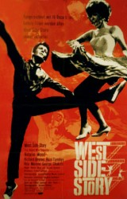
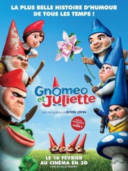

# 我们的现代改编在哪里？——以《罗密欧与朱丽叶》为例

这是一个被讲了无数遍的故事。

少男少女一见钟情，少男少女被父母拆散，少男少女双双殉情。

大神莎士比亚的《罗密欧与朱丽叶》写的就是如此：蒙太古家的少爷爱上了世仇凯普莱特家的女儿，两人相爱、私奔，最后双双殉情。彼时的莎士比亚虽是牛人，但仍只是同时代众多牛人中的一个。直至浪漫主义的兴起，他才被推上了圣台，被一群唐璜们当春哥一样地崇拜着。到了二十世纪，莎翁竟有了一家独大的趋势。欧洲、美洲乃至全世界各地，但凡自命有文化有国际视野的纷纷举办莎士比亚节，将他所有的作品一一搬上舞台。看多了束腰绑腿，这些具有创新精神的艺术家们开始在各个方面动脑筋，于是就出现了现代改编(Modern adaptation)。

所谓现代改编，就是将莎翁写的故事放在现代来讲。比如《红磨坊》的导演巴兹鲁尔曼将故事设置在当代纽约的维罗纳海滩，保留了莎翁原来的对白，于是就变成了莱昂纳多出演的后现代版《罗密欧+朱丽叶》(Romeo + Juliet)。这样的改编方式在戏剧界非常常见。笔者初涉领域见识浅薄，却也已经看过了卡巴莱(Cabaret)歌舞狂欢版《仲夏夜之梦》、当代带监视器版《哈姆雷特》和黑人剧团之《理查德三世》。

如果不拘束于字面意思，那么“现代改编”可以泛指任何保留了经典原著精神的作品。以《罗密欧与朱丽叶》为例——

如果将其设置在60年代的曼哈顿西区，并改编成歌舞剧，那么就摇身一变，成了1962年荣获十项奥斯卡奖（包括最佳影片奖）的《西区故事》(West Side Story)。在这个故事里，白人男孩儿东尼与波多黎各女孩儿玛利亚相爱，奈何一对鸳鸯分属于纽约西区的两个不同黑帮，故事最后以东尼的死和两帮化解仇恨结束。在情节上《西区故事》保留了大量莎翁的经典桥段：在舞会上一见钟情，在阳台上表露心声，男主角不小心杀了对方的人只得落荒而逃，女主角的诈死，悲剧的结尾。

如果将《罗密欧与朱丽叶》演绎在非洲大草原上，那么就变成了迪士尼出品的《狮子王2：辛巴的荣耀》(The Lion King II: Simba's Pride)。狮子王辛巴的女儿[琪拉雅](http://baike.baidu.com/view/965900.htm)爱上了高孚——已被放逐的刀疤的儿子。两位狮子冲破重重困难，最后在爱的指引下，使两个阵营化解了长辈结下的矛盾。虽然情节上没有像《西区故事》那样较完整地将《罗密欧与朱丽叶》复制过来，但故事脉络和人物情感与原著基本相符。

正所谓艺术家们的创造力是无穷的，约翰·麦登(John Madden)干脆把《罗密欧与朱丽叶》搬回莎士比亚自己的时代，将莎翁变成罗密欧，讲一个《恋爱中的莎士比亚》(Shakespeare in Love)。在这部剧中，莎士比亚爱上了小姐薇奥拉，奈何一个娶了妻一个要嫁人。电影以《罗密欧与朱丽叶》的创作过程为引线，借用了阳台示爱、舞会调情、保姆打掩护等等桥段（还引用了莎翁其他许多剧的台词，哎，文化人就是喜欢嘚瑟），上演了一部剧中剧中剧。

英国人民的倒腾劲并没有就此结束。2011年他们又弄出了一个3D动画版《吉诺密欧与朱丽叶》(Gnomeo and Juliet)，讲述了生活在长期不和的两户邻居家中的花园小矮人们之间的伟大爱情故事。在粉红色火烈鸟的撮合下，蓝户的吉诺密欧和红户的朱丽叶要冒着割草机的进攻和被摔碎的危险，冲破重重阻碍，终于幸福地在一起。导演甚至弄了一个莎士比亚石像，拿原作者开涮。

这些明显的改编并没有给人以“抄袭”的感觉。相反，他们为生涩的古英语原著注入了新鲜活力。《狮子王2》和《吉诺密欧与朱丽叶》将原来的悲剧变成了老少皆宜的动画喜剧，让更多的观众感受到莎士比亚的魅力。《西区故事》创造了属于自己的经典桥段和歌曲，甚至有了自己的改编作品，其中佼佼者《西岸故事》也获得了奥斯卡奖。而《恋爱中的莎士比亚》则呈现了一个浪漫诗意的莎翁年代，让观众和评委们倾倒，一举拿下了七项奥斯卡奖。

只要抓住经典原著的精神，任何形式上的变化都是浮云。

“What's in a name? That which we call a rose by any other name would smell as sweet.”

玫瑰易名，馨香如故。

** 我们的现代改编在哪里？**

现代改编的最大优点在于，他们比经典原著往往更能让观众产生共鸣，因为他们的创作时代更贴近当代人的生活。对于新片来说，他们可以吸取经典原著的精华，取得“踩在巨人的肩膀上”的优势；而对于经典原著而言，创造性的翻新使他们的艺术之树得以长青。

如今，现代改编早已不限制在莎士比亚佳作的范围之中。

当《BJ单身日记》（基于简奥斯丁的《傲慢与偏见》）、《绯闻计划》（基于《红字》）和《魔法奇缘》（基于多部迪士尼公主动画）在欧美粉墨登场的时候，我们正眼睁睁地看着金庸的作品被第N次摧毁。在接连不断毫无新意的翻拍、翻拍再翻拍大潮中，笔者不禁要问：

我们的现代改编在哪里？

为什么没有人拍住校高中版《西厢记》，亦或是屌丝女神版《梁祝》？乔治卢卡斯把古希腊英雄故事安插进太空歌剧，于是成就了《星球大战》；同理，为什么没有人拿《西游记》动脑子，改编成科幻？

有人会问，这不是在诋毁经典原著吗？

把卷福和花生捧红的《夏洛克》(Sherlock)制作人史蒂芬·莫法特(Steven Moffat) 在采访中说，福尔摩斯的原作者亚瑟·柯南·道尔是个非常与时俱进的人，甚至可以说是超越时代的。他推崇科学，强调推理，如果他生活在现代，一定会爱上电脑、手机这些新科技。然而福尔摩斯的翻拍似乎总在强调其维多利亚时代，这显然不是原作者的意图。莫法特和他的好基友马克·加蒂斯(Mark Gatiss)表示，将福尔摩斯的故事以现代改编的形式搬上电视并不奇怪，奇怪的是为什么以前没有人这么做？

同样，莎士比亚把《哈姆雷特》放在文化复兴时代的丹麦并不是刻意强调其历史和时代意义。丹麦之于莎士比亚，只是个遥远而浪漫的地方，他要突出的是人性的冲突和挣扎（我的戏剧历史老师曾经花了半个小时吐槽莎士比亚是个地理盲，说他拿着北欧地名瞎胡扯）。因此，只要抓住了原著的精神，即使是把故事搬到非洲大草原上，由一群会唱歌的狮子鹦鹉大猩猩讲述也未尝不可。

《狮子王》的十亿美元的票房、两个奥斯卡奖和三个金球奖就是佐证。

我们国人常常把“经典”二字看的太重，觉得文化一定是祖传的，而且还得供奉起来，不能碰，碰了就是亵渎。这样的想法框住了大量的创作者，于是他们只能毕恭毕敬地“再现”“还原”原著，落个画虎不成反类犬。要不然就绞尽脑汁绕过经典，抛弃了巨人的肩膀，在一旁拼了命的踮脚尖。

之所以经典改编的形式在西方社会流传了几十年，却仍旧没有被引进中国，是因为我们太害怕，怕搞坏了经典。

其实当年莎士比亚写的剧本大多是演员现场临时创作的，可以被随意删改抄袭；《007》最初是当半个黄片播的；披头士一开始也只是叛逆年轻人的代表，入不了主流。真正的经典在一开始都是些毛头小伙儿小姑娘砸破了旧罐子，创造出的新器皿。正是当初的“新”经过了历史的考验和沉淀，炼成了今日的“旧”。

当然，要打破“经典”这道坎儿还需要很多努力。经典改编这种形式若是想要在中国发扬光大，不仅需要文化创造者的勇气，也需要观众们的接受。

我期望有一天，现代改编的浪潮能涌进中国。

（采编：吴春凉；责编：王冬阳）
