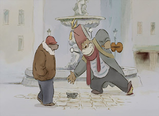

# 捍卫纯洁的友情——《艾特熊和赛娜鼠》

水彩晕湿了美好。冬去春来，四季在这里交替，友情在这里培土。

《艾特熊和赛娜鼠》以亲切的童年感，赚足了影迷和凯撒奖、康城影展、香港影展上众评委的喝彩，淡雅的水彩和手绘质朴的结合孕育而生了这个改编自原作者Gabrielle Vincent的绘本小品。伴随悠扬的法国小调，上演了一场动物界狄更斯式的朴实无华。逾越了种族的不容之目后，两只小动物捍卫友情的真心打动了世人，从此艾特熊和赛娜鼠幸福的生活在一起。

（一）绘本

说到“绘本”，人们会迅速笼统的联想到连环画或是漫画，绘本的确是具备了这两类书籍的某些共同点，但在整体上还是有所区别。它是以大幅单页或双页的图画撑起全书故事的视觉核心，所以在英语中绘本又称为“Picture Book”。

绘本起源于中国，上世纪30年代在欧美国家兴盛，“阅读绘本热”曾红极一时，之后陆续席卷全球，于是有了像Caldecott、The CILIP Kate Greenaway Medal、Newbery Medal，这些在西方国家有名的绘本大奖，以此来鼓励和支持那些在绘本领域有才华的创作者。

绘本启用少量篇幅的画面讯息，再配合图片简短的文字，两者相辅相成的互动使读者能够逐渐步入一种文学的阅读方式。它的内容精简，色彩明快，美术多变，同时也有为儿童和成人这些指定年龄层的读者群提供的阅读内容。绘本的价格，并不像普通儿童读物般平易近人，所以无论是在国内还是海外，都属定价稍显昂贵的图书。如果说“没有一本绘本是不可爱的”多少有些矫情，可它用简短的篇幅所要传递出的纯净、爱、想象力、内藏赋予哲理的言说、视觉等特色又是别于文字类书籍的。它的关键魅力在于图片和文字亲和力的讨喜，读起来不会使人冗赘烦闷，当人们阅读完一本绘本后，双手合上它的那刻，由心底升腾出那份掩卷长思的感动才最为珍贵，因它立足于回味的力量。

绘本家Gabrielle Vincent（嘉贝丽·文生）在绘本界是一个耳熟能详的名字。1928年嘉贝丽·文生出生在比利时的布鲁塞尔，一个有着浓厚艺术氛围的家庭，其后又毕业于当地著名的布鲁塞尔艺术学院，从52岁起嘉贝丽·文生开始迈入创作图画书的职业生涯。1982年她的绘本作品《Jour, Un Chien》（流浪狗之歌）直到现在都仍被多国喜欢绘本的人视为经典之作，其后的作品如《小木偶》、《天使的奇遇》、《蛋》等的推出，更进一步奠定了她国际级绘本家的地位。嘉贝丽·文生个人极端鄙视人类对物欲追求的价值观，也因此拒绝过商界老板把《艾特熊和赛娜鼠》的系列故事商业化的请求，她说“我想让每个孩子都能像赛娜和艾特一样，好好珍惜自己想象世界中的每一件东西。让孩子们一边读书一边进入想象中的美好世界，进入属于他们自己的世界中去。认为无论什么都得用金钱去买，一味拼命地弄钱。可是只要稍微认真地考虑一下，即使不去买，也有花点心思自己就能做到的东西。这样能让想象力丰富起来，自己来创造属于自己的东西。”正是持着这样的人生态度和创作信条，森比左志、今江祥智、Cathy Woodward都对她的作品赞誉有加。嘉贝丽·文生一生无儿无女，深居简出，但却给绘本界留下了一本本经久不衰的经典之作。她于2000年辞世，享年72岁。

（二）友谊长存

鼠国和熊国是两个相互对立的种族，熊国生活在陆地上而鼠国则在地下。鼠国里有一只喜欢绘画的叫赛娜的老鼠，他却有一个想与熊做朋友的念头。某个冬日，一次偶然的机会下，赛娜鼠在帮助挨饿的熊类艾特填饱了肚皮后，一只鼠和一只熊就这样成了朋友，但是两人的友谊被各自的族人视为不能被原谅，于是他们便躲到了艾特熊的家中，一同过了几个月的隐居生活，直到春暖花开的一天，他俩的行踪被苦苦寻觅的警察发现。

“情妇虽然要新的才有趣，朋友还是旧的好”钱钟书风趣地语重心长道。“人是应该兴旺的，一旦走了下坡路，是不存在朋友的”欧里庇得斯充满现实的哲学口吻。“即使开始怀有敌意的人，只要自己抱着真实和诚意去接触，就一定能换来好意”池田大作略带感化的语气道。如果爱情对于人类而言是自己在寻找另一根肋骨的亚当或夏娃的话，那么人类对友情的渴望就可喻为上帝赠予人们心底先天的另一份嫁衣。

每个人对友情的概念都有属于自己的论调，而维系友情的基础就是主体在对于外界的友人，交往中自身创造的并在不知不觉间相互锁定的格律，它参考着对方身上同自己相似的轨迹为契合点才可慢慢组建成型，彼此也会在这过程察觉到哪些点是可以忍让和倾慕欣赏的，一旦对方的缺点或相似度减少从而盖过了优点，那么友情也将不会成立甚至是决裂。每个人在这场友情的苗圃里，总是要不自觉的扮演着一个天秤的作用，友谊就被轻而易举的放在了主观的托盘上，权衡着一切。随着人类文明每分每秒的前进，朋友也出现了许多的分类和定义，诤友、网友、文友等，新旧关乎朋友的名词在时代交织，友谊这东西到底是人与人之间相处的一门学问，既然是学问，里面也就蕴藏着一种艺术，而高贵的友谊是包含在通达人情世故的基础后，所剩下的智慧。《布拉格之恋》里，Sabina对于Tereza和Tomas的友谊有着寻常人无法逾越的高度，《走出非洲》的丹尼尔来到同生前好友芬.奇哈顿经常一起狩猎的地点为他默哀，而不是涌进群人聚积的教堂为他冰冷的尸体送行。这些对友情解读至升华的例子已证明这份情谊可推置的觉高境界。古往今来，人类总是在渴求自己灵魂的另一半，可有个真正“懂”自己的人，在漫长的人生中又是寥若晨星般难得。

编剧丹尼尔.贝纳的女儿曾读过此书，这是他把《艾特熊和赛娜鼠》将其改编的一个重要契机，而本片的三位导演本杰明.雷纳、芬妮·奥比尔和文森特·帕塔尔又使角色的肢体语言在两只富于灵活变化的动物身上得以自由演绎出来。角色是影视作品中至关重要的，导演若选对了角色那影片也就成功了百分之八十，无可非议赛娜鼠天生就是惹人疼爱的形象，他喜欢画画，更喜欢交朋友，善良和单纯是他的名片，而艾特熊则是位穿梭于大街小巷以卖乐为生的街头艺人，他邋遢，不拘小节，还有喜欢吃糖果这一熊的特征，两人在现在看来都是富有才华的民间艺术家，在一同躲避警方追捕的友情日子里，编剧也不忍心看着他俩再灰头土脸的生活而遗弃自身那优人的小才华，所以安排了那场音画交融的难忘一幕。

为艾特熊献声的法国演员朗贝尔.维尔森同时还是一位男中音歌手，他将熊的体积和性格中懒惰的特质还原到人物身上，在录音中他还经常像美式动画的演员一样带着夸张的表演来塑造角色，其后作曲家文森特.古柯图用能代表两位主角的乐器加以更到位的诠释，弦乐是赛娜鼠，单簧管的低音区则是艾特熊，在录制其配乐的文森音乐制作工作室中，《Variations du temps, de l'hiver au printemps.》一曲方能感觉到音符化的艾特和赛娜在五线谱上愉悦地相互携手，小提琴的敏捷与单簧管憨厚音色的结合增添了浓重的童真气，但在多支乐器演奏时，器乐们带有过于凸显自己地位的痕迹，声音之间质感的层次等级划分不明晰，而且稍靠前了些，成品后有种腥味萦绕听觉。《艾特熊和赛娜鼠》没有宏大的幕后团队，但作品中的清新气在如今90分钟的以动物为主角的手绘动画电影中乃是不可多得的绝响，恰好这一点最能彰显出法国人民的特色，因故事设定在了小镇和乡间，这都是法国原汁原味的文化返璞，由于它国土面积较小，连法国人自己都常会自嘲这点来看，观看《艾特熊和赛娜鼠》的时候想必本土观众更能感受到亲切的乡土氛围。法国人多是以小情调至上的民族，所以无论是在它的文艺作品中还是国民素养方面都少有资本主义国民的高傲态度。

善于发现的观众一定察觉了片中不少蛛丝马迹，那场成批警鼠在下水道追逐艾特熊和赛娜鼠的戏，导演也毫不避讳的承认是借鉴了宫崎骏动画中才常出现的麻点密集运动美学。赛娜鼠在表演上明显的带有日本动画里卖萌女孩的特质，尤其是赛娜的声音，主角在大自然中随音乐翩翩绘画的点睛之笔又会有多少人联想到迪士尼的音乐会电影《幻想曲》，人物在线条上的简洁明快又是否在效仿《隔壁的山田君》。当今在美日两大动漫产业国的驱使下，这部法兰西文艺动画小品多少还是染了两国所产出的商品而所投下的相似元素，但“抄袭是最隆重的赞美”，再者《艾特熊和赛娜鼠》并没有完全照本宣科，所以对以上的总结仍不会撼动它在观众心中的地位，而且在有生之年可以欣赏到这个曾被原作者不允许动画化的作品能走出绘本来到幕布，就是件值得欣悦的事。

在二人一同生活的几个月中，没有外界的打扰，也没有鼠熊两界不容的程式公式。一晚，在正熟睡的艾特熊房间，他屋子露顶天棚上悠悠下起雪来，这是冬季将至的讯号，赛娜鼠就在他身上撑起小伞熟睡，那刻整个世界都处于安详的睡眠中，而友情亦如这宽大的温床，足以抵挡户外的严冬。

（采编：李玖玖 责编：王冬阳）
