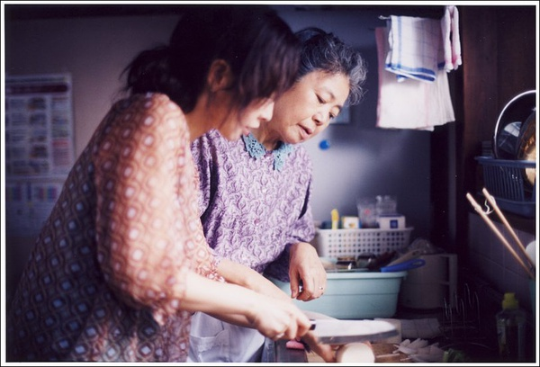
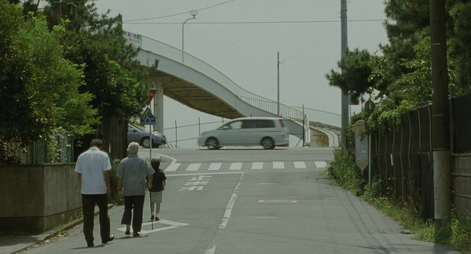

# <七星影像>母亲的味道-----《步履不停》影评

母亲是所有家庭风暴的中心，看似平静却内底汹涌，她们是最直接的受害者，这种伤害却往往被我们忽略，生活对她们有所亏欠，却很少有人能够理解。

看电影讲究缘分，偶尔听到一首叫做《朝》的日本歌，旋律干净悠缓，像是夏日里最深沉的河，后来知道是日本电影《步履不停》的主题原声，于是特意看了这部电影。日本家庭伦理电影在世界电影中占重要位置。较西方电影，日本电影和中国人的情感更为相通，感情含蓄，表达委婉，经典例子可属小津安二郎的《东京物语》，而《步履不停》正是导演是枝裕和对其的致敬之作。

是枝裕和说：“这是至今为止的作品中，最能表现出我自己味道的电影。”这部电影诞生的契机在于他母亲的死，里面有大量导演自己的回忆充斥其中——人在生死边缘总是能感知到生命中最本质的地方。细节和铺垫，已经和电影本身深深地融入到一起，自然妥贴。我们很容易被其中的细节打动。这是他的高明之处，作为曾经的纪录片导演，是枝裕和的电影真实而不做作，镜头冷静如水却又富有温情。相比较于《步履不停》我更喜欢电影的另外一个名字：横山家之味。一个家庭不管幸福与否，酸甜苦辣咸都要经历最少一遍。电影发生在夏日里的一个平常家庭，母亲准备着饭菜，女儿为了博其欢心询问着自己不擅长的家务事，一切都那么井然有序的：削萝卜，切蘑菇丝，做萝卜泥，炖肉，气氛和谐，父亲外出散步。一家人简单的一天开始了。影片中的日本像是一个世外桃源，安静宽敞的街道，房屋鳞次栉比，仿佛静卧的兽，匍匐休憩着，懒洋洋地晒着太阳。在一片静谧安详中新干线的轰鸣声划过天际，良多带着妻子由香里和其儿子厚司回家探亲。这一天刚好是死去多年的哥哥的忌日。哥哥在电影里是一个隐形人物，他从未出现，却链接着一个家庭，透过电影的只言片语我们知道，哥哥优秀且被寄予厚望，却因救起一个落水儿童而意外身亡。哥哥的死像是投入夏日河流的一颗石子，波纹微漾下是不可知的汹涌，即使15年过去，他的死亡仍然笼罩在这个家庭头上。而母亲则是这场风暴最直接的承受者。

有人说：“家庭主妇就像是随时处于待机状态。”在《一个人的老后》这本书里，作者曾经这样描述日本家庭妇女的生活：“虽然三房两厅大小的房子，也许无需花太多时间整理，但女儿放学回家准备上补习班前必须先吃饱再出门，还得替结束社团活动返家的儿子准备饭菜，或为加班晚归的丈夫准备热腾腾的晚餐。”这就是属于她们的一天了。在日本，大多数的主妇都无法忍受几十年如一日的单调无趣的生活，老年离婚的比例逐年增加。电影中的母亲和大多数日本母亲一样，她一辈子都未出去工作，是料理家务的能手。她能熟练的准备一家人的饭菜，手炸的玉米天妇罗是大家的最爱，她爱女儿，“你的脸这么漂亮，把额头露出一点啊。”这多像平时妈妈对我们说的话。她爱儿子，对于好久未归家的儿子，她专门去购买适合的睡衣，即使对儿子的婚姻心中不满，也做到准备三把牙刷。儿女是父母上辈子欠下的债，她没有半分怨怼。与此同时，她又是一个妻子，她对丈夫体贴入微，“他不想让邻居们看到他拿购物袋的样子，都这个年纪了，还喜欢别人叫他医生。”连女儿都抱怨说“妈妈你太宠着爸爸了。”母亲的生活看似风平浪静。然而大儿子死去多年，曾经获救的儿童已经长大成人，他肥胖，笨重，没有出息，父亲说：“这样一个人怎么值得我的儿子去救。”母亲却只是殷殷叮嘱：“明年还要再来啊。”转眼却是：“该让他也觉得痛苦”这话听得人胆战心惊，十几年来母亲是依靠什么一次次面对这个带给他们痛苦的人呢。我们不得而知。晚饭上母亲颤悠悠地拿出那张证明父亲曾经出轨的唱片，她那么轻易地道出一段往事，这时连一向庄重威严的父亲都慌了手脚，躺在浴缸里无所适从，母亲默默地包容着，维护着这个家：大儿子已死，二儿子久不归家，女儿远嫁，丈夫出轨。生活从来没有给她过任何优待。

树木希林的表演也让人眼前一亮，看这部电影的时候，意外出戏，脑子里不断浮现出奉俊昊导演的《母亲》，也许是因为她们同样的面孔上有着同样的哀愁。每个人都有一首属于自己秘密的歌，对于母亲的痛苦，我想良多的妻子由香里应该更懂得。寡妇的日子多难熬，更何况还带着儿子，即使再嫁，丈夫良多也是一个并不懂得体贴妻子的人，他中年失业，郁郁寡欢，甚至想不到帮妻子拎行李。母亲生前有两个愿望，一个是希望良多可以开车载她，这个至死都未实现，另外一个便是向由香里提出希望可以有一个血脉相连的孙辈。所以当电影结尾那个穿着白色裙子的小女孩出现的时候，这让人多欣慰。

厚司和由香里，母亲和良多，母亲和父亲，由香里和良多，两对母子，两对夫妻，一切都是延续，我们的生活是无数个平常的拼接，酸甜苦辣咸各轮一遍，平常的生活依旧平常地继续，只有死亡才是终结。良多的继子在黑夜中祈祷的时候说：“我成了接力跑的人。”这一切也许会在下一代有所改变，谁知道呢。

（采编：卢静 责编：王冬阳）