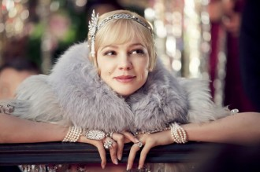
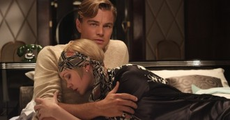

# 盖茨比真的“伤不起”？

有关盖茨比的种种讨论，随着由莱昂纳多·迪卡普里奥主演的新版《了不起的盖茨比》在全国上映，达到了顶点。有网友在看完电影后大呼“伤不起”，因为片中男主角盖茨比为了爱情倾尽所有，最终却落下个被爱人抛弃，死得不明不白的下场。更有网友写出攻略，指导身处盖茨比地位的男人们，究竟如何做才能最终抱得美人归。

影片本身中规中矩。导演巴兹·鲁赫曼显然不是一个讲故事的高手，至少肯定没有《本杰明·巴顿奇事》中大卫·芬奇表现出的功底。预告片和后来突然的延期上映也表现了，这部电影终究是冲着票房去的。蒂芙尼的珠宝、普拉达的华服，Jay Z的配乐，打造的是极致奢华。影片可圈可点很多，主演们的表演、Lana Del Ray的《Young & Beautiful》、 以及对菲氏笔下场景的重现等等，都非常出色。不管如何，导演是将这个原本看起来很难拍成电影的故事讲完整了，且拍出了特色，这已然是难得了。翻拍和致敬要比拍一个原创故事难得多，拍一部名著级别的小说也要比拍一部年度畅销书困难的多，《少年派》 、《幸福线》都是后者成功的例证。然而对于前者，它太深入人心，加之文字和电影的天然鸿沟，想要成功便尤其不易。

黛西和盖茨比的初见

片中女主角黛西的形象，是原著作者菲茨杰拉德先生本人最感兴趣的“Flappers”（飞女郎）。飞女郎们多数家庭富裕、喜欢寻求爱情和刺激的冒险，游走在各式各样的舞会和派对之间。菲氏在自己的小说，诸如《了不起的盖茨比》、《离岸的海盗》、《贫儿马丁·琼斯与威尔士王子》、《美与孽》、《富家公子》等等，塑造了无数这样的角色。“飞女郎”的生命总是在凋谢，如同烟花，一声璀璨的绚丽，之后便消失在黑夜寂静的高空。 

黛西在第一次见到盖茨比时，不是某些偶像剧中的女主那般“穿着简单的T恤或是套头衫，拎着不知名的手袋踩着平底鞋……”，甚至女扮男装。黛西是盖茨比第一个真正认识的“大家闺秀”，是一座极其美丽的豪宅主人的女儿。盖茨比的生命中从来没有和这类人接触过，总是有一道铁丝网将他与她们隔开。盖茨比出身贫寒，之后随科迪先生出门航海，遗产被夺后从军，一直在遇见黛西之前，他从未与这类光彩夺目的少女交往过。黛西的家中充满了来向她献殷勤的男人，这从某种意义上也加强了黛西的光芒。本来，黛西和盖茨比之间是连开始的可能性都没有的，黛西可不是泰坦尼克上的罗丝。帮助盖茨比赢得黛西芳心最好的武装，便是身上的那套军服了。

其实很简单，当我们在高中，每个同学都被要求穿着校服时，贫富什么的也就不显得那么明显了，而在军营这种纪律性要求高得多的地方，便更是如此。不管你是富二代还是穷小子，都是同样的一身行头。盖茨比知道不论以后他能取得多大的成就，就现在而言，自己唯一拥有的就是军装。脱下军装，自己一无所有；而穿上军装，政府一声令下就可以将它调派到任何地方。盖茨比在这时，虚构了自己那并不存在的百万家财，他可能并未直白的说谎，但他一定是给黛西造成一种错觉，认为对方的家世是和自己相当的。他想要狼吞虎咽地去占有，最终他也得偿所愿地占有了黛西。如果故事到此结束，也不过是一场一夜情罢了，然而就在这时，他才发现自己是爱着黛西的，从此才走向了那条试图找回过去的不归路。

黛西的感情

黛西是一个女人，但是一个女人的身份，并不能成为被原谅的原因。年轻的时候在社交季节上大放异彩，求得一个好夫婿之后日渐凋零，这是“飞女郎”们共同的结局。她们拒绝这样，试图找大堆的活动来填补空虚的生活，脑子想的是今天下午做什么，明天下午做什么…二十年后的下午做什么……“能找到一个知道自己是为什么结婚的女孩是令人鼓舞的,百分之九十的女孩都认为结婚就像是走进一幕电影中的黄昏。”在五年前与盖茨比相爱时，她的爱是真诚的，而当盖茨比离开，她在经历了一段焦灼的等待之后重回社交场，很快便投入了汤姆·布坎农的怀抱。在新婚前收到盖茨比的来信，哭着“黛西改变主意了”，将35万美元的项链扔掉时，她是真诚的，但当蜜月归来时，便又和丈夫如胶似漆了。她拥有足够的激情，而缺少的，是持续的勇气和坚持，去追求心中所想。

尼克在第一次去黛西家吃饭时，得知汤姆在外面有女人，甚至在黛西即将生产时不闻不问，他觉得黛西“应该抱着孩子走出这间屋子”，可是实际上，黛西她只是默默地接受了这个事实。要她这样慵懒的人去打破束缚，迎来自由呼吸的空气云云，终究是不太现实的。同样的情形发生在最后摊牌时刻，当汤姆追问“真的没有爱过我吗”的时候，她也没有顶住压力坚守盖茨比，而盖茨比生意的来历不明，只是那压垮驴子的最后一根稻草。汤姆给她的影响也是巨大的，闯祸撞死人之后，她已然崩溃，任由汤姆摆布，寻求自保。她的脆弱、不作为、缺乏勇气，导致了三个人无辜枉死。她是个女人，一个可怜的脆弱的女人，也是一个有罪的人。

而在电影中，最受人诟病之处也正是在此。电影里对原著中几处细节的更改，起了重要的作用，使得没有人成为大众理解的真正意义上的坏人，所有的一切都是机缘巧合和稍微的自私心理作祟，从而酿成悲剧。特别的，那拿起又放下的电话，尼克打电话过来时的茫然不知，我们的女主角黛西被放在了一个道德暧昧的位置。有人直言，鲁赫曼对于文学作品的理解有一种“毫不害羞的浪漫和充满热情的肤浅”，他用炫目的视觉效果和主人翁的爱意缠绵将人性深处最真实的令人战栗的丝丝凉意给抹掉了，这使得电影本身缺了一口气。

盖茨比的感情

小说名为《了不起的盖茨比》 ，这估计也是很多人不懂的地方了。有人会问，要是了不起的比尔盖茨我还能理解，这个盖茨比哪里了不起了啊？按照很多人的想法，盖茨比是个彻头彻尾的失败者，然而实际上，他是少有的真正意义上真诚的人。一个懂得改变的人，并不了不起，真正了不起的人是懂得坚守的人。很多人从一文不名变成富翁，从懵懂少年变成情场高手，而盖茨比，在他心中却永远保持了一个最美好的梦。在他的生活的无数个路口，他都本可以拥有更好的选择，而他，却走了我们看来最不值得的路。他在生意场上左右逢源，却在爱情的当口乱了手脚。看看他的表现吧，举办无数场华丽的派对只是为了要期待黛西有可能会过来。终于，当他终于找到尼克，这位他日思夜想的恋人的表哥，他按压着自己的那份欣喜，希望尼克可以请黛西过来喝茶，而自己“刚好过来坐坐”。看看他所说的话吧，“你哪天方便？……我不想太麻烦”。没有经历过极其强烈思念的人，很难理解这一份情愫。等到了那一天，他害怕恶劣的天气会另自己想要见的人失约，可是当她真正来了，自己却又畏缩不前。说到底，不论盖茨比在生意上如何狡黠，如何左右逢源，在爱情面前，他也只是个孩子。出事之后他在窗下彻夜守候，而这时汤姆和黛西在密谋掩盖事实；为了等黛西那不会打来的电话而被无辜枪杀，此时他心爱的人已经和丈夫出门旅行了。这是一种悲哀，令我们为他感到不值，感到可恨。其实在他的心里，他已经知道“黛西远不如他的梦想”，“她的声音里充满了金钱”，知道出事以后她不会打电话来的，知道所有的这一切可能都不值得。他的了不起，是在所有的人都觉得一件事不值得就不应该做的时候，他依旧愿意。所有的人都在试探、在掂量、在精明地算计出一条明智之举的时候，他保持了最简单最纯真的梦想去追求。他或许是夹杂在那一堆所谓聪明人之中的“笨人”，但是我也必须要向尼克最后那样大喊一句：“他们都是一帮混蛋，他们那一大帮子都放一推还比不上你”。

是的，盖茨比在我心中是了不起的，我不认同他，但同尼克一样，我是站在他这边的。尼克，或者说菲氏没有去写一部《了不起的汤姆·布坎农》 ，在很多人眼里汤姆作对了大部分的对的事，是最后的赢家，这会是一个很多人喜闻乐见的高帅富力挫锦衣归来试图逆袭的穷小子的故事。或者是一部《了不起的黛西·布坎农》，这就成了一个已婚妇女红杏出墙后幡然醒悟回归真爱丈夫身边的励志正能量故事。如果真有这样的书，那我只能说一句，“FUCK-OFF”。

（采编：王冬阳；责编：吴春凉）

[【风月江山】爵士时代的盖茨比](/?p=41380)--长时间以来，人们心中的泽尔达都是十足的坏女孩形象，她的疯狂与自私毁灭了他的丈夫。可是谁知道呢，如果没有泽尔达，会不会有《了不起的盖茨比》。

[＜玉衡＞毁掉菲兹杰拉德的女人](/?p=9303)--他毁了她，她毁了他，可这远远不能说清他和她之间最深沉的理解和冲突。他控制不住把她灵光四溢的日记抄袭进自己的小说，她控制不住在作家的妻子之外为自己寻找其他的身份。

[【七星影像】伤不起的盖茨比——那些年，我们没逆袭到的女神](/?p=41553)--为什么Daisy不选择Gatsby？Gatsby是注孤生吗？屌丝逆袭后如何才是推倒白富美的正确攻略？请看本期<七星影像>！
