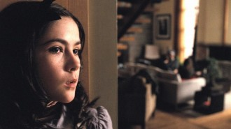

# 看，那个疯女人！-----《孤儿》影评

很久很久之前，世界上有两群人，姑且称之为A群体和B群体。A在实力（经济和体力上）上占绝对优势，因此A统治着B。然而这种统治的维持非常吃力，因为B群体虽然穷弱但在人数上和A几乎相等，所以A打算使用策略，对B分而治之。A将B群体按听话程度和自身条件分为B1，B2和B3三部分。A对于B1群体不吝溢美之辞，用金钱和权势大肆拉拢，让B1认为自己是统治阶级的联盟。因此为了维持上等地位，对于A所治定的驯化B群体的政策B1俯首贴耳，奉为箴言。B2群体所得的利益虽没有B1多，但比B3强，所以他们也信奉A和B1的思想，循规蹈矩地过日子。B3群体是整个社会中最穷困愚昧也最受压迫的部分，但他们不仅人数有限而且力量薄弱，所以只能在痛苦中挣扎。每当B3因为不堪折磨或不甘命运而做出危害A群体统治的革命性动作时，还没等A发话，B1和B2就已经对其进行狠狠的打击了，因为B3会败坏整个B群体在A眼中的形象，让B全体受到A的惩罚。所以，B3常常为B1、B2鄙视和排挤，他唯一的上升之途就是想出阴谋诡计来诱惑A群体，在A的支持下凌驾于B1B2之上。可以说，B3群体中的人面临两个选择，要不做饱受欺凌的弱者，要不做奸诈狡猾的佞人。虽然这两者下场通常都很凄惨，但总有个别倔强凶狠的极品毅然绝然地走上了后面那条路，在经历腥风血后成为背负一世骂名的风流人物。

A、B可以代指很多社会群体。但此处我眼中的A是男人，B是女人。B1是背着财富名望甚至贞洁牌坊的淑女和夫人，B2是相夫教子，生活规矩的普通女人，B3则是被主流文化边缘化的“疯女人”们。这些女人的疯狂之处在于她们没有遵守男人们为其制定的生活规则，离经叛道，走上了浪荡的旅途。对这些人最恨之入骨的其实反而不是男人，而是那些地位崇高的正派女人们，因为她们辛苦维系的与男人之间的联盟很可能被这群一无所有的疯女人打破。男人们对于这些疯女人的态度则反而是暧昧的，他们一面渴望享受后者楚楚可怜的眼神、崇拜的目光、鲜嫩的身体和狂野的风情，一面又害怕这些阴险贪婪的亡命之徒惹祸上身，摧毁他的家国甚至他本身。所以，男人更愿意在享受疯女人的谄媚和身体之后，让正经女人在战场上把她们杀个片甲不流，维持自己统治的安稳和谐。他们恨不得将个别的疯女人订上十字架，鞭尸示众。男人最大的恶梦就是这些疯女人冲破了好女人们誓死守卫的防线打到了自己的疆土。因为他知道她们一无所有，随时准备拼命。而不要命的人的确很难对付。

在《孤儿》中，这个恶梦变成了现实。这个疯女人是多重弱势群体的化身。她既是女子，也是疯子，也是孩子，也是外来移民甚至还是个孤儿（虽然是孤儿和小孩这一点是伪装的，但她在生活中确实受这一身分的限制）。这样一个被边缘到极致的人如果没有心计，不够狠毒，那么等待她的只有在疯人院孤独终老的绝望人生。所以她拼了，她疯狂地扫清所有挡在她和她想要的东西之间的障碍，就算这需要她杀人放火。她从来没有实在的力量来对抗那些掌握她生活的人，她只有美丽、只有奸诈、只有巧舌如簧、心狠手辣才能成为口吐毒液的蛇蝎美人，摆布男人来对抗女人。这场战争直到关键时刻到来之前始终都是女人之间的。这两个同属于B团体的人在打击对方的时候绝不手软但对于A的错误和丑陋却总能视而不见。男主角是伪善的背叛者，但这一点在电影中却表现的并不明显。因为这是一部用男人的眼光拍摄的电影，它反映了男人的极端恐惧（片中的男主角最后被残忍的刺死），它极立去塑造一个女“恶魔”（孤儿）和一个女“战士”（母亲），以此来教化广大的女性（虽然这不是本片的目的，但显然本片是从传统的价值观出发的）。然而，正如在电影中所展现的，二女的战争胜负在很大程度上都取决于男人。当男人站在“恶魔”这一边的时候，母亲即使声泪俱下的哭诉恳求也只沦落成被判断为“酒鬼”的份。为什么母亲在此处完全被父亲和心理医生牵制呢？关键就在于她曾因为酗酒而失职，差点让自己的聋女被淹死。而她为什么会酗酒呢？原因在于她的流产。这两件事都标志着她在“母亲”这个角色上的失败。在男权社会中，妻子和母亲这两个角色的重量远远大于一个女人自我的重量，也是衡量一个女人是否成功的首要标准。所以当她在这个角色上失职时，对于她的责难不仅来自于他人（包括她丈夫，她婆婆和她的心理医生，这其中有两位都是女性），更来自于她自己。她不能原谅自己，她特别缺乏自信。她甚至觉得自己做妻子也是不合格的，所以她在一开始没法和老公做爱，对于老公在外面乱搞也一并容忍下来。虽然流产这件事完全不能怪她。但是，就因为这一系列的失职，她的地位动摇了。这种动摇来自于她没有完全扮演好社会赋予女人的角色，她也是男权社会意识形态的受害者。从某种意义上讲她和那个孤儿同属于B团体，然而她们却注定要展开一场你死我活的血战，这是由她们的社会身分决定的。我们在看片的过程中可能会完全站在男性的立场上看到一个另人胆寒的女魔头如何在善良的人们当中挑拔离间、制造灾难。但如果把视野放宽一些，去反观电影的视角和刻画方式，就会发现真正被离间了的是被妖魔化和被英雄化的女人们，真正使用策略控制他人的是那群君临天下，书写历史的男人们。当然，这种伎俩由来已久，在所有女性主义论作中臭名昭著。

对于大多数羸弱的B3群体中的人来说，他们根本无法为自己的命运做出抗争。所以才会有许多鬼片让生前脆弱的人死后以鬼魅的形态来实施抱复，匡负正义。这是弱者的意淫，也是人们灵魂中正义之声本能的呼喊。所以电影中许多的鬼魂比人更有血有肉，有情有义。同他们比起来，现实中的恶人要丑恶千万倍。《孤儿》中的女魔头不是鬼，但比鬼可怕得多。因为她心怀弱势群体无处宣泄的怨念和对压迫她、扭曲她的社会规则的痛恨。她很强大，强大到可以炮制出一宗宗触目惊心的血腥事件。她又很弱小，在摆布她的命运和社会面前她只是那个在厕所隔间里尖叫着四下冲撞的疯女人。她或许可以凭着从男人那里得到的一时宠幸而上位，但她明白自己不过是个宠物，最终自己的阴谋都将被拆穿，自己总要走上那A和B1联合组织的审判台，被男人订上十字架，被正义的女人视为反面教材。

这部电影不仅制作精良，角色生动而且堪称一部张力极大的性别寓言。它表现了男人对女人恨与怕，也体现了女人对女人的恨与怕，也许还包含着统治阶级对最底层的势力的恨与怕。虽然片中对于女性的妖魔化或神化的男性视角异常偏执，但其中对于女性心理和生存状态的细腻描绘还是令人相当感动的。这样的片子可以有，因为只有在这样的片子中才能看到最不要命又最会玩命的人。没错，这通常是女人，被逼到极致的女人。

（采编：卢静 ；责编:王冬阳）
