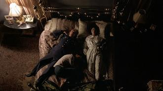
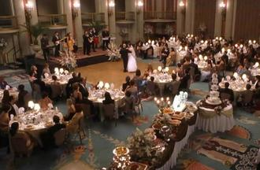

# 眼前迷雾，心底尘埃-----《晨雾家园》影评

佛书有云：“心若无尘，般若自在”，说是真心如果没有尘埃，智慧就会现前，一切自在无碍。然而这般超脱无羁的境界，不是常人能轻易企及的。花花世界，红男绿女，熙熙攘攘，各图所需。身处《尘雾家园》的人们也不例外，他们被心魔纠缠囚禁，在一次次错误的选择后走上了绝路。他们都算是善良的普通人，却在命运轻易的挑唆下反目成仇。造成人与人之间隔膜、怨忿、误解和伤害的从来都不仅是生活本身的艰辛。当心底的尘埃演变成了眼前的迷雾，我们就会对光明的道路视而不见，而朝着黑暗的方向渐行渐远。

现实困境到来时，心灵的困境常常接踵而至。影片的三位主角，Kathy，Behrani和Lester都在这样的双重困境中。先说Behrani。他面临的困境不仅是经济上的拮据，更是自尊与骄傲的难以保全。虽然充富豪是为了让女儿嫁得好，但很明显种种难以负担的形象工程更是为维护上校全家的颜面。上校曾在伊朗的政治斗争中起过作用并因此被驱逐（虽然也可能只是代购飞机而已），必是拥有过相当的财富和地位。作为一个曾经呼风唤雨的权威者，他习惯了发号施令，被人仰视和服从。而今虎落平阳，仰人鼻息的生活令骄傲而倔强的他如芒在背。“伊朗”这个词本原意是高贵，伊朗人很要强，信奉宁为玉碎，不为瓦全（想想内贾德跟美国叫板时那牛样）。可骄傲这种东西，真的很昂贵，当你支付不起时，就会成为巨大的负累。可以想象为什么上校辞工时多此一举的去跟工头通报，必是平时受够了那家伙的高高在上，这个有教养的老人虽没有乘机漫骂发泄，但从他会心的笑容中可以看出他是多么开心能摆脱这份在他看来低贱的工作，摆脱那遮遮掩掩的窘迫与屈辱。骄傲就是上校心底的那粒难以化开的尘埃。因为骄傲，他不能忍受老婆的质问，治安官的挑衅和贱民（在他看来Kathy其实根本不够格同自己说话）的骚扰。虽然大多数情况下他是个明智的谋划者和决策者，但若不是他的骄傲令他盲信自己必能制服Lester，也许他不会鼓励儿子借机反抗。他认为自己是狮子，对手是羊，却没想到对付自己的不仅是Lester，还有最爱作弄人的命运。骄傲的确太昂贵，花掉了至亲的性命。这位慈爱的父亲最终为自己的骄傲付出了太大的代价，所以他用痛苦的死法自我惩罚。当他卑微地向真主祈祷时，当他在自己死前拼命握住妻子的手时，他的骄傲消失了，自我缩小了，爱人在侧，死亡才能给他以自在。

如果说上校心底的尘埃是傲，那么Kathy就是惧。她是个怯懦的人，对于生活中的坎坷她的选择常常是逃避。她用酒精逃避现实，用谎言逃避亲友的疑问，甚至用自杀逃避痛苦。因此当生活里出现了一个可以为她担当的男人时，就算此人已有妻儿，她也顺其自然的做了小三。她全然依赖Lester，误以为自己失去Lester后就买酒，拿枪寻死，吃药寻死。这个平时被动的人在解决自己方面倒是动作快，方法多。她在Lester做出明显错误的决定和违法行为时完全听之任之，对自己的生活和别人的家庭也毫不负责。虽然罪恶常常等于罪行，但不作为有时候也是罪恶。片末Kathy追悔莫及，但这一切终于让她直视了一个之前她一直抗拒的现实----房子不是她的。虽然她失去房子本源于一个错误，但她已经在过于沉重的洗礼之后接受了这个不公平的事实，毕竟她的遭遇同发生在伊朗一家人身上的不公相比，真是太微不足道了。

Lester是个十分自私的人。自私的人常常会损人利己，在极端的情况下还会急功近利，不择手段，为贪图眼前的便宜而错失了长远的幸福。面对妻儿泪水涟涟的哀求，他的决绝令人心寒。Lester对Kathy有真爱吗？未尝没有，但他更爱的是他自己。他在为Kathy讨房子，也在为他自己安排下一站。为了自己的自由畅快，他义无反顾地撇下妻儿，把枪口对准了无辜的人们。只是他急不可耐地要摆脱原先的围城，却没料想跳进了更大的坑。片末锒铛入狱的他在悔恨中拔打了家里的电话，听到了却只是往日幸福的一去不返。

这部电影算是一部合格的悲剧。真正的悲剧不是偶然的悲剧，而是命运的悲剧。在最终导向万劫不复的因果链上每个角色都用符合其性格的必然选择和行动铸就了关键的一环。所以真正的悲剧既无法避免，也不必有大奸大恶之徒兴风做浪，它只需要普通人甚至是好人来推波助澜。每个人只要在人性的脆弱处和命运拐角点差池一步，一幕令人叹惋的悲剧就应运而生了。片中的每个人都有善良和值得同情的一面。他们只是做错了人生的很多选择题。而命运的捉弄和自我的迷失令他们难以保持清醒。从这一点上讲，每个人都有悲剧面，因为世事艰难，人性又本有缺陷。什么时候我们能除尽心底的尘埃，或许便能擦净眼前迷雾，将这个世界看得更通透些，也使人间少些悲剧吧。

（采编：卢静；责编：王冬阳）
