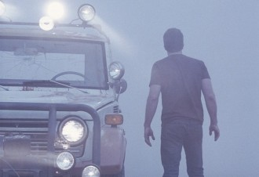
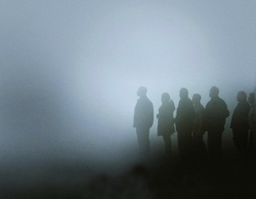

# 知识的背后是信仰-----《迷雾》影评

拉康说人类是“知识偏执狂”,也就是说我们对知识具有一种近乎歇斯底里的执着。从茹毛饮血的猿人到钢铁森林中的高智能生物，从脆弱无力的婴孩到具有抽象思维能力的成人甚至是天才，为了强大到足以对自己的命运达到最大程度的控制，我们的大脑进化出这样一种机制：它不仅有获得、储存和处理知识的功能并且有执行这种功能的要求。所以尽管过高强度的脑力劳动会损伤大脑但完全无须思虑的生活更易招来老年痴呆。而人与人之间，差别并没有那么大，只是我们信仰的东西不同罢了。

《迷雾》中的人物可以分为两类，信仰自己的和信仰别人的。一般状态下，我们都信仰自己，尤其是在美国这样一个强调自我的国家。于是当灭顶之灾从天而降时，人们最初的反应还是想依靠自己的力量一探究竟，所以男主角的黑人邻居带着一群人出去送死了。但当死亡面目狰狞地接踵而至时，人们的自信粉碎了，一部分人开始把希望寄托给别人，听凭别人为自己的生命做主。疯婆子正是抓住了这样的机会建立了自己的邪教组织。正如那个威猛爷爷所说的：“你只要能把人吓到一定程度，让他们干什么都行，他们会投靠任何能给出解决办法的人或东西。”这方面最典型的例子就是那个蓝领工人，一开始他自信满满，在和男主角争辩该不该出去修排气扇时还趾高气扬。被吓得半死之后立刻对男主角唯唯诺诺，不仅因为他错了，还因为他觉得男主角可能是救星。他本来恨不得要暴扁疯婆子，去药店被吓到极致之后却成为她最忠实的走狗。他就这样从听命于自己的意志，到听命于男主角，最终听命于貌似可以救他的疯婆子。而与他相对的，男主角始终信仰的都是自己，虽然挑战应接不暇，死亡阴云难散，但他始终积极主动地在做一些事，不管是在营救别人，商量计划，安抚弱者还是对付疯婆子，他都一直在做，而只要在做事，尤其当有一部分群众支持和信仰他，他就会产生一种模糊的安全感，认为对于命运他并不是毫无控制权，对于灾难他不是毫无还手之力。他的这种安全感给他一种潜在的希望，也给观众一种潜在的希望，于是我们把赌注押在他身上，赌他会是最后胜出的英雄。

可惜的是，他的这种信仰也是偏狭的。如果说信仰他人算软弱，信仰上帝算歇斯底里，那么信仰自己也未必有多么的明智。信仰疯婆子的人，信仰上帝的人，不论是软弱还是歇斯底里，在疯婆子被枪毙时都失去了最后的依靠，他们看着在迷雾中渐渐消失的汽车除了发呆还是发呆。而信仰自己的男主角在粮绝弹未尽时迎来了真正的信仰危机，没有问题让他解决，没有人让他救护，没有怪兽给他打，他一直用来对抗恐惧和绝望的那点点安全感和自以为拥有的控制权消失了，他作为其他四个人的依靠，首先崩溃。但即便这样，他还是很绅士地把子弹让给人家用，从这点小事上也看出控制欲和美国人性格中不可去除的英雄主义色彩。但不巧的是，美国今年来的电影讽刺得正是国民性格中的自我中心主义。自从911之后美国人就开始反思，反思出一大堆打击英雄主义的电影。就是因为美国人一直以自我为中心，爱充英雄，自以为是，招惹事非才被人炸了老窝，他怎么能不怀疑自己有问题呢。这部影片的打击的就是人类的自以为是，你以为人类知识多吧？我给你没见过的看看。你以为你能控制一切吧？我让你连自己都控制不了。你以为你高度文明吧？我让你看看自己有多野蛮。你以为你科技发达吧？我让科学家造个地狱出来！美国人引以为傲的一切都被践踏一番。所以很自然的，男主角成为所有人中最惨的。他的绝望和悔恨超过所有人。这对美国人当下的心情是非常好的写照。

电影最后，最有英雄派头的男主角草菅人命甚至误杀亲子不是偶然的。因为电影的主题不是讲惊悚故事，而是反思，是人类的自嘲：我们其实很无知，而我们不知道的东西能吓得我们丧失人性。表面看起来男主角比其他人都勇敢，冷静和智慧。但其实他跟那些缺陷明显的人并无本质区别。汽油用尽时他开始数子弹，数完不久就杀人了。为什么那么快？就算他们确实只剩下死路一条，为什么不等到饿得支撑不了或是猛兽来袭时再动手呢，那样哪怕还是会死，至少可以多活一会呀？多一会就多一份希望，这不正是他们历经千辛万苦跑出来追求的希望吗？但他还是动手了，别人死于他的信仰危机。

从启蒙运动高举理性大旗那个时代起，不，更早些，从苏格拉底说未经省察的人生是不值得过得那时候起，我们就在思考，思考把我们从动物中划分出来。人类历史和生活中的一切都在鼓励着思考与智慧，我们迫不及待地建立了许许多多宏大结构来梳理和储存巨细无遗的知识细节。当然那是人类的精神财富，与此同时我们很少去赚弃知识垃圾。获得知识从一种生存必备技能变成了一种心灵需要。现代人进化到了这样一种程度，我们习惯了掌握信息、做出计划、预知结果，所以一旦某些事物不在计划中便会有些焦虑，像《迷雾》里这样把人当蚂蚁耍的情况怎么能不令人抓狂？人们因此变得焦躁，盲目，而那个为孩子以死犯险的母亲为什么能逃过此劫？怪兽对中年妇女没有兴趣？或许是因为：信仰别人，信仰上帝，信仰自己都很愚蠢，都是面对恐惧的本能，比动物高级不了多少。只有信仰爱，在爱中消遁了自我的人才是人类中最高级的，才配享受奇迹，才能走出困境。

(**采编：**卢静 **责编：**王冬阳)

