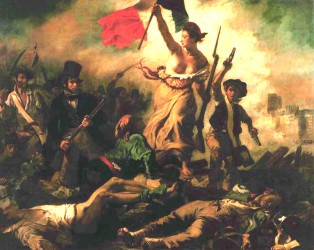

# 第二性的启蒙与男神的黄昏——《致青春》观后

青春的故事永远在一季又一季地重复着。所谓“青春不朽”，究竟是什么不朽；“青春逝去”，又是什么逝去？爱的启蒙、效用主义之袭、偶像的凋敝、精神的超越，在这里依次降临。然而，在两性互相献祭青春后，是否能最终达成和解？

 **两次高潮与两次对话**

电影的第一次高潮是女主角郑微在晚会上主动请缨独唱《红日》，第二次高潮是男女主角在盥洗间的争吵。这两次都是男女主角恋爱前和恋爱中的重大矛盾冲突的表现。

第一次的独唱，是女主角内心激越情感的表达，借助《红日》这首节奏快又让人为之激昂让人鼓舞的歌曲呈现，被导演以美学化、神圣化，本来是一次即兴的表演，本来是给院系领导的一次表演，原本的程式化、预定化的舞台戏剧脚本被郑微所打乱。

如果将这一情节适当寓意化，以舞台比作最大的宇宙世界或比作小一些的人生舞台，以郑微比作女性的执着、内心意志的执着坚守，原程式化的剧本被理解为现实冰凉功利的世界、男权社会，电影想要表达的就是女性的、激越的、有生机的、内心意志的决绝选择不断冲撞着男性的、审慎的、无活力的、功利安排的社会秩序和精神世界。

回顾导演对女主角郑微上台之后表演的背景装饰，一片金色绚烂还有场下无数青春青年的喝彩（反差以老年人、男主角的不高兴）足以看到导演的位置：为郑微热烈地喝彩，为这种激越的情感鼓掌，甚至导演似乎还暗示我们，她知道如此决绝、不计成本的追求是要“坏事”的，于是在郑微完成这次的表演之后第一个镜头便是病倒在床。不过导演对这样的“坏事”有怎样的价值判断、坏的事情的“好与坏”程度多大这个仍然可以进一步商榷。我只能说在这一幕，郑微只是感冒了而已，其他安好，甚至为她获得了更多的支持者。

影片的后来男主角自己陈述“人生是一栋只能建造一次的楼房，我必须让它精确无比”“说实话，我还真没打算在大学期间谈恋爱的，我不是不知道曾毓对我的意思，但我一直转化为友情”跟这里的第一次高潮的情节有所呼应。本来不愿大学谈恋爱的陈孝正被郑微“钓到”，“红旗插到了火星上”，而且成为了陈孝正人生计划中差点导致建筑物坍塌的一厘米误差（究竟是不是坍塌取决于海归后的陈孝正的精神塑成和他自己的价值决断），不管怎样，郑微出于爱情也罢出于消费青春也罢，她的执着改变了世界：她让曾副院长没有能够唱《北国之春》，也让陈孝正没有能够坚守大学不谈恋爱，让陈孝正承认“你对我来说是一个异数”。在这样的安排当中，我读出来的潜台词是女人而不是男人拥有激越冲撞世界的信念和能量，男人软弱、无担当、教条化、循规蹈矩，男人是被驯化的，而女人似乎未必。至少影片中郑微一直到工作也没有被驯化，所以她在见到林静后还能说“我还是会去不断地去爱”。

回到最初的主题，第一次的高潮其实也是第一次的对话，只是第一次的对话当中男主角陈孝正一直是退缩的、躲避的，甚至可以说被塑造为胆小的、畏惧的，郑微在舞台上大胆示爱、激情演出之时而陈孝正在台下则手足无措，甚至是慌忙逃离。

第二次的高潮则是因为男主角隐藏出国的消息而被女主角在盥洗室被质问，这一次的冲突更加激烈，这一次的冲突从根本上道出了恋爱二人的根本信念的分歧，郑微在痛苦当中责问陈孝正，二人此时此地对人生道路的决断出现了分歧，这样的分歧也成为本片少数几个本该可以继续深挖的主题。陈孝正说人首先要爱自己，他不愿让他爱的女孩子忍受贫贱，不愿意让他爱的女人吃苦，所以他选择了出国，而郑微则质问陈孝正为何不早一点告诉她，质问自己是否在他人生的蓝图当中，甚至质问陈孝正对自己有没有起码的信任。

陈孝正在这里的不敢担当，把事情搞到很糟，恐怕不一定是他赖以决断的价值体系的问题，至少不是他价值体系的前后连贯的问题。作为一个建筑土木专业的学生，作为一个贫寒出身父亲早亡的男生，应该没有严肃认真地思考过伦理学原则，不过他的生活体验、他一路的悲伤疼痛和心有不甘，必然地让他投向了效用主义，在这一点上他无可指责，甚至他本来可以更加高大，一切取决于他对效用主义的合理化适用。在独自忍耐与共同忍耐之间，他选择独自忍耐，虽被郑微视作过度自私，但何尝不是一种伪装的决绝。为何他一直将自己的人生看管地如此严格，除了其一路的悲伤疼痛增加了其爆发欲望、成功欲求外，还在在他的效用体系里面为了独自一人必须要付出两个人的努力的认识，他的决断是以两倍的努力成就两人的功业以此抵御本该两个人承受的痛苦，青年的他或许也不知道、不明确个人的努力对“共同福祉”的价值何在，但可以肯定的是出国归来的他必然已经顿悟。曾经的努力曾经的独自忍耐并没有错，因为正是他的努力和忍耐能够真正造福他所爱的人，正是这样一种自我反省与救赎的意识，将他带到曾经鄙夷的故友张开的前面，一事无成的张开成为他“微观天下”公司的合伙人。别人或许有不同的解读，然而在这里我看到的是一种谦卑的担当，这样的担当与第二次跟郑微对话当中表现出来的不敢担当感情同出一个源流，那便是内心深处他愿意独自承受痛苦的悲怆。力量最为微弱时的愿独自承担，所以他选择了回绝一份爱；强大后归来后的独自承担，所以他选择与朋友共享幸福。

如果说第一次对话当中陈孝正是退缩的、慌张的，那么第二次的对话陈孝正则是被动的、痛苦的，陈孝正心里很清楚一定会有第二次的对话，而且他也确实没有任何灵活应变的能力让郑微不伤心。

**女人是否需要男人？**

郑微“从认识的那一天起，我总是怕你突然就不见了”，所以她要求陈孝正不要突然失踪，“我怕我没有足够的勇气一直等你，更怕我们走着走着就再也找不到彼此了”。然而陈孝正的回答是“每个人明明都是独立的个体，一个人怎么能那么依恋另一个人呢？”郑微微笑之后，说了我作为一个男生极难想通的话“如果把你换成我，只要一天你就会懂的”，如果依照逻辑，一个人要明白这样依恋的原因何在呢？如果依照体验，一个人要明白这样的依赖（也可能是担心） 的体验又是什么呢？这个需要回答。

女人是否需要男人，这样老套而又不得不回答的现实问题在影片当中也有多幕涉及，虽然从整个情节安排方面，缺乏连贯性，似乎是一系列难以让人接受的偶然事件所爆发，赵世永与谭晓晶第一次上床居然导致了谭的怀孕，也因为谭的怀孕集中刻画了赵世永如此窝囊地跪在阮莞面前祈求原谅和寻求解决方案，阮莞的那句台词“你有点出息行么”更像是导演狠狠地抽男人的一个耳光，而不单单是赵世永。这一幕中，女人是否需要男人的问题被导演完全颠倒过来——不是女人是否需要男人，而是男人是否需要女人。正如赵世永的脆弱（好听一些可称作“善良”，出自谭小晶口）做错事不得不在精神上求助女朋友阮莞的宽恕，不得不让阮莞替他拿主意、做决断，甚至连谭小晶堕胎手术的钱都是要让阮莞出——很难想象，没有阮莞的赵世永是否能够熬过这一关，因此在这里找到的是颠倒的问题与颠倒的答案。

而在另一处堕胎候场的场面，阮莞从陪伴者变成了接受手术者，陪伴者变成了郑微，但两次手术前的候场同样是两个女人，而且同样达成了宽恕、和解乃至是女人之间的友谊——针对男人的共同阵线。在第一次阮莞与谭小晶的对话中，谭小晶钦佩阮莞的冷静愿打愿罚，而阮莞的一句“你何尝不是受伤害者”便结束了她们之间一切的敌意，而将一切的敌意化为对赵世永的失望。第二次阮莞与郑微的对话更少，在阮莞进手术室之前，郑微意味深长地说了一句“阮莞，你有我呢”，然后阮莞定神了大概三秒钟，作为一种回应，于是再次在这里看到了女人之间的友谊，这样友谊的达成是以对赵世永的道德贬黜而凸显，某种程度上这一幕是彰显女人之间的理解、包容、担当要高于男人对女人。

**男人作为女人青春的祭品？**

在传统印象中，基本是“女人青春作为男人的人生补充”，而在《致青春》当中却表现出极具女权主义的一面，导演再次进行了逆转，话题转换为“男人作为女人青春的祭品”的表达。

作为女主角的郑微她活在自己的赞颂当中，她需要一个具体完成她青春的男人，这个男人完成她对青春、爱情、神圣的赞颂之后，她甚至都没有赞颂两个人的爱情，只说这个男人教会了她怎么爱别人。所以，在结尾我不认为他们能和好，甚至不认为郑微会日后从一而终——她的生命很可能需要多个男人做“祭品”，林静、陈孝正已经是青春的祭品，林静是给了她爱的梦想，而陈孝正是给了她爱的启蒙的那个人，郑微对陈孝正的评价仅仅是“因为他才学会怎么去对一个人好”，落脚点仍然是她自己、她的爱情朝圣，只字未提他们共有的东西、共有的爱情甜蜜。她或许还需要其他的祭品，祭奠她的人生、她自己的价值，而不是两个人的价值。

郑微回应黎维娟的“吃亏说”，“谁也没拿枪指着我……谁也没逼良为娼，这事儿就图个你情我愿，我愿意傻，他愿意走，谁也不欠谁”，而在后来与回国后的陈孝正促膝而谈追忆这段感情的时候，她有说到，“我们一起度过了青春，谁也不亏欠谁的。青春就是用来怀念的……”最后，郑微说了一段我很难理解的一段话，她甩开林静的时候认真地说到，“林静，施洁是一个值得你爱的女人，她可以为爱以死相拼，片甲不留，我们应该惭愧。我们都爱自己，胜过爱爱情。现在我知道，其实爱一个人应该像爱祖国、山川、河流”，如果我没有猜错，这段话简直成为一段几乎埋葬林静的咒语，林静这个被摆放到信仰祭台上的猎物最后就因为郑微的这一段咒语而被“献祭”，死去的是人之灵性的情爱，代之以与如爱祖国、山川、河流一般的亲和。不管怎样理解，郑微对陈孝正一直是积极的、主动的，她也从来没有认为陈孝正亏欠于他，而郑微对林静复杂的感情也最终成就了一次她精神的再次超越，摆脱掉林静的郑微，似乎刹那间从灰袍法师长成为白袍法师，她的内心充满能量足以完全地掌控人生和掌控男人。白袍法师依然拥有爱的能力，爱就是她手里面的魔法能量，郑微正是以她的魔法守护着自己的信仰之神，在过去的神是青春，而青春逝去之后我想也有新的神出现，在那个位置上是一定要有个偶像的。

**是否存在和解与达成？**

故事的后半段给人的感觉是支离破碎乃至磕磕绊绊，剧情的结局也让人倍感无语，至少我作为一个男性观众极难接受电影的结局。从各种的比较判断看，《致青春》的思想立意和探讨的话题与深度均不算上等，不过不管立意高低、不管话题还是需要认真探讨下剧作和导演试图揭示的人物与思想方面的矛盾是否达成了和解，因为最后的故事结尾实在没有看出明确的判断。

在最根本的原则与信念上，始终没有看到两个人的和解和妥协，两个人如果没有互相的协调乃至退让，是无法拥有一个在一块的完美结局的。

在我看来，郑微无法理解陈孝正在与匮乏作战，与必然性作战，而年少的陈孝正也没有理解郑微也在与时间作战，与必然性作战。男人与女人的和解、宽谅需要互相看到对方的敌人，也必须谨慎克服这样一种趋向，这种趋向会将个人的敌人泛化为对方：女人将容颜不在、青春逝去的帐记给男人，而男人也因此被带上了罪恶的枷锁；而男人对必然性的屈服，权势较量中的挫败又会迁怒于女人，甚至有所谓“红颜祸水”，会沉溺于声色，满足肉欲、丧失爱的能力。

（荐稿：李卓然；采编：莫桂兰；责编：佛冉）
