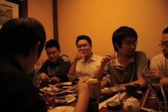
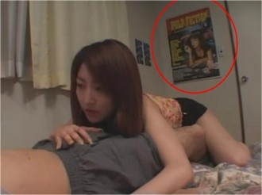
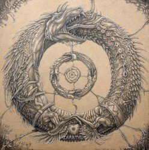

# 聊天话题的演变及电影中的叙事方法

今天晚饭过后，与几个哥们儿相谈甚欢，不觉已经过去三个小时，而谈论的话题落到了“小孩普遍比较操蛋”上。正当谈话将要结束之际，A突然发问：“咱们是怎么扯到这上来的？”三人经过一番回忆，发现话题竟然始于“今天食堂门口招兵”。其演变过程如下：今天第二食堂门口在招兵→咱也当兵去算了→你他妈以为就咱能当兵？特种兵得吃连猪都吃不下去的东西→讨论吃树皮和吃草→说到草，想起机器猫有一种手电状的机器，物体被照过之后就变成了原料，比如经照射后酒就变成了粮食→我小时候巨爱看漫画，家里有一套机器猫→谈到书→西单图书大厦很爽，不买直接看→最近想读读莫言的小说→诺贝尔文学奖→丘吉尔不仅政治牛逼，还获过文学诺奖→丘吉尔口才厉害，周恩来跟他会不会有一拼？→从周恩来谈到毛泽东→长达一个小时的个人崇拜问题、民主与集权问题、优胜劣汰问题、人类社会规则问题、达尔文理论的缺陷问题等→人性本善本恶的另一种解释→认为人本恶理论的一个理由是人小时候做的操蛋事往往比成人多，而后之所以变得善良是因为受到了教育和人类自己制造的很多规则的缘故。如此，话题从食堂门口招兵演变到了小孩普遍操蛋，中间话题转化自然而流畅，要不是之后重新捋顺一遍，无人感觉聊天话题的首尾竟然如此风马牛不相及。

这让我想起电影中的叙事方式来。

很多早期的电影和戏剧习惯把故事中部或者结尾的一部分截取下来放到开头，这么做的初衷是让电影创作者保持好故事发展的逻辑性，同时提醒观众故事是怎样有条理地一步步发展的。之后很多片子利用这一点来设置悬念，也已经是惯例。比较典型的有库布里克的《洛丽塔》（1962），开头与结尾基本一致。还有更多的是把临近结尾的部分搬到开头，但并不把泄露结局，仍放置在片子的最后再揭示。比如艾伦·帕克的《大卫戈尔的一生》（2003），影片开头是温丝莱特扮演的记者在公路上拼命地跑着，镜头一转，是与之毫无关系的室内；诺兰的《盗梦空间》（2010），片头是莱昂纳多躺在海滩里，之后去会见在深层梦境中已经垂暮的渡边谦，当然第一次看片子的时候没人知道是怎么回事，当故事发展到那一幕时才不禁拍案叫绝。除了这两种之外，还有将故事的中间部分搬到开头的，如马丁·斯科塞斯的《好家伙》（1990）……目的大同小异——这样的叙事方式会吸引观众产生好奇心看下去。

以上影片虽然把结尾放到开头来演，但本质上还是顺序地讲故事，叙事方式没有发生根本性的革新。

电影叙事方式的一个开创性革新是昆汀·塔伦蒂诺的《低俗小说》（1994）。影片分为三个独立故事和片头片尾五个部分，每个故事之间相对独立却又环环相扣，整体呈环状结构，开头与结尾紧密相连，无论从哪个故事开始看起影片都是一个完整的整体，这就是环形非线性叙事的魅力。《低俗小说》这种电影是反传统的，它不再是开头发展高潮结局这样一个紧凑的套路，而是形式大于内容，在保证每个独立故事可以讲得好的前提下，必须为整体结构服务，必要时要使单元故事的情节性作出牺牲。《低俗小说》之所以能在影史上留下重要的一笔，很重要的一个原因就是它这种开创性的叙事方式直接创造了一个新的类型片，典型作品就是由此转变而来的盖里奇的《两杆大烟枪》（1998）和《偷拐抢骗》（2000），还有宁浩的《疯狂的石头》（2006）和《疯狂的赛车》（2009）。盖里奇的两部电影和宁浩的疯狂系列是环形叙事的升级版。宁浩的毕业作品《星期三星期四》（2001）中，也采用了此种手法，叙述了三个独立的故事。三个故事用了完全不同的演员，在情节上没有任何关联性，但在故事的结尾宁浩用了不到两分钟的镜头把三个故事串了起来，观众们在苦苦思考三段故事到底有何关系之时得到答案的那种惊喜不言而喻。对《低俗小说》叙事方式模仿的影片有姜文的《太阳照常升起》（2007）和杜琪峰的《夺命金》（2012）。

在《低俗小说》之后，章节化叙事成了昆汀电影的标志。章节化叙事是将众多的故事线索分成几部分分别叙述，最后完成故事整体。典型作品《杀死比尔》（2003）、《杀死比尔2》（2004）、《无耻混蛋》（2009），这种叙事方式中章与章之间打破了时间顺序，并不按照时间先后来讲故事，而是从影片整体的逻辑结构和悬念设置出发。模仿作品有程耳的《边境风云》（2012），这种电影往往以出色的剧本和剪辑来震撼观众。

再一种叙事方式是倒叙。把一个故事分成若干段，段与段之间是倒叙，但每一段的故事是顺序。与前面不同的是这种电影就是一个故事，线索也只有一个线索，同样有开端、发展、高潮、结局。举个例子，比如说电影播放的顺序是片段1→片段2→片段3，但实际的故事发展顺序是321，而在每一个片段里故事又是顺着讲的，这样片段1的第一个镜头就是片段2的最后一个镜头，片段2的第一个镜头就是片段3的最后一个镜头。这种手法在电影中的运用最典型的是克里斯托弗·诺兰的《记忆碎片》（2000）。《记忆碎片》讲述一个没有短期记忆的患者，所以每一个片段的长度就是主人公的记忆维持时间，以此来设置悬念非常得体，其余的故事要盲目模仿这种叙事的话很可能适得其反。最近，我又看到一部10分钟的动画短片运用了与《记忆碎片》完全相同的叙事模式，而且出品时间还要早，是皮特·克朗的《中转》（T.R.A.N.S.I.T.）（1997），非常精彩，向大家推荐。

现在回到故事的开头，从食堂门口招兵到小孩普遍操蛋的话题。我觉得这种题目非常适合考核编剧编故事的功底，把一头一尾的片段拿给他，中间用一个合理的故事连起来。讲故事的能力是电影的基础，叙事方式的革新是推动电影历史向前发展的重要因素。叙事方式的多样化使得电影魅力大增，新的叙事方式会产生新的类型片，而新的类型片的出现，代表的则是商业上和艺术上的双重价值。

(荐稿：松子；采编：莫桂兰；责编：吴春凉)
