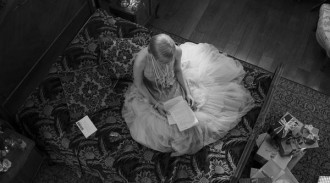
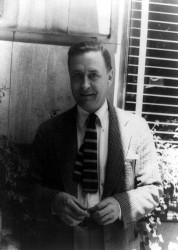
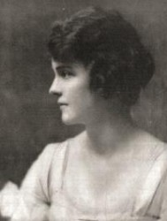
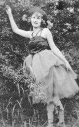
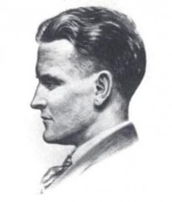
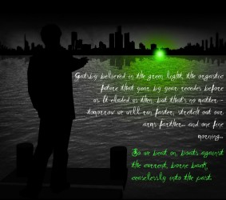

# 菲茨杰拉德——同盖茨比殉梦的人

“你觉得你是哪个婊子？”[i]41岁的弗朗西斯-斯科特-菲茨杰拉德醉醺醺的，对他身旁39岁的杰内瓦-金说。

那是1937年。前一年，菲茨杰拉德刚把妻子泽尔达送进北卡的高地医院。十二年前他已经出版了著名的《了不起的盖茨比》，此时在好莱坞燃烧自己，每周挣一千美金，有了双下巴，而且想法子戒他永远没戒成的酒，离他死还有三年。他对杰内瓦吐出这句话，只因为杰内瓦问了他一句：

“你小说里的女主角，哪个是按我塑造的？”

他有多恨她，才会这样，在会面之初就大量饮酒、口吐粗话，让杰内瓦后来说“我为菲茨杰拉德的堕落而难过”？天晓得。然而关于这次会见，菲茨杰拉德给自己女儿斯科蒂的信里这么写：

“她是我第一个爱过的女孩儿，我如此坚定的避免见到她——直到这一刻——就是为了保持那幅完美画面。”

在《了不起的盖茨比》第五章，盖茨比重新见到黛西，紧张，狼狈，做作，还撞到了钟，只会说些“我们以前见过”一类的套话。他只来得及说出“到十一月整整五年没见了”，展示他的爱情。2013版电影里，从头到尾闲雅自在的莱昂纳多，只在那一个场面，表现得狼狈不堪：满头满脚往下滴水。

“There must have been moments even that afternoon when Daisy tumbled short of his dreams--not through her own fault but because of the colossal vitality of his illusion. It had gone beyond her, beyond everything. He had thrown himself into it with a creative passion, adding to it all the time, decking it out with every bright feather that drifted his way. No amount of fire or freshness can challenge what a man will store up in his ghostly heart.”

（译文：甚至在那天下午，也一定有过若干时刻，黛西远不如他的梦想——并非她的过错，而是由于他的幻梦有巨大的活力。他的幻梦超越了她，超越了一切。他以一种创造性的狂热，将自己投入这个幻梦之中，不断添枝加叶，用一路飘来的每根绚丽羽毛加以缀饰。再多的激情或活力都赶不上一个人在情思萦绕的内心所累计的感受。）

“Ghostly”这个词传神但难以翻译。这是一种幽魂缭绕、经久不散的情思。2013版电影主题歌《Young and beautiful》得到过类似的评价：“好像有个人不断在你耳边下咒”。这种感情永久缭绕，恍若幽灵。你可以说：这一切，都是因为盖茨比，就像菲茨杰拉德保护杰内瓦的印象似的，把黛西的完美画面，保持得太好了。

1896年，菲茨杰拉德生在美国中西部明尼苏达，一个中产阶级偏富裕的天主教家庭。12岁之前，他在布法罗度过；13岁，他爹的家具生意毁了，而他第一次发表了作品——在校报上。17岁，他想法子进了普林斯顿大学读书，梦想当个小说家。19岁上，他遇到了小他两岁多的杰内瓦·金。

1915年2月，杰内瓦·金在日记里写：“斯科特是完美的情人。”下一个月，“我疯狂地爱上了他。”

他们通信，一直到1916年秋天。菲茨杰拉德去拜访了杰内瓦，然后，作为一个破产家具商的儿子，他挨了杰内瓦老爸——一个股票经纪人、建筑大亨的儿子——这么句话：

“穷人家男孩子，从来就不该动念头娶富家女孩子。”

他们分手了。菲茨杰拉德要求杰内瓦毁掉所有的信，杰内瓦照办了。而杰内瓦的信，被菲茨杰拉德锁好，藏起。那些信里的词句很端庄，一如杰内瓦的女儿后来所说：

“她没真正爱过菲茨杰拉德，她喜欢他，说他很聪明，很诙谐机智。”

但在日记里，杰内瓦要奔放得多。她说她爱菲茨杰拉德。她1916年写了篇小说，描述一个女人出嫁后思念意中人的故事：意中人叫做斯科特。很多年后，菲茨杰拉德结婚时，杰内瓦给他写信，祝他成功，还邀他来探访一下——当然他没能成行。但这些，菲茨杰拉德似乎并不知道。

他失恋了。他去参了军，准备参加一战。他怕死在战场上，再也没机会抖擞他的才情，于是在参军前，写了他第一部小说，《浪漫的自我主义者》。当然被拒绝出版了。那是1917年的事。1918年菲茨杰拉德遇到小他四岁的泽尔达，后来他回忆他爱上她的时间，“9月7日”。 泽尔达是典型的美国南方姑娘，生在1900年。16岁时就是学校的舞会皇后，万千宠爱于一身。她高中毕业照上题了段话，极见性情，甚至预示她之后的命运：

“Why should all life be work, when we all can borrow.Let’s think only of today, and not worry about tomorrow.”

“当我们能借到一切，为何要工作终日。让我们只想今日，不要为明日担忧。”

他们的感情（就像盖茨比和黛西似的）被战争打断，1918年10月菲茨杰拉德要被派去法国，先被送到纽约长岛。在那里，他听说德国人投降了，战争结束了。1919年情人节，菲茨杰拉德退伍，到了纽约。他搬到曼哈顿西侧一个单身公寓里，以便看得见泽尔达的家；他一边向泽尔达求婚，一边为家广告公司打工。泽尔达答应了他的求婚——当然，她还信口答应过许多人的求婚。然后，泽尔达做了件她自己常做，但对菲茨杰拉德来说影响深远的事：她悔婚了。菲茨杰拉德在天堂门口，被打进地狱。

菲茨杰拉德从天堂般的纽约回到中西部的明尼苏达，穷困到必须去洗汽车。那年他22岁，在如此的绝望之中，他翻出了《浪漫的自我主义者》，开始扩写。1919年9月，他完成了《天堂的这一边》——这部小说描述了一个中西部青年，如何热爱一个姑娘（以杰内瓦为原型）被弃；如何参军；如何又爱上一个纽约富家千金（泽尔达），但因为穷困，只能坐看该千金嫁了旁人。小说结尾是一段自嘲：“我了解我自己，但也就如此了。”11月，小说尚在制作时，菲茨杰拉德恳求编辑：“能不能加速出版？我的命运寄托在这本书的成功上——当然包括一个女孩子！”

1920年春天，小说出版，立刻畅销，首印三千册三天内卖完，一年内销售十二版近五万册。泽尔达回心转意，嫁了菲茨杰拉德，组成了金童玉女：那是1920年4月3日。又三年后，夫妻俩去了巴黎。

关于他们在巴黎的生活，海明威在《流动的圣节》里提到两个可怕的细节：

其一，菲茨杰拉德每次企图写作时，泽尔达就拉起他到处灯红酒绿、连夜痛饮，不让他得丝毫安生；

其二，泽尔达欺骗了菲茨杰拉德，让他相信自己性功能有碍，换别的女人，根本不要他。菲茨杰拉德信以为真。海明威最后总结：泽尔达有疯狂的独占欲，“兀鹰不愿分食”。

当然，海明威的言论，可能出于他对泽尔达的厌恶。实际上，泽尔达背地里也嫌他长胸毛，嫌他冒充男子汉，还认为菲茨杰拉德和海明威是同性恋伴侣——为了澄清这事，菲茨杰拉德甚至打算去找个妓女睡一晚，验证“我是纯爷们儿”。

1925年《了不起的盖茨比》出版，一举奠定菲茨杰拉德的伟大地位。海明威说他初见菲茨杰拉德时印象不好，但读完《了不起的盖茨比》后，他觉得“能写出这样小说的人就是个了不起的家伙”——考虑到海明威的刁钻口味和傲慢个性，这评价华丽透了。但菲茨杰拉德写作《了不起的盖茨比》时，泽尔达除了“兀鹰不愿分食”地搅扰他，还自顾自跑去海滩游泳、舞会欢闹。最后她认识了一个飞行员，跑回来跟菲少爷要求离婚——奇妙的是，那男人还蒙在鼓里，全然不知道泽尔达会为了他闹离婚。

就在泽尔达跟菲少爷闹离婚这事平息后不久，《了不起的盖茨比》出版了。菲少爷原本想的题目是：《长岛的特立马乔》、《特立马乔或盖茨比》、《金帽盖茨比》、《高跳爱人》。最后，泽尔达一锤定音，决定了《了不起的盖茨比》这个书名。

很多年后，杰内瓦问：

“你小说里的女主角，哪个是按我塑造的？”

许多学者相信：杰内瓦就是黛西。她是菲茨杰拉德（盖茨比）的初恋；她是菲茨杰拉德（盖茨比）攀折不到的那朵玫瑰；她嫁了人，给了菲茨杰拉德（盖茨比）第一个挫折……但是，这里有一个问题：杰内瓦——除了嫁了人，新郎不是菲茨杰拉德——和黛西，有多少相似之处呢？

其他小说：

在《最后一个南方女郎》里，菲茨杰拉德写了男主角在军营里所见的一个南方姑娘。美丽，善变，始终没接受男主角的求婚。女主角小男主角四岁——这是菲茨杰拉德和泽尔达的年龄差距。菲茨杰拉德大杰内瓦二岁。

在《一颗里兹饭店那么大的钻石》里，男主角见到了一颗山那样庞大的钻石，以及一个神秘富豪家族，而且与那里的美女结缘。但灾难随后到来，钻石被毁，逃生出来的男主角忽然间失去了璀璨夺目的故事，两手空空。

在《松包蛋》里，依然是流金溢彩的南方。在一个欢闹的夜晚，男主角仰慕的女主角赌输了，“松包蛋”男主角手气好，帮她赢回了钱，她拥吻了男主角，向他示爱；可是第二天，他就听说，女主角完婚了。“3点的街头很热，4点就更热了。4月的尘埃网住太阳，又将它释放出来，简直就是一个下午永远在开的玩笑。”

在《伯尼斯剪头发》里，菲茨杰拉德描写伯尼斯这姑娘如何试图打入社交圈，如何被骗剪了头发，如何以牙还牙。

在《头和肩》里，男主角是个书生，女主角是个活力四射的演员。这两位走进彼此的生活，彼此交织，最后男主角变成了个运动专家，而女主角成了个出色的写手。

在《冬天的梦》里，一个中产阶级男生陪富豪们打高尔夫，遇到从前旧识的美女一位。男生后来和一位邻家女孩儿订了婚，此时美女再现，让男生放弃了自己的婚约，然后再甩掉。男生去参加了一战，七年之后，成了纽约呼风唤雨的商人。他听说当年那位美女成了家庭妇女，美貌褪色。于是男生意识到“我的梦想已经远去，我再也无法回归”。

《夜色温柔》[ii]的内容过于有名，不赘述。

在这些小说里，女主角有一个共性：她们美丽，如梦似幻，高不可攀，同时任性，近乎残忍的地步。男主角们永远带着中西部男孩们的腼腆，只能任由璀璨明亮的女主角带给他们全新的世界，然后被无常的命运折磨。他们总是很接近幸福，然后不知不觉间，又被当作玩物放弃了。

众所周知，《了不起的盖茨比》写了一个痴情，或者说，痴于梦想的盖茨比，为了满足那个美丽但骄纵的女主角黛西，在长岛造起了唯有梦境可以想像的不朽舞台，但最后还是悲剧结尾。在那著名的海滩独白上，菲茨杰拉德感受到命运如灯，会不断勾引人去追逐，却日益远去。你可以读出，对他笔下的盖茨比，以及那个逐渐流失的黄金时代，充满了叹惋之感。

《了不起的盖茨比》开头，有这么段著名的题词：

Then wear the gold hat, if that will move her; 那就戴顶金帽子，如果能打动她的心；

If you can bounce high, bounce for her too, 如果你能跳得高，就为她也跳一遭，

Till she cry: 直到她喊：

"Lover, gold-hatted, high-bouncing lover, “郎君，戴金帽跳得高的郎君

I must have you!" 我一定得拥有你！”

[ii]小说最后的著名独白：

“And as I sat there brooding on the old, unknown world, I thought of Gatsby’s wonder when he first picked out the green light at the end of Daisy’s dock. He had come a long way to this blue lawn and his dream must have seemed so close that he could hardly fail to grasp it. He did not know that it was already behind him, somewhere back in that vast obscurity beyond the city, where the dark fields of the republic rolled on under the night. Gatsby believed in the green light, the orgastic future that year by year recedes before us. It eluded us then, but that’’s no matter--tomorrow we will run faster, stretch out our arms farther.... And one fine morning---- So we beat on, boats against the current, borne back ceaselessly into the past.”

（译文：当我坐在那里缅怀那个古老的、未知的世界时，我想到了盖茨比第一次认出了黛西家码头尽处那盏绿灯时的惊奇。他远道而来，来至这片蓝色的草坪上，他的梦一定像是近在指端，不可能会失手。他不知道那个梦已经丢在他背后了，丢在这个城市那边那一片无垠的混沌之中、合众国的黑黝黝的田野在夜色中向前伸展的某个所在了。 盖茨比信奉这盏绿灯，这个一年年在我们眼前渐渐远去的、纸醉金迷的未来。它从前滑脱了我们的追求，不过没关系——明天我们会跑得更快些，把胳臂伸得更远些……总有一个晴朗的早晨……

于是我们奋力向前划，逆流向上的小舟，不停地倒退，进入过去。）

回到盖茨比与黛西重逢的那段：

“甚至在那天下午，也一定有过若干时刻，黛西远不如他的梦想——并非她的过错，而是由于他的幻梦有巨大的活力。他的幻梦超越了她，超越了一切。他以一种创造性的狂热，将自己投入这个幻梦之中，不断添枝加叶，用一路飘来的每根绚丽羽毛加以缀饰。再多的激情或活力都赶不上一个人在情思萦绕的内心所累计的感受。”

当盖茨比没遇见黛西时，她不是一个人。她不是杰内瓦，也不是泽尔达，而是两个曾经拒绝菲茨杰拉德、使他跌入地狱的女人合体而成的幻梦。她是菲茨杰拉德这个盖茨比，以一种创造性的狂热，将自己投入这个幻梦之中，不断添枝加叶，用一路飘来的每根绚丽羽毛，缀饰起来的一个梦。她是财富，是美丽，是爱情，是那盏绿灯，那“一年年在我们眼前渐渐远去的纸醉金迷的未来”，以及美国梦本身——“只要你努力，只要你像盖茨比那样不懈追求，最后你总会得到这一切”。比真正得到手更明确的，是一个稳定的台阶，是一个“只要我们这么做，一定会成功”的公式。

而当盖茨比与黛西相遇之后，那个用粗心大意损毁一切的黛西，更像是泽尔达。杰内瓦更多代表了“穷男孩别打富家千金的主意”这个残忍事实，而泽尔达给了菲茨杰拉德更多：狂喜、哀伤、天堂到地狱的落差。杰内瓦代表着一个无瑕的梦想，泽尔达则带给菲茨杰拉德一种更残忍的东西：她会悔婚，她会玩弄一个人的悲喜。

《了不起的盖茨比》里这么说：

“They were careless people, Tom and Daisy--they smashed up things and creatures and then retreated back into their money or their vast carelessness or whatever it was that kept them together, and let other people clean up the mess they had made

（译文：他们是粗率冷漠的人，汤姆和黛西——他们毁坏事物，然后缩回他们的钱，或者他们的麻木不仁，或者其他什么使他们在一起的东西里头，让其他人帮他们收拾残局。”

杰内瓦不是黛西的最后一个证据：在1937年见面之前，菲茨杰拉德始终保有杰内瓦的无瑕形象。他始终不见她，就是为了“保持那幅完美画面”，而不是“粗率冷漠的人”。1937年那次会面，令他们彼此失望，但那其实不是意外。那时他们都老了，也变了。他们像盖茨比和黛西，还以为彼此是绿灯，但其实，“他不知道那个梦已经丢在他背后了”。

当然不是说，菲茨杰拉德很天真的保留着美好的最初印象。实际上，在写作《了不起的盖茨比》时，菲茨杰拉德已经不那么天真而痴心了。他内心深处，明白自己终将被损毁，这部小说简直完美预言了他的未来。实际上，甚至盖茨比自己在死之前，可能也已经明白，他所向往的，只是一场幻觉，但他还是得继续等下去：

“I have an idea that Gatsby himself didn't believe it would come and perhaps he no longer cared. If that was true he must have felt that he had lost the old warm world, paid a high price for living too long with a single dream. ”

（译文：我有个想法：盖茨比自己并不相信会有电话来的，而且他也许已经无所谓了。因为倘若如此，他一定会觉得，他已经失去了那个温暖的旧世界，他为了生活在一个梦中太久而付出了太多代价。） “你觉得你是哪个婊子？”

杰内瓦是菲茨杰拉德的所有女性形象，又全都不是。她只负责担当最初的梦，泽尔达才会使梦境且美丽且狰狞。盖茨比了解一个梦境的虚幻（杰内瓦），了解诱惑与伤害并存（泽尔达），却依然以无限热情，将自己殒身不恤的投进去，终于殉梦而死。菲茨杰拉德写了这样一个人，然后加上“了不起”的形容词，再将之杀死，顺便亲手毁掉了那个黛西的形象。但要到小说写完整整十二年后，他还保留着心目中的杰内瓦，“她是我第一个爱过的女孩儿，我如此坚定的避免见到她——直到这一刻——就是为了保持那幅完美画面。”他就是盖茨比：已经知晓了一切，但依然将自己投在其中，无法自拔。

有许多初恋拥护者认为，杰内瓦是菲茨杰拉德的初恋，也的确嫁了人，被认为最接近黛西，但因为小说/电影里黛西无法忽略的任性和careless，我还是倾向泽尔达更接近黛西——一个被仰慕的得不到的初恋，一个到手后会毁人的妻子。

杰内瓦是最初的梦，是那个令盖茨比念念不忘、再未谋面、始终完美的黛西；而泽尔达则是那个让梦璀璨夺目，然后把一切——连梦想带盖茨比自己——损毁的黛西。 最初，这个姑娘只是爱情的象征。然后，随着时光的流逝，这段爱情开始意味着一切：初恋、梦想、成功、人生的目标、纸醉金迷的未来、一切高不可攀的东西。之所以这段爱情和这个梦想的破灭，可以在一整个世纪里让一整个世界的人喟叹，是因为这小说构造了人类最古老、最天真、最直接又最纯粹的梦想：被无限热情的拥抱、放大、膨胀到不真实，最后眼看他起高楼，眼看他宴宾客，眼看他楼塌了的一路幻灭过程，以及背后那个男主角（也就是作者自己）：那个可能早已洞悉这一切秘密，了解梦境的美丽与空虚，但依然以身殉梦的人。

（采编：李卓；责编：吴春凉）

[i] 原话是Which bitch do you think you are，你也可以理解为，“你他妈以为自己是谁？” 

[ii]《夜色温柔》描写的是一个出身寒微但才华出众的青年迪克对富有梦幻色彩的富家女尼科儿的追求以及最终如何遭到失败、变得颓废消沉的故事。（编者加）
