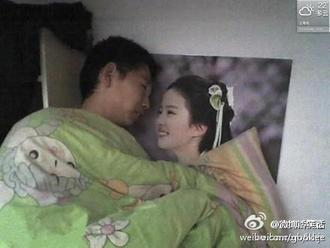

# 读者已死——解读《登堂入室》的野心

《登堂入室》很显然是关于一种凝视如何成为被凝视对象，他者如何被隐喻性指涉的故事。然而这样的结论却不可避免地陷入有关意义的悖论：《登堂入室》是关于“三个故事”的电影——克劳德笔下的故事；电影情节的故事；观影者的故事。

理解三个故事之间的内在动力，要求我们认真处理格雷马斯关于“目的语和元语言”的关系命题——对意义的研究，就被研究的表意集而言，总是处于一个元语言层面；而把任何一种元语言作为目的语来研究，就意味着必须设定一个新的元-元语言的层面。因此在这部电影中，究竟是哪个故事的主人公被凝视，又是哪个主体被指涉？

如果单独抽离出克劳德笔下的故事，那么我们很可能会将它视作为是俗套的、关于认同的故事。主人公克劳德母亲出走，父亲因工作残疾，失业在家。在这种破碎的家庭结构中长大的克劳德窥视着同学拉斐尔幸福的、典型的中产阶级家庭，心里想着“他们家会有多融洽？”他急切地希望占据拉斐尔的位置，找回家的归属感，重新拾得父爱和母爱等等等等。

然而这一解释忽视了原有故事中富有深意的细节，把家庭结构中三方关系的复杂性给简单化了。在克劳德的故事中，不仅有对拉斐尔的认同，同时也有对其母亲——埃丝特的对象选择过程。在认同和对象选择之间进行区分是必要的，弗洛伊德将两者的关系通过下面的方式进行表达：假如一个男孩认同父亲，他就想像父亲一样；假如他把父亲作为自己的选择对象，他就想拥有他、占有他。克劳德对拉斐尔的认同和对其母亲的占有两种欲望之间存在隐晦的勾连，缝合点以很容易被观者忽视的方式出现在第49分钟——克劳德和父亲拉斐尔坐在外面望着公园。克劳德此时的旁白具有深意：“当他和儿子在一起的时候只会谈论体育，谈汽车，谈论篮球比赛，可是和我就完全不一样••••••我看到公园里有个醉汉在喂鸭子，如果他抬头看到我们一定会以为我是儿子拉斐尔。”这段旁白在寻求父爱的掩盖下揭示了克劳德的真实欲望——当他和父亲拉斐尔在一起时，他希望自己不是以儿子的角色，而是以一个平起平坐的成年人形象出现；虽然在别人看来他像是儿子拉斐尔，他自己却渴望成为父亲拉斐尔。拉斐尔父子相同名字的设置是富有意味的，这一设置使得克劳德对于儿子拉斐尔的认同具有了隐喻性质，从而鲜明地诠释了俄狄浦斯结构的内在动力。

把克劳德的故事放入电影情节的整体性之中使情况更加复杂了。

我们要处理的不仅是老师吉尔曼-克劳德-拉斐尔三者之间基于情感张力构建的文本，同时还必须认识到吉尔曼的符号位置如何从元语言转化为目的语——即吉尔曼老师是如何打破阅读者主体和文本之间的最小距离而成为文本的表述对象。

电影通过刻意设置的角色互换提醒我们这一点——从第30分钟吉尔曼给克劳德上课到第45分钟克劳德给吉尔曼上课。吉尔曼老师并非一个普通的读者，他是一个文本为之存在的读者，因为克劳德的故事归根结底是为他写的。在这一层面上我们需要重新处理to be与to have，成为与占有之间的关系——在原文本中是克劳德to be拉斐尔，而在元文本中是克劳德to have吉尔曼。

窥视者的终极欲望不是成为被窥视的人，而是拥有一个窥视的共谋者。他不仅欲望着欲望的对象，而且欲望着自己的欲望。这一点毫无疑问翻版了1953年拉康对于理想自我和自我理想的论述：理想自我是认同于一个形象，而自我理想则是认同于一个象征点，一个凝视的角度。从克劳德的故事到电影情节的故事，应此可以看作是从想象性认同到符号性认同的过渡。其中三个角色都获得了各自的意义：拉斐尔是想象的能指，意味着完美中产阶级家庭形象的虚幻美好；吉尔曼老师是象征的能指，它不仅具备一个重要的符号身份，而且具有对想象的情节进行象征化升华的能力；克劳德是真实的能指，他不仅在想象的层面上揭露了中产阶级家庭的隐秘欲望与内在危机，而且在象征层面上瓦解了克劳德的符号价值。

现在我们来到观影者的视角。

作为元-元层面的叙述者，我们惊奇地发现前述的两个故事在结构上存在着近似完美的重复，以至于我迫不及待地要套用关于《被窃的信》的研讨班，宣称“两个场景，组织起这两个行动的三个项”了。

在克劳德的故事中，克劳德是作者，拉斐尔是对象（被凝视，被观察），而吉尔曼老师则是读者；在电影情节的故事中，吉尔曼是作者，他费尽心力希望把克劳德培养成一个优秀的作家，因为在他眼里克劳德比他更有写作天赋。他当然是克劳德故事的同谋者，但他创作的并非是故事情节，而是在创作作者主体。克劳德是他的对象，观众是他的读者。“读者-作者-对象”，这三个项不仅回应了形成主体的三个逻辑时刻，而且回应了决定它判定主体的三个逻辑位置。影片第25分钟，吉尔曼的妻子向吉尔曼介绍“声音绘画”——艺术家在墙上安装头戴耳机，或是放在空的画框中，通过画家的声音描述他的作品，而听众在无形中成为共同创作者，因为在想象他的画——这一段描述提示了电影的野心：我们应该放弃老生常谈的“作者已死”，开始讨论“读者已死”的问题了。当拉康说没有“没有一种元语言”时，他指的不仅仅是作者已死，没有一种预先设定的元思想；他同样指示的是读者已死，不存在一种超越文本语境的元位置。“作者已死”本质上依然是主体的胜利，它赋予了读者多重诠释和文字游戏的能力，给予了他们想象层面的自由；“读者已死”则是更为激进的颠覆方式，它意味着文本主动介入了读者的真实生活，威胁着读者象征层面的整体性，使读者被迫卷入某种话语之中。没有人是一个故事的主人，无论是作者，读者还是对象。正如《被窃的信》中的信，故事自身的移位决定了主体的行动和命运。

《登堂入室》的前两个场景揭示了吉尔曼读者位置的瓦解，但是对于影片的分析却不能止步于此，它必须期待着第三个场景的出现。影片第40分钟，吉尔曼夫妻走进电影院，镜头从屏幕的视角凝视观众，这难道不是一个明显的召唤吗？它在召唤荧幕内外的读者，成为故事的一部分。

（采编：吴春凉；责编：王冬阳）

[<七星影像>螳螂捕蝉，黄雀在后——《登堂入室》中“窥视”的嵌套](/archives/42060)----公寓的每个房间里都发生着不同的事，有阴谋、有情爱、有争吵、有谋杀，人世间的千姿百态就容纳于一栋公寓中。仔细想一想，你是否也暗地揣摩过别人的心思，臆想过他们的经历。
