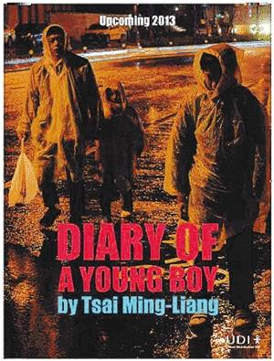
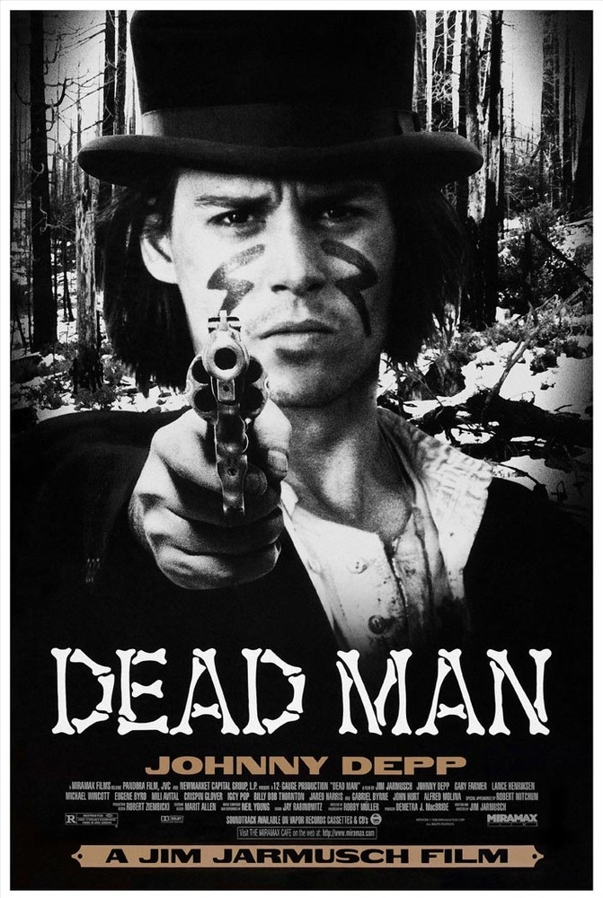

# 醒醒吧，世界上根本没有文艺片

电影是什么？

电影界、文艺界、发烧友和普通影迷异口同声地说：第七艺术！

这句经典意义的概括早已是理所当然，毋庸置疑的。“第七艺术”仿佛是一个金光闪闪的光环，其存在的合理性从未在中外观众或影评人心中引起过质疑，久而久之，很多人早已忘却了这块金字招牌的来历，对电影“艺术性”的崇拜就像信徒进入庙堂，一味顶礼膜拜，一切的质疑之音都是大不敬，丝毫不管自己拜的是神还是魔了。

我想说的是，电影确实是艺术，但它不是什么“第七艺术”，也不存在“艺术电影”——比如你从未听说过有“艺术雕塑”或“艺术绘画”——电影作为一门艺术与其他传统艺术有一个本质性的不同点，那就是它首先是一门工业，一门由光学摄录系统和洗印放映系统构成的工业，其次它才是一门艺术，一门需要科技的支持、需要投入巨额资金、没有巨量购票的观众就无法再生产的艺术。“第七艺术”的定位是把电影强行纳入传统艺术的美学框架的行为，这一说法的荒谬在于它抹杀了电影作为20世纪新兴艺术与早已存在了千百年的传统艺术之间的根本性差别，改变了电影的大众文化属性，使它成为供少数人把玩、在由所谓精英分子组成的小圈子里孤芳自赏的沙龙艺术。在“第七艺术”的大旗下，这些所谓的精英分子开始大肆攻击面向大众的电影，说它们是“唯利是图”的，迎合大众的低级趣味的“商业电影”，然后开始别有用心地夸大了“文艺片”与“商业片”的对立，甚至“第七艺术的艺术性与商业性的对立”。

这一切的结果会怎样？影史上有前车之鉴。

1895年，法国鲁米埃尔兄弟发明了电影技术，电影作为信息媒体诞生。

1902年，法国人乔治·梅里埃利用原始的电影技术拍出了情节虚构、人工布景、甚至略带特效镜头的《月球旅行记》——看过《雨果》的朋友应该比较熟悉这段历史——这标志着电影作为艺术媒介诞生。——请注意，这里并没有说电影已经艺术化，只是说电影有作为艺术媒介的潜力，比如石头可以作为雕塑艺术的媒介，而石头本身则不是艺术。

还是1895年左右，法国人查尔·百代创建了发型影片的百代公司，并于1907年创造了2400万法郎的巨额利润，成为彼时世界第一的电影发行公司。

当时，好莱坞还鲜有人知。

电影在那时已经成为一门急速发展的产业，但无论是电影从业人员还是观众，都不会将电影和艺术两者联系起来。

然后1908年，来了一对文艺青年兄弟：拉菲特兄弟。他们将自己创办的小制片公司和一家濒临破产的发行公司合作，给新的联合体起了一个大名：艺术影片公司，号称只生产艺术电影，还声称要给整个电影界的地位升格，邀请了以法国最著名的作家阿纳托尔·法郎士为首的剧本创作具体为公司编写剧本，雇佣了法兰西喜剧院的一批名演员充当演员，还请到了当时最优秀的配乐和布景。一时间，电影业的众多门外汉群贤毕至，在艺术界造成了不小的轰动，给上个世纪的文艺青年打了满满一针鸡血。

我认为艺术家对商业性的恐惧从那个时候就开始了。

拉菲特兄弟将电影生拉硬拽进传统艺术的范畴，还是需要一片特定的群众支持的，而彼时一批从事传统艺术的作家和艺术家出于对电影这门盈利到本满钵满的产业的恐惧就为这一荒诞之举提供了完美的土壤：他们担心从此下去一切传统艺术的观众都会被电影这门不登大雅之堂的产业抢走——法国著名作家都德就表示过这种担忧。这种恐惧加上20世纪10年代西方现代主义的狂潮，终于导致了电影这门新兴产业彻底被搅入了传统艺术的混水。

“文艺片(a.k.a. 艺术电影)”这个片种，通过电影史证明，是电影圈外一些根本不懂电影的本体属性的传统艺术评论家们捏造出来的。其中的代表是一位意大利文艺评论家卡努杜，他在上个世纪10年代提出将电影这门“第七艺术”定义为“光的艺术”，并呵斥“让商人滚开”并且声称“要把电影交回艺术家手里”。这一号令在传统艺术最强势的法国得到了响亮的回应。但卡努杜口中的“艺术家”指的确实电影圈外从事传统艺术创作的人，如画家、音乐家、作家、舞蹈家等等，电影人在他眼里是最没资格被称为艺术家的群体。法国人从此就走上了高举艺术大旗、和商业斗争到底的不归路：“艺术精英”纷纷站到“第七艺术”一边，把“商业”都留给了没有文化的大众，并且开始大肆攻击面向大众的电影，说它是“唯利是图”的、迎合低级趣味的“商业电影”，然后别有用心地夸大所谓“艺商对立”和“艺影、商影对立”。放弃大众，不再“媚俗”，在巴黎还出现了公开排斥普通观众的“老鸽笼”影院。

一帮欧洲现代主义文艺青年艺术家紧紧跟上，亮出了“先锋派电影”的纲领，其观点是反对用电影讲故事，把电影的艺术任务限定为：表现梦境、潜意识活动、机械图形、光影变化等。而电影艺术家，则必须由电影业外的作家和艺术家担任。编剧、导演、演员、摄影师和美工师都必须是电影产业之外的传统艺术家，否则就是充满铜臭的商业机器。

而这，就是最初“文艺片”的定义。而电影百年历史发展至今，再也没有过第二个关于文艺片的明确定义。就是因为将电影套上了“第七艺术”的棘冠，百代公司不再是世界第一公司，文艺气息彻底摧垮了彼时的法国电影产业，将世界电影市场拱手让给了新兴的产业——美国好莱坞。

第70届威尼斯影展上，台湾导演蔡明亮带同唯一一部角逐最高荣誉“金狮奖”的华语片《郊游》上场，然而电影播放后，他突然宣布退出影坛，原因是他认为制作商业电影违背他的艺术原则，《郊游》会是他最后一部电影。他坦言，制作商业电影违背他的艺术原则，在这种压力下，他决定退出影坛，今后不再拍电影。

通过蔡导的“明智行为”我们可以得出结论：所谓“文艺片”“艺商对立”，实在是一项自废武功，自寻死路的划分，它否定了大众对于电影产业的推动力，妄想去贬低和疏离观众，而忽略了电影是一门需要大量技术和资金来实行再创造的产业。电影是一种完全不同于传统艺术的新型艺术，是一种在20世纪与消费时代的到来同步发展的消费性极为明显的新型艺术，是一种离不开商业运作的艺术，所以，所谓的“艺术电影”是一种根本不可能存在的东西，但蔡导显然没有看到这点。

写到这里有人该纳闷了，高导难道是精分了么？之前怒喷《小时代》不就正是对着大众文化开火么？批评《云图》删减不就是在呼吁将电影还给艺术家么？和高举着打死商人的法国文艺青年有什么区别？

在这里我声明：商业和艺术电影的矛盾会且只会在一种条件下存在：那就是制片商为牟利而粗制滥造，使产业中形成劣币驱逐良币的现象，而这就是我一直批评的《小时代》和审查制度的本质原因。解决这个矛盾的不是艺术美学或艺术家，而是优胜劣汰的市场法则和观众，是要能识别自己“被坑了”的观众。但在中国，能做到这一点的观众寥寥无几。所以，就像我一直坚持的，我并不打算提高大众审美，只是指出其必定把自己引向灭亡的事实。中国电影以没有甄别淘汰能力的观众为主体，一直是劣等市场，这也是事实。

20世纪以来，以电影为主的大众文化开始向精英文化发起了冲击，几乎所有的传统艺术也都有了面向大众的“叛徒”——比如诞生于传统音乐艺术中的通俗歌曲、流行歌曲，诞生于舞蹈艺术中的街舞，这些“下里巴人”虽然在经济效益、知名度等方面皆超越了“阳春白雪”，但还是不如后者硬气。原因正如辉格所说：对文化产业构成压制的力量和舆论基础，常常来自权力和精英阶层对大众文化之庸俗的担忧、反感和抵触；对庸俗的反感是可以理解的，担忧则大可不必，大众文化从来都是庸俗的，毕竟任何社会的绝大多数都是俗人，雅士从来都是极少数，后者大可以坐享其优越感，却没有道德上的理由将其审美偏好强加给广大俗人。

因而文化若要发展成一个大产业，构成其主要部分并在数量上占压倒性优势的产品，必定是庸俗的；更重要的是，对于精英和雅士们，假如他们希望看到更多高雅作品从文化市场上涌现，那么试图遏制庸俗文化的发展也是不明智的，相反，他们应该乐见庸俗文化的繁荣，因为一个庞大而繁荣的庸俗文化市场，将为高雅产品的孕育和成长创造一片更好的土壤。

既然文艺片从来就没有一个完备的定义，那么可以说，现在的电影没有一部“文艺片”。但是，不管我再怎么宣称文艺片不存在，有些电影看起来确实还是和其他电影不同，行内流传着一个笑话：吉姆·贾木许（代表作《离魂异客》）和迈克尔·贝（代表作《变形金刚》）都是电影导演，但其实不是同行。即使缺乏衡量标准，有些人就是认为“在你看完电影那一刹那你就会获得神谕，告诉你它是文艺片还是商业片”那么，广泛意义上的“文艺片”和“商业片”究竟是通过什么来区别彼此的？“神谕”究竟是什么？

答案其实很简单：情节设置。

读过罗伯特·麦基《故事》的人都明白，我们经常说的电影剧情、情节，无非只具有三种属性：大情节、小情节和反情节。

大情节的经典设置是指围绕一个主动主人公而构建的故事，这个主人公为了追求自己的欲望，经过一段连续的时间，在一个连贯而具有因果关系的虚构现实中，与主要来自外界的对抗力量进行抗争，直到一个绝对而不可逆转的变化而结束的闭合式结局。 也就是说，大情节的“戏”主要来源于主人公与外界的冲突，比如追回爱人、拯救世界或逃离警察，所谓的“商业片”大多是大情节经典叙事的簇拥。

当然，大情节并不是故事讲述的极限，经过最小主义修饰后，大情节可以变成表现人物内心、将冲突由外界转为人物内心冲突的小情节，最小主义的情节处理是要在简约、精炼的前提下依然保持经典的精华，使影片仍然能够满足观众，达到情感上的信服。心灵的救赎，爱人的心路，精神的升华往往会采用小情节的细腻形式，多出现于饱受追捧的“文艺片”中。

反情节就相对特殊一点，它的作用可类比为反小说或荒诞派戏剧，这一套反结构的变通并没有消减经典，而是反其道而行之，用嘲弄和戏谑传统导致观众心中产生的间离感来让传统叙事的模式更加深入人心。在实验片和意识流电影中常常会出现。

所以，“商业片”和“文艺片”这两个词浅层次来讲代表着两种创作准则，但深层次上却只是情节设置手法的技术差别。

不可否认地，商业片导演常常会对生活变化的能力——尤其是变好的能力——过分乐观，因此，大情节叙事和happy ending就变成了商业片中的常客。但同样不可否认的是，文艺片导演却普遍对生活的变化表现出过度的（同时也是美丽的）悲观，因此，为了放大他们印象中生活的苦难，文艺片导演往往炮制出一些静态的、非情节的呆板刻画，或具有负面结局的极端反情节或小情节。两者的过量追求均会导致故事在“商业片”和“文艺片”之间站队。这将导致两端都乏善可陈，这个壁垒不除，对双方都百害而无一利。

从电影发展的过程来看，商业实际上对艺术起着有益的促进作用。我们很难想象如果没有商业竞争的动力，电影的艺术表现能拥有今天这样天马行空般想象力的可能性。法国也有“艺术影院”，但其票价却比一般的电影院还要高，文艺青年要想提高一下艺术修养还是得乖乖掏出充满铜臭味的法郎。对于把看电影当成娱乐的绝大数观众来说，所谓的商业性就是指娱乐性。但对于那些见识丰富、影商高的观众群体来说，一部好的商业电影必然离不开高超的叙事手法、与内容合拍的节奏、摄影、调度和构图等等娱乐性元素，而这些也恰恰是电影艺术性的体现。所以商业和艺术性不存在绝对矛盾。那些重文艺而轻商业的所谓“文青”，“第七艺术的拥护者”只是对电影产业的构成和发展缺乏认知的门外汉而已。

(**采编**：王卜玄；**责编**：王冬阳)
