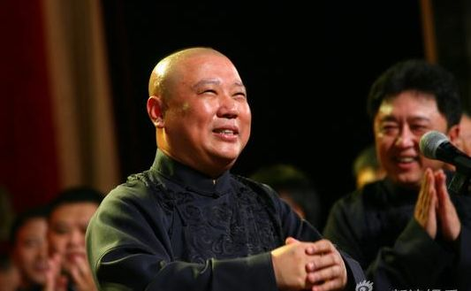

# 第一期：管理这个国家的人读《人民日报》，自以为管理这个国家的人读《环球时报》，认为自己应该管理这个国家的人读《南方周末》

### 

### 

# 七星微语

## 第一期：管理这个国家的人读《人民日报》，自以为管理这个国家的人读《环球时报》，认为自己应该管理这个国家的人读《南方周末》

### 

### 

**瓢虫君：**各位读者，小瓢虫这厢有礼了。七星微语第一期（同时也是测试版）上线了！如果你也想在七星微语中看到你的微博，请在人人网@[瓢虫君](http://www.renren.com/profile.do?id=362359989)或新浪微博@[七星瓢虫君](http://weibo.com/2079236837)！ 七星微语一共有五个分类，分别是说事（时评）、论道（思想）、吐槽（调侃讽刺）、杂烩（五花八门）、小报（北斗生活） 在此@某某仅仅表示瓢虫君能看到的转发的最源头，大多是该微博的原创作者，但并不排除是其转发的可能呦。 

### 

#### 【说事】

**@罗天：**管理这个国家的人读《人民日报》，自以为管理这个国家的人读《环球时报》，认为自己应该管理这个国家的人读《南方周末》，认为国家应该由外国人管理的人读《自由时报》，认为国家已经被外国人管理的人读《乌有之乡》，不知道谁在管理这个国家但坚信他们做得不对的人……他们当然自己写文章投给铅笔社啦。 **@陆小鸟：**你们理解错了，北师大那个对学生说：“四十岁时没有四千万就别说是我的学生”的教授并不是在激励学生，更不是什么教育的悲哀，仅仅是这位睿智的教授对十几年后中国经济通胀情况的准确预判而已。 **@谢至理：**记得去年贵国发表《2009年美国人权报告的时候》我在英文论坛看到美国网友们讨论美国的人权问题和美国外交政策中的人权套路，今年同样套路的《2010年美国人权报告》发布后我再去看发现美国网友依然对美国有着同样的批评。两国在批评美国的人权上是相当一致的。 **@谢至理：**有人就药家鑫案表示强烈的愤慨，觉得要严惩才能彰显正义和法律，于是就有傻逼跳出来说你这样道德高地的做法是不对的。为什么说这些人是傻逼呢，因为这些人不懂什么叫占领道德高地，我举几个有名的靠占领道德高地做事的历史人物：曼德拉、甘地、马丁路德金。。。。 

### 

### 

### 

**@王昊伟whwkaj：**论坛里有人问李刚的儿子撞死了药家鑫会怎样，楼下表示这是我国法律的一个漏洞。 **@洞感超人：**新闻上说一疑犯一口气连捅被劫女人32刀。底下众人评：乖乖，世界级的钢琴家诞生了！！！ **@王垚：**聚众就能扯到公民性？正常社会可以聚众表达，但这不代表你聚众了社会就正常了。而且堵塞高速为难司机，这是TM哪门子公民行动？表达自由从来不包括侵犯他人人身与财产。救狗可以，但别以救狗之名，侵权作恶。@常远：嘲讽救狗似乎有理：你为一群狗牵肠，却对人类苦难视而不见；狗在牢笼，亦有好人身陷囹圄；你跑到边远山区支教，却对身边暴力拆迁和上访户不闻不问—选择性爱心，是矫情伪善。可是朋友，救狗易，救人难；有人居其难有人为其易。每滴善心都值得珍视，每一次公民行动都在撞线，都是通往公民社会的启蒙。 

### 

#### 【论道】

**@谢至理：**未来的史学家在学习美国帝国衰亡史的时候，一定会很惊讶为什么在这样一个对冲基金经理人一个月赚得比一般人一辈子赚得都多的时代，政府讨论的是裁掉多少个老师来节约开销。 **@孙小永：**作为现阶段的互联网的入口，搜索引擎被喻为拥有像上帝一般强大的力量，要求执掌它的人必须秉持正义和平等的价值观。 **@洞感超人：**在中国，想要不被人骂，不被人说“虚伪”，最好的办法就是不要出头，做一个冷漠的围观者。。。貌似很多人就是这么做的，不但这样，遇到别人出头的他还要狠狠去踩上一脚。。 **@周勉之：**人民就象一群绵羊，但执政者并不是牧羊人，他只不过是头羊而已...看起来牧羊人对绵羊很好，把它们养的很肥，其实只是为了送它们进屠宰场而已，这就是为什么羊群要逃离表面上让它们衣食无忧生活的饲养场，去追求吃了上顿没下顿的自由 

### 

#### 【吐槽】

**@李剑：**如果在新闻联播能插上情景剧里的那种背景声就定会提高收视率，比如：观众朋友们晚上好，欢迎收看新闻联播节目..{哈哈哈哈哈}十二五期间国家首次提出居民融合发展让高科技军工技术造福百姓生活..{哈哈哈哈哈哈哈}北京市推出一改新措施缓解了看病贵看病难的问题..{哈哈哈哈哈哈哈哈哈} 

### 

### 

### 

**@沙宣:** 午时三刻，烈日当空，监斩官下令：斩！突然死囚一阵哈哈大笑，监斩官问到：你因何发笑？ 死囚迟疑片刻道：专家果然没说错，每天笑一笑可以延长寿命5秒。 **@沙宣：**当我还在关心大盘鸡的时候，朋友们都在关心大盘和鸡了，这就是生活差距。 **@黄薄码live：**某豆友：“昨天被车撞了，还没等司机下车，我就赶紧跑了，我这样做对吗？”众豆友：“LZ真是捡了条命啊！！！！！！！！！！” 

### 

#### 【杂烩】

**@沙宣：** “这世界上有一种鸟是没有脚的，它只能一直飞呀飞呀，飞累了就在风里面睡觉，这种鸟一辈子只能下地一次，那一次就是它死亡的时候”。这种鸟的名字就叫：Angry Bird **@黄薄码live：**玉蒲团上映之后，香港一家影院的工作人员发现，每天下午一位白发苍苍的老头都会准时出现在第一排中间的位置，散场之后总是久久不愿离去，这天散场之后工作人员好奇的问他为什么？他老泪纵横的说：愤怒的小鸟！！久违了！！ **@周二言：**一人骑车摔倒。上海人骂自己：侧那，今朝眼睛瞎脱了。北京人骂路：我靠，这谁tm修的破路啊！天津人站起，朝四周一抱拳：哥几个，对不住啊！没练好，现眼了。 

### 

### 

### 

#### 【小报】

**@谢至理：**经过我的长期观测，本周在Google的搜索关键词“北斗”的搜索结果中，ibeidou网站的排名第一次超越了北斗导航系统的政府网站，仅次于北斗手机网之后。与此同时在百度的搜索结果中，ibeidou长年落后于“铃木北斗星”汽车相关网站。 **@薄然：**从我们人类学角度，两个人偷偷拿出积攒了二十多年的九块钱去领证，是不算做事实婚姻的！婚姻必须要有社会性和仪式性！ 

### 

### 

### 

**@张舒迟：**宝玉便走近黛玉身边坐下，又细细打量一番，因问：“妹妹可曾入編輯部？”黛玉道：“不曾入，只读了一年北斗，些须发过几篇稿。”又问黛玉：“可也写专栏没有？”黛玉便忖度着因他写过专栏，故问我有也无，因答道：“我没有那个。想来那专栏是一件罕物，岂能人人有的。” 

### 

### 

（采编：陈造极、金吉男、钱思韵、刘一舟 责编：刘一舟）

### 

### 
