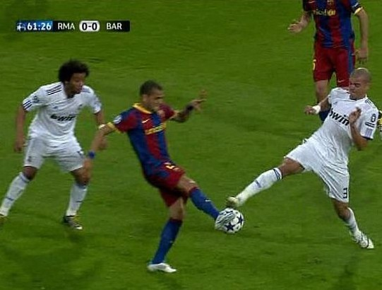
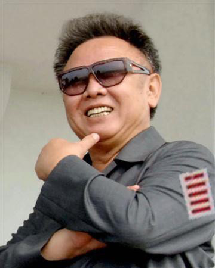
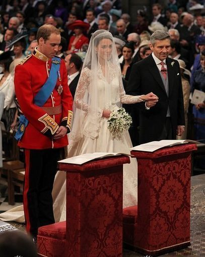
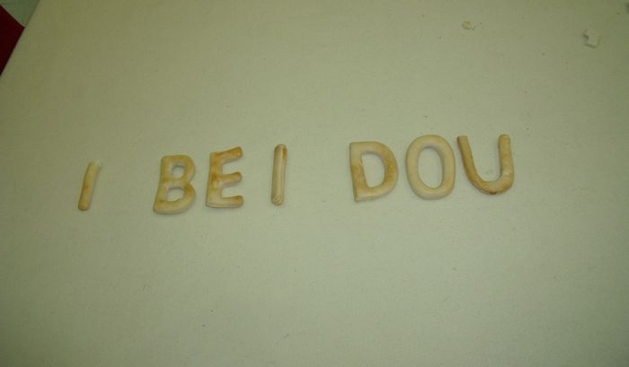

# 第四期：问:本拉登和巴萨球员的区别是什么？答：拉登确实被打到才倒下的。

 

# 七星微语

## 第四期：问:本拉登和巴萨球员的区别是什么？答：拉登确实被打到才倒下的。

  **瓢虫君：**各位读者，小瓢虫这厢有礼了。七星微语第四期来了！如果你也想在七星微语中看到你的微博，请在人人网@瓢虫君或新浪微博@七星瓢虫君！ 在此@某某仅仅表示瓢虫君能看到的转发的最源头，大多是该微博的原创作者，但并不排除是其转发的可能呦。 

#### 【说事】

**@黄薄码Live :** 问:本拉登和巴萨球员的区别是什么？答：拉登确实被打到才倒下的。 

 **@郑艺 :** 拉登死了，我觉得布什真的应该惋惜下。没有拉登，布什不见得能连任。更不可能把总统权力扩得像中国村长那么大，还绕过国会窃听民众，这权力都快赶上腾讯管理员了。 **@林柏墙 :** 你每月房租1110元，剩下5个农民自己建房，1个干部国家分房，3个乞丐根本没房，1110除以10，啊，幸福洋溢的感觉…… **@朱睿: **关于黄艺博小盆友，想起郑渊洁的一句话：如果一个国家的孩子说大人话办大人事，那么这个国家的大人一定说孩子话办孩子事。 **@陈轩:** 在这片土地上，诸位小学时难道比小黄同学好到哪里去吗？说到底，只不过是你们没有人家畸形得那么出色罢了。过了十几年，你们看破了，于是迫不及待地赶去嘲笑十几年前的懵懂的姿态。 **@张亦: **没人要嘲笑黄艺博，在这个土地上他的状态是合理的，他就是我们的童年影子，但是合理不代表正常，大家笑的只是他背后不正常的东西，甚至只是对五道杠的事表示惊讶。我又不是瞎子，用你来告诉我他还是个孩子？炒起来他自然会受些影响，但是他自己高调出镜，难道我们有义务做瞎子做哑巴？ 

 **@彭杨 :** 南方周末披露惊天内幕，北京海关等政府机关工作人员长期食用无毒无害的特供食品，民众普遍忧虑，一旦美帝发动化学战，他们将是最早挂掉的一批．后果不堪设想…… 

#### 【论道】

**@张航K10 :** 跟通货紧缩似的；比如女性是货物，男性是货币；高档货物供应充足，高端消费人群市场有限；于是多余了很多货物。中低档消费者很需要呀，但是买不起。剩女，只是个虚假的繁荣。挺可怜的.生产过剩的高档货物和中低消费者都挺可怜的. **@邱政政 :** 旋转木马是“最残忍的游戏”，彼此追逐却有永恒的距离！ **@张亦 :** 少年时总会问“这有意义吗”，现在我不会这么偏执。有些事本身就是价值就是意义，不一定非要导向某种结果才有意义。比如读书，听音乐，画画，锻炼身体，给亲人打电话。 **@罗桀.selfish :** 从前有个小孩，在学走路的时候摔了一跤，自此就害怕走路，于是坐着轮椅长大了。大了以后他还到处跟人夸耀：历史已经证明，走路对我而言是行不通的，我只适合坐轮椅。你说，这熊孩子不是SB是什么？ **@徐超: **一身强力壮的青年路遇流氓强暴少女，遂挺身而出打算“英雄救美”，旁边两个猥琐男醋意大发，大声疾呼：大家快制止他，他不是真的为了救少女，他是为了泡妞！！！青年刚要反驳，猥琐男就质问他：你敢说你一点YY的心思都没有？青年默然了。少女遂被xx **@井越 :** “6÷2（1＋2）是等于9还是1”其实很简单，比“8×8究竟等于64还是404”这道题容易多了。 **@袁见齐 :** 有情人终成房奴，有房人终成眷属。 

#### 【吐槽】

**@黄薄码Live :** 对于蜜月旅行，威廉和凯特希望去一个能有完全隐私，没人会泄露他们行踪的地方。比如巴基斯坦。 

 **@彭凌璨 :** 总统先生独自在椭圆办公室闷坐。他抽出那本空壳的《圣经》，掏出里面的《古兰经》，一声长叹。穆巴拉克•侯赛因•奥萨马，你要孤军奋战了，他对自己说。 **@唐璜：**报复社会的办法就是上三国杀，然后托管。。。 **@刘一舟 : **五毛说自己爱国，草泥马笑了；草泥马说自己有思想，意领笑了；意领说自己深刻，文昆笑了；文昆说自己搞学术，大牛笑了；大牛说自己有成果，导师笑了；导师们说自己有影响力，学阀笑了；学阀说自己有话语权，校领导笑了；校领导说自己官大，教育部笑了；教育部说自己重要，发改委笑了；发改委说自己掌握经济，某某党笑了；某某党说自己苗红，少将笑了；少将说自己路还长，黄队长笑了。 

#### 【杂烩】

**@朱华璋Ⓐ :** 鸳鸳相抱何时了，鸯在一旁看热闹。 **@刘宇 :** 某领导酒后与下属发生关系,被告到纪委,纪委书记找其谈话,此人态度诚恳地说:到了床上其实我也不想犯错,但人性告诉我该进去,我就进去了,进去后党性又告诉我该出来,我又赶快抽出来,结果就在人性-党性-人性-党性..之间痛苦的挣扎和徘徊,反复斗争半小时,我们党胜利了.纪委说:好同志... 

#### 【小报】

**@薄然 :** 今天是5月5日，北斗三岁生日快乐！ **@罗天 :** Q：韩寒和北斗有什么共同点？A：当他们的文章无法吸引读者的时候，就靠传基情绯闻来抓住人们的眼球啦。#Gaydou三周年 **@陈轩 : **据悉，某天文爱好者协会将发表系列社论：《本拉登，莫做少先队高层变革的牺牲品》《别向这个操蛋的美帝国主义投降》《晚近中国恐怖主义考》《美帝，给世界留下一点恐怖主义的种子吧》…… **@瓢虫君: **陷在这个操蛋的世界中，在应付生活和学业，在忙碌或者无聊的时候，是否曾经想过暂时脱离这些枷锁，去看些别样的风景呢？ “曾梦想仗剑走天涯，看一看世界的繁华。” 哈哈，当你内心蠢蠢欲动时，已经有人上路了。李胜博，和大家一样的一个普通大学生，他决定休学一年，周游全国。不是一个太难的决定是不是？目前李大侠已经游历了东北，现在到了西安。瓢虫君将状态直播他的历程。当你又打开电脑时，就可以看到他的经历了。请关注#休学一年，周游全国# 

（责编：刘一舟）

  
