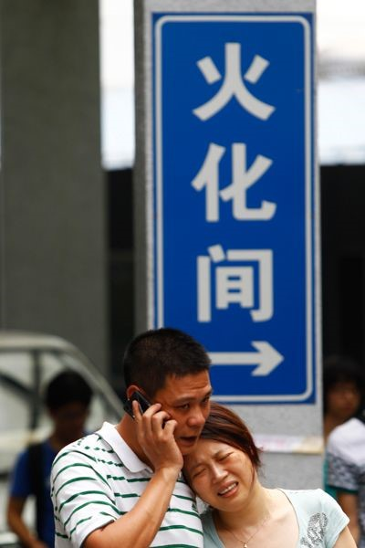
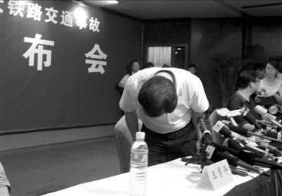

# 第十五期：沉痛悼念723温州特大动车追尾事故遇难者

 

# 七星微语•一周状态撷萃

## 第十五期：沉痛悼念723温州特大动车追尾事故遇难者

  [瓢虫君](http://www.renren.com/profile.do?id=362359989)：各位读者，小瓢虫这厢有礼了。七星微语第十二期来了！如果你也想在七星微语中看到你的微博，请在人人网[@瓢虫君](http://www.renren.com/profile.do?id=362359989)或新浪微博[@七星瓢虫君](http://weibo.com/signup/signup.php?c=&type=&inviteCode=1670285792&code=&spe=&lang=)！ 在此每条微博前标注的作者名仅仅表示瓢虫君能看到的转发的最源头，大多是该微博的原创作者，**但并不排除是其转发的可能呦。**链接点点更健康！ _

#### 【说事】

[赵觉成](http://www.renren.com/profile.do?id=294812530) :与其相信我们能改变世界，不如相信这个世界通过我们来改变自己。所以说，与其试图说服那些我们难以改变的人，倒还不如向愿意聆听的人们宣讲。有时候，这个世界的改变并不像我们所想象的那样困难，我们只是得去了解这个世界需要我们做些什么。 [崔飘扬 ](http://www.renren.com/profile.do?id=264603487):崔卫平老师当年那句“你怎样，你的中国便怎样”最近无限中枪了。其实作为老资格的敏感词，她显然很清楚这个政权和制度到底是什么货色的，写这些“温暖人心”的话，更多是鼓舞了解实情的同道中人。拿这种心灵鸡汤忽悠还搞不清楚国情的小朋友们自然是不厚道，但若心中了然，再记着这一句良知的呼唤又何妨    [林传晓 ](http://www.renren.com/profile.do?id=242301343):六月飞雪，或者天降冰雹，这些类似天谴的现象能改变什么吗？放在古代或许能起到舆论的作用，想当年黄巾军的起义，太平天国的起义莫不是借了神话意味的东西来做舆论铺设。可惜，现在的你我，心底看到这些难道没有掠过一丝自嘲、一丝悲哀么？ [常遠](http://www.renren.com/profile.do?id=188752901): 【你为什么不生气】或许你不会因言论被删帖跨省，因家有冤屈上访被截访关押；或许你家的高档小区不会被强拆，高物价你消费得起；你养孩子不怕结石，托亲友从国外寄奶粉；你摆摊不怕城管，内部有人。你只想做一个踏实、安稳过日子的普通人，一个上学工作娶妻生子了此一生的小民。这想法很自然，很好。当别人告诉你那些苦难的新闻，你大喊着，这关我什么事？我只想过日子。可是亲爱的，你并不安全。一个有毒的体制提供的公共服务也是不安全的，你每天乘坐的地铁有可能突然逆行，你常年乘坐的火车、飞机可能以非技术原因出事故。 [丁云峰](http://www.renren.com/profile.do?id=262975247) :晚上理发，有人在说这次 动车事故，老板帮我吹着头发突然默 默的说：“老子他妈买个500块钱的 电子狗，都知道提醒老子前方几公里 测速，前方几公里有服务站，超速了 还提醒减速，前面是左转还是右转！ 这花了几百几千个亿的东西，前面停 个那么大的东西，居然没反应！直接 撞上！真他妈的神奇 [宋石男](http://www.renren.com/profile.do?id=338166923) :新京报吴伟：“为了唤醒他，我一直和他说话，摸他，全身地摸。但他全身都是伤，从头到脚都是伤，我都不知道手往哪里下。”这是我温州之行的最后一篇稿件开篇的直接引语，来自于第40名死者陈伟的妻子刘成兰，写的时候未曾料到，这竟会是这个夜晚过去后媒体人对这个国家的感悟。 [麦静 MJ](http://www.renren.com/profile.do?id=255864564) :说实在的，我最怕有的知心姐姐跑来语重心长地说我愤青，还无所不知地指导我如何”把这些变成生活、事业的一部分，投身其中“，熬了一大锅的心灵鸡汤殷切地要给我灌下去，”对国家要有宽容和理解“，你对我与你相左的想法都不宽容和理解，反倒要求我去宽容和理解政府的作为，这也太可笑了吧 

#### 【吐槽】

[李坦Loser](http://www.renren.com/profile.do?id=309501855) :中国行政体系供奉的三大神兽：马、牛、羊。下属拍马、领导吹牛、事儿漏了牵出一只替罪羊。各有司都应在办公楼门前树这三种动物的巨型雕塑，作为一种基本职业技能培训。 佚名:如何避免动车追尾？有人想出这样一个办法，即“在列车头部和尾部分别放置两只领导”。但也有人对此表示忧虑，因为他觉得这更有可能遭到雷劈…… [张人鉴 ](http://www.renren.com/profile.do?id=242656974):一民女向zf状告遭一官强奸，领导：“他戴套了，不算强奸”；女：他没戴，他撒谎；领导：“至于你信不信，我反正信了”；女：我都怀孕了；领导：“这是一个奇迹”；女：那现在怎么办？领导：“我只能说，它就是发生了 [胡叁.Xanda](http://www.renren.com/profile.do?id=274727349): 中国政府拥有世界上最冗杂最吸金的官僚机构却担负着若有若无的责任。这是因为根据中国逻辑，政府是个只能同时处理一件事的单线程处理器。如果他们接受问责，他们便不能展开救援。 [艾忠国](http://www.renren.com/profile.do?id=357618871) :死了的就让他们死了吧，不许追查了，活着的人都他妈痛快起来给老子接着干活创造GDP去，以上内容可精炼为8字曰：“逝者安息，生者坚强” [施密哒](http://www.renren.com/profile.do?id=336515749): 看了动车温州脱轨，我也开始相信《高铁侠》里火车头会飞的情景了。 [陈君清salim](http://www.renren.com/profile.do?id=277807088) :昨天总理说要给人民一个交代，今天政府却给了媒体一根胶带。 [白云鹤](http://www.renren.com/profile.do?id=232785361) :看来政府官员都深入学习了邓小平那句经典的“我是中国人民的儿子”，你们干的唯一一件事就是坑爹！ [李伟](http://www.renren.com/profile.do?id=279092588): 新干线号称开通44年零伤亡，这简直是信口开河，我记得名侦探柯南里面新干线上就死过不止一个 [谷 卿](http://babyguqing.renren.com/?id=233369365): 铁道部王发言人是治愈系毕业的~~~   

#### 【杂烩】

[罗磊luolei.org ](http://www.renren.com/profile.do?id=246433134):各位难道没发现腾讯是中国最有道德的企业么，5年前一月会员10块钱，现在依旧是10块钱，服务还超多，要知道5年前10块钱还能买一大碗分量十足的牛肉面，现在就两包方便面啊~~~ [罗天 ](http://www.renren.com/profile.do?id=225618178):从“你不关心政治，政治却会来关心你”到“你不关心政治，政治控却会来关心你” [姚欣玥 ](http://www.renren.com/profile.do?id=229720190):生得计划 死得随机 [麻世川](http://www.renren.com/profile.do?id=238719866) :7.23新增一遇难人员:中国媒体。 [宋小乐](http://www.renren.com/profile.do?id=228074615) :沁园春·血：中国风光，千里网封，万里血飘。望网墙内外 惟余盲盲；媒体上下 顿失滔滔。官无人舌，掩埋真相，欲与人心试比高。须何日，看牛鬼蛇神，不被轻饶。江山代表钞票，引无数党员竞折腰。惜拆迁自焚，无人注意；红十郭美，仍在卖骚；高铁动车，就地拆埋，五十万买命一条。俱往矣，数坑爹人物，还看今朝。 [董坤.TATTOO ](http://www.renren.com/profile.do?id=257643937):今天整理手机信息,发现中奖情况,我一共拥有四千一百七十余万奖金.宝马一辆.兰博基尼两部,保时捷911一部,奇瑞QQ一部.iphone4.5,6各一部.三星手机一个.电饭锅两个.儿子若干.在外失贞的女儿一个.总经理头衔一个,亲戚四个,公司一个,法院传票两张.电话费共欠五万余元.信用卡被刷爆三次.受到一次海外捐款... [穆敏晰、MADAO ](http://www.renren.com/profile.do?id=274249659):君坐动车头，我坐动车尾，昨日动车撞动车，同做动车鬼。贪腐几时休，独裁何时已。官无道德禽兽多，和谐你妈个腿。 [崔文駮Zephyr](http://www.renren.com/profile.do?id=242972386) :果然是瓷器国，谣言都分成官谣和民谣两种。 [✿郭开全々锅盖ル](http://www.renren.com/profile.do?id=237233754) :天堂里来了一群中国孩子，上帝询问他们的来历。甲说：“我是坐电梯来的。”乙说：“我是坐大巴来的。”上帝随后指着其中一个女孩问道：“孩子，你是怎么来的？”“我是坐动车来的……”“作孽，真是作孽！你回去吧，让他们看看什么叫奇迹！”上帝抚摸着孩子的头，落下了两行泪…… [毛涵涵](http://www.renren.com/profile.do?id=297016155): 现在想想2012那个电影真是够大胆的，连方舟都敢让中国造……服了…… [刘备](http://page.renren.com/600445273?id=600445273): 诸葛亮为下家的郭嘉的闪电判定放了张红桃7，但是，在张角和司马懿的判定下，神奇的变成了黑桃7的杀，然后郭嘉死了，初步调查结果就怪闪电了，进一步调查结果就应该是诸葛的责任，而郭嘉死了就死了的，司马懿和张角继续过着悠闲的生活，当然那张出事的黑桃7也没必要继续存在了。~~~最后愿逝者安息   

(责编 陈造极）

