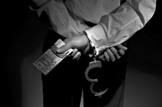
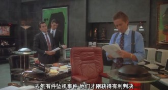
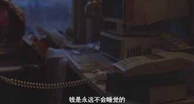
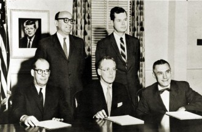
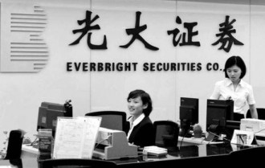
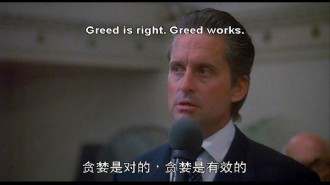
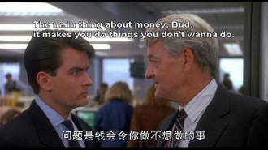
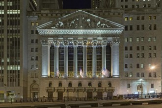

# 第七十三期：内幕交易

**目录****:**

1 内幕信息与内幕交易

2 内幕交易的现实案例

3 内幕交易的影响

4 内幕交易的监管

5 参考文献

6 延伸阅读

 **1. ****内幕信息与内幕交易：****How about Blue Star Airlines?** 

在1987年的经典电影《华尔街》中，导演奥利弗·斯通在影片中设计了这么一个桥段：初出茅庐的华尔街小兵Bud Fox从身为工会领袖的父亲那里得到内部消息，蓝星航空公司即将在一起坠机纠纷中获判无罪，并将取得拓展新航线的资格。为了获取华尔街大鳄Gordon Gekko的信任，他将此消息透露给Gekko，并受托在低价位大量买进蓝星航空股票。翌日，报纸公开报道蓝星航空获判无罪的消息，蓝星航空股价大涨，他们也因而赚的盆满钵溢。

图片来源：电影《华尔街》

《华尔街》中上演的这一幕就是最为典型的内幕交易。那么，金融业究竟是如何定义内幕交易的呢？

内幕交易，又被称为知内情者交易，是指公司董事、监事、经理、职员、主要股东、证券市场内部人员或市场管理人员，以获取利益或减少经济损失为目的，利用其地位、职务等便利，**获取发行人尚未公开的、可以影响证券价格的重要信息，进行有价证券交易、或者泄露信息的行为**。[1]

事实上，内幕交易的法律规定较复杂，各国对于内幕交易的规定也不尽相同，这里介绍的主要是我国对于内幕交易的相关规定。简单来说，**内幕交易就是行为人利用内幕信息进行证券交易的行为**。

所谓内幕信息，也就是**尚未被市场获悉、且会对证券价格产生影响的信息**。在这里，蓝星航空即将获判无罪就是一条内幕信息，它具备内幕信息的两个基本特征：一方面，这一消息还没有正式公开宣布，甚至连原告都还不知晓；另一方面，蓝星航空获判无罪后将获得开拓新航线的资质，可以面向更广阔的市场，显然这会推动公司股价上涨。Bud和Gordon由于先于市场知悉了这一信息，并利用这一信息买进蓝星航空，因此他们的行为也就构成了内幕交易。

** ****2. ****内幕交易的现实案例：****Money never sleeps** ** **

沉睡之中的Bud Fox被Gordon Gekko的电话叫醒，电话那头的Gordon告诫道，钱是永远不会睡觉的。金钱永不眠，对金钱的欲望也永不会停息，现实的证券市场上从来不缺少试图通过内幕交易获利的投机者。

图片来源：电影《华尔街》

** **

由于监管规则、法律体系与中国存在较大差异，美国证监会SEC对于内幕交易的定义和处理与中国也不尽相同，这里仅介绍美国1961年的Cady, Roberts & Co.案。

Cady, Roberts & Co.是一家证券经纪商，因工作原因，从其客户Curtiss-Wright公司处获悉后者计划减少股票分红，而这将导致股票价值减少、股价会下跌。于是，Cady, Roberts & Co.在客户公司宣布这一消息之前出售了其持有的Curtiss-Wright股票，并进行了若干卖空交易。

SEC认定Cady, Roberts & Co.的行为属于内幕交易。SEC在所发表的意见中指出，尽管传统上认为董事、经理层和控股股东等公司内部人在证券交易中负有“披露或不交易”（disclose or abstain from trading）义务，但是负有这种义务的并不限于这几类人；符合下述两个条件的人均负有此义务：（1）因存在某种特殊关系而可以接触和获取公司信息，且该信息应仅用于工作目的而非任何私人用途；（2）明知交易对方不知晓这一信息而不予披露，造成交易的不公平。根据这一分析，Cady, Roberts & Co.毫无疑问违反了上述义务。[2]

Cady, Roberts & Co.案

而在中国证券市场上，引人注目的光大案中，光大证券高层的补救措施也被监管部门认定为内幕交易。

据披露，光大证券高层在得知本公司系统故障引发股市异常之后，内部紧急商定卖空股指期货合约、转换并卖出ETF对冲风险。从下午开盘的13时到这一消息被公布的14时22分，光大证券卖空IF1309、IF1312股指期货合约共6240张，获利7141万元。同时，转换并卖出180ETF基金2.63亿份、50ETF基金6.89亿份，规避损失1307万元。以上两项交易获利和避损合计8721万元。

证监会认为，光大证券异常交易不仅对光大证券自身的经营和财务有重要影响，而且直接影响了证券市场的正常秩序和造成股票价格的大幅波动，影响了投资者对权重股票、ETF和股指期货的投资决策，属于《证券法》第75条、《期货交易管理条例》第82条规定的证券、期货市场内幕信息。14时22分公告前，光大证券知悉市场异动的真正原因，公众投资者并不知情，在此情况下，光大证券本应戒绝交易，待内幕信息公开以后在合理避险。光大证券在内幕信息依法披露前即着手反向交易，明显违反了公平交易的原则。

在这一事件中，光大证券由于系统故障错误下单而导致股市异常上涨就是一条内幕信息。一方面这一信息在8月16日14时22分正式对外公布前还不为人知，另一方面这一信息一旦公布，又必然会导致股市下跌回调。因此，光大证券利用这一内幕信息进行交易获利、避损的行为也就涉嫌内幕交易了。

光大证券8.16案

**3. ****内幕交易的影响：****Is greed good?** ** **

《华尔街》中Gordon在股东大会上发表的一番演讲足以载入电影史册，他说道，贪婪是好的，贪婪澄清、穿透和捕捉到了进化精神的精髓。贪婪是对的，贪婪是有效的。那么，由贪婪催生出的内幕交易，对于整个证券市场的运行，又有怎样的影响呢？

事实上，如何评价内幕交易取决于我们所面对的市场环境和前提条件。金融学中著名的“有效市场假说”认为，市场具有根据新信息迅速调整证券价格的能力。按照市场有效反映信息的能力强弱，又可以分为三种。其中，弱势有效市场是指市场上证券的价格已经反映了**所有历史信息**，半强势有效市场是指市场上证券的价格能有效反映**包括历史数据和现实情况在内的目前可得的所有公开信息**，强势有效市场是指市场上的证券价格已经反映了**包括所有公开信息和未公开信息在内的全部信息**。

如果我们认同强势有效市场的理论，认为证券价格已经反映了包括内幕信息在内的所有信息，那么内幕交易者就无利可图，内幕交易行为也就不再是一种无法容忍的行为了。从这个意义上来说，Gordon的名言不无道理，贪婪推动的内幕交易反而会促使内幕信息的流通，实现强势有效市场。

但在现实中，人们认为强势有效市场的假说大多数时候并不成立，市场上的证券价格无法及时对内幕信息做出反映。因此，内幕交易者往往可以利用信息的不对称在证券交易中获利。显然这是一种不公平的交易行为，这也是证券监管部门要对内幕交易行为进行重点监控的原因。

** ****4. ****内幕交易的监管：****Money makes you do things you don’t wanna do** 

在影片中，Bud在证券公司的同事Lou告诫他，利令智昏，金钱往往会令人做出一些不想做的事情。内幕交易也是如此，尽管我国对于内幕交易都有着严格的规定，但内幕交易行为仍然屡禁不止。那么，应如何有效提高内幕交易的监管效率呢？****

 ** **

** **

图片来源：电影《华尔街》****

** **

防范和治理内幕交易，最重要的措施就是建立起多层次的监控体系。也就是说，要构建一个包括证券监管机构、行业自律组织、中介机构及社会公众在内的多方联合管理的监控体系，从而在公司、行业、政府部门各个层面上加强对内幕交易的监管。

首先，证券监管机构要不断完善各项监管制度，及时发现可能存在的内幕交易、依法处理内幕交易行为。这里一方面可以借鉴美国等发达资本市场的监管经验，建立起关于“什么是内幕交易、什么不是内幕交易”的可供执行的标准。另一方面，对于证券市场中内幕交易行为，也应该依法处理，更多的走法律程序而非行政程序，例如在光大案中，证监会虽然认定光大证券存在内幕交易行为，但并未对其提起诉讼，而仅仅只是进行了行政处罚。

其次，证券交易所和证券业协会作为自律管理组织，应该充分利用自身的优势，更好地发挥应有的职能。其中证券交易所由于对证券交易进行着动态监控，因而是防范内幕交易的前沿阵地，在光大案中，异常交易情况最初就是由交易所发现、调查并上报证监会的。

再次，在证券公司层面，也应自觉完善风险控制机制，将不同业务部门严格隔离。类似光大证券补救措施中由高层“统一指挥”各不同业务部门卖空ETF的情形，按规定是不应发生的。此外，国内很多证券公司内部保密意识欠缺，大量使用一些涉嫌窥探用户隐私的软件，这也为内幕交易的发生埋下了隐患。

最后，还应该充分发挥中介机构及社会公众的监督作用，建立强大的市场监督机制。要开拓视野，把范围扩展到中介机构及社会公众，充分动员社会各界力量，充分发挥证券公司、会计师事务所、律师事务所、新闻媒体等中介机构及社会公众的监督作用，将社会网络也纳入到监管体系中，共同构建全方位的内幕交易防护网。

只有各个层面上都加强对信息的保密和监管，我们才有可能防住那只由贪婪驱使着的不安分的手。

**5. ****参考资料**

[1] 华尔街（1987）.奥利弗·斯通 导演、查理·辛、迈克尔·道格拉斯主演.

[2] 证券市场基础知识.中国证券业协会 编.中国金融出版社.

[3] 廖凡.美国证券内幕交易经典案例评介.

[4] 财新网.证监会认定光大证券补救措施为内幕交易.

[5] 人民网.证监会认定光大816事件属内幕交易，罚没5.2亿元.

[6] 金融学.黄达 编著.中国人民大学出版社.

[7] 光明日报. 如何防范我国证券市场的内幕交易.

** ****6. ****延伸阅读**

[1] [光大证券乌龙指事件](http://finance.sina.com.cn/focus/qzgjtmtszczdp/).新浪财经.

[2] ["Greed is Good"](http://movie.douban.com/review/2912406/).豆瓣影评.

** **

(助理：张涛 编辑：戴青 责编：高丽)
