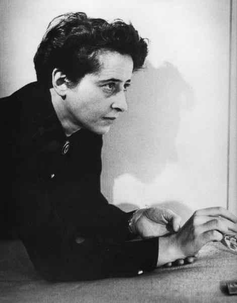
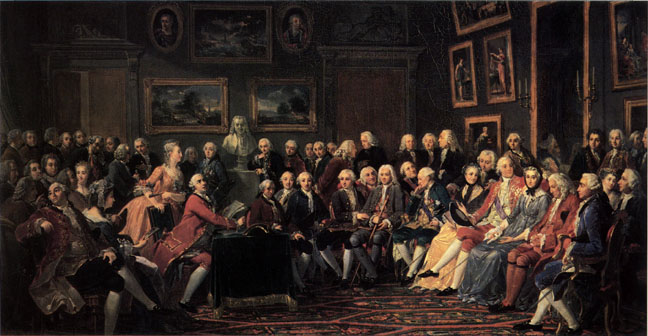
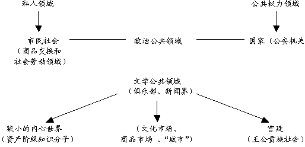
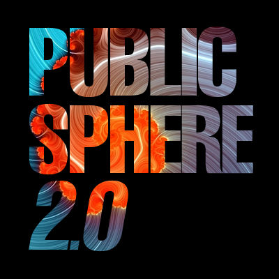

# 第七十九期：何谓公共领域

**引言**

现今中国的各大城市、城镇里，各小区都能看到为数众多的在健身器材上锻炼的人们，当然也不缺一项长盛不衰、喜闻乐见的保留节目——广场舞。小区内的公共设施、空地无疑是大家都已经习惯享受的一个公共空间了。

诸如广场、公园这样的公共场所是有形的公共领域，而还有一个无形的空间也属于公共领域的范围，比如公共安全、公共权益乃至公共话语等。公共领域是现代哲学以及社会科学的重要概念，对于公共领域的研究也是西方哲学家最为关注的课题之一。

无论是广场、图书馆这种公共场所的建设，还是公共秩序意识以及公益思想的强化，都属于对公共领域的一种固化。可以说，随着时代的进步，公共领域的建设也会更周全和完备，社会回报给公民的各种公共权利也更加齐全。这也是许多社会改革家所期待的理想图景。而这一美好愿望的实现，则必须要从对公共领域这个概念的充分理解开始。

**理论渊源及相关概念发展**

公共领域（Public sphere），是一个哲学与社会学概念，与私人领域（private sphere）相对，是指介于国家和社会（即国家所不能触及的私人或民间活动范围）之间的一个公共空间，公民可以在这个空间中自由参与公共事务而不受干涉。

德语世界的学者如熊彼特（Schumpeter，1918）和布鲁纳（Brunner，1943）都研究过同一主題。在英语世界，阿伦特（Aerndt，1958）和更早的杜威（Dewey，1923）也分別从公共哲学的角度探讨过相关问题。

**阿伦特的观点**

我们现在公认的关于“公共领域”的概念，是由20世纪50年代德国犹太裔思想家汉娜•阿伦特（Hannah Arendt）最早提出。阿伦特所说的公共领域是指作为行动（action）实现的场所，是人们平等对话、参与行动的政治空间。所谓行动是人们之间不借助于中介而直接交往的活动，它是人类意识发展最高阶段的产物，是优于劳动和工作的真正人类自律。阿伦特认为劳动和工作都属私人领域，劳动的特点在于不留下永久的客体，它的结果一经生产立即被消耗，劳动仅仅是满足生命必要性的手段，而更高一层次的工作会产生耐久的客体，并以此为首要目标。工作使人产生了自我意识，但是工作者面临的仍然是物的世界而不是人的世界，只有行动才面临人的世界，行动不仅通过他人确立个人认同和自我存在，而且提示着个体唯一的自由。

所以阿伦特认为，人生的意义在于参与到公共领域中，参与行动，从而超越劳动和工作。政治则是教会人们如何到达伟大辉煌的艺术。由此她推论道，自古希腊以降，西方政治不再配称政治，“经济利益占主导的意识形态导致了私人领域的膨胀，最终取代吞噬了公共领域”。所以我们看到更多的劳动取代了行动，政治变成了一种简单的行政。

**作为代表的哈贝马斯的观点**

而与阿伦特的悲观和偏向朴素化的分析结论不同，德国社会学家尤尔根•哈贝马斯（Jürgen Habermas）在20世纪60年代通过论文《公共领域的结构转型》对这一概念进行了更加充分的阐释并衍生出被广为接受的定义。

哈贝马斯先是在《市民社会与政治公共领域》中把公共领域定义为“一种用于交流讯息和观点的网络”。

通过对公共领域兴衰的历史学和社会学考察，他提出了“代表型公共领域”、“文学公共领域”、“政治公共领域”等不同概念。哈贝马斯的理论是指作为公众的私人聚集在一起，就公共事务进行讨论，最后形成意志，达成共识。与阿伦特强调的观点与意见的异质性明显不同，哈贝马斯强调取得一致意见，这也是两种定义的最大差别。

哈贝马斯所表达的公共领域概念从18世纪的英国就已经真正存在。随着资本主义的到来，市场的自由贸易的兴起，自由的信息交换出现，开始出现市民阶级——由资本家、商人、银行家等组成，这批人从一开始就是一个阅读群体，逐渐成为公众的中间力量。那时伦敦社会中的咖啡店变成了艺术和文学批评的中心，逐渐的伸入到经济的或者政治的如对事件的批评。在法国的沙龙，如哈贝马斯所说，“观点从经济依赖的束缚中解脱”。任何一件新的作品，或者一本书或者一件音乐作品都必须在这里得到它的肯定（legitimacy）。它不仅仅是一个自我展现的论坛，实际上已经变成了一个公开讨论一个观点和公共讨论议程的平台。围绕文学和艺术作品展开的批判很快就扩大为关于政治和经济的争论——这便形成具有政治功能的公共领域。

**存在的两个条件**

这种公共领域的存在有两个必要条件。第一个是国家与市民社会的明确分离，即公与私的明确分离。公众在市民社会中的经济活动，属于他个人的私人事务，国家不得也不必要干预。因为市场经济的法则自然会约束这些经济活动：由于市场是完全竞争的，所以市场中的任何行动者都不可能对其他行动者构成强制，他们唯一要服从的是市场本身的法则，而不是任何其他行动者的意志。这样，人们的经济活动就完全是私人性的，而没有任何社会性，所以国家不需要干预。由此，至少从理论上看，国家立法和议会决策所要讨论的就不包括公民个人或者一部分公民的私利，而是整个政治共同体的利益，这种利益对所有公民都是平等适用的。这样，公民（或议员）就可以通过在公共领域（或议会）里，通过公开地运用理性进行批判，来达到政治共识，形成国家意志。

这种理性批判涉及到公共领域存在的另外一个条件，即**理性的批判主体的形成。**两个方面，一个是财产和资产阶级小家庭，财产保障了公共领域里批判者的独立性，并成为他的小家庭的物质基础，而这个小家庭形成了对外封闭的私人空间，批判者在其中处理个人和家庭的私人事务，并在这里进行独立的、真正具有批判性的思考。另一个方面就比较微妙一些，哈贝马斯在讨论政治公共领域之前，先分析文学公共领域，通常的理解是文学公共领域提供了发展政治公共领域的社会空间，但其实更重要的是，资产阶级文学和文学批评的发展在心理上促进了后来的**政治批判者的主体化，**帮助他们发展明确的**自我意识。**两个方面结合在一起，就形成了独立的、有自我意识的、有理性批判能力的公共领域中的批判者。

这是一群具有批判精神的公众，他们通过公众讨论，形成公众舆论，从而影响国家决策。不过这批公众形成的前提有两个，一是具有私有财产，二是受过高等教育。而且正伴随着资产阶级的崛起，这些人无疑代表了资产阶级上升时期的利益和主流观点，或许在一定意义上代表了**共识（普遍意志）。**

资产阶级法治国家的基础就是建立在公众的授权之上，建立在公众舆论的根基之上。资产阶级的法典体系正是交由公众舆论反复公开批判之后确立的。**“资产阶级关于以法为本的国家理想是要求一切国务活动都必须遵守公共舆论认可的规范体系。目的是彻底废除作为统治工具的国家。”**

哈贝马斯用以上结构图表示资产阶级的公共领域（哈贝马斯，1999a：35）

由于哈氏知识体系庞大，理论涉及的范畴众多，因此学界虽然兴趣浓厚，却存在了一些难解之处。为此，哈贝马斯在1964年更加规范地给出了公共领域的定义：

**所谓公共领域，我们首先意指我们的社会生活中的一个领域，某种接近于公众舆论的东西能够在其中形成。向所有公民开放这一点得到了保障。在每一次私人聚会、形成公共团体的谈话中都有一部分公共领域生成。然后，他们既不像商人和专业人士那样处理私人事务，也不像某个合法的社会阶层的成员那样服从国家官僚机构的法律限制。当公民们以不受限制的方式进行协商时，他们作为一个公共团体行事——也就是说，对于涉及公共利益的事物有聚会、结社和发表意见的自由。在一个大型公共团体中，这种交流需要特殊的手段来传递信息并影响信息接受者。今天，报纸、杂志、广播和电视就是公共领域的媒介。当公共领域涉及与国务活动相关的对象时，我们称之为政治的公共领域，以相对于文学的公共领域。**

在当代思潮中，受到后现代主义兴起的影响，公共领域的问题已经变成了一个关于在公共领域中支配力量（hegemonic forces）规定哪些可以谈论哪些不被允许，同时规定作为一个人身份的一部分哪些可以阐明哪些不能阐明的问题。比如，heteronormativity的概念是被用来描述处于基本的男女性别之外的那些人，这些性别不同于双性恋的人无法适当地要求他们的身份，从而引起他们的公共自我和私人自我的分裂。

**小结：对当下中国的启示**

在《公共领域的结构转型》一书最后一章，哈贝马斯引用了美国社会学家米尔斯关于“公众”与“大众”的比较，其中分别谈了四点不同：一、公众中大多数人都在表达意见，而大众中，只有少数人表达意见，大多数人接受意见；二、在公众中公众意见能得到个人的有效回应，而在大众中个人不能马上回应；三、在公众中，讨论的意见有发泄的途径，但是在大众中，意见能否实现掌握在权威人士手中；四、在公众中，权威机构不对公众进行渗透，公众或多或少具有自主性；但在大众中，权威机构的代理人渗透在大众中，削减了大众的自主性。

在当下中国，按这四条标准来看，“大众”要比“公众”更多。中国自古以来就是国家和社会不分，公私的界限从来就不明确。“普天之下莫非王土”的观念由来已久，老百姓又何来对“自然的”私有财产“理性”的社会行动呢？任何时候他们的财产和房子都可能被充公或者没收。因此封建社会里没有出现过也不会出现公共领域。
　　
当我们回想革命时代，或许存在这么一个公共领域，各个有志之士在茶馆、书店、报刊、大学和广场等，积极进行讨论和批判，形成一定的共识，并引导着中国的新文化运动和革命进程（参见《近代中国知识分子的公共交往》），但这种**中国式“公共领域”**也摆脱不了昙花一现的命运。　　

而现代社会的一个标志就是公共领域的明晰和发育。当公民认识到自己与公共领域是一种共生共存并且共同获得发展的关系，就会建立和遵守一定的共同秩序（公共秩序）。如果没有公共秩序，那么就像拥挤在道路上的车子没有行驶规则一样，最终会损害参与各方的利益。而规则和秩序意识是公共领域观念的伴随产物。能够自觉维护公共秩序，遵守公德，就是现代公民的基本素质。在一个社会中，公共事业具有公共福利性质，比如义务教育、医疗卫生保障等，是每个社会成员从道义和法律上都应该享受的社会权益。但公共领域若不划分明晰，或者对公共领域的重视程度不够，就会让那些惟利是图的人钻空子，产生道德风险和公地悲剧等问题。如此不可避免地导致对社会公正的损害和公共道德的滑坡，互惠共享的社会公益观念也就始终无法建立，也就造成了积极现代化缺失的一环。

随着现代文明的发展，社会公共领域建设渐渐成为必需。也就是说，社会要进步就必须具备明确的和健全的公共领域。因此，对于长期没有公共领域意识和观念的中国人来说，加强公共领域意识必须早日提上日程。我们现在提倡的主体意识、公民意识以及以人为本观念，都与公共领域有着直接或者间接的关系。当公共权利从个人事物中明确和独立出来，社会成员所享有的权利明确了，公民的“公”字也得到了强化，人们就从社会成员的角色转变为公民角色。只有我们开始对自身定位于社会公民，阿伦特所一直倡导的人的主体意识才能从基础上建立起来，才会产生真正的对人和人权的尊重。公共领域看起来是一项宏观的关于社会建设的事情，需要整体上协调资源，与个人关系不大。其实，每个人的利益都与之密切相关。历史已经一次次给出证明，我们的付出最终都会惠及个人私利，培育公共领域意义重大，刻不容缓。

**参考文献**

（美）汉娜•阿伦特著，竺乾威等译.《人的条件》. 上海人民出版社, 1999

（德）哈贝马斯，曹卫东等译.《公共领域的结构转型》.学林出版社，1999

李佃来.《公共领域与生活世界》.人民出版社，2006

敬海新.阿伦特的公共领域思想研究.哈尔滨市委党校学报. 2007(02)

维基百科：词条“公共领域”和“公共领域的结构转型”

**推荐阅读**

《近代中国知识分子的公共交往》

《文化与公共性》

《中国的“公共领域”与“市民社会”？——国家与社会间的第三领域》

耶鲁大学公开课：欧洲文明第五集《启蒙运动与公共领域》

(责编：陈澜鑫；)