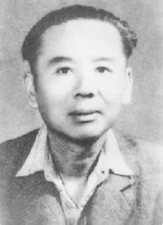
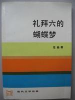

# 第七十二期：鸳鸯蝴蝶派

词条简介 

鸳鸯蝴蝶派亦称“礼拜六派”、“民国旧派小说”，它不是一个严密的文学团体，而是一个文学倾向相近、艺术趣味相投的都市小说流派。鸳鸯蝴蝶派形成的时间大约是“1908年左右”，一直延续到新中国成立，随着政治上的变革而结束。其活动时间约40年。鸳鸯蝴蝶派小说以言情小说为主，同时杂有狭邪小说、侦探小说、黑幕小说等，作家作品庞杂，影响甚大，主要集中在京、津、沪等大城市。

目录 

1 鸳鸯蝴蝶派的起源

2 鸳鸯蝴蝶派的困境

3 代表人物及作品

4 历史评价

5 延伸阅读

6 参考文献

1 鸳鸯蝴蝶派的起源

与世界上不少国家一样，中国也在十九世纪末二十世纪初涌动起通俗文学的滚滚洪流，真有浩浩荡荡、横无际涯之观，然亦有支流蜿蜒，亦有水势大小，及至四十年代末，内地终因政体变革而逐渐枯竭，前后持续半个多世纪。它发萌期的代表作品，有韩邦庆的《海上花列传》、孙家振的《海上繁华梦》、张春帆的《九尾龟》等；它终结期的代表作家有张恨水、张爱玲、徐讦、无名氏等。作者之众，作品的种数和印数之多，都远远超过五四以后的新文学，在社会上曾产生广泛而深远的影响。

五四新文化运动标志着社会和文化的转型，为建立新文学作家的“主体性”，并以此启蒙社会大众，开始对当时这一主流文学现象进行发难。清末民初的绝大部分通俗文学作者都成为牺牲品，被斥之为鸳鸯蝴蝶派。如果说，现代史上确实存在这一文学流派，那真是群体庞大、情形复杂的阵营。可惜他们并没有共同的宣言或宗旨，只是被认为有相同的“趣向”而被归纳在一起。鸳鸯蝴蝶派这个名称，不但是批判者所起，并且他的范畴和概念也在批判过程中不断修正。

据目前所知，最早提出鸳鸯蝴蝶派概念的是周作人，1918年4月19日，他在北京大学文科研究所作题为《日本近三十年小说之发达》的演讲时，批判当时旧形式、旧思想的中国小说，特别提到“此外还有《玉梨魂》派的鸳鸯蝴蝶体，《聊斋》派的某生者体，那可更古旧得厉害，好像跳出在现代空气之外的，且可不必论他”。1919年2月2日出版的《每周评论》第七期上，他又发表《中国小说中的男女问题》，称“今时流行的《玉梨魂》，虽文章很是肉麻，为鸳鸯蝴蝶派的祖师”。周作人说的鸳鸯蝴蝶派，乃专指才子佳人的哀情小说。鲁迅对鸳鸯蝴蝶派的理解，也是这样，直到1931年，他在《上海文坛之一瞥》中提及民初的情形，说道：“这时新的才子+佳人小说便又流行起来，但是佳人已是良家女子了，和才子相悦，分拆不开，柳阴花下，像一对蝴蝶，一双鸳鸯一样，但有时因为严亲，或是因为薄命，也竟至于偶见悲剧的结局，不再都成神仙了-----这实在不能不说是一个大进步。”可见狭义的鸳鸯蝴蝶派，仅此言情小说而已。至于“鸳鸯蝴蝶”的由来，是因为那些小说内容不外才子佳人，双双成对，故以鸳鸯、蝴蝶称之。新文学作家解释时，每每用“卅六鸳鸯同命鸟，一双蝴蝶可怜虫”来比喻。这两句诗魏子安《花月痕》第三十一回里韦痴珠的一声叹息，魏子安则从陈文述《无题》诗“七十鸳鸯同命鸟，一双蝴蝶可怜虫”而来，只是将“七十”改为“卅六”。另外还有一个解释，因为民初小说大量采用骈四俪六，辞藻艳丽，笔致缠绵，就像是成双成对的鸳鸯或蝴蝶。其实这也是当时风气，民初及推重骈文，政府文告、通电均用骈文，类乎《玉梨魂》虽以散体为主，掺入大量骈句，以求得小说的词章之美，这也是小说“文章化”的最后尝试。

2 鸳鸯蝴蝶派的困境

1919年1月，钱玄同在《新青年》第六卷第一号发表《“黑幕”书》，将“鸳鸯蝴蝶派的小说”与黑幕小说及《艳情尺牍》、《香闺韵语》等连类并举，并称“四年以来，凡变过集中面目，其实十六两还是一斤，内容之腐败荒谬是一样的”。同年同月，至希在《新潮》第一卷第一期发表《今日中国之小说界》，将当时的小说分成三派，“第一派是罪恶最深的黑幕派”，“第二派的小说就是滥调四六派”，“第三派的小说。比以上两种好一点，就是笔记派”。这第二派就是狭义的鸳鸯蝴蝶派，作者举例说：“诸位一看徐枕亚的《玉梨魂》、《余之妻》，李定夷的《美人福》、《定夷五种》，就知道了。”由此可见，鸳鸯蝴蝶派已成为“逆流”，但还是有所特指，并未将它扩大化。至于黑幕小说，乃是文学史上的冤案，当时世间有根据报刊上“黑幕征答”所编的《“黑幕”书》，周作人，钱玄同等误以为是黑幕小说，其实《“黑幕”书》属于新闻汇编一类，并不是文学创作。

至二十年代初，新文学作家加强了抨击力度，除对狭义的鸳鸯蝴蝶派穷追不舍外，将消闲和趣味的读物也作为批判的对象。这有个重要原因，那就是他们在和新文学争夺出版市场，并且新文学正处于劣势。1921年、1922年《文学旬刊》的“杂谈”专栏上就有郑振铎的不少文章，他并不否认对手的强劲，在《通讯》里他写道：“《礼拜六》那一类的东西诚然是极幼稚——亦唯幼稚的人喜欢罢了——的东西，根本要不得。中国近年的小说，一言以蔽之只有一派，这就是‘黑幕派’，而《礼拜六》就是黑幕派的结晶体，黑幕派小说只是以淫俗不堪的文字刺激起读者的色欲，没有结构，没有理想，在文学上根本没有立脚点，不比古典派旧浪漫派等等尚有其历史上的价值，他的路子是差得莫明其妙的；对于这一类东西，唯有痛骂一法。”至此，消闲和趣味的文学就被归入了“黑幕”，称之为礼拜六派。

随着新文学理论的推进，鸳鸯蝴蝶派的范围才逐渐被认定。1935年10月，郑振铎在《中国新文学大系文学论争集导言》里明确地说：“鸳鸯蝴蝶派的大本营是在上海。他们对于文学的态度，完全是抱着游戏的态度的。那时盛行的‘集锦小说’——即一人写一段，集合十余人写成一篇的小说——便是最好的一个例子。他们对于人生也便是抱着这样的游戏态度的。他们对于国家大事乃至小小的琐故，全是以冷嘲的态度处之。他们没有一点的热情，没有一点的同情心。只是迎合着当时社会的一时的下流嗜好，在喋喋地闲谈着，在装小丑，说笑话，在写着大量的黑幕小说，以及鸳鸯蝴蝶派的小说来维持他们的‘花天酒地’的颓废的生活。几有不知‘人间何世’的样子。恰和林琴南辈的道貌岸然是相反。有人谥之曰‘文丐’，实在不是委屈了他们。”这样一来，凡民国期间强调趣味性、娱乐性和秘闻性的文学，特别是小说（尤以长篇小说为主），包括社会、黑幕、娼门、哀情、言情、黑幕、家庭、武侠、神怪、军事、侦探、滑稽、历史、宫闱、民间、反案等各类题材，也就是现代通俗文学的几乎全部，都被纳入鸳鸯蝴蝶派的范围。

由于鸳鸯蝴蝶派长期以来遭到新文学作家的詈骂和奚落，几乎成了“封建”、“守旧”、“顽固”，“堕落”的代名词，被“派定”为其中的人，大都不领此“恶谥”。周瘦鹃就只承认自己是礼拜六派，他在《闲话〈礼拜六〉》里说：“我是编辑过《礼拜六》的，并经常创作小说和散文，也经常翻译西方名家的短篇小说，在《礼拜六》上发表的。所以我年轻时和《礼拜六》有血肉不可分开的关系，是个十十足足、不折不扣的礼拜六派。”并说，“至于鸳鸯蝴蝶派和写作四六句的骈俪文章的，那是以《玉梨魂》出名的徐枕亚一派，礼拜六派倒是写不出来的。当然，在二百期的《礼拜六》中，未始捉不出几对鸳鸯几只蝴蝶来，但还不至于满天乱飞遍地皆是吧！”包天笑则在《壬寅杂诗》的《鸳鸯蝴蝶派》一首下注道：“1959年出版的《中国文学史》，大谈其鸳鸯蝴蝶派，说我是这个派的主流。又说我‘作品体裁多样，长篇、短篇、话剧、诗歌，无不染指’。读之不胜愧悚。最近上海友人又赠我以魏绍昌所编《鸳鸯蝴蝶派研究资料》一书，厚厚一巨册，当然对我亦无恕词。我虽不愿戴鸳鸯蝴蝶的帽子，然亦无申诉之余地，有许多同文说是‘乱点鸳鸯谱’，我也未免语涉不庄。试想我当时亲老家贫，卖文为活，不免东涂西抹，安足供文学史的资料呢？”至于范烟桥、郑逸梅等则自封为“民国旧派”，他们知道自己不属于新文学阵营，但又要与鸳鸯蝴蝶派划清界限。张恨水更不承认自己是派中之人，1944年，他在五十岁生日茶会时作的《总答谢》中说：“我曾受民初蝴蝶鸳鸯派的影响，但我拿稿子送到报上去登的时候，上派已经没落，《礼拜六》杂志，风行一时了。现代人不知，以为蝴蝶鸳鸯派就是礼拜六派，其实那是一个绝大的错误。后者，比前者思想前进得多，文字的组织也完密远过十倍。但我这样说，并不以为我是礼拜六派，远胜鸳蝴派。其实到了我拿小说卖钱的时候，已是民国八九年，礼拜六派，也以五四文化运动的巨浪而吞没了。我就算是礼拜六派，也不是再传的孟子，而是三四传的荀子了。二十年来，对我开玩笑的人，总以鸳鸯蝴蝶派或礼拜六派的帽子给我戴上，我真是受之有愧。我决不像进步的话剧家，对文明戏三字那样深恶痛绝。”这几位被称为鸳鸯蝴蝶派名家的人，都不承认是派中之人，并非全是想处身事外，而是他们对鸳鸯蝴蝶派的理解，还停留在徐枕亚《玉梨魂》的时代，故而认为自己并不在其中。岂不知它的范围越圈越大，民国时期的文学，除新文学以外，几乎都归并在一起了。

3 代表人物及作品

代表人物： 从鸳鸯蝴蝶派这个创作群体的主流来看,他们大多是清末民初最具影响力的社团———南社的社员,如许指严、朱鸳雏、包天笑、徐枕亚、周瘦鹃、范烟桥、姚民哀、徐天啸、赵苕狂、陈蝶仙、叶楚伧、闻野鹤、刘铁冷、王西神、贡少芹、苏曼殊、胡寄尘、程善之、戚饭牛、蒋箸超、谈善吾、宋痴萍、张冥飞、叶中冷、姜可生、陆澹安等,他们活动的空间多在上海,从事的是新兴的行业——报刊业,他们的思想意识和创作成就不仅在南社占有一席之地,在鸳鸯蝴蝶派中也是中坚力量。

代表作品： 《镜花水月》、《啼笑姻缘》、《金粉世家》、《秋海棠》、《杨乃武和小白菜》、《[广陵潮](http://baike.baidu.com/view/1185728.htm)》、《[江湖奇侠传](http://baike.baidu.com/view/1187095.htm)》、《断鸿零雁记》、《玉梨魂》、《情茧》、《恋之梦》、《爱途历程》、《言情小说家之奇遇》、《火车中》、《沧州道中》、《东方神侠传》、《舞宫春艳》、《民国艳史》、《唐代宫廷演义》、《海外缤纷录》。

4 历史评价

一个民族的文学发展到成熟时期，出现了众多的作家和大量的作品，特别是有的杰出作家以其高度的艺术成就和独特的风格吸引人们竞相仿效，才能形成流派。五四运动以后的二三十年代,“文学研究会”、“创造社”、“鸳鸯蝴蝶派”、“新月派”等文学流派的产生是当时文学繁荣的表现之一。

半个多世纪以来，由于政治的过分干预，文学失去了独立性，对于一些文学现象的批判自然失之公允。现代文学史上对鸳鸯蝴蝶派的评价直至今天基本上还是否定多与肯定，有些甚至遮蔽历史，避而不谈，这不是科学的作法。即使’文革’前大学中文系的毕业生，也恐怕连一部鸳鸯蝴蝶派的作品都没读过，起码不会作为一个文学流派来选读它的作品。1998年，由人民教育出版社和江西人民教育出版社出版、2002年第4次印刷至今仍在使用的“全日制普通高级中学教科书（试行本）”《中国文化史》对鸳鸯蝴蝶派评价：“民国初年出现的专写’才子佳人’的鸳鸯蝴蝶派作品也由最初的一点点进步趋向演变成远离现实生活的’言情小说’、’狭邪小说’，甚至有浓重思想毒素的色情小说。”

由此可见，客观正确地评价鸳鸯蝴蝶派，还其本来面目，已成为现代文学史上一个严肃的课题，迫在眉睫。从文学的意义来看，鸳鸯蝴蝶派至少两点应载入史册：

第一，鸳鸯蝴蝶派传承了中国传统文学。苏州大学汤哲声认为：“中国现代文学有两条发展线索，一条是1917年开始的中国新文学，后来发展演变成纯文学的路子；另一条是清末民初大约1902年左右从梁启超《论小说与群治之关系》之后发端的大众文学，继鸳鸯蝴蝶派小说而发展演变的通俗文学。这一条线索1949年在大陆随着新中国的诞生而中断，但是在港台地区却得到了延续和发展，金庸就出现在这条发展线上。”

第二，鸳鸯蝴蝶派在艺术上有许多的创新，弥补了新文学的不足，丰富了文学宝库。如徐枕亚的《玉梨魂》是中国第一本歌颂寡妇恋爱的小说，他的《雪鸿泪史》是中国第一本长篇日记体小说；包笑天的《冥鸿》是中国第一篇书信体小说。这些创新都代表了当时中国文学的水平。

从文学发展历史的长河来看，鸳鸯蝴蝶派虽然是昙花一现，但它的风姿在现代文学百花园中独领风骚，留下了永不磨灭的印痕。

5 延伸阅读

1 《[鸳鸯蝴蝶派与近代小说观念的演变](http://d.wanfangdata.com.cn/periodical_sddxxb-shkx200203012.aspx)》 黄丽珍 《山东大学学报》（人文社会科学版） （2002年第3期）

2 《鸳鸯蝴蝶派与民初办报热潮之关系》 [黄雯](http://search.cnki.com.cn/Search.aspx?q=author:黄雯) [《贵州民族学院学报(哲学社会科学版)》  （1999年01期](http://www.cnki.com.cn/Journal/H-H7-GZMZ-1999-01.htm)）

6 参考资料

1 《审视“鸳鸯蝴蝶派”》 白世星 华北水利水电学院学报（社科版） （2005年第21卷第4期）

2 《关于鸳鸯蝴蝶派》 王稼句 《十月》（2007年第3期）

（编辑：高丽 ； 责编：高丽）

## 
