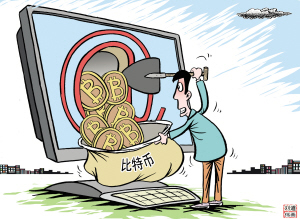

# 第七十八期：比特币

### 比特币的由来

1976年，奥地利经济学家哈耶克在他的《货币的非国家化》中首次阐述了去国家化的非主权货币的构想，提出了一个革命性的建议：**废除中央银行制度，允许私人发行货币，并自由竞争，这个竞争过程将会发现最好的货币。**据此诺贝尔经济学奖得主弗里德曼产生一个伟大的灵感：**可以用计算机技术来建立比国家信用更可靠的货币体系。**弗里德曼构思了一个自动化装置，可以按程序来发行货币，从而避免各国央行无限制的开动他们的印刷机。可是，怎么来实现这一设想？怎样去制造不可伪造的货币呢？

2008年11月1日，一个名不见经传，自称中本聪(SatoshiNakamoto)的网友，在metzdowd.com的密码学邮件组中发表了《比特币：一种点对点的现金支付系统》，阐述了他对电子货币的新构想。自己开发出了一个叫做比特币的开源电子现金系统，它完全去中心化，没有中央服务器或者托管方，不受任何政府、任何银行的控制，所有一切都是基于参与者。

讲到这里，我们知道了第一个概念，**比特币其实就是电子货币。**同腾讯的Q币、人人网的人人豆一样，都是虚拟的，不存在实体的东西。

### 比特币为什么能够充当货币

货币是一种特殊的商品，特殊性在于，其主要的用途是交换媒介，这种用途，构成了该商品的部分价值。原来人们都是通过以物易物的方式进行贸易。某个地方的人发现羊可以换到大多数商品，其他商品开始以“换XX头羊”作为标价，此时，羊就成为了一般等价物。因为充当实物货币，牛、羊、猪等牲畜不能分割，五谷会腐烂，珠玉太少，刀铲笨重，故最后集中到海贝这一实物货币。后来，经过长年的自然淘汰，在绝大多数社会里，作为货币使用的物品逐渐被金属所取代。使用金属货币的好处是它的制造需要人工，无法从自然界大量获取，同时还易储存。数量稀少的金、银和冶炼困难的铜逐渐成为主要的货币金属。

早期的金属货币是块状的，使用时需要先用试金石测试其成色，同时还要秤量重量。随着人类文明的发展，逐渐建立了更加复杂而先进的货币制度。古代希腊、罗马和波斯的人们，由官府铸造重量、成色统一的硬币。这样，在使用货币的时候，既不需要秤量重量，也不需要测试成色，无疑方便得多。这些硬币上面带有国家元首，如国王、皇帝等君主的头像、复杂的文章和印玺图案，以免伪造。

到这个时候，货币的效用得到了国家的信用支撑，人们不用担心自己手头的货币不能够兑换物品。但同时，货币的铸造被国家垄断。一般来说，国家拥有比较好的信用，不那么容易破产。但国家垄断货币以后，也有很不讲信用的一招：通货膨胀。通货膨胀的本质是抵赖所欠债务，剥夺人民财富，总的会对社会经济造成负面影响，这是哈耶克最最深恶痛绝的地方。看看金融史，过去并没有什么严重的通货膨胀。最严重的通货膨胀，也称作恶性通货膨胀，统统发生在上个世纪，正是伴随货币体制一体化的进程兴起的。

而比特币有着以下几个特征：

**1、难以获取：**比特币的本质其实就是一堆复杂算法所生成的特解。特解是指方程组所能得到无限个(其实比特币是有限个)解中的一组。而每一个特解都能解开方程并且是唯一的。而挖矿的过程就是通过庞大的计算量不断的去寻求这个方程组的特解，这个方程组被设计成了只有 2100 万个特解，**所以****比特币的上限就是 2100 万。**

而所谓的“挖矿”，意思就是解题。比特币系统会不断地给玩家的计算机提供所谓的“苦力题”，**即毫无捷径可循，全靠卖苦力死算的题目。**谁先做出就可获得一定数量的新货币—相当于发行了这一数量的货币。然后你可以保留这些货币，或者卖掉，换取现金。**挖比特币多采用烧显卡的方式工作，耗电量极大。尽管可以说每台电脑都可以参与到比特币的挖掘工作中，但个人挖矿难度大，费用高。**《京华时报》报道了一个“老范”的故事：2013年年初，老范浏览了多个比特币论坛之后，找了一个合适的“矿池”，注册好账号，在电脑上下载了一个“挖矿”软件，让它不停运算。所谓“挖矿”，就是让电脑根据比特币固定算法进行不断计算以获得比特币，电脑配置特别是显卡、芯片的性能决定了电脑的计算能力，也就是比特币的收益。为此，老范花了1300元买了一款中高档的AMD显卡“RadeonHD7850”，在运行一天一夜之后，发现得到了0.01个比特币，按当时的行情价大概值7元钱。

**2、普遍认证：比特币网络是一个在线系统，比特币本身作为一串数(特解)离开了比特币网络一点用处也没有，这些数只有放进比特币网络里才能正常运作。**比特币网络被设计成了一种存储数据库，但是这个数据库并不存在某个中心的服务器里而是面向所有人公开：每一个比特币钱包都是一个节点。意味着每一笔交易都能够直观地被其他所有人捕捉，而且只有当所有人都认可某个解的时候才能够产生比特币。

**从这点来看，比特币自身的运算机制充当了国家银行的功能。**

3、不可破解：修改本地的数据，达到篡改比特币的目的很简单。就如在电脑上直接修改游戏源代码一样，金币经验修改数据只是分分钟的事情，但是这种方式只能够在单机游戏上有效。

之前已经讲到，比特币的数据库是在互联网上的，也就是云数据库。这个数据库里面的所有数据都是公开，每一个用户节点也都是同步的。当某个用户的数据与其他人所看到的数据产生差异时，其他人可以否认对此用户的数据进行否定。从而这个人的修改就是不成功的。另一方面，比特币虽然是匿名的但是也是完全透明的，只要你想的话，你可以在本地的数据库中追查到某个比特币从被发现之时起所有交易经过的节点。通过这些交易记录与那些各大比特币交易所的市场深度进行对比，其实要人肉某个账户相对来说也是比较容易的。

**所以，修改比特币的规则只能同时得到所有参与者的认可。而这一点明显是不可能的。**

(编辑：方小华；责编：陈澜鑫)
