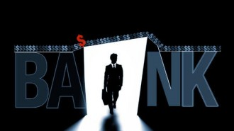
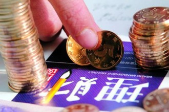
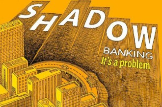

# 第七十六期：影子银行

**编者按**： 影子银行这个新生名词，在金融危机后突然引起了全球的关注，似乎中国的影子银行也在媒体的渲染之下显得可怕万分，犹如中国经济的一颗定时炸弹，那么，影子银行究竟是什么，又是否真的有传说中那么可怕呢？

##  词条简介：

影子银行是指那些在传统商业银行业务以外从事存放款业务的机构和活动，在中国主要包括地下钱庄、理财产品、信托公司以及部分金融衍生品等。影子银行体系的出现一方面活跃了金融市场，另一方面由于相对隐秘不易监管，也给整个经济系统带来了较高的潜在风险。

##  目录

1 什么是影子银行？

2 影子银行在中国发展如何？

3 如何评价影子银行对经济运行的影响？

4 怎么确定你说的是真的？

5 如果我对影子银行还有兴趣，可以阅读哪些材料？

###  1. 什么是影子银行？

不管从哪方面来说，影子银行都是经济金融发展过程中的一件新鲜事儿，这个概念最早由美国人保罗·麦考利（Paul McCulley）在2007年提出，彼时震撼世界的金融危机还只是初现端倪而已。麦考利用“影子银行体系”（shadow banking system）概括那些有银行之实却无银行之名的种类繁杂的各种机构。

一个学院派的定义可能会告诉你，影子银行是指“在传统银行体系外的信用中介体系，包括各种金融实体和业务活动”，“这些机构通常从事放款，也接受抵押，是通过杠杆操作持有大量证券、债券和复杂金融工具的金融机构”。其实抛开这些严谨的术语，简单说来，**影子银行就是在不同程度上替代商业银行核心的存/放款功能的那些机构或者业务。**

鲜为人知的影子银行

（图片来自网络）

###  2. 影子银行在中国发展如何？

作为一个新生事物，影子银行的范畴其实很广，在金融发达的经济体中，影子银行体系相对更加庞杂，而在中国，由于金融业整体还在发展阶段，因此影子银行体系也相对简单。

但简单不等同于规模小，对于国内影子银行规模的估计众说纷纭，但大多数估计都在二十到三十万亿人民币左右（约为2012年中国GDP的50%），新增的信用中也有将近一半由影子银行提供。中国的影子银行不仅规模惊人，而且发展速度也很快，据估计，在2010年到2012年之间，中国的影子银行规模短短两年内几乎翻了一番。

至于国内影子银行的主要构成，我们平常见到最基本的影子银行就是**地下钱庄**了，这些主要分布于沿海富裕地区的钱庄用相对较高的利率吸收附近居民的存款，同时向被主流银行忽略的小企业提供高息贷款。而存在于全国各地的**小贷公司**（想必大家都收到过它们的广告短信）在传统的商业银行体系之外提供贷款业务，也是中国影子银行的基本构成部分。此外，商业银行提供的**理财产品**虽然看上去与存款差不多，但由于这类业务本质上不是债权关系，不同于传统的存贷款业务，因此是一种具有中国特色的影子银行。

如果我们要看看影子银行在中国更高级的形式，那么最主要的就是**信托公司**了，它们主要通过以高利率放贷给高风险客户（特别是由于政策原因难以取得银行贷款的房地产开发商们）来实现盈利。而银证合作（银行与证券公司合作）、银信合作（银行与信托公司合作）、资产证券化等或简或繁的**金融衍生产品**以及一些**私募基金**由于在某种形式上提供了放款业务，因此也属于影子银行的范畴。

理财产品也是中国影子银行体系的重要组成部分

（图片来自网络）

影子银行体系运作示意图

（图片来自网络）

###  3. 如何评价影子银行对经济运行的影响？

说到影子银行，不管是经济学家还是政府官员，大都同意一点，那就是影子银行体系蕴藏了巨大的潜在风险，必须加强监管。

为什么影子银行比商业银行具有更大的风险呢？我们先来看商业银行，传统意义上商业银行的资金主要来源于存款，在留取一定存款准备金后再做贷款。商业银行是整个金融体系的核心，如果它不能够及时兑付存款，那么很可能引发骨牌效应，导致金融机构大面积倒闭，上世纪二三十年代的大萧条加剧就是始于银行的大量倒闭。自那以后，商业银行一直受到监管部门的严格监管，比如说，商业银行必须维持存款准备，保持资本充足率不低于8%，即杠杆率不能够超过12.15，并向存款保险体系缴纳保险费等。（简单理解就是商业银行不能无限制不顾风险的放贷，而必须受到某些硬性指标的限制，同时还必须给客户的存款上保险，以确保一旦自己倒闭了还有保险公司来赔偿客户的损失。）也正是得益于严格的监管，从大萧条之后，商业银行一直没有发生过大规模的倒闭潮，也没有酿成过真正系统性的金融危机。

但影子银行则不同，由于属于新生事物，它所受到的监管比商业银行还少很多，影子银行的高杠杆率放大了其面对的风险，而且影子银行的交易大多采用场外交易的方式，受到的监管更少。比如说，影子银行中的证券化产品基本上都是通过高度数学化的模型计算风险而设计出来的，如果这些资产的品质能够维持在模型的安全范围内或房价在上升，那么影子银行不仅能够有效运作，而且这种证券化按揭产品表面上也能够分散风险，但当房价上涨假定不成立或房价下跌时，这种广泛分散的风险则会把其中的风险无限放大。可以说，次贷危机就是由于影子银行体系放大了风险而一步步演化成金融海啸的。

简单来说，**影子银行是在或多或少做着传统意义上由商业银行来做的事情，它们有着比商业银行更大的风险，却接受着比商业银行要少得多的监管。**一旦影子银行中少受甚至不受监管的风险集中爆发，那么对经济造成的冲击将是非常可怕的。也正是由于这个原因，金融危机后各国经济学家和监管部门都在积极讨论如何将影子银行纳入到系统的金融监管体系中来，以降低它可能带来的风险。

**但倘若认为影子银行单纯只是经济运行中的一颗定时炸弹，那倒也不尽然。**影子银行实质上是金融市场不断发展的产物，它相较于商业银行更加灵活，能满足企业和个人多种多样的融资需要，**尤其是在金融行业高度管制的中国，影子银行的存在更有其独特的意义。**众所周知，中国的商业银行面临着严格的利率管制，很多情况下企业想贷款却贷不到，银行想放款却不被允许，在这样一种金融制度下，影子银行体系的存在就在很大程度上解决了供求双方的需求，而且影子银行体系中更加自由的利率设定也打破了官方的利率管制，相对更加合理的配置了资源。因此，**中国的影子银行体系反而可能在某种意义上倒逼金融的自由化改革，对于中国的影子银行体系，堵不如疏，应纳入监管体系使之更加透明，但如果贸然取缔也绝非上策。**

影子银行体系的发展给监管带来了一系列新的问题

（图片来自网络）

###  4. 怎么确定你说的这些都是真的？

本文在写作过程中参考了以下资料，这些资料都来自专业人士和严肃媒体，值得信赖，但由于条件所限笔者无法对参考资料中的信息真实性逐一进行核对，如有差错还望读者见谅：

[1] 李扬.影子银行体系发展与金融创新.中国金融，2011（12）.

[2] 易宪容.“影子银行体系”信贷危机的金融分析.江海学刊，2009（3）.

[3] FT中文网:中国影子银行隐藏的风险.

[4] FT中文网: 中国影子银行功与过.

[5] FT中文网: “中国特色”的影子银行.

###  5. 如果我对影子银行还有兴趣，可以阅读哪些材料？

对于影子银行在中国的发展状况和未来出路，财新网的专题有比较详细的介绍，很好的结合了中国实际，从中可以对影子银行在中国的发展状况有一个大致的了解。网址在这里：[http://finance.caixin.com/2012/yingziyinhang/](http://finance.caixin.com/2012/yingziyinhang/)。

此外，如果你对影子银行对经济运行的影响有兴趣，不妨读一读索尔金著、巴曙松等人翻译的[《大而不倒》](http://www.amazon.cn/gp/product/B0043VD5JU/)，这本书详细描述了金融危机中投行和监管部门的众生百态，可以看到金融危机是如何在影子银行的催动下一步步酿成的，值得一读，比起《货币战争》之流，不知道高明到哪里去了。

（编辑：戴青 ；责编：高丽）
