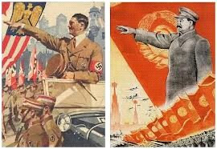

# 第七十四期：魔弹理论

**编者按：**魔弹理论是公认的最早出现的传播效果理论假说。那么，魔弹理论的内容具体有哪些？它产生的背景是什么？人们对魔弹理论的评价又有哪些？魔弹理论在互联网时代还有其生命力吗？本期百科针对这些问题向读者逐步解答。

**词条简介：**

**魔弹理论，是在20世纪20年代，结合弗洛伊德学说和行为主义理论形成的一种宣传理论。**该理论认为全能的媒介负责发送信息，而分散的大众负责接受这些信息。受众无力自觉抵制媒介的操作。如果将“魔弹”效应理解为同仇敌忾的同义词，就会明白，“魔弹”效应不仅出现在二战时期，而且在历史上屡屡出现，并不断重演。

**目录:**

1 魔弹理论的主要主张

2 广播节目火星人入侵地球事件

3 魔弹理论的盛行及再现的可能

4 魔弹理论产生的背景

5 对魔弹理论的评价

6 魔弹理论与网络

7 参考文献

8 延伸阅读

**1.魔弹理论的主要主张**

**魔弹理论，又称靶子论、皮下注射理论，是在20世纪20年代，结合弗洛伊德学说和行为主义理论形成的一种过于简单化的宣传理论。**前者主张人类的行为是个体的本我、自我、超我互相斗争的产物。后者认为人类的所有行动都只是对外部环境刺激的条件反射。

魔弹理论是公认的最早出现的效果理论假说。

魔弹理论认为：**传播具有极其强大的威力，**受传者就像是射击手面对的孤零零的靶子或是躺在病床上接受治疗的病人一样，任由媒介扫射，只要枪口瞄准靶子，或者针头准确扎入病人的身体，子弹或药水就会产生强大而神奇的效果。传播者只要使信息对准受传者，就可以把自己的思想、情感和动机灌注到受传者的脑海中，迅速使受传者的态度和行为发生改变。即媒介能渗入人们大脑，迅速制造效果。

**该理论把媒介对人的刺激看作是魔弹渗入受众的大脑，并迅速使受众将特定的概念与强烈的情感之间建立起联系的过程。**宣传家相信：通过对这些魔弹的精心控制，能使受众本能地把正面的情绪（如忠诚、崇敬）与自己的国家联系在一起，而把负面的情绪（如恐惧、憎恶）与他们的敌人联系在一起。

**该理论认为全能的媒介负责发送信息，而分散的大众负责接受这些信息。受众是纯粹的乌合之众。受众无力自觉抵制媒介的操作。**理性只是形同虚设，完全不能抵挡强大讯息的侵入，受众没有能力对这些讯息进行筛选、批判。**受众多是受到本能驱使的、没有个性和独立见解的人群，他们孤寂无援，彼此隔离，难以沟通，除了有限的社会规章、法规、契约外，严重依赖大众传媒与社会发生关系。**

魔弹理论推断了一些行为主义理论没能充分验证的东西：外部刺激（比如那些通过大众媒介传输的观念），实际上能使所有的受众都按照高明的宣传家所期待的方式行事。

**2. 广播节目火星人入侵地球事件**

在历史上，魔弹理论的倡导者曾引用无数的例子，来证实媒介的显著力量。其中最有名的一个例子是火星人入侵地球事件。

1938年10月30日，万圣节的前一天，美国哥伦比亚广播公司的《火星剧场》播出了一个令人震惊的消息：一个巨大的陨星落到了新泽西的一个农场里，纽约正面临火星人的进攻。

剧中运用了逼真的音响效果，**使600万听众中的至少100万人真以为外星人从天而降，由此陷入极度的恐慌中，惊恐万状地祈祷、躲藏、 哭喊，四处逃散。其实，当晚人们听到的这个消息是假的，它是哥伦比亚广播公司根据英国科幻小说家威尔斯的科幻小说《星际战争》改编的广播剧《火星人入侵地球》。**

只不过，广播剧运用了逼真的音响效果，被奥森·威尔斯和他所在的水银剧团(MercuryTheater group)演播得绘声绘色。通常，广播剧播出10分钟之后会播放一段音乐休息一下，但是，当天的音乐被“突发新闻”取代了：一个天文学家(由奥森·威尔斯扮演)证实，可以观测到火星上有几个很显眼的爆炸产生的“白色炽热气团”。紧接着，新闻称：一个“巨大的燃烧的物体”已经降临到了新泽西附近的一个农场，播音员还以记者的口吻描述说，他看见了火星人正从一个太空船里爬出来。“我的天，有个东西正在爬出太空船！”播音员在做“现场报道”：“他身上闪着光泽，就像湿漉漉的皮毛发出的光泽。啊，他的脸，……简、简直是难以形容！1938年，全世界笼罩在第二次世界的阴影里，而《火星人入侵地球》所用的手法———急促的、喘着气的报道，同一个月前报道“慕尼黑危机”时的方式一模一样。 据普林斯顿大学事后调查，整个国家约有170万人相信这个节目是新闻广播，约有120万人产生了严重恐慌，要马上逃难。实际上，广播剧播出时，开始和结尾都声明说这只是一个改编自小说的科幻故事，在演播过程中，哥伦比亚广播公司还曾4次插入声明。然而，谁也没有料到，该节目会对听众产生如此巨大的影响！

**3. 魔弹理论的盛行及再现的可能**

20世纪20年代至40年代，魔弹理论开始盛行。

魔弹理论最早在一战中被协约国使用。协约国通过宣传技巧，强化沮丧和挑拨离间来摧毁敌人的意志。

后来,德国在纳粹时期，成功实践了魔弹理论。**当时政府严格检查所有可控制的报刊和广播内容，实行新闻封锁；向民众轮番轰炸来自政府和党派的片面信息，鼓吹日耳曼主义和复仇主义。**

**在魔弹效应产生的年代，出现魔弹效应有个共性的条件，就是强烈的信息不对称性。即，受众对事实真相的了解程度远不及信息的发布者。**

尽管这个理论已经被认为是过时的理论，但从实践中看，只要条件成熟，“魔弹”效应还会出现。**如果将“魔弹”效应理解为语同仇敌忾的同义词，就会明白，“魔弹”效应不仅出现在二战时期，而且在历史上屡屡出现，由来已久，并不断重演。**

魔弹理论在一些非常态的社会背景下可能会再次出现，且已被许多事例证实。

官方或权威的信息若有拖延，流言就会趁虚而入。这些流言对受众会产生无法想象的深刻影响，甚至左右受众的行动。

**4. 魔弹理论产生的背景**

**魔弹理论形成的社会背景是第一次世界大战，**战后有一种观点认为，德军不是在战场上被打败的，而是受协约国宣传的影响丧失斗志，在敌军还没有进入本国领土的情况下就崩溃而投降的，说明大众传播能产生奇迹般的巨大效果。

魔弹理论形成的理论背景是当时西方盛行的本能心理学和大众社会理论。本能心理学认为，人的行为正如动物的遗传本能反应一样，是受"刺激—反应"机制主导的，施以某种特定的刺激就必然会引起某种特定的反应。大众社会理论则认为，大众社会中的个人，在心理上陷于孤立，对媒介的依赖性很强，因而导致媒介对社会的影响力很大。

**5. 对魔弹理论的评价**

当人们处于战争、灾难、困境等情况下，即在人的切身利益受到威胁的时候，人们会变得神经质、迷信权威，并表现出明显的从众心理，此时的传播往往能产生惊人的效果。

然而，传播者与受众之间的关系远不是子弹与靶子那么简单，受众不是单纯地被传者左右和支配。**将受众视为毫无分析与辨别能力，而只是被动接受信息，忽略传播效果与传播环境、传播内容等的群体是“魔弹”论的最大局限。**

事实上，传播效果的产生与传播环境、传播媒介的公信力、传播内容以及受众的媒介素养等因素都有直接关系。

**有研究认为，只有受众认为传播的内容与自己的利益具有高度联系的时候，受众才可能被“魔弹”击中。受众在多数情况下，并不是无力的、散乱的信息接收者。与之相反，受众善于选择和操纵信息，不愿受到不知名力量的摆布。**

故而，魔弹理论有唯意志论之嫌。它过分夸大大众传播的力量和影响，却忽视影响传播效果的各种客观社会因素，否定受众对大众传媒的能动的选择和使用能力。

有关这一理论的研究大都是建立在观察基础上的结论，并未经过严密的科学调查与验证。这种理论过分夸大了大众媒介的影响力，同时也忽视了受众对大众传播的自主权的前提。受众是具有高度自觉的主人，他们对信息不仅有所选择，而且还会自行决定取舍。

此外，这一理论还忽视了影响传播效果的各种社会因素。传播效果与当时当地的社会环境、媒介环境、群体心态、政治军事经济及文化背景密切相关。不能把传播效果放到"真空"中去考察。

**决定媒介效果的最根本的因素是受众的经验域，其一般与受众的经济地位正相关。同时，另一个也非常重要的因素，即受众的经验处理能力(包括对既往经验的利用能力和对新经验的接收能力)，其一般与受众的受教育程度正相关。**受众的经验域和经验处理能力是一对相互作用、相互联系的因子，二者共同决定媒介的效果。

媒介的作用分为两个过程一个效应，两个过程即个体经验的公示化与经过受众参与的个体经验公共化;一个效应即累积效应，包括单经验(历时)效应和多经验的(历时)多重迭加效应。公示化过程，受众一般不参与;公共化过程，必须受众参与才能发生。

**6. 魔弹理论与网络**

网络已经成为反映社情民意的重要渠道。公众对自己关心或与自身利益紧密相关的各种社会现象与问题，都可以通过网络表达出自己的意见和态度。纵观各种热点事件，正是在网络放大效应的作用下，由个别事件上升为公共事件，由少数人关注演变成千万人“围观”，网络已经具备“公共领域”的性质。

网络虽是一个虚拟社会，但其公共领域的性质仍得以体现。人们在网络上对某个话题进行讨论、发表意见，类似于生活中众人在公共场所聚会议事。

**在21世纪的网络环境中，“魔弹理论”似乎又显山露水，尤其在网络热点事件的传播过程中，与事件相关的信息特别是负面信息，频频成为“魔弹”击中的目标。**

网络环境中，各种信息被大量地复制，网民通过点击、跟帖、发帖、网络投票、转发等方式参与传播，其传播效果异常强大。随着信息技术的普及，自媒体日益活跃，话语权不再只是被官方或少数知识精英所垄断，普通公民发布信息越来越便利。每个人都可以是记者，每个人都可以利用网络作为新闻发布的平台。而新的自媒体传播形式――微博，从其信息发布来看，140个字的信息量只要1秒钟的时间就能得到广泛传播。**一旦发生突发事件，如政府信息发布节奏跟不上民间，甚至拖延和隐瞒事故，各路流言就会乘虚而入。这些流言并不都是谣言，而是有待证实的传言。在政府部门没有有效回应的情况下，这些传言会造成受众在选择上采取“宁可信其有”的态度，这些网络信息便像“子弹”一样射中受众，影响他们的情绪，引发他们的行为，从而出现网络传播的“魔弹”效应。**

归纳起来，**网络环境下“魔弹”效应产生的原因在于：一是网络传播的互动性、便捷性使然；二是社会问题给民众带来的心理不安，使人们变得轻信、感性而易于接受网传信息；三是政府信息公开、透明程度尚未达到民众要求，给网络传言提供了传播的机会。**

互联网是网民们分享信息的感性平台，而非追求理性公正的传统媒体，当网民们以互联网作为公共领域进行对话、辩论时，不可避免地伴有情绪化倾向。同时，全球化带来的“民主监督”概念近年来在我国快速传播，使得民众对政府信息公开的要求变得异常强烈。而近两年大多数的网络热点事件，都与政府信息公开不及时或不充分有直接或间接的关系。

7. 参考资料

[1] 《大众传播理论:基础、争鸣与未来》（清华大学出版社） （美）斯坦利·巴兰（Stanley J.Baran），（美）丹尼斯·戴维斯（Dennis K.Davis）著；曹书乐译

[2] 管学军 《古老的魔弹理论》

[3] "魔弹论".大众传播学

[4] 中国新闻观察中心：[谁把谁击倒——“魔弹论”の再思考 ](http://www.1a3.cn/cnnews/dzcb/200910/10795.html)

[5] 《浅议“魔弹论”思想的存在历史及再现可能》 周音孜 《今传媒》（2013 年第6 期 ）

[6] 四月网：[李刚门”——谈网络热点事件负面信息的“魔弹”效应](http://opinion.m4.cn/2012-05/1163027.shtml)

[7] 传播学百科网：[广播节目火星人入侵地球](http://www.chuanboxue.org/index.php?edition-view-9736-2.htm)

8. 延伸阅读

[1] [“500次转发”止于官方的信息透明.腾讯网](http://view.news.qq.com/a/20130921/001968.htm)

[2] [“转发超500次”涉寻衅滋事罪？-新华网](http://news.xinhuanet.com/legal/2013-09/20/c_125415741.htm)

[3][甘肃“质疑命案转发超500次被拘”当事人微博曝光_资讯频道_凤凰网](http://news.ifeng.com/mainland/special/dajiwangluoyaoyan/content-3/detail_2013_09/20/29760814_0.shtml)

(编辑：张涛 责编：高丽)
