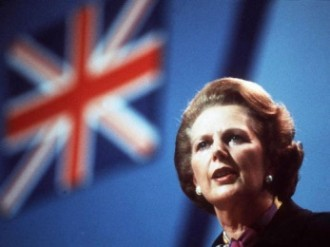
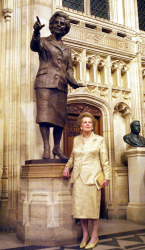
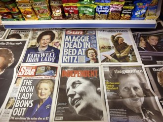

# 第五十九期：撒切尔主义

**编者按：**随着一代“铁娘子”撒切尔夫人的离世，她所推行的撒切尔主义又再次引起热议，在被时人讥为’英国病”，长达多年的经济滞胀现象面前，撒切尔主义是怎样产生？又是怎样帮助英国社会走出泥沼的呢？本期百科将为读者介绍撒切尔主义。

**本词条在以下文章中被使用：**

1. <风月江山>：[《玛格丽特来到东方 玛格丽特离开东方》](/archives/32574)

2. <七星百科>第二十五期：[鹰派](/archives/21914)

3. <开阳>：[凯恩斯主义的问题与出路（上）](/archives/21076)

4. [替代资本主义之“参与型经济”](/archives/2289)

**词条简介：**

“撒切尔主义”是一个用来概括撒切尔夫人执政主张和措施的概念，范围涵盖了经济、政治、意识形态、文化等多方面，核心是推行私有化和自由市场，是兴起的新自由主义在英国的体现，对英国经济乃至整个英国社会都有着深远的影响。

**目录**：

1 “撒切尔主义”产生的背景

2 “撒切尔主义”的主要内容

3 对“撒切尔主义”的评价

4 参考文献

5 延伸阅读

 

**一、“撒切尔主义”产生的背景**

二战中英国受到重创，国家实力不可挽回地衰落了。英国人开始向往工党所倡导的战后新社会，同时保守党也开始反思30年代大危机的经验教训，认识到必须要采取制度方面的改革措施，两党政策开始逐渐趋同。在这一过程中，有着深厚自由放任传统的英国也开始采纳凯恩斯主义的主张，实行国家干预经济的政策，并与工党所信奉的民主社会主义相结合，形成了英国战后的“共识政治”，而国有化政策的推行和工会势力的崛起则是这一转变的直接后果。

但这一政治潮流却没有使英国重拾日不落帝国的辉煌，相反，英国经济陷入了长期的滞涨之中，通胀加剧，失业率居高不下，经济增长缓慢，英国的GDP下降到了西方国家中的最低水平，民众也普遍滋生怀疑悲观情绪，史称“英国病”。可以说，“撒切尔主义”既是对二战后“共识政治”的反动，也是对“英国病”做出的回应。

玛格丽特·希尔达·撒切尔（1925-2013）

**二、“撒切尔主义”的主要内容**

“撒切尔主义”最引人关注的主张和措施集中在经济方面，以私有化和自由市场为核心，其针对“英国病”开出了一系列药方：

在**宏观经济政策方面**，“撒切尔主义”采纳了货币主义学派的理论。撒切尔夫人反对英国过去实行的国家高度干预经济运行，靠扩大政府支出、提高通胀率来刺激经济增长的做法，主张减少国家对经济的干预、重视发挥市场机制作用，紧缩政府支出，靠控制货币供应量来调控经济发展，同时大幅度提高利率，坚定遏止通货膨胀，以此来扭转英国经济衰退；

在**所有制政策方面**，“撒切尔主义”主张改革国有企业，广泛推行私有化政策。撒切尔夫人把国有企业的股份大量出售给个人，鼓励私人资本进入；同时把原属政府的公屋大量出售给私人，使拥有私房的家庭数目显著增加。她还取消了物价管制委员会，缩小国家企业局的权力，废除了180多项限制经济活动的规定，特别是废除了实施40年之久的外汇管制条例，听任英镑汇率自由浮动，以此来更多地发挥市场和竞争的调节作用；

在**要素市场方面**，“撒切尔主义”主张限制工会权力，压制工会运动。撒切尔夫人对英国工会和罢工运动采取针锋相对的正面斗争策略，以取代过去政府所采取的协商、谈判和妥协的方针，用铁腕手段成功削弱了工会组织在劳动力市场上的垄断地位；

在**再分配政策方面**，“撒切尔主义”主张改革税制，降低税率，大刀阔斧地削减教育、医疗等公共开支和社会福利，扩大公共品供给领域的市场经济成分。

此外，**在政治上**，“撒切尔主义”倾向强大的中央政府和相对强势的政治手腕；在**意识形态上**，坚守保守主义信条，对内重视传统、家庭、民族，对外支持新自由主义，撒切尔夫人本人也与里根一道共同见证了柏林墙的倒塌和自由市场在世界范围内的胜利；在**文化和道德观上**，“撒切尔主义”在很大程度上恢复了先前维多利亚时代的文化和价值体系。

伦敦金融城

1984-1985年，撒切尔夫人镇压英国罢工矿工

2007年，撒切尔夫人在英国议会大厦自己的铜像前

**三、对“撒切尔主义”的评价**

1980年代，“撒切尔主义”与“里根经济学”一道引领了新自由主义在全球范围内的兴起，但时至今日，人们对“撒切尔主义”的评价仍旧是毁誉参半，难以达成共识。

“撒切尔主义”的支持者们认为，正是围绕私有化和自由市场实施的一系列经济政策医好了“英国病”，重振了英国经济，而取消外汇管制、放松金融监管等措施则直接促成了伦敦金融城的崛起，更是直接为后来英国经济的发展带来了新的增长点。此外，在撒切尔夫人执政时期发生的马岛海战胜利以及柏林墙倒塌也大大提升了英国的国际地位。

然而，“撒切尔主义”的批评者也从来不是少数。在他们看来，是北海油田勘探所带来的巨大收益而非“撒切尔主义”的自由化政策使英国经济走出了长期的泥潭，而“撒切尔主义”对社会福利的大幅削减也加大了英国社会的不平等状况，使底层民众福利状况相对恶化。他们还批评“撒切尔主义”的私有化政策和对工会势力的打击导致了煤炭工业等英国传统产业的彻底衰落和产业工人的失业，而且认为撒切尔夫人对金融监管的放松为金融危机的爆发埋下了祸根。

直到撒切尔夫人去世，英国报刊对她的评价依旧毁誉参半

**四、参考文献：**

[1] 邹威华,刘波.斯图亚特霍尔的“撒切尔主义”研究.南京社会科学,2012(11).

[2] 毛锐.撒切尔政府私有化政策的目标评析.世界历史，2004(6).

[3] 孔令龙.“英国病”.南都周刊，2011(3).

[4] 赵晓.不能忘记撒切尔主义.宁波经济（财经视点），2009(10).

[5] 黄一磬. 盘点铁娘子：从“抢儿童牛奶的人”到“撒切尔主义”.南方周末，2013-04-12.

[6] [刘阿英.撒切尔的功与过.FT中文网，2013-04-10.](http://www.ftchinese.com/story/001049854)

**五、延伸阅读：**

1、《通往权力之路：撒切尔夫人自传》，当代世界出版社

2、《唐宁街岁月：撒切尔夫人自传》，国际文化出版公司

（助理：谢昆 编辑：戴青 责编：高丽）
