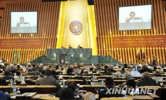

# 第五十八期：反腐公约

**编者按：如果你经常翻墙或者上微博，就不难看到很多贪官外逃异国他乡、卷走大笔赃款的新闻。这让人不禁感到气愤：逃到国外的贪污犯就能逍遥法外吗？介于全球化的大势所趋，国与国的界限已经逐渐淡化，这种现象也变得数见不鲜。《反腐公约》正是在这个背景下诞生。这部公约的由来、内容以及公约对中国反腐的启示，将是本期百科的主要内容。**

**反腐公约**

 **目录** 1. 公约诞生背景 2. 公约结构 3. 与中国反腐法律的区别  ** 词条简介**

《反腐公约》全称为**《联合国反腐败公约》**，是2003年由联合国颁布的，为全面指导国际反腐败斗争的全球性法律文件，而且是迄今为止治理腐败犯罪方面最为完整、全面而又具有广泛性、创新性的国际法律文件。中国是公约缔约国之一。

《联合国反腐败公约》第三次缔约国会议开幕（来源：新华社） **1. 公约起源**

正如编者按里谈到的，自20世纪中后期以来，腐败犯罪逐渐成为全球性的问题。腐败不仅严重地危害着各国的政治稳定、经济秩序、公共管理部门的公正性和人们的价值观，而且也损害了那些所谓法制国家的国际形象。国际社会在反腐败方面采取了一系列的措施：联合国1996年制订了《公共官员国际行为守则》，2000年制订了《联合国打击跨国有组织犯罪公约》。但是，随着近年来腐败分子利用各国对于腐败问题的不同态度，经常犯罪外逃或者转移腐败获得的资产，给各国的惩治腐败行为造成障碍。因此，国际社会深感惩治腐败行为不能没有国际合作，必须制订一部专门打击腐败犯罪的国际法律文件。在此背景下，**联合国大会于2000年12月通过决议，为制订一项有效的反腐败国际法律文件而成立了《联合国反腐败公约》。特委会和相关的政府间专家工作组，负责公约的起草工作。**

该特委会先后举行了七届会议，经过两年多的磋商和努力，终于于2003年10月1日在维也纳举行的第七届会议上确定并核准了《<联合国反腐败公约>草案》。2003年10月31日，第58届联合国大会全体会议审议通过了《联合国反腐败公约》。2003年12月9日至11日，在墨西哥梅里达举行的联合国国际反腐败高级别政治会议上，包括我国在内的130多个国家签署了这个联合国历史上通过的第一个反腐败国际公约《联合国反腐败公约》[1]

 **2. 公约内容**

反腐公约除序言外，共分8章，包括总则、预防措施、定罪和执法、国际合作、资产的追回、技术援助和信息交流、实施机制以及最后条款，共计71条。反腐公约的重要规定集中于总则、预防措施、定罪和执法、国际合作、资产的追回等章，其基本内容确立了国际反腐败的六个问题。

2.1 反腐公约的宗旨

反腐公约开宗明义地指出，本公约宗旨是：促进和加强各项措施，以便更加高效而有力地预防和打击腐败；并支持国际合作和技术援助，包括资产追回；提倡廉正、问责制和对公共事务和公共财产的妥善管理。为了统一、正确地实施这一宗旨，对反腐公约涉及的“公职员”、“外国公职人员”、“财产”、“犯罪所得”等9 项概念，规范了其法律内涵，这是西方立法通常采用的立法技术。

2.2 预防措施

反腐公约第二章专门规定为“预防措施”，要求各缔约国应当根据本国法律制度的基本原则，制定和执行或者坚持有效而协调的反腐败政策，这些政策应当促进社会参与，并体现法治，妥善管理公共事务和公共财产、廉正、透明度和问责制的原则。全章共分十条，主要为“预防性反腐败政策和做法”、“预防性反腐败机构”、“公共部门”、“私营部门”、“社会参与”等。

2.3 定罪和执法机制

这是反腐公约中内容最多的一部分，列为第三章“定罪和执法”共38条，占全反腐公约的半数多。它主要规范三大内容：

2.3.1 规范腐败定罪

规定各缔约国均应当采取必要的立法措施和其他措施，将下列故意实施的行为定为犯罪，共有9 类：贿赂、贪污、挪用、影响力交易、资产非法增加、对犯罪所得的洗钱、窝赃、滥用职权、妨害司法。这是首次以联合国公约形式明确规定腐败为刑事犯罪。

2.3.2 规范刑事制裁

规定缔约国应当使根据本公约确定的犯罪受到与其严重性相当的制裁，并且应当根据本国法律制度和宪法原则，既要照顾到为公职人员履行其职能所给予的豁免或者司法特权，又要照顾到在必要时对本公约确定的犯罪进行有效的侦查、起诉和审判的可能性。除刑事制裁外，还规定取消任职资格、冻结、扣押、没收等制裁。

2.3.3 规范人权保护

规定保护证人、鉴定人、被害人、举报人，使其免遭可能的报复或恐吓，并在法律程序中将腐败视为废止或撤销合同、取消特权等，因腐败行为而受到损害的实体或人员有权获得赔偿。

2.4 国际合作机制

长期以来，在国际反腐司法合作中充其量就是“引渡”，而且还存在许多法律障碍。反腐公约的出台，加强了建立全面，有效的国际合作机制。反腐公约一方面对引渡机制规定更为明确、具体，细分为十八款，规范各项请求引渡情况；另一方面，还有“被判刑人的移管”“司法协助”、“刑事诉讼的移交”、“执法合作”、“联合侦查”等国际合作机制。

2.5 实施资产的追回制度

反腐公约要求缔约国把缴获的腐败资产交还原属国，这是一个重大突破，将有利于发展中国家重新获得失去的资金，将之用于发展经济和消除贫困。具体规定“预防和监测犯罪所得的转移”、“直接追回财产的措施”、“没收事宜的国际合作”、“资产的返还和处分”、“金融情报机构”等。

2.6 履约监督机构

设立缔约国会议，定期审查实施情况，提出建议；还设有秘书处，提供必要服务。[2]

 **3. 与中国反腐法律的不同**

反腐公约中的**公职人员范围**与中国国家工作人员的范围基本一致。但反腐公约中从事影响力交易的人包括了公职人员以外的任何人。可见， 反腐公约的主体范围就明显大于中国受贿罪的主体范围。从贿赂来看，反腐公约关于**贿赂**的规定是“不正当好处”，我国《刑法》规定的是财物。“不正当好处”的范围要大于“财物”。“不正当”是“好处”的修饰语，是出于贿赂行为而得出的评价。“好处”也就是某种利益，除了财物或财产性利益以外，它还可以指非财产性利益，如公职人员子女就业、就学等机会。

关于**公职人员侵犯财产**的行为， 反腐公约规定与我国《刑法》中的规定基本一致，但 反腐公约中没有限定财产的所有权归属，中国《刑法》却将其限定为公共财物、公共财产、公款等。

简而言之，**利用职务便利**就是利用公职产生的对财产支配的便利，这与反腐公约中公职人员因职务而受托在本质上是一致的。因为，因职务而受托者对财物也形成了支配权。国家工作人员对财产支配的便利并不能改变财物的所有权的性质，尤其是在所有权与经营权相分离的情况下更是如此，中国《刑法》可以将贪污、挪用罪的对象扩充为任何财产。

反腐公约规定的**滥用职权行为**与我国《刑法》滥用职权罪的范围是一致的。但在规定上又有很多不一致的地方，具体而言主要有以下几点：

主体范围。我国《刑法》中规定的主体是特定主体，即国家机关的工作人员。而反腐公约关于公职人员范围的规定近似于我国的国家工作人员的范围。

客观方面。我国《刑法》对滥用职权客观方面规定除滥用职权以外，还要求该滥用职权行为达到致使公共财产、国家和人民利益遭受重大损失的程度，并根据其各种具体的情形设立追诉标准。但反腐公约规定的是获取不正当好处。二者最根本的区别在于是否以使公共财产，国家和人民的利益遭受重大损失为客观方面构成要件。我国《刑法》中的滥用职权是指国家机关工作人员超越职权，违法决定，处理其无权决定处理的事项，或者违反规定处理公务；反腐公约中的滥用职权或者地位，是指公职人员在履行职务时违反法律。从文义上来分析， 反腐公约与我国《刑法》中的滥用职权的规定是一致的。但从反腐公约的规定与我国的受贿罪比较来看，利用职务便利中也存在违反规定处理公务的情况。因此， 反腐公约中规定的滥用职权与我国《刑法》中的滥用职权和受贿罪存在交叉情况。

 **4. 参考文献** [1] 刘卫国，何艳，2004，反腐败国际合作法的新发展——《联合国反腐败公约》评析，《河南师范大学学报（哲学社会科学版）》2004年第4期. [2] 李昌道，2006，《联合国反腐败公约》解析，《复旦学报（社会科学版）》2006年第4期. [3]赵秉志，2006，关于我国刑事法治与《联合国反腐败公约》协调的几点初步探讨，《法学杂志》2006年12期  **5. 延伸阅读** [1] [反腐公约全文](http://review.jcrb.com/zywfiles/ca555842.htm) [2] 万霞，2004，反腐败的国际立法浅析，《外交学院学报》2004年3月. [3] 皮勇，2004，《联合国反腐败公约》及其对我国反腐败法律机制的影响，《法学杂志》2004年25期.

（编辑：海舰；责编：海舰）
