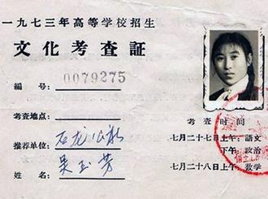
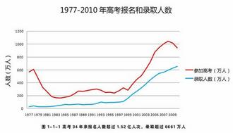

# 第六十七期：中国高考制度变迁

**词条简介******

**中国高考制度变迁**，指1949年之来， 根据政治经济和社会状况划分的高考制度变迁 , 大致可以划分为四个时期 : **建国初期****(1949 — 1965) ****、****“****文革****”****期间****( 1966 — 1976) ****、改革初期****( 1977 — 1991) ****和**** ****改革深化时期**** (1992 — ) **。

 **目录****** 一 建国初期  二 “文革”期间  三 改革初期  四 改革深化时期  五 参考文献  ******一 建国初期******

1949年, 高等学校沿袭过去单独招生的方式。1950年,同一地区高校联合招生。

1951年, 以全国大行政区范围统一招生。1952年6月12日, 教育部发布关于全国高等学校暑期招收新生的规定,首次明确规定高等学校招生实行全国统一招生考试。至此, 废除科举制度后一直施行的高校自主招生政策彻底宣告结束。

 **二 “****文革****”****期间******

1966 年“文化大革命”开始，废除高考，高校停止招生。1971年高等学校逐步举办试办班, 恢复招生。招收的新生初中毕业即可, 但须经过两年以上劳动锻炼。**废除招生考试**** , ****改为****“****自愿报名****, ****群众推荐****,****领导批准学校复审****”**。“工农兵大学生”就是该非常时期的产物。著名的“白卷英雄”张铁生就是一位明星式的“工农兵大学生”。

1976年10月,“文革”结束。

“文革”时期实行一系列激进的教育政策。一方面 ，这一时期以全民教育为目的 , 基础教育得到充分发展,这为削弱家庭背景对教育获得的影响打下了基础。为了实现“教育平等”目标 , 当时的教育收费无论在高中还是在大学都十分低廉, 这对于一般城市家庭并不成为经济负担。另一方面，在非基础教育阶段，教育筛选废除了绩效原则，全面否定“分数挂帅”的“修正主义教育路线”,升学普遍使用推荐和配额等形式, 家庭背景中的政治出身起到关键作用。尤其是高等教育,“推荐入学”成为高等教育的主要录取方式。所以在各个社会阶层中, 成分好的工农子弟无疑具有优先权;干部子女比一般人略有优势 。

**“文革”****时期**** , ****整个社会不平等的主轴是政治上的不平等****, ****家庭背景中政治出身成为教育**** ****机会差别的主要原因**。但也应该看到，在当时特定情况下,政治歧视主要是针对少数特定人群。就教育而言, 政治选择过程对社会整体的影响是有限的,因为被歧视的人群所占比例不大，这一时期是典型的政策干预模式，采取有利于广大工农子弟的政治性选择标准 , 社会阶层背景的影响被大大削弱。废除绩效主义的选拔原则后，文化再生产模式中人力资本和文化资本的机制无从发挥作用。同时, “文革”期间基础教育的普及和受教育费用的低廉，这些都有效地阻止了家庭资源向子女教育机会的转化。所以,作为历史比较的基础:在“文革”期间,不同家庭背景的子女教育机会差异较小, 总体教育不平等程度低。

******三 改革初期******

1977年8月,复出不久的邓小平在一次有四十多位教育界著名人士及官员参加的 “神仙会“上决定: 立即恢复高考 。

1977年, 新中国教育史上出现一个奇观:为尽速弥补“文革”给高等教育带来的耽搁和损害, 决定在当年冬季就进行大学招生。于是1977年冬和1978年夏的几个月时间内 , 神州大地就有了世界上有史以来声势最浩大的一次考试, 参加考试的总人数达一千一百六十余万之多。中国人的大学梦在此次的大考中获得最彻底而淋漓尽致的展现。

至1985年，上海市首次取得了高考的自主命题权, 由此不再参加全国的高校统一招生考试, 这是地方实施自主命题之肇始 。

它有太多的故事, 也太令人回味 。

上世纪整个80年代, 大学生被名副其实地称为,天之骄子, 身上布满了神秘而神圣的光辉。

**1977****年恢复高考****, ****高等教育升学的推荐制度被废除****,****代之以全国统一高考成绩为依据而择**** ****优录取。**这一举措的深远意义在于, 教育筛选的标准从“文革”时期的“政治挂帅”转向了“绩效原则”, 从而整个高等教育制度的性质也从“革命化”转变为“精英化”。在恢复高考的刺激下, 教育系统重新分化组合。特别是在中等教育阶段恢复和重建了重点学校系统 , 升学的标准也转变为以“分数”为中心。在高考的“指挥棒”下 , 绩效主义成为整个教育体系的基本准则 。教育筛选遵循绩效原则是文化再生产模式发挥效用的制度前提。教育体制在“文革”后回归到绩效原则, 这时家庭教育背景的影响日益重要。家庭对孩子的教育期望和督促,父母的人力资本、文化资本都能帮助孩子在学校取得好成绩 , 进而在升学中获得优势。所以,**在这一时期,文化再生产模式所导致的教育不平等凸现,不同家庭教育背景子女间的教育机会差异增加，教育不平等整体程度随之增加。**“文革”中升学标准的政治化，在客观上有利于处于劣势的普通工农阶层。教育制度的变迁终止了这一带有阶层庇护色彩的政策 , 普通工农阶层与优势阶层的差距显现出来。同时, 改革初期整个社会的收入水平都有大幅度提升 , 虽然社会分化已经初显端倪, 但总体上差异不大。而且在这一时期家庭所承担的教育费用仍然十分低廉, “择校”现象也不普遍 , 家庭资源转化模式中的各种排斥机制作用有限。改革初期的一些研究发现家庭教育背景的作用要大于家庭社会经济地位的影响 。所以, 在这一时期 , 虽然导致教育不平等的主导模式是文化再生产模式 , 家庭社会经济背景的作用亦有所增强。

 ******四 改革深化时期******

1992年邓小平南巡,中国的社会经济状况自此发生了根本性的变化,这也意味着新一轮教育体制改革的开始。该阶段的基本特征是教育产业日益受到市场的冲击和影响:教育资金从全额财政支付到中央、地方和市场分担; 管理体制从完全由政府“计划”管理,逐渐通过“给政策”下放部分事权、经营权和收益权; 办学主体逐渐多元化,民办和合办的教育机构纷纷涌现 , 而且份额日益增加。 随着权力下放和市场投入比重的增加 , 教育机构获得越来越多的自主权, 进而向成为独立的利益主体演进。虽然整个教育体制仍然在政府的直接监管之下 , 但教育机构经常通过各种形式的博弈,从国家和市场中获得最大收益。因为教育改革的配套制度和措施尚不完善, 有效的监管制度也未形成, 教育机构的利益最大化过程往往会以牺牲绩效原则为代价。最明显的变化是家庭教育成本的显著上升。十几年来,高等教育费用的涨幅远超过同期国 民收入和居民平均收入的增长速度, 供养一个大学生对于普通城镇居民已经构成一定的经济负担。在高中阶段,各种名目的收费大行其道,教育成本明显上升。同时择校和借读现象盛行,“进门费”甚至高于大学的学费。同时,教育产业化下新涌现的民办教育和合作办学, 拥有更多的自主招生权,为经济条件较好的家庭提供了又一个升学选择。

在西方, 阶层间教育资源不平等的一个重要体现是不同阶层的居住社区间的教育质量的不同。在中国, 随着住房商品化的进程,社区阶层化也已经明晰可辨。这些都是资源转化模式中排斥机制的表现 , 它标志着家庭资源能够比以往更容易而且更有效地转化为子女教育机会。故在市场冲击下的教育, 绩效的原则在一定程度上被侵蚀,资源转化模式的机制日益发挥着更大的效用。

 ******五 参考文献******

[1] 李煜 制度变迁与教育不平等的产生机制——中国城市子女的教育获得（1966-2003）《中国社会科学》 2006年 第4期

[2] 张伟 中国高考制度的变迁，《基础教育》2006年第7期

[3] 李立峰 高考自主命题利弊论析 《湖北招生考试》2004年04期

（编辑：谢昆 责编：高丽）
