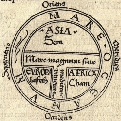
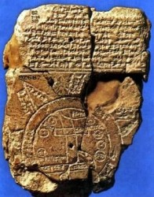
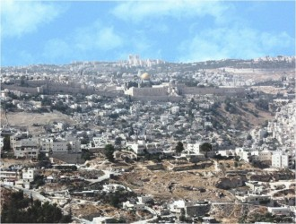
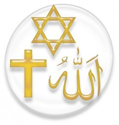

# 第六十三期:闪米特一神诸教

**编者按：闪族？不是那些一定场合一起做同样行动的快闪一族，也不是不停结婚离婚的闪婚一族,而是指那些被亚底格里斯河和幼发拉底河两条母亲河滋养着的生活在这片土地上的人。同时记载在古巴比伦泥板书上的最早的闪族宗教也成为了犹太教、基督教、伊斯兰教的共同起源。** **词条简介：** 闪米特一神诸教又称亚伯拉罕诸教、天启宗教，指世界主要的三个有共同源头的神教──基督教(包括天主教、基督新教和东正教）、伊斯兰教和犹太教。特点包括：共同的先民，共同的原始一神教起源，共同的圣地。 目录： 1.闪米特族 2.闪米特原始宗教 3.共同圣地 4.三大宗教 5.参考文献 6.拓展阅读 **1.闪米特族**

“闪族”的全名是“闪米特人”（Semites），亦称“塞姆人”（Semu），**包括阿拉伯人、希伯来人、腓尼基人、巴比伦人、亚述人和阿拉米人在内的一系列占据阿拉伯半岛、叙利亚—美索不达米亚和伊拉克地区的民族。**根据《旧约全书·创世纪》所载传说，称其为挪亚长子闪（Shemu或Semu，也译为“歇姆”、“塞姆”）的后裔。一般认为古闪米特人以畜牧为生，原来生活在撒哈拉北部地区。约在公元前五千年，气候剧变，开始东迁，陆续来到西亚两河流域和叙利亚草原，一直保留着相当统一的民族共同体。至公元前三千年初，**按语言明显地分为东、西两大支。**

东闪米特人生活在两河流域的北部，操阿卡特语，在与苏美尔人接触中吸收、融化了对方的语言。自公元前三千二百年至公元初，其代表为阿卡德人、巴比伦人、亚述人。按现代分类法，此支称**“闪米特北支”**。

西闪米特人又分三个分支：**西北支**（现称闪米特北中支），系指分布在巴勒斯坦、叙利亚、美索不达米亚北部的各族，最早的代表为阿摩里特人、迎南人、乌加里特人，约在公元前二千年后，有跳尼基人、犹太人、阿拉米人、莫阿比特人、亚奥迪人等。**中支**（现称闪米特南中支）约在公元前二千年至前一千年，其代表为利希亚尼特人、萨姆德人等，随后统一共称阿拉伯人。七世纪随着伊斯兰教的兴起，开始了闪米特人的一次大迁移。现分布在埃及、苏丹、摩洛哥、阿尔及利,亚、伊拉克、沙特、叙利亚、也门、突尼斯、黎巴嫩、约旦、利比亚、科威特等国，按方言、历史、文化传统和地域可分为47个民族。**南支**（现称闪米特南支）分布在阿拉伯半岛的南部，古代代表有马闪人、萨巴人、卡塔班人、哈德拉人等，南支部分曾于七世纪越过红海到达非洲之角，今埃塞俄比亚闪米特各族的祖先。马赫里人等就属这支。

从这些记述看，“阿拉伯半岛，可能是闪族的摇篮，闪族在这个地方成长之后，迁移到肥沃的新月地区（即伊拉克、叙利亚、黎巴嫩、巴勒斯坦和约旦），后来就成为历史上的巴比伦人、亚述人、胖尼基人和希伯来人。**据此可知创建犹太教和基督教的希伯来人（即犹太民族的人），首传伊斯兰教的古来氏人（即阿拉伯民族的人），都是闪米特人的后裔。**

**2.闪米特宗教**

** 巴比伦泥板**

犹太教、基督教、伊斯兰教都明显源自于古老的闪族异教。根据巴比伦泥板书和了晚于巴比伦泥板的“亚述泥板” 和早于它的“苏美尔泥板”的神话记载，可以看出以下几个特点：

**它的第一个特色, 是把旷古无始的阴阳两水—娣娅曼杜和阿卜苏奉为神祖。**这种观念显然是原始拜物教遗韵的升华,因为巴比伦尼亚地处幼发拉底河和底格里斯河之间的两河流域, 正是有了这两条波澜壮奔流不息的大河才缔造、哺乳、养育了巴比伦尼亚。

**它的第二个特色, 反映了原始宗教由多神论向主神论的发展演变过程。**这一过程的完成, 则建立在如下的认识论基础上: 各个时期都有不同的最强大的天神出现, 如最初的阿努神, 稍后的埃亚神和最后的马尔杜亥神; 而且是后来者居上, 最终确立了马尔杜亥神位居巴比伦主神的崇高地位。

**它的第三个特色, 传世神话中把人说成是用神的鲜血或泥土造成的。**由于人的身上含有神的血, 又是直接为神服务的, 因此人与神的关系就不是那么遥远或高不可攀了。在巴比伦另一则造人的神话中, 非常明确地指出: “**人就是天地间的纽带**”。

在之后的旧约创世纪神话和古兰经中创世的故事都能看出与巴比伦神话一脉相承，如洪水神话。

在古代闪族一神思想的始祖是**亚伯拉罕**（伊斯兰教称易卜拉欣），是犹太教、基督教和伊斯兰教的先知，是耶和华从地上众生中所捡选并给予祝福的人。同时也是希伯来民族和阿拉伯民族的共同祖先。 犹太人古称希伯来人，希伯来人原是闪族的一支。闪族起源于阿拉伯沙漠南部，起初是逐水草而居的游牧民公元前2000多年，从阿拉伯半岛南部迁到两河流域（幼发拉底河和底格里斯河）的美索不达米亚平原定居，和美索尔人共同创造了两河流域文化。公元前十八世纪古巴比伦王国统一了两河流域，国王汉漠拉比强迫被征服民族信仰他的部落神“马尔都克”，不服从者受惩罚，或当奴隶。希伯来人不愿放弃他们的信仰，遂在亚伯兰的领导下，离开吾耳城，来到了迎南的南部定居下来，开始向沙南人学习种田。公元前2000年，有一个来自海上民族叫非利士丁的人侵人迎南，改迎南为巴勒斯坦。有一天亚伯兰说：耶和华显灵，命他改名亚伯拉罕（意为万灵之父），因而不再叫亚伯兰了。亚伯拉罕向人们宣传说“万能的神主”耶和华已和我们定下了圣约，凡希伯来的男婴儿，生下第八天都必须受割礼。**在这样的情况下，亚伯拉罕创传了在当时还较模糊的一神信仰，崇奉耶和华为唯一神。所以犹太教、基督教和伊斯兰教都谓亚伯拉罕是造物主派到人间传播一神教的一位使者受到崇敬。尽管三教对亚伯拉罕的故事述说不尽相同，但总的脉胳是一致的。**

**3.共同的圣地**

**犹太教、基督教和伊斯兰教在耶路撒冷都有圣迹。所以三教都自称耶路撒冷是自己的圣城。**

**耶路撒冷**

公元前十一世纪犹太首领大卫王领导抗击跳力斯人获胜，遂建立了统一的以色列一犹太王国，定都耶路撒冷。**大卫王之子所罗门继承王位后，大兴土木，建造了第一圣殿，确立耶路撒冷为犹太教的圣城。**后来，耶路撒冷几经亚述、巴比伦、波斯等外族征服，第一圣殿毁于战火。**公元前56年波斯人为犹太人，曾在耶路撒冷旧址给犹太人重建圣殿，史称第二圣殿。**公元前63年，罗马人占领耶城，将犹太人逐出巴勒斯坦，从此，犹太人流散世界各地。**耶城的“哭墙”（即西墙）成为犹太教的圣地，也是表明昔日辉煌的象征，也可说是犹太人的精神寄托。**

基督教是基于**耶路撒冷是耶稣早年求学、中年布道和晚年催难的地方。**《圣经》载, 耶稣被钉死在城边的十字架后, 被埋葬在这里, **后人在其墓地上建造了圣墓大教堂, 使其成为全世界基督徒的朝拜圣地。**圣墓大教堂始建于306 年,规模宏伟, 庄严肃穆。内有一座座小教堂分属于基督教的多个分支—希腊正教、亚美尼亚教、罗马天主教等。，耶城就成为基督教不可替代的永久圣地。因为耶稣基督之死使耶城成了基督教的中心。**同时，“受难之路”、“橄揽山的脚印”等圣址，吸引基督徒从世界各地赶来朝圣。**

公元638年阿拉伯人征服了耶路撒冷。**先知穆罕默德的继承者哈里法·欧麦尔来到此城，并建造了阿克萨清真寺（会极殿）。**《古兰经》称“远寺”，与麦地那的“先知寺”和麦加的哈兰姆清真寺共称为伊斯兰教三大“圣寺”。据《古兰经》叙述，耶路撒冷是先知穆罕默德从麦加禁寺夜行至此，驻马登霄聆听真主启示之地，其中“西墙”被伊斯兰教称为“飞马墙”。阿克撒清真寺被称为飞来寺，把耶路撒冷视为仅次于麦加和麦地那的伊斯兰教第三大圣地。 **耶路撒冷老城内的圣殿山是犹太教、基督教和伊斯兰教三大宗教圣地的集中地。**

**4.三大宗教**

**三大宗教**

**总的来说：孕育于西亚的闪族文化, 自古巴比伦时代起至伊斯兰教创立、传播至令, 延续数千年而始终没有中断; 闪族文化的发展经历了三个较为明显的演变阶段: 自古巴比伦马尔杜亥神被奉为巴比伦主神始, 标志着宗教由多神论演变为主神论阶段; 自犹太教创立始, 标志了由主神论演变为民族一神论阶段; 而自基督教、伊斯兰教创立始, 标志着由民族一神论演变为世界性一神论阶段。**

4，三大宗教 

犹太教认为亚伯拉罕和摩西是先知，直接受命于唯一真神（名曰耶和华）。耶和华通过摩西，与以色列人订立约定《十诫》，**只要以色列人遵守约定，只崇拜唯一真神耶和华**，耶和华将保佑以色列人。信仰上，**犹太教只承认《塔纳赫》**，即希伯来圣经或称希伯来手稿。**犹太教不接受圣子论，他们并不认为耶稣及穆罕默德是他们的弥赛亚（救世主），并继续等待弥赛亚的来临。**

基督教脱胎于公元以一世纪左右一个新兴犹太教派。该教派认为犹太人违背了耶和华和以色列人定的约（即旧约），所以派他的儿子**耶稣作为弥赛亚（救世主）以自己的生命为人类赎罪，不仅和以色列人而和全体人类订立“新约”**。基督教**信仰三位一体**，即圣父、圣子、圣神（圣灵）为同一本体（本性）、三个不同的位格，他们以希腊语：homoousios 来表达他们之间的关连。三位格为同一本质，三个位格为同一属性。通俗地说，仅有独一的天主；圣天父完全是天主，圣子完全是天主，圣神完全是天主；圣天父不是圣子，圣子不是圣神，圣神不是圣天父。

伊斯兰教不接受圣子论，穆斯林认为基督宗教内的三位一体（圣父、圣子、圣灵）是错误的，他们**只承认独一真主（名曰安拉）**。他们认为安拉每隔一段时间选出一位先知，但只有使者才被赐予一部经卷，亚丹（阿当）、易卜拉欣（亚伯拉罕）等只是先知，而穆萨（摩西）、尔萨（耶稣）既是先知又是使者，穆罕默德是安拉选出的最后一位先知，所谓“封印使者”。信仰上，穆斯林相信安拉给人类的启示，现在已经大部分失传，较广为人知的有四部：第一部叫做《讨拉特》，有指是旧约中的律法书；第二部叫做《宰蒲尔》，即旧约中的诗篇；第三部叫做《引支勒》，即新约中的福音；第四部叫做《古兰经》。伊斯兰教认为“旧约”和“新约”《圣经》都是安拉赐予的经卷，后赐的经卷对以前的经卷基本是同一核心内容，就是叫人信仰独一真主，如要说是进行修正和补充，那是因为前面的经卷已被更改，**伊斯兰教认为《古兰经》是安拉发出的最后一部最完善的经卷，是众经中最受保护的。**

综上，犹太教、基督教、伊斯兰教具有相同的起源，并相信神的唯一性，只信仰和崇拜一个主宰宇宙万物、至高无上的造物主，**区别在于对于“弥赛亚”认知的不同、对于基督教“三位一体”的看法等。历史发展上看，基督教是古犹太教的一个新兴教派。而传统上犹太教和基督教认为伊斯兰教是在吸收了犹太教与基督教的经典和教义思想的基础上创立的。**三大宗教在之后千年的发展中又不断有新的教派产生，相互之间的关系也随着时代不同而变迁，。

**5.参考文献**

【1】陈永岭等编纂委员会，《民族词典》，上海辞书出版社，1987-06 【2】孙承熙，巴比伦泥板书、《旧约·创世记》和《古兰经》中创世神话之比较——兼论闪族宗教观的演变，《国外文学》1993（02） 【3】谢让志，圣城耶路撒冷，《城市》2001（03） 【4】[维基百科，亚伯拉罕诸教](http://zh.wikipedia.org/wiki/%E9%97%AA%E7%B1%B3%E7%89%B9%E4%B8%80%E7%A5%9E%E8%AF%B8%E6%95%99) **6.延伸阅读** 【1】罗伯特·史密斯，《闪米特人的宗教》 【2】加里•W•特朗普，《宗教起源探索》 【3】西格蒙德•弗洛伊德，《摩西与一神教》

（编辑：谢昆 责编：高丽）
