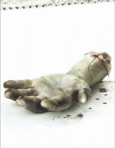
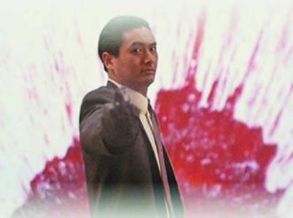

# 第六十九期：暴力美学

### **词条简介：**

暴力，这一词在词典中的解释有两种，第一种解释是：政治学名词，不同政治利益的团体,如不能用和平方法协调彼此的利益时,常会用强制手段以达到自己的目的,称为暴力；第二种解释是：泛指侵害他人人身、财产的强暴行为。而我们这里将暴力和美学联系在一起的暴力美学，有了新的含义，那新的含义便是：暴力美学是人们在文学艺术中乐意且擅长的表现手法，是实实在在存在的，以美学的方式、诗意的画面，甚至幻想中的镜头来表现人性暴力面和暴力行为的一种电影的表现手法。

### **目录：**

1 暴力美学的产生

2 暴力美学电影

2.1暴力美学电影史简述

2.2 暴力美学代表人物

3 暴力美学的后现代主义审美特征

4 暴力美学所带来的问题

5 参考文献

6 推荐阅读

#### **1 暴力美学的产生：**

暴力美学是由吸引力蒙太奇【注】发展而来的一个技巧论形式美学概念，它提供的是种纯粹的审美判断。它主要发掘枪战，武打动作，杀戮或其他一些暴力场面的形式感，并将这种形式美感发扬到美丽炫目的程度；有的时候，导演还故意用暴力，血腥的镜头或者情景来营造一种令人刺激难受的效果。**最初，这不是一个严格的理论术语，而是从形式感出发的批评术语。**主要是电影中对暴力的形式主义趣味。其起源于美国，并在二十世纪八十年代在香港发展成熟，以吴宇森为代表，其后北野武，昆汀塔伦蒂诺等一些导演将暴力美学发挥至极致，并演变成一种新的审美视角，即“东方美学视角”。

【注】：爱森斯坦最早是在1923年《石式左翼文艺战线》上提出“吸引力蒙太奇”的理念。其理论依据包括俄罗斯的形式主义，列宁的电影工具论，马克思主义唯物辩证法和认识论，美国的蒙太奇技巧和方法。吸引力蒙太奇的主要思想，就是使用离开现实的，脱离情节的画面元素和组接方法，创造具有视觉冲击力和表意明确的电影文本，以此来表现作者的思想观念。 

#### **2 暴力美学电影：**

暴力美学电影的特征为创作者在电影的打斗场面中运用后现代的手法，将其消解成为无特定意义的游戏或者玩笑；或者将其符号化，作为跟影片内容紧密相关的视觉和听觉的审美要素。暴力美学”是个广义的、泛审美的概念，并非严格的美学概念，相关作品的主要特点是展示攻击性力量，展示夸张的、非常规的暴力行为。在电影中，暴力的呈现可划分为两种不同形态：一是暴力在经过形式化、社会化的改造后，其攻击性得以软化，暴力变得容易被接受，比如，子弹、血腥的场景经过特技等手段处理后，其侵害性倾向被隐匿了一部分。又如，在美国的一些电影中，施暴者代表正义却蒙受冤屈，这种人物关系的设置也软化了暴力行为的侵略性。另一种情况是比较直接地展现暴力过程以及血腥效果，渲染暴力的感官刺激性，这种倾向在多种文化行为中都可以看到。

#### **2.1暴力美学电影史简述：**

**1．20 世纪 60-70 年代：美国的“新好莱坞电影”和中国的武侠电影。**

20世纪60-70年代西方世界掀起反传统、反理性、反现代主义的非理性思潮。美国暴力美学的奠基性影片《邦尼和克莱德》。这种非理性思潮反映在电影界，表现为“新好莱坞”的形成。“新好莱坞”是欧洲新浪潮电影的美国翻版。与传统好莱坞影片迎合政治形式不同，“独立”制片人为电影找回它真实的社会内容。电影暴力美学就在这种形势下起步开始获得发展。

1967年阿瑟•佩恩《邦尼和克莱德》里的反传统、非理性风格及黑色幽默、反讽手法、1969萨姆•佩金帕《野帮伙》中升格夸张暴力及其浪漫化的手法、1971年斯坦利•库布里克《发条橙子》的戏谑、1976年马丁•斯科西斯《出租车司机》的写实主义都为暴力美学成为一种风格类型做了有益的积累。《邦尼和克莱德》结尾邦尼和克莱德被机枪打得浑身是洞的场面被导演佩恩用慢动作加以表现，堪称“暴力美学”的开始，80年代香港的《喋血双雄》、90年代的《天生杀人狂》都能看到这部影片的影响。此外，影片的情节具有浓郁的黑色幽默风格。这种风格在后世的昆廷的电影《水库狗》、《低俗小说》里皆得到延续和发扬。

中国电影暴力美学也迈出了开创性的脚步。主要表现在新派武侠片的创作上。当时的新派武侠片创作背景是：观众对电影娱乐的要求提高以及要求对银幕阴柔之气的摆脱。张彻是新派武侠片的领军人物，他对中国（港台地区）电影史的重要意义在于他“阳刚美学”的理论和实践。在电影表现技巧与形式上，张彻的武侠片具有一下特点：

1、白衣大侠形象。这是张彻电影的标志性符号。

2、主角必死。张以英雄悲剧性的死收场，渲染一种悲壮的美感。

3、赤膊上阵。即男主人公在影片中露出上身肌肉，这样做使人物形象具有阳刚的感觉，又增加了真实感。

4、慢镜表现。在华语武侠片中使用慢镜头是由张彻开始，以慢镜头抒发悲壮感，影片《十三太保》中“五马分尸”的场面就是用慢镜头拍摄，成为张彻电影中的经典性镜头。

5、手提机拍摄。张彻认为这样可以拍出武侠动作片的动感，在《独臂刀》中首先使用。 6、西乐配音。古典音乐往往太慢、太柔，不大适应动作片节奏及其阳刚奔放情调，大胆改革，使用西乐配音。张彻的武侠电影以阳刚和悲壮为主要美学基调，这种风格及他对暴力动作的电影表现形式与技巧都对后世动作片的创作、发展产生了深远的影响，最直接的影响便是其弟子吴宇森的“英雄片”的创作。

**2．1979年—90年代中期：暴力美学作为具有电影史意义的风格形态的形成，是在中国香港。代表性导演为吴宇森、徐克、林岭东。**

1979年，香港兴起“新浪潮”运动，以电影导演追求创作个性，表达主观意识为特征。在拍摄技巧上，导演们力求与国际先进水平同步。他们醉心于用高超的艺术技巧创造“外在真实的表象”，而不是注重题材或故事情节的“写实性”，由此造成既真实又鲜明、大胆，极富冲击力的视觉效果。徐克以其《蝶变》一片成为新浪潮代表人物之一。在《蝶变》中，徐克将科幻电影与武侠电影合二为一，刷新了香港观众对武侠电影的观念。也由此奠定了徐克日后武侠片以“介于科幻与神话之间的想象”为特征的暴力美学风格。

1986年，吴宇森编导的《英雄本色》拉开了“英雄片”系列的序幕，其后，吴宇森又相继拍摄了《英雄本色 II》、《义胆群英》、《喋血双雄》、《喋血街头》、《纵横四海》、《辣手神探》，构成他的“英雄片”系列。 继承阳刚美学风格，把武侠精神注入现代枪战片、警匪片，同时融入了美国歌舞片的舞蹈元素，形成独具特色的“吴氏暴力美学”。浪漫、激情、悲壮是主调，往往推到爆炸性极端，高度风格化、美化的打斗、枪战，往往被推到超现实的程度。

将武打动作奇观化，导演徐克居功至伟。90 年代，徐克以五部《黄飞鸿》系列影片及《笑傲江湖》系列、《新龙门客栈》等影片开创了“徐克武侠电影时代”，徐克使武侠电影彻底摆脱了实用技击的束缚，创立了“武侠神话”的表现样式。拍摄武打场面已不用纯粹依靠武打演员的功夫，而使用科技手段、电影表现手段制造武侠电影奇观。动作特技、光学视觉特技、拍摄特技、及灵活多变的剪辑，营造出极富视觉冲击力的画面效果。人物打斗不再完全依靠实用招式、武功套路，而是以出乎想象的“神功”形式出现。炸药和烟火特效为其制造出力能摧山的效果；一根钢丝佩以高速摄影，就足以使演员在镜头中凌空飞翔飘飘若仙，舞蹈美感与浪漫具足。

如果说吴宇森、徐克的暴力美学是浪漫主义的风格，那林岭东的暴力美学作品则体现为现实主义的风格。80 年代中后期，在吴宇森推出他的英雄系列片同时，林岭东创作出体现写实风格“风云”系列影片——《龙虎风云》（1987）、《监狱风云》（1987）、《学校风云》（1988）、《圣战风云》（1990）《监狱风云2》（1991）。 影片的特色：忧郁、落寞、压抑为主调，间歇爆发为激狂的发泄。打斗、枪战真实而残酷，夸张之余保持实感。

吴宇森、徐克、林岭东等人对动作及火爆场面的表现手法被其他电影导演广泛借鉴，风格化的暴力场面大量存在，并贯穿于港产动作片、枪战片中，香港的暴力美学已经形成。

**3．90年代中期至今：**

中国的暴力美学在形成发展过程中受到美国电影的启发，经过张彻至吴宇森、徐克等两代香港电影创作者的努力，发展成为具有类型和风格意义的电影形态，现在开始反过来影响美国的电影。随着香港武侠片、枪战片著名导演、演员相继登陆好莱坞，中国特色的暴力美学风格在好莱坞影片中开始蔓延。吴宇森以《终极标靶》1993，《断箭》（1996，《变脸》1997、《碟中谍 2》2000，《风语者》2002，续写他的暴力美学神话，2000李安《卧虎藏龙》更以其独特的东方文化底蕴和暴力美学特质征服了西方观众，获得 2000 年奥斯卡四项大奖。中国武术指导袁和平在许多好莱坞影片中担任动作导演，《骇客帝国》、《霹雳娇娃》、还有昆廷•塔伦蒂诺的新作《杀死比尔》等片，使这些影片带有浓郁的东方动作风格。

日本和韩国的暴力美学则总体上体现为冷静式的暴力，主要风格以表现绚丽的画面，冷酷的现实和冷静的人物性格为特点。代表人物是日本导演北野武，由他执导的影片《花火》、《玩偶》都是以清新优美的画面布置人物的周围环境，然后以催人泪下的故事营造凄美的氛围，暴力成为展现人性美的手段，于残酷的外在形式下表现人物内在的真善美。形成了一种“残酷的美”。韩国影片《朋友》、《飞天舞》都具有类似特点。

#### **2.2 暴力美学代表人物：**

吴宇森（香港） 代表作品：《喋血双雄》、《英雄本色》、《变脸》 、《碟中谍2》

北野武（日本） 代表作品：《花火》、《座头市》

昆廷•塔兰蒂诺（美国）代表作品： 《低俗小说》、《杀死比尔》

罗德里格斯（美国）代表作品：《杀人三部曲》、《罪恶之城》、《弯刀》、《杀出个黎明》

沃卓斯基兄弟（美国）代表作：《黑客帝国》、《忍者刺客》

#### **3 暴力美学的后现代主义审美特征：**

**1． 传统消失。**不是不讲道德，而是反统一道德；不是否认真理，而是设定有许多真理的可能性，从个人的角度、情境的、文化的、政治的、甚至是性的角度。后现代主义反对连贯的、权威的、确定的解释（包括对圣经，和其它信仰宣告）。个人的经验、背景、意愿和喜好在知识、生活、文化和性上占优先地位。

**2． 深度消失。**现代主义艺术总是以追求乌托邦的理想、表现终极真理为主题，而后现代主义艺术则放弃了作品本身的深度模式，不再具有思想，不再提供解释，拒绝挖掘任何意义，仅仅追求一种快感。

**3． 历史感消失。**历史永远是记忆中的事物，而记忆永远带有记忆主体的感受和体验。现代主义艺术因追求深度而沉迷于历史意识，而后现代主义艺术中，历史仅仅意味着怀旧，它以一种迎合商业目的的形象出现。

**4． 距离消失。**在现代主义艺术看来，距离既是艺术和生活的界线，也是创作主体与客体的界线，它是使读者对作品进行思考的一种有意识的控制手段。后现代艺术中，由于主体的消失，作品失去深度和历史感，仅仅具有作用于人感官的刺激性，而没有任何启发和激扬的功能，换言之，它强调的只是欲望本身。

#### **4 暴力美学所带来的问题：**

**1．暴力美学对受众价值观的误导**

就暴力美学的实质上看，是缺陷性审美，也就是审丑。用美的形式掩盖遮蔽向动物性血腥世界复归的低级内容。这与建立和谐社会是不相容的，与真正的审美即引导人们追求至真至善至美的终极关怀，更是背道而驰的。暴力美学源于暴力文化，是一种畸形，变态，扭曲的怪胎。由于当今传媒界发达，暴力文化无处不在。暴力文化甚至被提升到理论高度包装成所谓的暴力美学。文化的本意是与宽容，进步，文明紧密相连的，而暴力却是强制，落后，野蛮的。文化与暴力结合注定孕育出一个怀胎，他是对暴力的纵容和文化的亵渎。

**2．暴力美学引导社会暴力**

暴力美学通过对暴力内容的形式化处理，降低了作品的社会功能，其注意力在于发掘人内心深处的欲望，即对暴力攻击欲的崇尚，同时也有对血腥死亡的恐惧。在这样的作品中，艺术作品的教化功能被弱化了，而是把道德评判的保准留给了观众。从美学上看，暴力美学是审美的事儿，但从社会道德层面上讲，暴力美学展示的程度如果没有控制好，就有可能带来负面影响。人的内在攻击性欲望没有正确释放出来，新的刺激又会加重人企图释放出来的欲望，这将会导致犯罪，甚至是杀戮的发生。

#### **5 参考文献：**

[1]郝建，《暴力美学的形式感营造及其心理机制和社会认识》[J]北京电影学院学报，2005（04） [2]孙晓文，《世界影坛涌动着的暴力美学》[J]世界文化，2005（02） [3]郝建，《美学的暴力与暴力美学—杂耍蒙太奇新论》[J]当代电影，2002（05） [4]戴明，《吴宇森与暴力美学》[J]电影评介，2002(11) [5](美)大卫伯德维尔，《电影艺术——形式与风格》，彭吉象译，北京大学出版社，2003年 [6]陈旭光，《当代中国影视文化研究》，北京大学出版社，2004年 [7]（美）爱森斯坦，《蒙太奇论》，中国电影出版社，2003年 [7]贺天忠，甘庆超《论视像暴力对受众的异化性误导》 [8]尹洪，冷欣，程辉《试论“暴力美学”及其特征》 

#### **6 延伸阅读：**

[1]人民网：浅谈电影中的暴力美学 

（编辑：朱燚 责编：高丽）
