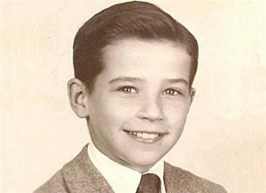
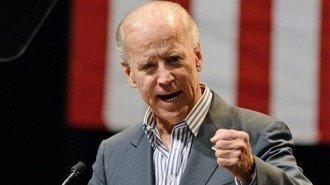

# 第六十四期:约瑟夫•拜登

**编者按：**美国副总统拜登5月13日在美国宾夕法尼亚大学毕业典礼上发表演说，称中国是不能“另类思考”或“自由呼吸”的国度，引起在场中国学生的不满并有学生起草信件要求其道歉。顿时国内众说纷纭，有搬出柏杨先生写过的中国人的奴性思想，常常面对忠言而逆耳的观点；有阴谋论者质疑拜登这张“大嘴”的背后究竟是偏见还是不可告人的秘密。本期百科将带读者认识“大嘴”约瑟夫·拜登。

**本词条在以下文章中被使用：**

1.<七星说法>：[美国枪支如何自由](/archives/28819)

2.陈季冰：[最关键的时刻，最糟糕的大选](/archives/24942)

3. ＜七星微语•一周状态撷萃＞第十九期：[卡扎菲……乔布斯……新东方……帅哥美女一箩筐](/archives/13536)

4. ＜七星微语•一周状态撷萃＞第十八期：[大家一起来唱蓝精灵之歌吧！~](/archives/13328)

**词条简介：******

**约瑟夫•罗宾耐特•拜登**（Joseph Robinette Biden）1942年11月20日生于宾夕法尼亚州斯克兰顿市，是老约瑟夫•拜登与吉恩•拜登之子。他是四个兄弟姐妹中的老大，生长在爱尔兰天主教家庭。他的父亲是一名商人，曾经做过汽车销售员、阿莫科石油公司的销售代表、农药喷洒公司的合伙人、海运密封剂制造公司的经理、房地产经纪人、供热公司的锅炉清洗工，并在这些领域内都取得了成功。

**目录：******

2. 执政生涯

3. 执政政策

4. 拜登的“大嘴”

5. 延伸阅读

6. 参考资料

**1. ****生平简介******

从童年至成年，拜登的生活与普通美国人毫无两样，罗马天主教的家庭背景让他自小便严格自律。但是童年的拜登有一个同龄人少有的缺陷，那就是口吃，尽管他擅长体育尤其是橄榄球，同学们还是给他取了一个绰号“累赘”（impedimenta），这是他们所学的为数不多的几个复杂的单词之一。童年的印象非常深刻以至于若干年后拜登回忆起来仍然历历在目:“我非常想证明我和每个人都是一样的，即使今天对于那些恐惧、羞耻、怒不可遏我还记忆犹新。”急于摆脱先天缺陷的强烈愿望使他在父亲因生计所迫而举家从宾夕法尼亚州的斯克兰顿迁至特拉华州的威尔明顿时高兴万分，因为他将有一个新的开始:“我们将会结识新的朋友，搬进崭新的家，这不是旧房子，而是全新的，从未有人住过。”此外，当他沮丧之时母亲不断的鼓励也让他倍感温暖:“乔伊你是一位优秀的运动员，拥有高智商，才思敏捷，假如有人嘲笑你，那是他们的问题，他们只是出于嫉妒而已。”逐渐摆脱幼年阴影后的拜登开始朝自己的梦想前行，在全新的环境中他获得了他人的尊重，而后在特拉华大学和塞拉克斯大学法学院的求学生涯又培养了他对政治的浓厚兴趣，尽管在大学期间成绩平平，但这似乎是许多美国未来的领导人的共同特点，也并不妨碍他从政的决心。大学毕业后他曾在一家律师事务所工作，后来在一桩诉讼案件中因不愿为一家公司起诉受伤的员工而辞去了薪水丰厚的工作。

小时候的拜登

之后拜登便步入政坛，出色的口才以及正直的人格使他很快融入到了美国政治生活中，直至二十九岁成为国会参议员，这在美国政坛还是颇为鲜见的。正当他踌躇满志地准备干一番大事业之时，不期而至的意外灾祸几乎将他击倒，他的妻子内莉亚和小女儿在一起车祸中不幸遇难。消沉过后他重新组建了家庭，并积极参与参议院的工作，然而他又罹患脑部动脉瘤，严重的病情一度让他无法清醒地思考，政治生涯也似乎即将结束。后来友人的帮助使他重拾信心，战胜病魔后他立刻投入1988年的总统竞选，但媒体披露其涉嫌剽窃英国工党领袖尼尔·金洛克（Neal Kinnock）的演讲稿，从而被迫退出竞选。此后他一直在参议院就职，任司法委员会主席以及外交委员会主席至今。

**2. ****执政生涯******

拜登的政治生涯始于27岁。**1970****年**，他入选特拉华州纽卡斯尔县的县议会。在那里工作两年之后，他的政治生涯有了大飞跃。29岁的拜登击败共和党的特拉华州参议员詹姆士•迦勒布•博格斯（James Caleb Boggs）（已连任两届的在任参议员），进入参议院。在这次竞选中，拜登获得了58%的选票。当选参议员两周后，拜登的家人遭遇车祸，他的妻子和女儿在车祸中丧生。他在儿子的病房中宣誓就职，成为历史上年纪倒数第五的参议员。拜登长达35年的特拉华州参议员生涯由此展开。

为了照顾两个儿子，拜登一直过着通勤生活，每天搭乘火车往返于华盛顿（Washington）和特拉华州的寓所之间。乘火车已经成了贯穿拜登参议员职业生涯始终的习惯。这个习惯还为他赢得了一个名号——“华盛顿特区内的圈外人”（生活在华盛顿特区外的华盛顿人）。

**1988****年**，拜登第一次竞选美国总统。他的竞选口号是：“在我们社会中重新点燃理想的火种”。直到纽约时报专栏作家莫琳•多德（Maureen Dowd）指控拜登剽窃英国工党领袖尼尔•金诺克的讲话之前，拜登的支持率一直都很高。在一次演讲中，拜登“变成了金诺克”，他不但重复了金诺克所说的话，还将金诺克的部分人生故事引为己用。**1987****年8****月**，在爱荷华州（Iowa）的一次辩论中，拜登将金诺克演讲的部分内容引为己用，说自己是家族中第一个上大学的人。这句话对于金诺克而言是事实，但对于拜登而言则是谎言。

后来，拜登的竞选经理人为他进行辩护，指出拜登早先就曾声明会在竞选过程中引用金诺克的部分演讲内容。尽管如此，拜登的爱荷华州演讲和一些负面调查结论（拜登在法学院上学时所写的论文有三分之一属于抄袭）还是使拜登的支持率一路下滑。由于公众的强烈抗议，拜登不得不在加入1988年总统角逐的三个月后，黯然退出竞选舞台。

尽管存在争议，拜登还是保住了自己的参议员席位。回到华盛顿并且两次战胜动脉瘤之后，“拜登成为最活跃、最敢于发表意见的参议员之一”。1975年，他成为参议院外交关系委员会的成员，目前担任该委员会主席；退出1988年总统竞选后，他还加入了参议院司法委员会，并在1987年至1995年期间担任该委员会的主席。

拜登长期担任参议员的资历和在各个委员会中的成员资格为他带来了不可忽视的影响力，同时批评也接踵而至。担任外交关系委员会主席期间，通过与国家领导层接触，拜登获得了丰富的外交政策经验。担任司法委员会主席期间，在任命罗伯特•波克（Robert Bork）和克拉伦斯•托马斯（Clarence Thomas）为最高法院（Supreme Court）法官的听证会上，拜登作为会议主持者的表现受到了广泛批评，使得这两次听证会变成了“杂耍表演”。拜登还曾因其子亨特的说客活动而受到牵连。2001年至2008年间，亨特•拜登一直在华盛顿从事说客活动。但是，在父亲被任命为副总统候选人两天后，他已经正式辞去这项工作。

**2007****年**，拜登再次参加美国总统竞选。他在爱荷华州党内提名竞选中排名第五，无望候选人名单，被迫宣布退出总统角逐。退出竞选后，他拒绝向其它候选人提供正式支持。

由于对外交政策格外热衷同时拥有外交关系委员会主席这一头衔，拜登参议员被认为是美国外交政策问题上最有影响力的权威人士。此外，他在很多领域内的政策观点也具有举足轻重的分量。

**2008****年8****月23****日****凌晨3****点**，奥巴马竞选团队向支持者们发送了短信和电子邮件。电子邮件中写道：“朋友，我现在要正式宣布一个重要的消息。我已经选择乔•拜登作为我的竞选搭档了”。在五天后的民主党代表大会上，拜登证实了这一消息：“是的。毫无疑问，我接受了你的提名，我将参加这次竞选并为美国的下任总统奥巴马效力”。

拜登被选为奥巴马的竞选搭档后，他的口才再一次得到检验。人们用“坦率而耿直”、“强有力的辩论者”、“口若悬河的长篇大论”和“偶尔容易乱放炮”或将这些词语结合起来形容拜登和他的演讲。作为奥巴马的竞选搭档，拜登顶住了对方阵营对他接受副总统候选人任命前和任命后发表的各种言论的攻击并成功当选副总统。

**3**.**执政政策******

拜登的**外交政策理念核心**是：伊拉克战争可能是“美国历史上最大的外交政策失误”。拜登参议员曾一度站在支持伊拉克战争的政治立场上，还在2002年决定是否开始向伊拉克派军的议案上投了赞成票，因此受到很多人的抨击和批评。之后，他修正了自己的观点，并于2007年2月建议国会撤销在中东国家使用武力的授权，有效地结束这场战争。

虽然他所信奉的天主教义反对堕胎，并且“愿意凭信仰接受”生命始于受孕的观点，但拜登参议员还是**坚决维护了妇女的堕胎选择权**。他反对半生产堕胎法和坏孕后期堕胎，反对为任何形式的堕胎提供公共资助。他投票赞成联邦政府赞助性教育和避孕药具的发放，赞成联邦政府赞助干细胞的进一步研究[。拜登反对同性婚姻（尽管他支持同性的民事结合），但不赞同为了禁止同性婚姻而修改宪法。

在**防治犯罪**的问题上，拜登主张加强执法力度。1994年出台的《拜登犯罪法案》使得联邦政府拨款在全国范围内增加100,000名警力。该法案还将一些攻击性武器列为禁用，扩大了死刑的适用范围，划拨更多资金资助新监狱的建设工程，并在暴力侵犯妇女法案之中规定加大性虐待的民事责任。

拜登曾在2007年说过，如果上帝赋予他特殊的力量，他将利用这种力量去解决全球能源危机。他是**生物燃料研究的强有力支持者**。按照他所设定的目标，到2030年，美国每年生产的生物燃料应当达到600亿加仑。他反对在北极国家野生动物保护区内进行钻探活动，也反对在美国近海沿线进行海上钻探。他还呼吁政府取消对石油企业的补贴，主张政府对美国总统乔治•W•布什和其他人在汽油问题上对消费者进行价格欺诈一事进行调查。尽管拜登赢得了环保群体的高度支持，但是媒体指出，他是在竞选中使用私人飞机的候选人之一。

拜登主张**废除有利于美国****1%****极富者的布什减税政策**。他在2008年表示，现在正是最富有的美国人表现“爱国心”的时候，这些人应当缴纳更多的税款来帮助美国度过难关。拜登对奥巴马的减税计划持支持态度。按照这一计划，年收入少于250,000美元的美国人将得到减税待遇，而年收入高于250000美元的美国人将缴纳更多税款。在参议院表决中，拜登投票反对废除或降低替代最低税。替代最低税制度于1969年开始实施，初衷是对高收入群体征税，但是这一制度从未根据通货膨胀和平均工资增长水平调整过。因此，如今进入替代最低税课税领域的不是高收入家庭，反而使中等收入家庭纳税负担沉重。

**4****．拜登的“大嘴”******

2008年美国总统大选，美国民主党总统竞选人贝拉克·奥巴马２３日宣布特拉华州联邦参议员约瑟夫·拜登为竞选搭档。拜登“亮相”几小时后，麦凯恩阵营２３日投放一则电视广告，“回顾”拜登先前批评奥巴马的言论。

广告引用拜登２００７年在美国总统选举民主党党内预选时与奥巴马的一场辩论赛内容。一位辩论主持人对拜登说：“你被问道‘他（奥巴马）准备好了么？’你说，‘我想他能准备好，但我认为他此刻还没有。总统职位可不是能在职培训的事情。”拜登则回答说：“我想我坚持这一陈述。”广告内容随后转为拜登谈论麦凯恩的说法：“跟约翰·麦凯恩一起竞选或作为他的对手，我会感到荣幸，因为我认为国家会更好。”

麦凯恩阵营说，奥巴马选择拜登作为竞选搭档是承认自己没有做好成为总统的准备。

美国《纽约时报》网站报道说，拜登经常因言语不慎而让自己陷入麻烦。除“尚未准备好”的言论外，他在参加民主党总统竞选人竞选之初还曾说，奥巴马是“第一个主流非洲裔美国人，口齿清楚，聪明，干净，长相好”。

拜登这番涉嫌带有种族歧视性的话立即招致谴责，被迫向奥巴马道歉。

此外，拜登在新罕布什尔州也曾语出惊人，“除非你有轻微的印度口音，否则你不能去一家７—１１店或邓金多福饼店”。

**5.****延伸阅读******

网易公开课：[拜登2013宾夕法尼亚大学毕业演讲](http://v.163.com/movie/2013/5/T/B/M8UUVRG9F_M8UV03FTB.html)

《中国的崛起不是美国的终结》 乔拜登 《商周刊》（2011年第19期）

** **

**6.****参考资料**

1. 博文网：乔拜登简介

2.凤凰网：“草根”政客乔·拜登

（编辑：高丽 责编：高丽）
