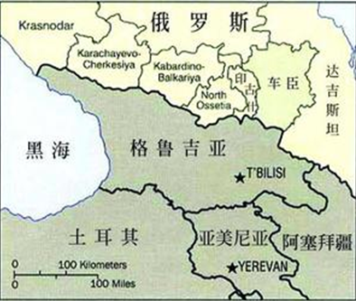
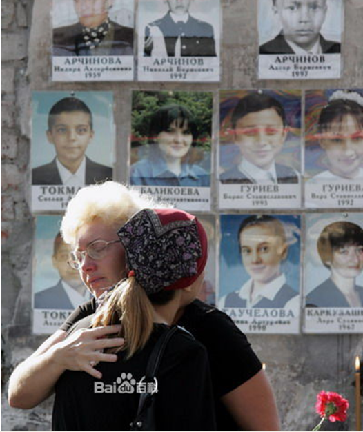
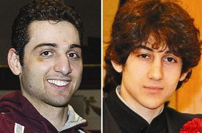

# 第六十期：车臣恐怖主义

**编者按**：2013年4月15号，波士顿马拉松终点发生了至少两起爆炸。这一明显践踏体育精神和中国留学生在此次爆炸案中的伤亡再次将恐怖主义这一话题推倒了风口浪尖。据悉蓄意进行此次恐怖袭击的兄弟俩都为车臣人。车臣恐怖主义是如何发展的？它与美国的关系又是如何变迁的？这将是本期百科要讨论的话题。  **本词条在以下文章中被使用：****** （1）<第三十三期·摇光>：[阳光是最好的消毒剂](/archives/699) （2）＜七星视点＞第十七期：[从微博到炸弹——非暴力与暴力的两难抉择 ](/archives/9786) （3）＜摇光＞：[生病的医生 ](/archives/10421) （4）＜北斗荐书＞：[《让人民自由：民主的历史》读书笔记](/archives/14506)  **词条简介**** **

车臣恐怖主义顾名思义是由起源于北高加索的车臣民族中的极端分子制造的恐怖主义袭击。车臣恐怖主义有其独特而复杂的历史原因，深刻的文化与民族动因。

 **目录：** 1、车臣民族历史 2、车臣恐怖主义发展 3、车臣恐怖主义与美国关系 4、参考文献 5、延伸阅读  **1****、车臣民族历史******

车臣最早起源于北高加索的阿尔贡河边，12世纪车臣人建立自己的王朝，之后的两个世纪遭受蒙古、突厥的侵袭。15世纪奥斯曼土耳其帝国入侵后**逐渐开始信奉伊斯兰教**，与周围信奉东正教的格鲁吉亚人、哥萨克人和信奉藏传佛教的卡尔梅克人矛盾不断。19世纪沙俄经过半个世纪的高加索战争将车臣划入自己的版图，在沙俄征服高加索的过程中，**车臣人是最活跃最坚强的敌人。******

十月革命后，苏联政府对北高加索山民采取了一些保护性措施：废除了沙皇的民族压迫政策，帮助一些山民建立民族国家组织，发展民族经济，创造民族文字，在宗教信仰和风俗习惯方面强调要尊重少数民族的特点等。但由于受历史上大俄罗斯沙文主义的影响，加之对“好乱成性”的山民猜疑和不信任以及二战期间部分车臣人依附德国人“通敌卖国”，**苏联政府在对待北高少数民族的政策上存在着混乱和过激之举**，比如频繁变更民族行政区划、强制实行农业集体化、强迫民族迁移、实行民族融合政策，引起了包括车臣在内的各民族新的不满和反抗。

20世纪80年代末，**随着苏联解体，新一轮民族独立运动浪潮掀起高潮**，1991年车臣杜达耶夫在参选者只占选民总数10%-12%情况下当选总统并宣布车臣共和国为主权国家。在俄联邦实施高压政策交涉未果情况下**俄联邦于****1994-1996****和1998****年两次出兵，进行了两次车臣战争**，对杜达耶夫武装力量以毁灭性打击，同时也造成了大量平民伤亡和流离失所。

** ** **2****、车臣恐怖主义******

**车臣身处民族、宗教成分复杂的北高加索，多年的战争、动荡使这片土地满目疮痍，人民生活贫困、受教育水平普遍不高，同时伊斯兰原教旨极端主义、独立（分裂）主义思想的传播伴随着各种政治角逐和国外干涉，共同使这片土地成为恐怖主义的温床。**

** ****（别斯兰中学事件悼念活动）**

上世纪九十年代中期第一次车臣战争中巴萨耶夫在斯塔夫罗波尔边疆区制造了绑架1000多名人质的事件要挟俄政府立即从车臣撤军，否则杀死全部人质。自此现代意义上的车臣恐怖主义登上历史舞台，仅1997年、1998年就绑架了欧洲多国代表，1999年制造了15起恐怖事件造成338人死亡，550多人受伤。

进入二十一世纪之后，车臣恐怖主义制造了更多的恐怖袭击，**尤其2004年为恐怖袭击高峰**，并有了著名的征用女性恐怖分子的“黑寡妇袭击”，袭击的对象不仅包括俄罗斯共和国及其加盟联邦也包括格鲁吉亚，土耳其等邻近国家。其中著名的恐怖袭击事件包括：

2002年5月9日俄罗斯南部达吉斯坦共和国的卡斯皮斯克市在举行纪念二战胜利游行活动时发生爆炸事件，造成42人死亡，100余人受伤。

2002年10月23日40多名蒙面持枪的车臣恐怖分子闯入莫斯科轴承厂的文化宫大楼，劫持了正在那里演出的演员、欣赏音乐会的观众以及文化宫的工作人员近千人。3天后，俄特种部队向剧院内施放催眠气体后，成功地解救了大多数人质，但仍有130名人质不幸丧生。

2004年2月6日莫斯科一列地铁列车在运行中发生爆炸，近50人死亡，100多人受伤。这是莫斯科有史以来最严重的地铁列车爆炸案。

2004年5月9日车臣首府格罗兹尼的狄纳莫体育场5月9日发生爆炸，炸死车臣总统卡德罗夫、车臣国务委员会主席伊萨耶夫等7人。

2004年8月24日，两架从莫斯科起飞的客机在几分钟的时间里相继发生空难，机上89名乘客和机组人员全部遇难。据证该举本意制造俄罗斯的911事件。

2004年9月1日车臣武装分子策划了震惊世界的俄北奥塞共和国的别斯兰第一中学劫持人质事件，将1000多名正在举行开学典礼的师生及家长劫为人质。尽管俄罗斯动用了各种手段，但仍有335名师生不幸遇难，其中包括157名天真可爱的儿童。

2010年10月19日俄罗斯车臣共和国议会大楼遭到数名武装分子袭击。俄联邦侦查委员会车臣侦查局表示本次袭击共导致6人死亡17人受伤。

车臣问题是多年的宗教文化历史等原因共同造成的结果，**给两个民族都带来了巨大的伤痛。******

** ** **3****、车臣恐怖主义与美国的关系******

九十年代车臣问题爆发后，**出于掣肘俄罗斯和争夺里海石油资源的目的**，西方国家不断介入车臣事务。其中美国克林顿政府出于对伊斯兰世界的同情态度，态度上尤其坚定，战略上：

首先,提升该地区在美国对外政策中的地位。1996年3月,美国总统国家安全顾问伯杰表示“高加索和中亚在美国对外战略中应是特别关注的地区”,“美国应加紧参与高加索和中亚事务” 。7月,美国出台“新中亚战略”,其核心是‘支持这一地区国家对俄罗斯的独立倾向; 大力开发石油资源,使该地区成为美国21 世纪的战略能源基地;遏制并削弱俄罗斯和伊朗的影响,逐步确立美国在该地区的主导地位”。

其次,密切与该地区国家的高层接触。近年来美国高级政要接连访问这一地区,同时不断邀倩中亚高加索国家首脑访美,双方的政治关系日趋升温。

第三,加强对该地区的经济援助力度。美国对中亚国家的援助额1997 年为6.2亿美元,1998年则升至9亿美元。近年来,中亚国家引进的外资70%来自西方国家,其中绝大部分来自美国。

第四,控制该地区的油气生产与运输。目前美国已向该地区的能源开发领域投人数百亿美元的巨资,同时还竭力开辟运输里海能源的新通道,避免“石油生命线”被俄罗斯控制。

第五,借助北约向中亚高加索地区进行军事渗透。目前,该地区的8个前苏联共和国除塔吉克斯坦外都加入了北约的“和平伙伴关系计划” 。

但随着伊斯兰世界原教旨极端主义逐渐将美国视为最大敌人，9.11**后，美国开始增加与俄罗斯的反恐合作。**俄军方向美军在阿富汗的行动提供了大量地质情报，帮助美军粉碎了基地和塔利班的洞穴战。俄军特工和独联体中亚国家的特种部队还直接出兵阿富汗，打着志愿军的旗号，与美国特种兵并肩作战。彻底摧毁了塔利班；俄罗斯在西方国家情报协助下，反恐不断告捷，恐怖分子首脑纷纷落网或被击毙。在车臣“拉登”巴萨耶夫被击毙后，车臣恐怖分子现在只剩下了不到500人。躲在深山中苛延残喘。车臣恐怖主义分子与美关系破裂。

波士顿爆炸案嫌犯特萨尔纳伊夫兄弟与车臣战争期间作为难民被美国接收成为美国公民，在美期间缺乏文化、政治认同感与归属感，在伊斯兰原教旨主义思想的影响下制造了波士顿爆炸案。波士顿爆炸案将促使美国各界反思奥巴马政府加速反恐战线收缩的战略。

** ** **4****、参考文献****** [1] 李华，2004，俄罗斯车臣恐怖主义产生的历史及现实根源，《南通大学学报（哲学社会科学版）》 2005年1期 [2] 柴理，2000，车臣战事——民族矛盾起干戈，《民族论坛》，2000年01期 [3] 凤凰网资讯，[波士顿马拉松连环爆炸](http://news.ifeng.com/world/special/bostonmarathon/) ** ** **5****、拓展阅读****** [1] 徐振泽，孙景源，舒梓 《车臣之鉴——俄罗斯恐怖事件根源及教训》 [2] 闻一：左斟右酌话车臣，共识网 [3] 侯艾军，《车臣始末》 

（编辑：谢昆 责编：高丽）
