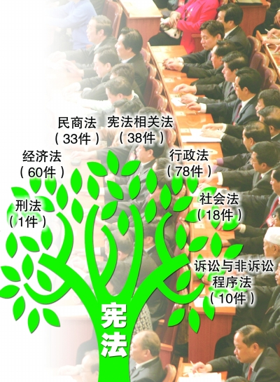
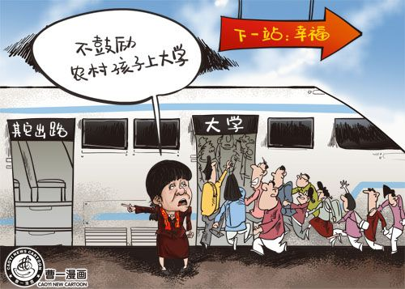
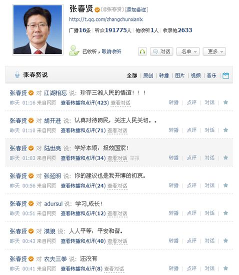

# 两会专题：两会大party，我们隔窗看

# 七星视点

## 两会专题：两会大party，我们隔窗看

### 小编按：

3月13日，中国人民政治协商会议第十一届全国委员会第四次会议在京闭幕。3月14日，第十一届全国人民代表大会第四次会议在京闭幕，政府工作报告、“十二五”规划纲要、全国人大常委会工作报告等得到批准。  
一年一度的两会又落下帷幕，据说中国式民主也在实践中得到了不断丰富和发展。中国式民主的变迁，也许我们应该问见证了十一届全国人大会议的全国人大代表申纪兰。但这位从来没投过反对票的代表，以她82岁的高龄在人民大会堂前拾级而上的时候，大概已经感到吃力了吧。  
两会是为百姓而开。有舆论归纳，这次政府工作报告直接回应了十大民意，涉及物价、楼市、收入分配、社会保障、食品安全、反腐倡廉、教育医疗就业等热点问题。南周两会版有个广告：“见证中国新进取，某某名车恭祝两会召开。”好像在不经意间告诉我们，真正参与两会的到底是哪些人群。金碧辉煌的屋里有一场大party，而一副穷酸打扮的老百姓就趴在媒体做的窗户上往里看。可是那些窗户不知道怎么做的，让我们看到的一切都是亮色的。  
在这里，我们愿做一块简陋但却透明的玻璃，且为你路过时往里撇那么几眼。

### 1、立法难与易

全国人民代表大会最重要的职责就是立法。今年的会议期间，中国特色社会主义法律体系宣告形成。但据说在立法过程中，一直遭遇 [**代表“法难立”，政府“立法易”**](http://nf.nfdaily.cn/nfzm/content/2011-03/11/content_21085302_4.htm)。

**七星视点：**** **

在国内，广义上的法指一切规范性文件，包括全国人大立法、全国及地方性行政法规、部门规章等。而狭义的法则，仅指全国人大及其常委会制定的法律。因此，窃以为“代表立法难，部门立法易”的现象确实存在，但在许多情况下，前一个“法”通常指的是经过全国人大及其常委会审议通过的适用全国的法律，而后一个“法”则是指相对下位的行政法规、地方法规、部门规章等，虽然对法律的规范对象而言，这种区别在实践中未必具有什么实际意义。  
鉴于全国人大及其常委会决议通过的法律具有基础法律的性质，并在全国范围内适用，因此其程序上往往更为严苛且繁琐，例如，人大常委会在对一项法律案进行决议之前，通常要进行三次审议，如遇争议较大，则可能出现四至五次审议的情况。除此之外，此类法律往往牵涉众多部门利益，因此在通过之前总须耗费大量尽力用于协调各部门利益。  
反之，政府部门制定的诸如规章、实施细则等，则无须上述繁琐程序。但作为行政部门制定的规范性文件，与具有宏观指导意义的人大立法相比，在实践操作层面中与社会公众的接触往往更为频繁。另，因立法总是相对滞后于社会需求，政府部门频繁出台的政策性文件也在一定程度上起到的规范社会公众的作用。例如，商务部门出台一个N号文，便可对跨国投资者产生诸多实际影响，对这些投资者而言，此类政策性文件与法律无异。

**By ****迦南**

### 2、“民富优先”不是“先富起来”

援引新华网评论：调整个税起征点、扩大央企红利上缴比例、努力实现居民收入增长和经济发展同步……今年全国两会释放出的一系列惠民、富民信号，让人倍感振奋和期待。坚持民生为大、倡导**[“民富优先”](http://news.xinhuanet.com/politics/2011lh/2011-03/14/c_121186509.htm)** ，日益成为广泛的社会共识和鲜明的政策指向。  
**七星视点：**** **

对“民富优先”的倡导仿佛让我们看到了下一个五年工资卡上数字的不断飙升。可是，民富的标准是什么？收入达到多少才算是民富？多大比例人口实现富裕才称得上民富？会倒是开完了，可给我们的答案并不清晰。收入水平的年年上涨与飞涨的物价以及GDP的节节高涨相比显得那么无力。  
政府早已找到了实现民富的路径。在实现“民富优先”过程中，两会提到“要扩大央企红利上缴比例，要进一步打破垄断坚冰，为民企发展创造更好的环境”。这样的说法我们早在前几年就听到过，可直到现在仍旧没有落实的迹象，这不得不让我们怀疑这些政策的实施前景甚至是制定动机。  
只希望“民富优先”的口号不仅仅是个口号。但愿我们下一次审视这一提法时，不要让“部分人民优先富裕起来”成为“民富优先”的另类解读。  
**By ****小驴 **

### 3、进军“十二五”

3月14日，第十一届全国人民代表大会第四次会议审查了国务院提出的**[《中华人民共和国国民经济和社会发展第十二个五年规划纲要（草案）》](http://news.xinhuanet.com/politics/2011-03/16/c_121193916.htm)** ，会议同意全国人民代表大会财政经济委员会的审查结果报告，决定批准这个规划纲要。  
在“十二五”时期的主要目标和任务的章节中，报告明确说明：“改造提升制造业，培育发展战略性新兴产业。”

**七星视点：**

调结构，保增长，这是多年来一直被提到的话题。制造业仍是我国现阶段及不远的未来的支柱产业，如何把战略新兴产业与传统制造业结合得相得益彰是目前我国最需要研究的方向。而全球热点能源环保、生物、新材料、信息技术仍然是下一个五年的发展动向。具有自主知识产权、帮助传统工业转型过渡实现“软着陆”、节能降耗、环境保护的高新科技技术将会成为未来政府扶持的重点。  
08年税改后，政府推出的一揽子高科技企业减税政策和层出不穷的政府科技型基金都已经明确告诉了未来的发展重点。好产业是需要资源聚焦的，这聚焦，包括政策聚焦、资本聚焦、技术聚焦、人才聚焦等等。我相信这次战略新兴产业不仅仅会是一时的热点，它将会延续数十年之久，直到淘汰产能落后、高能耗、高污染、低利润的产业。  
**By ****钱慕白**

### 4、农民进不进城

“我们也不要鼓励我们农村的孩子去上大学，因为一旦农村孩子读了大学，就回不到自己的家乡，回不去自己的家乡就是一个悲剧。”近日，全国政协委员无党派联组的分组讨论上，全国政协委员、北京中华民族博物馆馆长王平语出惊人。她表示，自己常年深入农村地区，认为城镇化让每个地方都千篇一律，甚至不鼓励农村孩子上大学。  
而同时**[人大代表建言新生代农民工融入城市之路](http://news.xinhuanet.com/politics/2011lh/2011-03/13/c_121182246.htm)** 。

**七星视点：**

王委员的观点，还透露着过去限制个人流动性而非尊重个人选择的思维方式。从农村到城市的大规模流动，是市场规律，岂是鼓励不鼓励的事吗？  
现在的实际情况是，农村孩子很多还考上了但是上不起大学。这种不公平，本来应该由社会各方共同努力去弥补的。教育是社会成员实现向上流动的一个重要途径，不接受高等教育，很多农村孩子就永远失去了在社会中向上流动的机会。  
城市化是中国社会当前的方向，也是不可逆的。关注农村、关注农民是为了协调城乡在城市化进程中的关系。农村确实应该得到政策上更多的支持。但是这种支持的着眼点不是保持农村的现状，传承所谓的“农村文化”，而是让农村得到保障的同时更适应社会转型。农村孩子想到城市上学，应该得到最大的支持。这样才能让他们更快地融入城市，而非像现在无数的漂泊的农民工，在城市中没有地位，回家了却没有生活，在城乡的夹缝中挣扎。  
**By ****竺道生**

### 5、考碗族：肿么木有考公务员的利好消息？

全国人大代表、广东省政协副主席王珣章说，**[公务员热只因地位高待遇好权力大](http://edu.163.com/11/0310/22/6UQOE4RD00294IIO.html)**。作为政府公职人员，他也认同目前官员地位被推得太高，大学生爱考公务员的目的往往是爱当官，认为做官后地位会很高，权力很大。而全国政协常委、中央党校原副校长李君如日前在接受媒体采访谈互联网上官员与民众交流的问题时，提到须倡导平等交流，[**防止“仇官”等不正常心态蔓延**](http://news.163.com/11/0311/08/6URQUDK80001124J.html)，引发社会不安。他强调，“一旦公务员在社会上的基本人权得不到保障，得不到尊重，那就意味着这个社会失控了。一旦这个社会失控，倒霉的不是官员，倒霉的是老百姓。

**七星视点：**

李君如说：“一旦公务员在社会上的基本人权得不到保障，得不到尊重，那就意味着这个社会失控了。”试问，在普通民众的人权尚得不到保障的情况下，如何能直接跳跃到公务员的人权？公务员作为“人民的公仆”，本身是服务性质而非福利性质的，却被李委员强调其人权保障，确有无视现状，本末倒置之嫌。做官应为百姓谋利，如果社会失控了，倒霉的是老百姓，官员如何能袖手旁观，还庆幸倒霉的不是自己？没有无缘无故的恨，百姓的仇官，无非是有官员为非作歹，整个官僚体系又充斥着垄断和不公平，官员怎能以威胁恐吓的方式来对待？中国自古以来就存在官民裂缝，官民之间从来都是上下级，而非平等，何谈服务与被服务的关系。官代表政府，民代表社会，其间的裂缝使得很多时候官民不能通力合作，政府与社会不能齐心协力，对于整个国家是断无好处的。  
**By ****登峰**

** **  
政协常委说老百姓仇官将损害自身利益，这个说的一点也没错，很难得政邪委员们敢于在这么尖锐的问题上说这么靠谱的话了。仇官会导致百姓自己的利益受损，这个事情有几句老话讲的好，官官相护。所以我们的老百姓如果不喜欢官员们，真的会倒霉。那么官官相护这个词是什么时候有的呢？不知道，至少也是晚清之前把？很显然，我们的官场和前面几个朝代没什么区别。  
仇官会导致百姓自己的利益受损，是政邪委员吧话说了一半，另外一半是说：攀附官员则会有利于自己的利益。即便这为政邪委员有胆量说出真话，也没胆量把话的另外一半说出来。而这个，也恰恰和几百年以前，混官场的人讲究“城府”一样。  
说来说去，其实这个年代，和我们几百年前的时代一样。总之，我们民族的问题，终究没有得到解决，这将依然是我们未来必须面对的问题。  
**By ****安静的繁华**

### 6、官员的网络形象

全国人大代表、新疆自治区党委书记张春贤开通微博，并给网友写信表示“**[民生连着民心，民生凝聚人心](http://cpc.people.com.cn/GB/64093/64103/14053478.html)**”，负责微博管理的工作人员证实了该微博的确为张春贤所开，这也被称为“微博史上最高级别的官员”。截至3月14日，张春贤的[**微博一共更新了83条**](http://t.qq.com/zhangchunxianlx)，**[听众达到277400人](http://t.qq.com/zhangchunxianlx/follower)**。小编在浏览其微博时看到，张春贤对网友留言的大部分内容都予以了回复，而回复的时间多集中在晚间十一点至两点间。显示他在每天工作之后**[看微博到半夜的报道](http://news.ifeng.com/mainland/special/2011lianghui/content-0/detail_2011_03/07/5004531_0.shtml)**属实。但作为“微博史上最高级别的官员”，张春贤表示在[**两会之后或许不会再更新微博**](http://www.china.com.cn/2011/2011-03/09/content_22088495.htm)。

**七星视点：**

张春贤书记曾经在湖南主政数年，作为一个湖南人，本人对张春贤的政绩还是很满意的。更为重要的是，张春贤是为数不多的在我印象中会认真对待民意尤其是网络民意的地方领导人之一。不过对于张春贤书记表示在两会后不会再更新微博，本人认为十分可惜。大陆官员一向缺乏与民众的交流，反观台湾，在前一段时间开通facebook（台湾称脸书）（小编注：这个哪里存在，怎么没看到过）的台湾地区领导人马英九却在个人主页上与民众互动，很是风生水起。在网络上展示亲民的一面，不但没有影响政治人物的权威，反而让民众认识到了一个更为真实的官员。在新世纪的网络时代，官员对网络民意的重视和与网民的互动，是一个国家政治成熟的标志之一，大陆在这方面很值得向对岸学习。

**By **纳兰辰瀚****

### 7、“幸福工程”反三俗

全国人大代表、江苏省广播电视总台台长周莉接受采访时认为，当前的文化市场上，为迎合观众口味，不少影视作品有媚俗化倾向，应加以重视。在影视作品创作以及文化建设中，应突出贴近百姓生活的“幸福文化”理念，打造老百姓精神上的“幸福工程”。

**七星视点：**

周代表这次果不其然又给大批影视作品贴上了媚俗的标签。首先，要分清俗和雅。“俗”无非就是人民喜闻乐见的作品。雅，即是那些晦涩难懂或者主旋律的作品。我并不认为会有很多人真正喜欢或者认同那些所谓的“高雅”的作品。而失去了民众基础的作品，应该也不会有什么生命力，也就是束之高阁，逢年过节拿出来看看而已。如何去媚俗化？不是去，而是做好影视的分级制度，保护青少年不要受影响就好，其余的成年人，喜欢高雅的就去看高雅的影片去，喜欢低俗的又何妨。  
而后，周代表，再一次代表人民过上了幸福的生活，贴近人民的幸福生活，但如果人民过得不幸福，这叫我们如何伪装着幸福去欣赏那些作品呢。与其一味强调幸福，不如强调真实。真实的作品才会让观影人产生共鸣，也是民众喜闻乐见的影视作品吧  
**By ****凤先生**

**（随手评论，参与七星视点。投稿邮箱： ibeidouview@gmail.com）**

（采编：钱思韵、杨再爽、陈造极、金吉男、刘一舟 责编：刘一舟）
