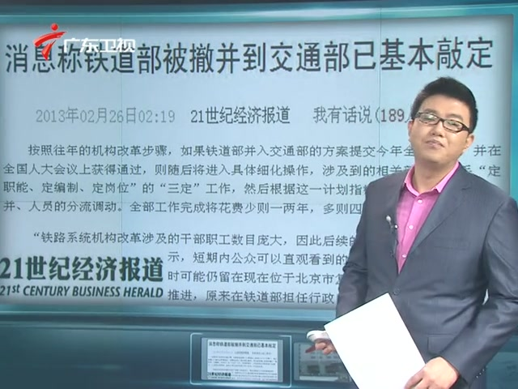

# 今日视点：铁道部 —— 一个时代的终结？

今天发布的《国务院机构改革和职能转变方案》中提到：

为推动铁路建设和运营健康可持续发展，保障铁路运营秩序和安全，促进各种交通运输方式相互衔接，实行铁路政企分开，完善综合交通运输体系。将铁道部拟订铁路发展规划和政策的行政职责划入交通运输部。交通运输部统筹规划铁路、公路、水路、民航发展，加快推进综合交通运输体系建设。组建国家铁路局，由交通运输部管理，承担铁道部的其他行政职责，负责拟订铁路技术标准，监督管理铁路安全生产、运输服务质量和铁路工程质量等。组建中国铁路总公司，承担铁道部的企业职责，负责铁路运输统一调度指挥，经营铁路客货运输业务，承担专运、特运任务，负责铁路建设，承担铁路安全生产主体责任等。

这意味着，这份方案经十二届全国人大一次会议审议通过以后，长期以来处在舆论的风口浪尖的、被认为要为群众的出行困难负很大责任的铁道部，就将不复存在了。

自1949年起，铁道部就作为中央人民政府政务院的组成部门存在，其间，也曾在70年代初一度并入交通部。经过了65年，铁道部已然成为一个政企不分、军政合一、检法俱全的庞然大物。几年来，对此的批判不绝于耳。虽然其中诸如医院、学校、通讯等机构已经逐渐剥离，而在2012年，铁路司法也终于移交地方，但是最受关注的政企不分问题，却始终没有得到解决。这次机构改革，正是针对这个问题而来。

一个时代过去了，然后呢？

群众对这次改革的期望，无非集中在更高效、更廉价、更便捷、更清廉这几个方面。然而，姑且不论这些诉求是否可欲，至少，这未必将是这场改革所带来的结果。铁道部的低效是一个客观的现实，然而，很多国有企业的低效和昂贵也是一个客观的现实，没有理由说政企分开之后，新的中国铁路总公司就不会变得与“两桶油”一样。至于对12306的改进期许，也未必就比对网银那些控件的期许现实。

有趣的是，网民们已经开始预言票价的上涨了。这是可能的。长期处在市场调节之外的铁路票价将如何变化，并不是那么简单就可以预测。另一方面，虽然政企分开了，但是管制和垄断并没有消失。

当然我们还是可以对这次改革抱着美好的希望。民航的市场化和拆分不是成功了吗？而日本国铁的分割民营化不是也取得了传奇般的成就吗？毕竟，现在只是一个开始。

“转变国务院机构职能，必须处理好政府与市场、政府与社会……的关系，……以充分发挥市场在资源配置中的基础性作用。”这是《国务院机构改革和职能转变方案》中的一段话。但愿这不是一段空话。

而另一方面，我们也不应该高估什么。就像这个预言里所说的一样：

[@小白兔吃猫饼干](http://www.weibo.com/rabbitkillkenny)：最多过两年，就会有人跳出来怀念铁道部，痛斥公司化搞坏了铁路运输，当然那时候也还没市场经济什么事，但公知又免不了遭一番批判，这是保守估计。  扩展阅读： [＜七星视点＞第二十期---乡愁是服务器永远正忙](http://blog.renren.com/blog/362359989/799849398) [＜七星视点＞第三十三期：车票的故事](/?p=29807) [2013年春运纪事｜北斗网](/?p=30412)

（编辑：张舸）
