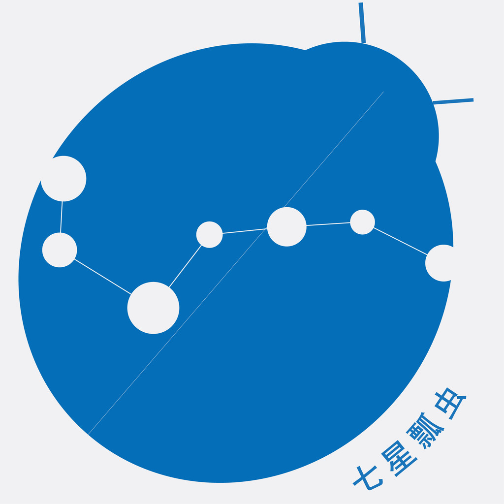
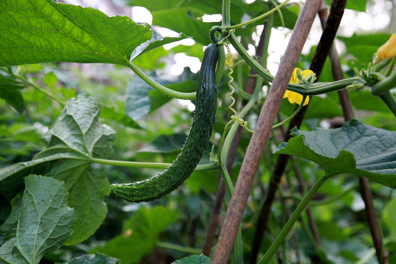

# 广告时间：七星瓢虫君来了！

### 

### 

# 广告时间

### 

## 七星瓢虫君来了！

### 

### 

#### 小编日志：

本周没有如期奉上七星视点，列位，小编在此实在对不住了。不是说本周没有发生值得关注的新闻事件。天朝的大地上，闹剧和悲剧依然在如期上演。而是有些事，小编真是欲言又止。 所以开个天窗透透气也好。 七星视点栏目在您的支持下已经走过了十二期，按每周一期算就是一个季度的时间。在这期间我们也是边扔石头边过河，在摸索中前行。您的关注，不论褒扬还是批评，都是我们的动力。 在七星视点里参与过评论的既有学术大牛又有普通读者。但进了七星视点就只有一种身份，评论者。谁的声音都是重要的，都应该被听到。我们的观点是：七星视点——多元观点的平台。 但是七星视点作为北斗尝试推出的一个新闻评论类栏目，形式还比较单一，内容还不够丰富。总之还不够给力！我们立志解放思想，实现跨越式发展！ 经过精心筹划，在七星视点经验教训的基础上，我们已经筹划了打造一个北斗旗下的新闻评论品牌“七星”！代言人就是我们的七星瓢虫君！接下来不仅仅是七星视点第二季开播，而且会有两个新栏目《七星微语》和《七星联播》上线。好期待啊！ 

### 

### 

### 【广而告之】

### 

#### 七星视点：

在新的七星视点里，我们会精选新闻，改变现在蜻蜓点水式的做法。一期只会选择三五条甚至一两条新闻，但评论的力度会加大。我们计划对新闻时事和舆论观点进行地毯式轰炸，提供更多的背景阅读，评论也是多角度全方位的。 

#### 

#### 七星联播：

新闻播报栏目。仍在规划中。 

#### 

#### 七星微语：

我们会精选大学生微博，集结发布。 目前我们已经设立了人人网帐号“[瓢虫君](http://www.renren.com/profile.do?id=362359989&from=opensearch)”和新浪微博帐号“[七星瓢虫君](http://weibo.com/2079236837)”。这两位存在就是为了求@。当你发表或者转发精辟有趣的状态和微博，只要随手@“瓢虫君”和“七星瓢虫君”，就会有机会得到转发。而我们也会每周筛选集结发表。 无论表态还是吐槽，我们都非常欢迎！新一代的状态帝就要诞生了！ 快@人家嘛！ 

### 

### 

“北斗是那常青藤，七星就是藤上的瓜！” （批评或投稿：[ibeidouview@gmail.com](mailto:ibeidouview@gmail.com) “瓢虫君”“七星瓢虫君”） 

### 

**By 北斗网络部**

### 
