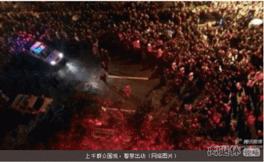

# 第三十七期：地震思考录——救灾中那一只“看不见的手”

### 物资涨价何以导致暴力攻击？

地震发生没有几天，在灾区雅安荥经县，有一家名叫“杨胖子”的面馆，在地震后，将原本只要5元一碗的面涨至每碗20元，卖给路过荥经支援灾区的官兵以及周边的居民，引起荥经民众的愤怒，以至于数百近千人围在“杨胖子”摊前，一些激动的群众将门店的招牌也取了下来，阻止店方营业。

在排除法律的因素之外，按照人类的同情心来思考这种现象，“奸商”和“唯利是图”的非理性情绪占了上风，而这对于在没有完整的制度来保护私人财产权利的情况下，这样的后果不可想象。

在畅销书《在超市遇见亚当斯密》一书里有这样的事例的阐释：地震时趁机涨价的超市才最公平？夜晚突然地震，超市的手电筒必然要畅销，而此时才能知道谁是最需要光明的人群？那么唯有价格才能真正反映出人们的需求。虽然涨价了，但是超市购物的人依然很多，需要手电筒的人依然愿意付出高价来购买，而对于那些家中有蜡烛的人此时放弃买手电筒的决定，把商品留给最需要的人。涨价弥补了爱的缺乏。涨价鼓励人们要购买，而是让愿意付较高价格的陌生人买到最需要的商品。而且涨价是商人有了积极性，愿意就关键品种多备一些货，并承担备货成本。而此时的涨价在众人的眼里就变成“发国难财”，引发民粹情绪，造成更大的损失。此时市场通过价格的信息引导商品的流通，被看成是在“敲竹杠”，是在“赚取灾难的苦难财”。

在地震后提供餐饮，在瘟疫中提供药物，这不也是在帮助和改善灾民的处境？自愿交易代表双方都受益。商家提供了服务，你觉得不划算，没有购买商家的服务，但是你的处境并没有因此变差。如果你觉得划算，购买了他的商品和服务，你得到了相应的满足。这是两厢情愿的事情啊。觉得地震后涨价的面条贵，你选择不吃而排队去领取公益组织和政府提供的赈灾面包，你并不因此受到损害。但是商家的行为给你了另一种选择。我就是等不及免费的赈灾面包，我就是想吃面，我还可以花钱吃到面。涨价的商家给予了灾民更多的选择，换句话说，提供了更多的自由。这难道不是改善了灾民的环境吗？

灾难之中，普通商品的供求关系发生了变化，是人们的需求哄抬了价格，而商家的定价不过是反映了这个需求罢了。同理，供需变了以后，价格自然变了。充满爱心的围观群众会说，这是灾难，“经济规律不适用”，他们就是不该涨价。但是无论承不承认，实际的供需关系已经变化了。某样急缺的商品不涨价，就是人为造成了短缺。票面上的价格没有变，只是你买不到而已。我们可以想象一下，当物资稀缺的时候，若不能用价格机制调配，物资会怎么分配呢？权力？寻租能力？

商家的本意是赚钱，这个本意是无关于善恶的，但是他们提供的商品和服务，满足了灾区人民的需要，改善了灾区人民处境。毫无疑问，是一件好事。

在一场灾难中想赚国难财的商家越多，物资和服务提供得越丰富，灾民得到的实惠越多，越容易从灾难中尽快恢复过来。物资越丰富，物价也越趋向于平时状态，最终恢复到正常时期。

灾难意味着大量生命的逝去，财产的损失。这是谁也不愿意看到的。但是悲伤归悲伤，生活还要继续，如何更有效的救治灾民，更有效的让社会恢复正常的运转，请尊重经济规律。围观的爱心群众即使不能为灾区尽一分力，万万不可凭借一腔热血冲动而为，你的好心很可能让灾民陷入更糟糕的境地。

### 民间慈善

一直以来，我们抨击中国人自私冷漠、缺乏道德、缺乏慈善之心，这似乎已成为一种时髦。并且，批评者往往把许多中国社会问题的深层原因都归结到这里——中国人没有宗教信仰，因此没有终极关怀，于是也就不愿牺牲现实利益去帮助他人。由于这种心理来源于中国文化，所以短时间内无法改变。

如果是这样，那么中国社会中的那些需要帮助的人指望谁呢？那些仅仅是由于运气不济而陷入悲惨境遇的人到哪里去寻求帮助呢？看来只有依靠政府的福利保障了。既然中国人不愿意自发行善，那么就只好强迫他们行善，也就是由政府征收税款，然后再分配给那些需要帮助的人。否则，那些可怜的人就不会得到任何帮助。

现实情况看来的确是这样。中国的慈善事业很不发达。与那些慈善事业发达的国家相比，中国人捐资行善的绝对数额和占收入的比例都是较低的。这种现状和中国的经济发展水平并不相称。中国人并没有穷到无力助人的程度。看来，中国人在乐于助人方面确实令人不敢恭维。

虽然现实情况无可否认，但最好还是不要轻易下结论。历史表明，中国人其实是乐善好施的人群。那么，为什么现在中国社会的慈善事业那么不发达呢？

在慈善事业中，慈善机构的作用是极其重要的。捐资行善的人虽然有足够的善心和财力，但他并不掌握行善所需的信息和相应的管理能力。缺乏信息，就会给骗子提供机会。而管理能力不足，也会使得善款的使用不能达到最好的效果。而慈善机构的作用就在于为捐资行善者提供信息和管理。

由于慈善机构的专业化工作，即使扣除他们必要的工作经费，捐资者的善款也将得到最大限度的合理使用，为社会提供尽可能多的帮助。如果捐资者自己直接去寻找受助者，往往效果更差。最近国内已经披露出好几起类似的事件，捐资者往往陷入被骗或者被利用的境地。这并不是偶然的。可以想象，这些捐资者的被骗，将使得无数本来想要行善的人往而却步。

可是，怎样保证慈善机构的诚实可靠和工作能力呢？靠竞争。企业要面临竞争，要使消费者相信自己提供的商品和服务更加质优价廉，慈善机构同样要面临竞争，要努力让捐资者相信自己的诚信和操作能力。那些在竞争中胜出的慈善机构将募得更多的善款，发挥更大的作用。而那些行为可疑、浪费低效的慈善机构只能逐渐萎缩，直至消亡。目前国内的许多慈善机构——他们往往是由政府主办的——在诚信程度和工作能力上都不尽如人意。他们果然也没能得到大量的捐款。如果他们把自己的失败归因于中国人缺乏慈善之心，那是极为荒谬的。中国人有足够的慈善之心，但中国人也有足够的智慧，可以有效地识别出那些骗子和不可靠的人。指望着人们把钱大量捐给蛀虫，是办不到的。

因为同样要面临竞争，所以，慈善机构和企业具有一些共同的特点，最大的区别仅在于慈善机构并不以经济利益——利润最大化为目标。慈善机构其实就存在于市场以内，遵从市场的基本规律，是整个市场经济体制的一部分。我们可以看到，越是市场经济体制发达完善的国家，慈善事业越发达。这不是偶然的。不是市场经济国家的人们更有善心，而是竞争的有效性使他们的行善愿望有更多得到满足的机会。

而目前的中国，在不完善的体制下，民间创办独立慈善机构的空间受到极大压制，甚至根本不可能。这才是中国慈善事业不发达的根本原因。历史和现实充分表明，中国人并不缺乏慈善之心。中国人缺乏的，是自主行善的机会和条件。

看到中国慈善事业不发达的现状，要做的不是空洞地谴责中国人缺乏慈善之心，而是要尽量给他们创造出自由发展的空间。当人们有了自由选择的权利时，会有许多人选择无私地去帮助他人。自愿帮助他人不仅使受助者得益，捐助者自身道德水准也很有所提高。

这次四川雅安地震，李连杰的壹基金的就表现出民间慈善机构的力量，而这也正是市场力量推动的结果，社会对于民间慈善机构的热情在这次雅安地震的信任和支持，正是对于诸如红会官办慈善机构的一种不信赖。所以说在政府之外，依靠竞争带来的信誉才是慈善事业不断发展的基础。

地震确实让我们悲伤，难过，我们为逝去的无辜的生命哀悼，再重新建立新的家园的时候，我们需要更多的理性，这种不可预知的天灾让我们人类的力量看起来无比的渺小。而只有灾区的人们自己动手，重新建立自己的家园才是真正的道路，国家的救助永远无法满足他们的需求。

依靠全社会的力量来帮助灾区人民重建家园，而不是单纯的依靠政府的救助，灾民不需要施舍，他们需要的是帮助他们重建家园的途径，他们不缺少重建家园的力量，他们不需要额外的怜悯，不需要特别的对待，他们有自己的双手，可以劳动，可以生活。结合市场自发的交易和价格信息的流动，依靠市场的自发的秩序，加上灾区人民的辛勤劳动，我们有理由相信，灾区一定会重新焕发活力，新的雅安将在不久之后重新站立在人们面前，让我们为雅安祈祷 。

（编辑：郑浩；责编：刘迎）

[【灾难沉思录】<七星说法>第七十七期：地震后,我们应该怎么办?](/archives/34988)——我想想自己的专业知识在震后对大家的帮助还是很大的，于是根据书本和网上的搜索，我整理了以下震后法律小常识，供大家参考。

[【灾难沉思录】七星百科〉第六十一期：道德绑架——何谓“道德绑架”，“道德绑架”又是怎样界定的？本期百科将为读者解释。 ](/archives/35219)
