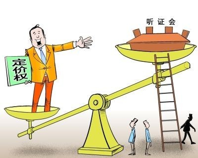

# 第三十九期：避重就轻的听证会

北京出租车价格调整听证会于5月23日在京举行。会上提出的出租车调价方案有两个，分别为每公里计程2.3元和2.6元，起步价均为13元。25名听证代表中，13人赞成2.3元/公里方案，11人赞成2.6元/公里方案，仅1人反对涨价。从此前听证会惯例来看，出租车涨价几乎成定局。

此次出租车涨价的目的是为了缓解打车难。北京打车难的问题由来已久，而涨价到底对缓解打车难有多大作用，笔者对此持谨慎态度：出租车收费的高低是否是决定打车难易程度的主要原因呢？

目前对于“打车难”，乘客至少遭遇三大困扰。

困扰一：遭遇拒载、打车像“搭车”。

困扰二：不开计价器，漫天要价。

困扰三：提前叫车车不应，尤其是在恶劣天气中。

对于打车难的原因，众说纷纭。现在有越来越多的证据表明，打车难与北京出租车行业的结构性矛盾相关。如果不适当放开行政管制，打破出租牌照的垄断，引入市场竞争，打车难恐怕还要持续。

造成打车难的病根之一是“车份钱”。上世纪90年代初，北京市鼓励社会力量发展出租车，由于门槛低，获益高，吸引了众多投资经营者，最多时出租车公司达到1000多家。从1993年开始，主管部门停批新公司，停止投放运营指标，使运营指标成为稀缺资源。之后不久又刮起兼并之风，最终形成以几家大公司为主、公司制几乎一统天下的市场格局。这些出租车垄断巨头，凭借市场中的强势地位，强行与司机签订“一边倒”的契约合同，出租车司机除了要向公司交纳约为车价一半的所谓“风险抵押金”外，还要给公司上交数千元的管理费即“车份钱”。以北京新月出租车公司为例，据笔者了解，该出租车公司目前采用这样的运营模式，出租车分单班和双班两种。前者一人一车，后者两人一车，轮流倒班。对于公司来说，双班用车利用率更高，双班车每辆车司机上岗之前需要交纳7万的“风险抵押金”，其中包括2万元的押金和5万元公司名曰“公司融资费”的费用；收的“份子钱”也较高，每月约7000多元，以上费用均由两个司机共同承担。对于出租车司机来讲，不管盈利与否，“车份钱”都得按时按量交纳。在油价节节攀升，拥堵不断加剧的情况下，他们自然不愿在早晚拥堵时间或恶劣天气里出车拉活。

造成打车难的另一个原因是供求严重失衡。北京现有出租车6.7万辆，是上世纪90年代后期形成的规模。十几年来，北京市人口规模不断膨胀，据最新统计全市人口已经超过了2000万。而出租车规模十多年没扩大，供求严重失衡。由于政府管制，使出租车市场由最初的准入逐渐演变为禁入，市场资源的配置方式由行政性的分配制度替代了市场机制，使得民间资本无法依靠正常途径进入这个领域。合法的出租车短缺，必然导致民间“黑车”盛行。

“车份钱”和供求失衡，都是垄断带来的苦果。实际上，出租车行业的牌照管制，造成了出租车公司的垄断，它们不是靠市场竞争，而是靠出租牌照收份钱挣钱。这既导致出租车司机挣不着钱，积极性不高，又导致出租车行业不能及时反映市场需求，出租车公司也缺乏动力紧随市场变化，增加出租车辆。

笔者认为，要解决打车难这个问题，必须首先向垄断开刀，放松营运牌照管制，让民间资本顺畅进入这个领域参与公平竞争，增加出租车数量；同时大力发展个体出租车，把部分地下“黑车”的运力引导到合法经营的轨道上来；最后，逐步理顺现有出租车公司与司机的劳动关系，变抵押承包关系为聘用关系，使公司与司机共享收益，共担运营风险。如此，查清病根，对症下药。

此次北京出租车价格调整听证会旨在提高出租车司机待遇，解决打车难的问题。而该问题的根本症结在于目前出租车行业存在垄断经营，以及份子钱偏高的一些现象。把“打车难”的问题仅仅归咎于出租车收费低，由乘客来承担所有成本，既显失公平，也有“避重就轻”之嫌，其效果必然会大打折扣。所以即便是举行了价格听证会，出租车涨价，也未必能真正的解决打车难的问题。

@[吴澍言论](http://weibo.com/u/2538242610) V：北京出租车提价听证会落幕，同意涨价竟成为多数代表的一致意见。知道什么原因吗？因为北京市政府只给了两种答案:要么乘客掏钱，要么的士司机不增加收入。如果第三种答案提交听证，我敢保证全票通过——清算出租车公司的暴利，减少压得司机喘不过气的份子钱！大家同意吗？ 

如上所说，一次有效的听证会，除了程序公正以外，笔者认为还应具备以下两点：首先要明确所要解决的问题，即决策目标搞清楚。其次，要多角度分析、深层次挖掘造成该问题的原因，而不是打着尊重民意的名义，通过避重就轻，告诉民众这个问题是解决不了的，“羊毛出在羊身上”，还得你们来买单，维护了垄断集团的利益。如果民众能够选择的方案，不论是肯定或否定，都没能真正触及问题的根本。这样的听证会是毫无意义的。

（编辑：姚立婷；责编：刘迎）
