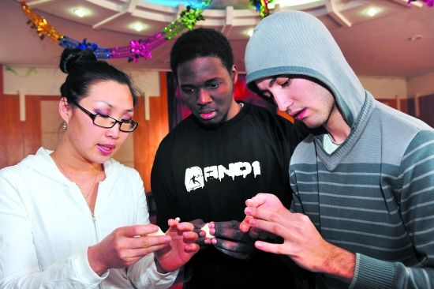
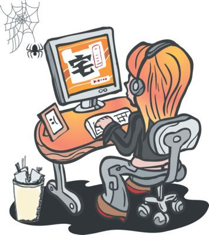
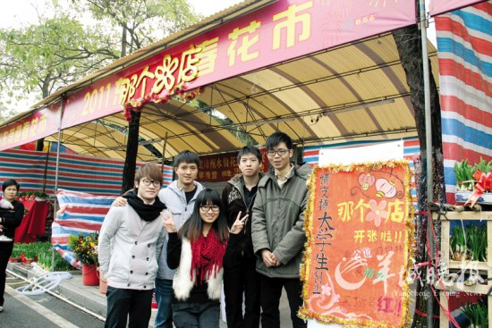

# 第三期：过年了，全世界的大学生们都在干嘛

### 

### 

# 七星视点

### 

## 第三期：过年了，全世界的大学生们都在干嘛

### 

### 

### 1， 旧金山州立大学师生畅谈埃及

### 

### 

2011年2月1日，旧金山州立大学的学生和老师对发生在埃及的重大起义进行了[公开讨论](http://translate.google.com.hk/translate?hl=zh-CN&langpair=en%7Czh-CN&u=http://abclocal.go.com/kgo/story%3Fsection%3Dnews/local/san_francisco%26id%3D7933676)。当天的演讲者包括阿拉伯政治和文化专业的教授和学生。他们将讨论该地区的历史，最近的抗议活动和美国的外交政策等等。当然，他们也会讨论网络和社会媒体在此次事件中发挥的重大作用。其中一位发言人说：“这次社会媒体发挥了极大的作用，但是我们更应该赞扬那些走上街头的群众。正是因为他们成功的‘脱宅’，才有上回突尼斯的阶段性胜利。”据称，部分教授甚至打算参加将在旧金山联合广场举行的集会活动，来表示对埃及人民的支持。 **七星视点：**其实关于大学生和埃及最多的报道还是世界各国的留学生如何从埃及胜利大逃亡的。埃及本土早就乱作一团，当地留学生都[十分恐慌](http://www.washingtonpost.com/wp-dyn/content/article/2011/02/01/AR2011020106551.html)，政府部门也相当紧张，[马来西亚](http://mil.huanqiu.com/world/2011-02/1478192.html)甚至考虑调动亚丁湾的军舰接学生。当然，也有极少部分[埃及学生](http://www.wtvr.com/news/wtvr-egyptian-students-on-protests-20110131,0,1141860.story)凭借大无畏的精神和对自由公平的向往考虑回国加入抗议队伍。 当然，在这里我们也不能忘了远在埃及留学的中国留学生。可惜的是我没能在一个语言类学校主页搜索到他们的情况，不过值得欣慰的是，网上唯一关于他们近况的文章表明，他们似乎早在动乱开始前就[顺利结业回国](http://www.chinanews.com/lxsh/2011/01-13/2784677.shtml)了，这是多么可喜可贺呀！ 最后补充个正经的：[我滞留埃及公民陆续回国](http://news.163.com/11/0202/09/6RSJP7PI00014AED.html)。 

### 

### 2，“洋学生”着迷汉文化 欢欢喜喜过“中国年”V.S.中国留学生发起“汉服”网络春晚 爱好者将自录节目

### 

### 

京剧、快板、绕口令、中国功夫等表演大家都见过，可如果这些纯中国元素的表演全部是由外国人来完成的，那就只能用“[震撼](http://dalian.runsky.com/2011-02/01/content_3814306.htm)”来形容了。来自美国的谭洁英表演了歌曲《京剧脸谱》，她说自己非常喜欢中国京剧，2008年第一次来中国听到京剧就喜欢上了，和朋友一起模仿，最喜欢的就是《沙家浜》选段。她一上台，大家就互相问：“这是外国人唱的？太好听了，比中国人唱得都字正腔圆。”波兰小伙子任国忠说起快板《满天星》、俄罗斯小伙子马克表演了绕口令“吃葡萄不吐葡萄皮”以及“八百标兵奔北坡”引得大家哈哈大笑。最精彩的要数斯洛伐克的两兄弟马力安和马丁表演的中国功夫了。台下观众不时叫好，掌声雷动。马力安说，他从小就喜欢搏击术，来中国后还特地学习了少林拳。这几位留学生中国话说得特别棒，而且他们都有一个爱好就是吃饺子。听说要到居民家去吃饺子，他们非常高兴。谭洁英说：“我喜欢中国年，因为可以吃到好多中国菜，我喜欢中国菜，尤其是饺子，太好吃了！” 与此同时，由几名赴欧美留学生策划发起的，一台名为“[华夏•雅韵辛卯年汉服](http://tieba.baidu.com/f?kz=977576493)”的春晚将通过网络播出。策划发起者介绍，希望以“汉服”为媒传播传统文化，用丝丝古韵营造浓厚年味。“汉服”春晚策划远在美国的工学博士王军表示，留学美国后，他见识了多元化的文化环境，深刻体会到文化对民族认同和团结的重要纽带作用。接触过一些汉服倡导者后，王军感到，通过一定程度的汉服回归，能让大众接触到诸如汉舞、雅乐等形式的优秀传统文化，于是倡议筹办汉服春晚来更广泛更直白地弘扬传统文化。去年10月底，他通过百度“[汉服吧](http://tieba.baidu.com/f?kw=%BA%BA%B7%FE%B0%C9)”策划并发起了举办[“汉服”春晚](http://v.youku.com/v_show/id_XMjQxMDk5MTg4.html)的活动。随后的3个月时间里，策划发起人建立了“汉服春晚”的官方网站，海内外的汉服爱好者们各展所长，录制了50多个古琴、汉舞、礼仪等方面的节目，并通过网络上传节目组。 **七星视点：**小编不吃饺子，不会唱戏，也不会中国功夫，穿过汉服也被指为朝鲜服。捂脸。 

### 

### 3， 大学生深宅家中过寒假

### 

### 

[专家](http://web.duowan.com/1102/160625661430.html)表示，“宅”就像一种恶性循环，越“宅”越懒，越懒越“宅”。如果长期脱离现实生活，缺乏与人的交往，可能会导致基本的社交技能退化。 **七星视点：**除了宅，大学生们其实还有很多选择，比如陪家人共享天伦和走亲访友等等。跟漫长的暑假不同，寒假时间较短，大学生很少会在这段时间里寻找[兼职](http://hlj.rednet.cn/c/2011/02/02/2172881.htm)打发时间，除了少数能够[扮演帝和后](http://news.ifeng.com/mainland/special/2011nianchunjie/content-2/detail_2011_02/03/4555324_0.shtml)的诱人机会，只能选择到网络上实现各种COSPLAY了。 

### 

### 4， 网瘾，你懂的

### 

### 

近日，一项大学生[网络成瘾](http://edu.qq.com/week/blog_zk2.htm)的调查指出，高校要立足大学生成长特点和需要，不应一味杜绝网络，而应以兼顾矫治与预防为原则，有效协助“网瘾学生”自助、互助，逐步走出虚拟空间，培养出网络时代的[“网创”人才](http://www.jyb.cn/Teaching/jysx/201012/t20101229_408459.html)。 其实关注点不仅在电脑，最新爆发的[手机综合症](http://finance.eastmoney.com/news/1355,20110128117835370.html)也很抢眼。由于手机的便携性，学生们机不离手，利用手机上网甚至作弊，很令老师和家长们抓狂。 甚至连国外媒体都报导评选了包括FACEBOOK在内的几家会触发网瘾的“[毒网](http://news.cnblogs.com/n/90069/)”，十分欢乐。 **七星视点：**看来网瘾问题已经是世界性难题了。如何防治“网瘾”，国内的专家叫兽们各有高招，倒是走在世界前列。疗效不清楚，名气绝对已经打响了。当然，大学生队伍中也涌现出了一批[战胜网瘾](http://edu.ifeng.com/news/detail_2011_01/31/4529996_0.shtml)的典范。这些都充分表明了网瘾其实不可怕，关键是要时刻牢记自己的理想和信念，把持住自己，才能经得起诱惑。 

### 

### 5， 创业不是你想创，想创就能创

### 

### 

2011年东莞迎春花市隆重开市。在花的海洋中，一块五彩斑斓的牌匾写着“[请支持大学生创业](http://jingji.cntv.cn/20110131/105170.shtml)”，吸引了不少市民的注意力。这家店别出心裁命名为“那个花店”，香水百合、各色菊花、康乃馨等鲜花姹紫嫣红，店内被打扮得喜气洋洋，原来这是一家学生铺，由八名在校大学生所开，今年第一次做花市生意。八个同学集资了近万元，筹备了将近一个月，“前期我们让学工业设计的同学专门绘制了一张电子海报，首先在QQ上、微博上群发做宣传，后期采购鲜花布置店铺，都忙得不可开交。为了节约成本，这些百合花都是我们前段时间自己去花田里采摘的，现在涨价了不少。这些菊花、康乃馨就是自己去花市里采购的。”他们中，只有一名莫同学曾开过淘宝店，其他人都是首次做生意，刚开铺就有同学前来帮衬。 **七星视点：**大学生创业从来就是“雷声大，雨点小”。究其原因，通常包括[勇气、资金、项目、经验、环境](http://job.workercn.cn/c/2011/01/30/110130084143475568764.html)等各个方面，当然最关键的除了缺少一个[靠谱的IDEA](http://www.howvc.com/Html/venture/campus/76788944985851.html)外，还有对社会的认识不够深入，[社会经验不足](http://news.163.com/11/0201/02/6RPAD1QS00014AED.html)。 其实，绝大多数公司初期都是要亏本的，只要能保持公司运作，最终扭亏为盈，就是创业的最终胜利，想创业的朋友们一定要耐得住性子呀。 

### 

### 6， 女大学生返乡路上离奇失踪 网友微博上寻人

### 

### 

咸宁通城的女大学生[吴珏敏](http://news.sohu.com/20110130/n279153019.shtml)从河南新乡搭乘火车到武汉站后离奇失踪，同学在天涯发帖寻人后，点击率超过21万，众多热心网友跟帖提建议，还有网友将吴珏敏哥哥的电话公布在腾讯微博上，掀起寻人热潮。吴珏敏的特征是22岁，身高1米6，失踪时身穿白色棉袄，扎一高马尾，背一李宁牌蓝色碎花背包，掂一手提电脑。 **七星视点：**每年总有那么几个女大学生失踪，总能让小编产生莫名的恐慌，据说容易被失踪的还都是[面貌清秀，性格善良，和气](http://www.jj831.com/Article/2011/201102/2011-02-01/Article_20110201224826_59458.html)的姑娘，不法分子还真是令人发指啊。希望社会各界人士在关注失足妇女之余也能多想想办法寻找帮助这些失踪少女。 当然，也要提醒广大女大学生们，一个人出门在外一定要增强自我保护意识，随时保持警惕，否则书白念了不说，命都可能搭上。 

### 7， 美国大一生压力“山大” 六成女生求心理指导

### 

### 

担心学习成绩不够好，担心奖学金没着落，担心毕业后找不到工作……美国27日公布的一项年度调查显示，全美大学一年级学生心理健康状况跌至25年来最低点，不少学生坦言自己压力“像山一样大”。研究人员调查今年全美279所4年制高等院校的20多万名大一新生，27日发布报告。报告显示，51.9%学生认为自己的心理健康状况高于平均水平，比2010年减少3.4个百分点，而1985年为63.6%。加州大学洛杉矶分校高等教育研究所负责人约翰普赖尔认为，这一比例跌至25年来最低点，“令人非常担忧”。调查显示，18%男生承认自己经常因压力感到不堪重负，而女生比例为39%。在寻求校方心理咨询服务的学生中，至少六成为女生。 七星视点：事实证明美国大学生从大一开始就在考虑自己的未来了，毕竟有压力才会有动力。相比之下中国大学生刚从高考中解脱，正想着好好放松呢。况且，[中国大学生的压力](http://news.sina.com.cn/s/2008-06-16/093414024217s.shtml)一点也不小，甚至因为没有咨询心理医生的习惯，最终导致了各种心理障碍和心理疾病呢。 

### 

### 
