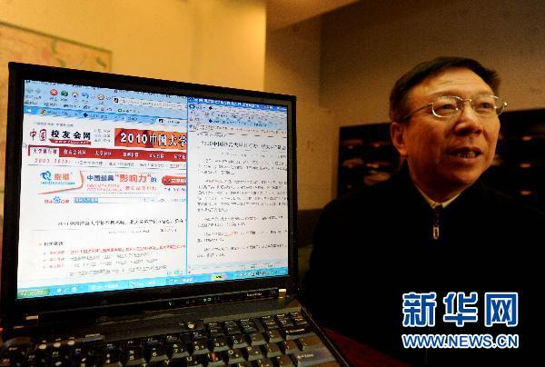
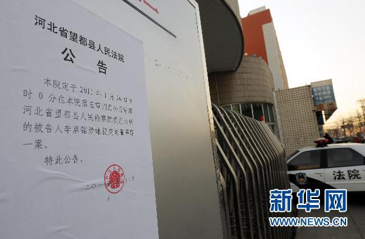
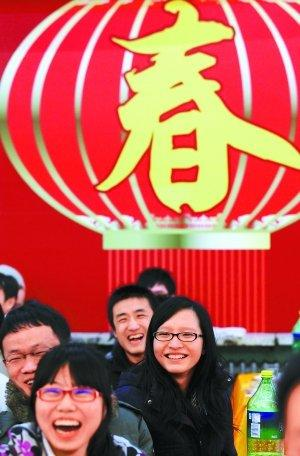

# 第二期：有就业率是否就业利？

**编者按：** **作为一名大学生，你关注大学和大学生的相关新闻吗？北斗认为，关心时事，要从关心自己开始。为此北斗试推出一个新栏目：“七星视点”。**** **每周我们的小编会摘录七条跟大学和大学生相关的新闻，并简单地评论，这是我们北斗如何看，而你如何看呢？欢迎大家来跟北斗小编一起嬉笑怒骂。** **不光要仰观星空，还要俯察校园；不光要有学生经历，还要有“七星视点”。**** **本期是“七星视点”第二期。**

# 七星视点

 

## 第二期：有就业率是否就业利？

### 1.有就业率是否就业利？

1月25日，人社部新闻发言人尹成基在新闻发布会上表示，截至2010年12月底，应届高校毕业生**[就业率达](http://news.xhby.net/system/2011/01/26/010875189.shtml)****[90.7%](http://news.xhby.net/system/2011/01/26/010875189.shtml)**，较上一年的87%提高了3个百分点。看到这里，小编悬着的一颗心放了下来。据说在突尼斯变天过程中，大量失业的年轻人是骚乱的主力。突尼斯官方公布的资料显示，突尼斯近年来平均失业率为14％。失业大军中近三成是大学生，突尼斯每年有8万多名大学生踏入社会，但其中只有四分之一的幸运者能找到工作。像我国这么高的就业率，维稳局势无压力啊。 **七星视点：**这个数字出来以后，质疑声音很多。就业率这么高，为什么应届生还是抱怨不断呢？小编也是今年本科毕业应届生，从身边同学的经历来看，大家要就业的的确也都能就业，这样的数据也不会偏离事实太远。现在是一个用数字说话的时代，90.7%这么一个干巴巴的数字，确实一下就道出了似乎整个社会就业率的事实，但它道不尽的是求职历程的艰辛和苦闷，道不尽将自己卖给一个跟理想不相关的工作时的那种失落和迷茫。 

### 2.三本改技校，我还是不是大学生

就业数据发布了，谁知道成色如何？前面视点里说了，就业率不能反映就业质量。而且就90%的就业率来说，去年毕业的600多万大学生中，还有60多万尚未就业。面对严峻的大学生就业形势，中国人民大学**[《中国相关就业群体的就业前景》报告](http://news.sina.com.cn/c/2011-01-28/144221891310.shtml )**认为，应该拆并**[三本院校](http://baike.baidu.com/view/1483339.htm#6)****[(](http://baike.baidu.com/view/1483339.htm#6)****[独立学院](http://baike.baidu.com/view/1483339.htm#6)****[)](http://baike.baidu.com/view/1483339.htm#6)** ** **改为技术学校，以适应目前大学生就业难和技工荒情况。 **七星视点：**人大的报告，似乎提出了一个对症下药的好计划。**[结构性失业](http://baike.baidu.com/view/303316.htm)**， 一直是中国劳动力市场的大问题。熟练技术工不好找，学了半天什么没学到的大学生却满街跑。大学扩招开始，大学生就变得不再稀罕，渐渐过剩，现今成了社会的累赘。那我们就悔棋吧。撤了高不成低不就的三本，重新开技校。可是换了包袱皮包的东西变不了。我们的三本教育体系跟技校教育体系完全不同，这个轨怎么接？一般的，我们把三本学校学生叫做大学生，而技校学生不叫大学生，三本招生人数可能占全部高校的20%-30%，** **撤并一部分学校就意味着一部分求学者就失去了成为大学生的机会，那么他们答不答应呢？ 

### 3.选大学，就看《造富榜》？

上周中国校友会网与《21世纪人才报》发布的最新**《****[2011](http://cuaa.net/cur/2011/09.shtml)****[中国大学造富排行榜](http://cuaa.net/cur/2011/09.shtml)****》**本周开始在媒体和公众舆论中得到发酵。质疑和支持的声音都在，确实引起了**[一场对于大学价值的思考](http://www.infzm.com/content/55127)**。这场争论中，比较代表性的声音有中国人民大学社会学教授**[周孝正](http://baike.baidu.com/view/955193.htm)****，**他认为，名校“造富”，猛一看，像是倡导 “知识创造财富”；细一看，把问题看得过于简单和片面了。 **七星视点：**很多人觉得上大学就是为了以后赚钱，上北京大学就有79/该校学生人数的概率成为亿万富翁，上小编的学校只有4/该校学生人数的概率成为亿万富翁，那谁不想上北京大学。但是，认真你就输了。《造富榜》只是媒体的噱头，茶余饭后谈谈可以，但这种咨询对选择是没什么参考性的。有人说《2011中国大学研究报告》里也有很多别的榜，应该用别的榜来综合评估一个大学。可中国大学最缺的是个性，是风骨，**[没有个性就谈不上大学精神](http://news.sina.com.cn/pl/2010-12-18/075321664600.shtml)**。用榜来评价大学容易，但真正想依据个性来选大学的时候就难了。 

### 4.“李刚门”关了，可哪里还开着窗

于2011年1月26日在河北省望都县人民法院公开开庭审理的**“****[10.16](http://news.sina.com.cn/s/2010-10-18/091821297439.shtml)****[校园车祸案](http://news.sina.com.cn/s/2010-10-18/091821297439.shtml)****” **今日一审宣判，河北省都县人民法院认定李启铭醉酒驾驶，致1人死亡1人受伤，且肇事后逃逸，构成交通肇事罪。李启铭被判处有期徒刑6年。怎么是六年，小编正要学开车，科目一的理论考试里说“机动车驾驶人因交通肇事逃逸致人死亡的，处7年以上15年以下有期徒刑”。哦，法庭鉴于李启铭认罪态度较好，其亲属积极赔偿被害人损失，酌情从轻处罚。李启铭的认罪态度，不就是说：“我爸是李刚！” **七星视点：**案子结了，“李刚门”就关了。李启铭确实比较倒霉，他因为喝醉酒，可能本身性格也比较纯真，就一不小心把一个大家都心照不宣的秘密讲了出来：手里有权，法律也是浮云。而这以后，“李刚”们肯定会嘱咐好“儿子”们不要随便提自己的名字啦。公开里不提，但私下里，这个名字也还会起作用。因为那些想滥用公权为自己谋求特殊待遇的人，不光明正大地走门了，还会从旁边没关紧的窗子爬过去。 

### 5.“学生们的参与热情都特别高，还有学生追到火车站来报名的。”

本周春运将达到客流最高峰，但学生流的高峰已经基本过去，大多数同学都已经回到了温暖的家中，但是有一部分同学却还待在火车站，这一待也许就是一个寒假。当然，他们是志愿服务的，他们就是**[大学生春运志愿者。](http://news.e21.cn/html/2011/gdjy/632/20110129110844_12962705241176188521.htm)**据悉，春运志愿者累计参与者将达万人。据某学校团委老师说：“学生们的参与热情都特别高，还有学生追到火车站来报名的。” 

**七星视点：**感谢铁道部，他们不仅“不让一个学生站着回家过年”，而且还不让同学们虚度寒假。“能让旅客平安顺利返乡是我们最大的心愿。”这是春运志愿者同学们对官方媒体说的话。但也许他们对期盼他们回家的家人和朋友说：真的有**[不得不的原因。](http://www.chinadaily.com.cn/dfpd/chongqing/2011-01-25/content_1650488.html)** ** ** 

### 6.清理系统垃圾不如直接重装,

湖南大学放假前，一下子清退了26名教师。这些老师“下课”了，就再也不能再回到课堂上课了。这些老师被清退的原因是擅自离岗出国逾期不归。对此有媒体评论，**[大学老师不能滥用自由。](http://news.sohu.com/20110130/n279157228.shtml)** **七星视点：**高校中老师的饭碗还太结实了。擅自离岗自然不像话，于是被清退。可是那些不离岗在讲台上混的老师呢？那些把学生当作免费劳力干活赚钱的老师呢？湖大校长常务副校长解释说学校要定期依规进行“磁盘整理”，只有将那些不发挥作用却又占用了内存的信息适时清理，才能确保学校“整台电脑”的稳定和高效运行。但小编觉得这个清理做得不够彻底。系统太慢，光清理垃圾也没用，不如干脆重装升级。 

### 7有领导慰问，大学生留校过年就和家一样温暖

下周就是春节了，很多同学还留在学校不能回家过年。据说有领导慰问，大学生留校过年就和家一样温暖。看相关新闻，请百度“大学生留校过年”。除了领导慰问，很多地方或者学校也想了很多别的招来制造“温暖”，**[湖北大学规定寒假留校学生每天发短信报平安](http://www.chinadaily.com.cn/micro-reading/china/2011-01-30/content_1689161.html)**。 **七星视点：**小编有个同学寒假就打算一个人留在上海寒冷的宿舍里，虽然小编不能像学校领导一样去慰问，但我会给他打个电话拜个年，鼓励他去达成那个以回家过年为代价的目标。
